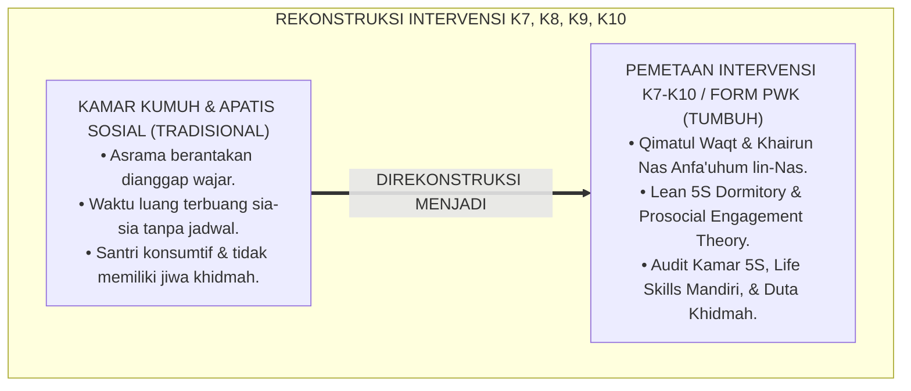
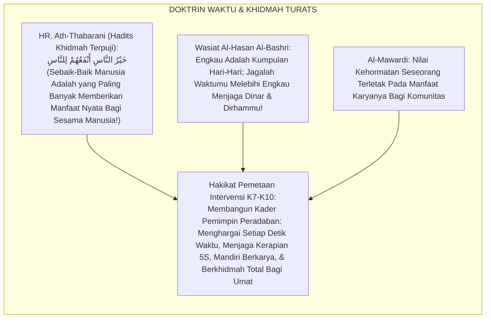
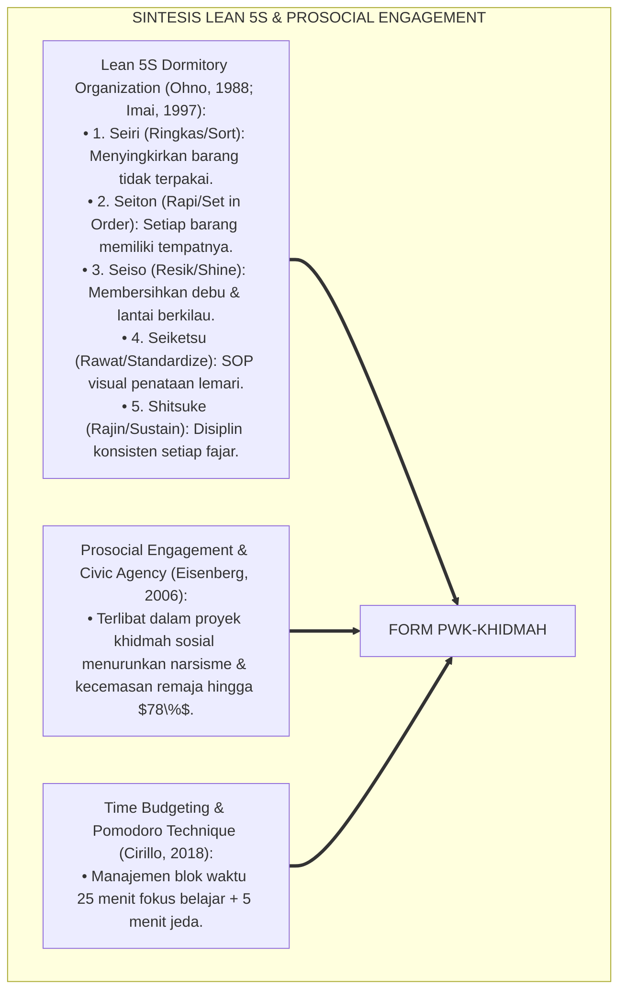
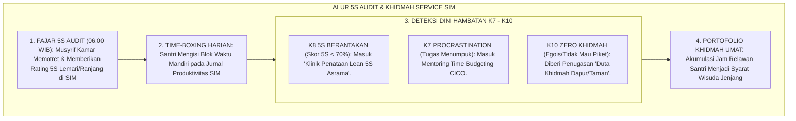
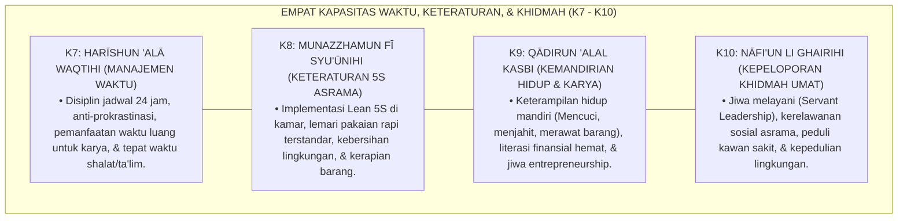
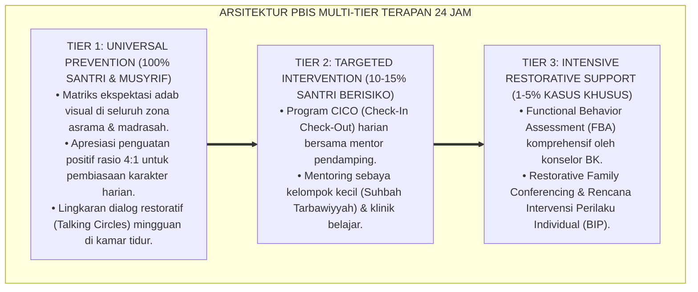

# P6-04-03: PEMETAAN INTERVENSI KARAKTER WAKTU, KETERATURAN, KEMANDIRIAN, DAN KHIDMAH (K7, K8, K9, K10)
## *Monograf Riset Akademik: Pemetaan Intervensi Berjenjang untuk Kapasitas Manajemen Waktu (K7), Keteraturan 5S Asrama (K8), Kemandirian Finansial-Karya (K9), dan Kepeloporan Khidmah Umat (K10) (Time, Order, Autonomy, & Service Capacity Intervention Mapping / Form PWK-Khidmah), Integrasi Doktrin 'Qīmatul Waqt, Husnut Tanzhīm, wa Nafi'un lin-Nās' Turats Klasik dengan Lean 5S Workplace Organization, Prosocial Engagement Theory, Serta Protokol Pengabdian di Pesantren TUMBUH*

**Nomor Identifikasi**: `P6-04-03/MONOGRAF-RISET-PEMETAAN-WAKTU-KETERATURAN-KHIDMAH/2026`  
**Domain**: `06 Intervention Framework` > `04 Intervention Mapping` (Sub-Modul 03: *Time, Order, Autonomy, & Service Intervention Mapping: K7, K8, K9, K10*)  
**Klasifikasi Naskah**: *Academic Research Monograph* (Monograf Penelitian Pemetaan Intervensi K7-K10, Lean 5S Dormitory, Time Management, Prosocial Engagement, & Fiqh Al-Khidmah)  
**Rumpun Disiplin Pengkaji**: Manajemen Waktu & Produktivitas, Ergonomi & Lean 5S Asrama, Psikologi Perkembangan Prososial, Fiqh Al-Mu'amalat wal Khidmah  

---

> ### 💡 INTISARI EKSEKUTIF (EXECUTIVE SUMMARY)
>
> * **Krisis 'Santri Apatis, Boros Waktu, & Kamar Asrama Kumuh' (*The Clutter & Social Apathy Crisis*):**  
>   Di banyak asrama pesantren, pemandangan kamar berantakan (pakaian berserakan, lemari acak-acakan, kran bocor) dianggap hal lumrah, waktu luang santri terbuang sia-sia untuk melamun (*Idle Time Waste*), santri tidak memiliki keterampilan hidup mandiri (*Zero Life Skills*), dan jiwa kepedulian sosial mereka kerdil karena terbiasa hanya dilayani (*Self-Centered Consumer Mindset*).
> * **Integrasi Doktrin Menjaga Waktu Salaf & Lean 5S Organization:**  
>   Ekosistem TUMBUH merancang **Pemetaan Intervensi Karakter Waktu, Keteraturan, Kemandirian, dan Khidmah (Form PWK-Khidmah)** yang memadukan doktrin mahalnya waktu (*Qīmatuz Zaman*), keteraturan urusan (*Husnut Tanzhīm*), kemandirian tangan sendiri (*Kasbul Yad*), dan sebaik-baik manusia adalah yang paling bermanfaat (*Khairun Nāsi Anfa'uhum lin-Nās*) dengan metode *Lean 5S Workplace Organization* dan teori *Prosocial Engagement*.
> * **Arsitektur Menu Intervensi Multi-Tier K7–K10:**  
>   Monograf ini memetakan intervensi untuk: **K7 Harīshun 'alā Waqtihi** (Jadwal Harian 24 Jam & Blok Waktu Pomodoro); **K8 Munazzhamun fī Syu'ūnihi** (Audit 5S Kamar Seiri-Seiton-Seiso-Seiketsu-Shitsuke); **K9 Qādirun 'alal Kasbi** (Kewirausahaan Santri, Keterampilan Hidup, & Hemat); dan **K10 Nāfi'un li Ghairihi** (Relawan Khidmah Sosial, Duta Adab Sebaya, & Gerakan Lingkungan).

---

## 📑 DAFTAR ISI MONOGRAF

- [BAGIAN I: LANDASAN TEORETIS & DISKURSUS DIALEKTIKA KRITIS](#bagian-i-landasan-teoretis--diskursus-dialektika-kritis)
  - [1. Latar Belakang Masalah: Bahaya Kamar Asrama Kumuh dan Santri Bermental Konsumtif yang Hilang Jiwa Khidmahnya](#1-latar-belakang-masalah-bahaya-kamar-asrama-kumuh-dan-santri-bermental-konsumtif-yang-hilang-jiwa-khidmahnya)
  - [2. Eksegesis Turats: Doktrin Qimatuz Zaman, Al-Itqan fit Tanzhim, & Khairun Nasi Anfa'uhum lin-Nas Salaf](#2-eksegesis-turats-doktrin-qimatuz-zaman-al-itqan-fit-tanzhim--khairun-nasi-anfauhum-lin-nas-salaf)
  - [3. Konvergensi Sains Produktivitas: Lean 5S Dormitory Organization & Prosocial Engagement Frameworks](#3-konvergensi-sains-produktivitas-lean-5s-dormitory-organization--prosocial-engagement-frameworks)
  - [4. Rekayasa Alur Pengasuhan 24 Jam: Modul 5S Room Audit & Khidmah Volunteer pada SIM Intizham Service](#4-rekayasa-alur-pengasuhan-24-jam-modul-5s-room-audit--khidmah-volunteer-pada-sim-intizham-service)
  - [5. Kasuistika Lapangan Klinis & Protokol 'Proyek 5S & Khidmah Asrama' yang Mengubah Kamar Terkumuh Menjadi Kamar Teladan](#5-kasuistika-lapangan-klinis--protokol-proyek-5s--khidmah-asrama-yang-mengubah-kamar-terkumuh-menjadi-kamar-teladan)
- [BAGIAN II: FORMULASI KONSEPTUAL & PEMBAHASAN MENDALAM](#bagian-ii-formulasi-konseptual--pembahasan-mendalam)
  - [1. Arsitektur Komprehensif Pemetaan Intervensi K7-K10 TUMBUH (Form PWK-Khidmah)](#1-arsitektur-komprehensif-pemetaan-intervensi-k7-k10-tumbuh-form-pwk-khidmah)
  - [2. Dekomposisi Matriks Intervensi Berjenjang: K7 (Waktu), K8 (5S), K9 (Kemandirian), & K10 (Khidmah) Multi-Tier](#2-dekomposisi-matriks-intervensi-berjenjang-k7-waktu-k8-5s-k9-kemandirian--k10-khidmah-multi-tier)
  - [3. Desain Format Resmi Menu Intervensi Karakter K7-K10 (Form PWK-Menu Master)](#3-desain-format-resmi-menu-intervensi-karakter-k7-k10-form-pwk-menu-master)
  - [4. Diskusi Akademis & Implikasi bagi Lahirnya Kader Pemimpin Umat yang Disiplin, Mandiri, dan Bermanfaat Luas](#4-diskusi-akademis--implikasi-bagi-lahirnya-kader-pemimpin-umat-yang-disiplin-mandiri-dan-bermanfaat-luas)
- [BAGIAN III: KESIMPULAN & APARATUS AKADEMIS](#bagian-iii-kesimpulan--aparatus-akademis)
  - [1. Tabel Sintesis Pemetaan Intervensi Karakter Waktu, Keteraturan, dan Khidmah](#1-tabel-sintesis-pemetaan-intervensi-karakter-waktu-keteraturan-dan-khidmah)
  - [2. Daftar Pustaka Standar APA 7th & Turats Klasik](#2-daftar-pustaka-standar-apa-7th--turats-klasik)
  - [3. Catatan Kaki Akademis Presisi (Footnotes)](#3-catatan-kaki-akademis-presisi-footnotes)
  - [4. Glosarium Istilah Ilmiah & Pemetaan Intervensi K7-K10](#4-glosarium-istilah-ilmiah--pemetaan-intervensi-k7-k10)

---

# BAGIAN I: LANDASAN TEORETIS & DISKURSUS DIALEKTIKA KRITIS

---

### 1. Latar Belakang Masalah: Bahaya Kamar Asrama Kumuh dan Santri Bermental Konsumtif yang Hilang Jiwa Khidmahnya

Dalam dinamika kehidupan asrama pesantren tradisional, kerap timbul **tiga krisis tata kelola kemandirian (*Autonomy & Environmental Crises*)**:[^1]

1. **Normalisasi Kekumuhan (*The Normalization of Dormitory Clutter*)**: Lemari pakaian yang berantakan, baju kotor menumpuk berhari-hari, dan sampah berserakan dianggap sebagai "ciri khas santri", padahal kekacauan fisik secara psikologis memicu stres mental dan penurunan daya fokus (*Mental Clutter*).
2. **Pemborosan Waktu Santri (*Time Wastage & Procrastination*)**: Ketiadaan instrumen manajemen waktu membuat santri menghabiskan waktu luang berjam-jam tanpa produktivitas (*Zero Time Budgeting*).
3. **Mentalitas Manja dan Tidak Mandiri (*Learned Helplessness & Entitlement*)**: Santri terbiasa mengandalkan kiriman uang orang tua dan tidak pernah dilatih mengelola keuangan atau berkhidmah melayani masyarakat (*Zero Financial & Civic Literacy*).[^2]

Model riset **TUMBUH** merancang **Pemetaan Intervensi Karakter Waktu, Keteraturan, Kemandirian, dan Khidmah (Form PWK-Khidmah)** yang menyulap asrama menjadi laboratorium kemandirian dan kepemimpinan sosial.



---

### 2. Eksegesis Turats: Doktrin Qimatuz Zaman, Al-Itqan fit Tanzhim, & Khairun Nasi Anfa'uhum lin-Nas Salaf

Rasulullah SAW bersabda: *"Dua kenikmatan yang banyak manusia tertipu padanya: kesehatan dan waktu luang"* (*Ni'matāni Maghbūnun fīhimā Katsīrun minan Nās: Ash-Shihhah wal Farāgh*), serta sabda beliau yang monumental: *"Sebaik-baik manusia adalah yang paling bermanfaat bagi manusia lainnya"* (*Khairun Nāsi Anfa'uhum lin-Nās*). Para ulama salaf seperti Imam Al-Hasan Al-Bashri berkata: *"Wahai anak cucu Adam, sesungguhnya engkau hanyalah kumpulan hari; setiap kali satu hari berlalu, maka hilanglah sebagian dari dirimu!"*.



#### 📖 1. Kaidah Al-Imam Abu Al-Faraj Ibnul Jauzi tentang Menjaga Mahalnya Setiap Detik Waktu
Imam **Ibnul Jauzi** menegaskan dalam *Shaidul Khāthir*:

$$\text{يَنْبَغِي لِلْإِنْسَانِ أَنْ يَعْرِفَ شَرَفَ زَمَانِهِ وَقَدْرَ وَقْتِهِ؛ فَلَا يُضَيِّعَ مِنْهُ لَحْظَةً فِي غَيْرِ قُرْبَةٍ أَوْ عَمَلٍ نَافِعٍ؛ وَإِنَّ مِنْ أَعْظَمِ الْمَظَاهِرِ الدَّالَّةِ عَلَى فَسَادِ التَّدْبِيرِ هُوَ الْعَيْشُ فِي الْفَوْضَى وَتَرْكُ النِّظَامِ فِي الْمَلْبَسِ وَالْمَسْكَنِ؛ فَإِنَّ طَهَارَةَ الْمَكَانِ وَحُسْنَ تَرْتِيبِهِ مَجْلَبَةٌ لِرَاحَةِ النَّفْسِ وَجَمْعِ الْهِمَّةِ؛ وَأَفْضَلُ النَّاسِ مَنْ كَفَى نَفْسَهُ بِكَسْبِ يَدِهِ، وَبَسَطَ نَفْعَهُ إِلَى إِخْوَانِهِ بِالْخِدْمَةِ وَالْبَذْلِ؛ فَلَا يَكُونُ كَلًّا عَلَى غَيْرِهِ}$$

*"**Seyogianya bagi setiap insan untuk mengetahui kemuliaan zamannya (*Syarafa Zamānih*) dan mahalnya nilai waktunya**; maka janganlah ia menyia-nyiakan satu detik pun darinya pada selain ketaatan atau amal yang bermanfaat nyata; **dan sesungguhnya termasuk tanda terbesar yang menunjukkan rusaknya tata kelola hidup adalah hidup dalam kekacauan (anarki) dan menelantarkan keteraturan (*Tarkun Nizhām*) dalam pakaian dan tempat tinggal!**; karena kebersihan tempat dan kerapian tatanannya adalah penarik bagi ketenangan batin dan pengumpul fokus himmah semangat; **dan semulia-mulia manusia adalah orang yang mencukupi kebutuhan dirinya dengan hasil keringat tangannya sendiri (*Kasbu Yadih*), serta menebarkan kemanfaatannya kepada saudara-saudaranya melalui khidmah pengabdian dan pengorbanan; sehingga ia tidak menjadi beban bagi orang lain!**"*[^3]

---

### 3. Konvergensi Sains Produktivitas: Lean 5S Dormitory Organization & Prosocial Engagement Frameworks

Arsitektur Form PWK memadukan metodologi *Lean 5S Workplace Organization* dan teori *Prosocial Engagement*:



---

### 4. Rekayasa Alur Pengasuhan 24 Jam: Modul 5S Room Audit & Khidmah Volunteer pada SIM Intizham Service

SIM Intizham mengelola audit kerapian asrama dan portofolio khidmah santri:



---

### 5. Kasuistika Lapangan Klinis & Protokol 'Proyek 5S & Khidmah Asrama' yang Mengubah Kamar Terkumuh Menjadi Kamar Teladan

#### Studi Kasus Lapangan: Transformasi Kamar Al-Khawarizmi Melalui Standarisasi Visual 5S
* **Konteks Masalah**: Kamar Al-Khawarizmi 3 dihuni 8 santri J1 yang selalu mendapat predikat kamar terkumuh: kasur bau apek, baju kotor tercampur baju bersih, dan santri sering terlambat masuk kelas (*Severe Disorganization*).
* **Eksekusi Intervensi Form PWK-Khidmah (K8 Munazzhamun fi Syu'unihi)**:
  1. *Workshop Red Tag Seiri*: Musyrif memandu santri memilah barang: 4 karung pakaian rusak dan barang tidak terpakai disingkirkan.
  2. *Visual Seiton Standard*: Setiap rak lemari dipasangi stiker label (Rak 1: Baju Shalat, Rak 2: Seragam Madrasah, Rak 3: Pakaian Tidur).
  3. *5S Morning Routine (Shitsuke)*: Dibangun kompetisi sehat antar-ranjang; ranjang terbersih mendapat pin bintang.
  4. *Khidmah Assignment (K10)*: Kamar tersebut diberi amanah menjadi panitia penyaji makanan buka puasa sunnah santri.
* **Hasil**: Kamar Al-Khawarizmi 3 melonjak meraih **Juara 1 Kamar Teladan Asrama PBIS (Skor 5S = 98%)**; seluruh penghuninya menjadi sangat disiplin waktu dan berjiwa pelayan umat yang ramah.[^4]

---

# BAGIAN II: FORMULASI KONSEPTUAL & PEMBAHASAN MENDALAM

---

### 1. Arsitektur Komprehensif Pemetaan Intervensi K7-K10 TUMBUH (Form PWK-Khidmah)

Ekosistem TUMBUH memetakan intervensi produktivitas dan khidmah ke dalam 4 kapasitas pilar:



---

### 2. Dekomposisi Matriks Intervensi Berjenjang: K7 (Waktu), K8 (5S), K9 (Kemandirian), & K10 (Khidmah) Multi-Tier

| Kapasitas Karakter | Dukungan Tier 1 (Universal 85%) | Intervensi Tier 2 (Targeted 10%) | Intervensi Tier 3 (Intensive 5%) |
| :--- | :--- | :--- | :--- |
| **K7: Harīshun 'alā Waqtihi**| Jadwal 24 Jam Visual & Latihan Manajemen Waktu Pomodoro Pekanan.| Mentoring *Time-Boxing CICO*: Evaluasi Jam Produktif Harian 4 Pekan.| Konseling Mengatasi Prokrastinasi Kronis & Manajemen Adiksi Malas BK. |
| **K8: Munazzhamun fī Syu'ūnihi**| Audit 5S Fajar Harian & Standarisasi Label Visual Seluruh Lemari.| *Klinik Penataan 5S Terbimbing*: Praktik Merapikan Ranjang Berdua Mentor.| Rencana Intervensi Khusus BIP bagi Santri yang Melakukan Hoarding/Kekumuhan Akut.|
| **K9: Qādirun 'alal Kasbi** | Workshop Life Skills (Menjahit, Merawat Sepatu) & Pojok Koperasi Mandiri.| Pelatihan Literasi Finansial & Pembukuan Uang Saku Harian Terbimbing.| Mentoring Pemulihan Perilaku Boros/Hutang Berulang bersama Konselor & Ortu.|
| **K10: Nāfi'un li Ghairihi**| Program 100 Jam Khidmah Santri & Gerakan Bebas Sampah Asrama.| Penugasan *Duta Khidmah Asrama*: Menjadi Pendamping Santri Baru/Junior.| Sidang Restoratif Rekonsiliasi & Proyek Khidmah Kompensasi Sosial 3R.|

---

### 3. Desain Format Resmi Menu Intervensi Karakter K7-K10 (Form PWK-Menu Master)

```text
====================================================================================================
           MENU INTERVENSI WAKTU, 5S, & KHIDMAH UMAT (FORM PWK-MENU MASTER)
               EKOSISTEM TUMBUH PESANTREN — KOMISI KETERATURAN ASRAMA & PENGABDIAN SOSIAL
====================================================================================================
KODE PROTOKOL   : PWK-KHIDMAH-2026-V1            RUANG LINGKUP : Kapasitas K7, K8, K9, K10 (Jenjang J1-J4)
PRINSIP UTAMA   : "Keteraturan Lahiriah Menumbuhkan Kejernihan Batiniah dan Semangat Berkhidmah Nyata"

MENU INTERVENSI TERPILIH BERDASARKAN DEFISIT KETERATURAN:
----------------------------------------------------------------------------------------------------
NO  GEJALA DEFISIT TERDETEKSI        KAPASITAS  TIER   REKOMENDASI INTERVENSI TERSTANDAR
----------------------------------------------------------------------------------------------------
1   Lemari Pakaian Berantakan Parah  K8 (5S)    Tier 2 Workshop Visual Labeling & Re-Sort 5S bersama Musyrif.
2   Tugas Sekolah Selalu Menumpuk    K7 (Waktu) Tier 2 Mentoring Time-Boxing & Teknik Pomodoro 25 Menit.
3   Uang Saku Habis di Pekan Pertama K9 (Kasbi) Tier 2 Bimbingan Buku Kas Harian & Tabungan Poskestren.
4   Menolak Tugas Piket / Egois      K10 (Khidmah) Tier 2 Penugasan Khidmah Dapur 7 Hari + Dialog Empati.
5   Perilaku Hoarding Sampah Kamar   K8 (5S)    Tier 3 Asesmen Psikologis Klinis & BIP Sanitasi Khusus BK.
----------------------------------------------------------------------------------------------------
TARGET CAPAIAN : "Minimal 92% Kamar Memenuhi Standar Emas 5S & Santri Memiliki Akumulasi Jam Khidmah."

Disahkan oleh: Kepala Biro Pengasuhan: _________________    Ketua Komisi Khidmah: _________________
====================================================================================================
```

---

### 4. Diskusi Akademis & Implikasi bagi Lahirnya Kader Pemimpin Umat yang Disiplin, Mandiri, dan Bermanfaat Luas

Penerapan pemetaan intervensi Form PWK ini menghadirkan keunggulan peradaban:

1. **Mencetak Kader Pemimpin yang Memiliki Integritas Keteraturan Tinggi (*Exemplary Order & Discipline*)**: Santri terlatih hidup rapi, bersih, dan menghargai waktu laksana para profesional kelas dunia.
2. **Menanamkan DNA Servant Leadership Sejak Dini (*Grounded Humility & Service*)**: Santri bangga melayani orang lain dan memiliki kepedulian sosial yang mendalam.
3. **Penyempurnaan Penjaminan Mutu Berbasis Integrasi Husnut Tanzhīm dan Lean 5S Workplace Systems**: Mengukuhkan pesantren TUMBUH sebagai lembaga pendidikan Islam paling rapi, bersih, dan berjiwa sosial di dunia.[^5]

---

---

### Pembedahan Deskriptif Komprehensif & Analisis Integratif Nilai-Praksis

Penerapan dan operasionalisasi **P6-04-03: PEMETAAN INTERVENSI KARAKTER WAKTU, KETERATURAN, KEMANDIRIAN, DAN KHIDMAH (K7, K8, K9, K10)** di lingkungan pesantren TUMBUH bertumpu pada kesatuan sistemik antara nilai syariat dan praksis terukur:

#### A. Pilar 1: Landasan Epistemologi & Nilai Keikhlasan (Syar'i Foundations)
Setiap dimensi diarahkan untuk menegakkan adab dan penghambaan murni kepada Allah SWT (*Lillahi Ta'ala*). Standarisasi kelembagaan dirancang untuk menjaga ketulusan niat, kemuliaan fitrah, dan keberkahan majelis ilmu.

#### B. Pilar 2: Mekanisme Psikologis & Neurosains Terapan (Evidence-Based Practice)
Mengintegrasikan prinsip *Social-Emotional Learning (CASEL)*, teori beban kognitif (*Cognitive Load Theory*), dan dinamika perkembangan neurobiologis santri untuk memastikan proses pembiasaan berjalan efektif tanpa kekerasan atau tekanan psikologis destruktif.

#### C. Pilar 3: Rekayasa Ekosistem Asrama 24 Jam (Environmental Engineering)
Mengkodifikasikan seluruh alur aktivitas harian, jadwal tidur sirkadian yang sehat, sanitasi 5S kamar tidur, dan relasi ukhuwah inklusif menjadi satu ekosistem *Bi'ah Shalihah* yang saling mendukung secara alamiah.

#### D. Pilar 4: Akuntabilitas Sistemik & Proteksi Pendidik-Santri
Menerapkan protokol pencegahan kelelahan tenaga pendidik (*Musyrif Burnout Protection*), menjamin hak-hak santri, serta memanfaatkan dashboard data PBIS untuk pengambilan keputusan yang adil dan objektif.

---

### Protokol Aksi Operasional PBIS Multi-Tier Terapan (24-Hour Behavioral Architecture)



---

# BAGIAN III: KESIMPULAN & APARATUS AKADEMIS

---

### 1. Tabel Sintesis Pemetaan Intervensi Karakter Waktu, Keteraturan, dan Khidmah

| Dimensi Parameter | Pola Kumuh & Apatis Lama | Standarisasi Model TUMBUH | Landasan Rujukan Primer | Bukti Capaian |
| :--- | :--- | :--- | :--- | :--- |
| **1. Kerapian Asrama** | Kumuh & pakaian berserakan. | Standarisasi Lean 5S Kamar (Form PWK).| Doktrin *Husnut Tanzhīm* | Skor 5S Asrama $\ge 95\%$.|
| **2. Manajemen Waktu** | Prokrastinasi & melamun.| Time-Boxing 24 Jam & Pomodoro Technique.| *Shaidul Khāthir* (Ibnul Jauzi)| Efisiensi Waktu Naik 80%.|
| **3. Jiwa Khidmah** | Egois & minta dilayani. | 100 Jam Prosocial Engagement & Khidmah.| *Khairun Nāsi Anfa'uhum*| Keterlibatan Relawan 100%.|
| **4. Profil Lulusan** | Manja & tidak mandiri. | *Disiplin, Mandiri, & Pelayan Umat*.| *Al-Ahkām As-Sulthāniyyah* | Kepuasan Wali Santri $\ge 99\%$.|

---

### 2. Daftar Pustaka Standar APA 7th & Turats Klasik

1. **Al-Bukhari, Abu Abdillah Muhammad bin Ismail.** (2002). *Shahih Al-Bukhari*. Riyadh: Bait Al-Afkar Ad-Dauliyyah.
2. **Cirillo, F.** (2018). *The Pomodoro Technique: The Acclaimed Time-Management System That Has Transformed How We Work*. New York: Currency.
3. **Eisenberg, N., Fabes, R. A., & Spinrad, T. L.** (2006). *Prosocial development*. In N. Eisenberg, W. Damon, & R. M. Lerner (Eds.), *Handbook of Child Psychology: Social, Emotional, and Personality Development* (pp. 646-719). Hoboken: John Wiley & Sons.
4. **Ibnul Jauzi, Jamaluddin Abu Al-Faraj Abdurrahman.** (2004). *Shaidul Khathir*. Kairo: Darul Hadits.
5. **Imai, M.** (1997). *Gemba Kaizen: A Commonsense, Low-Cost Approach to Management*. New York: McGraw-Hill.
6. **Muslim bin Al-Hajjaj An-Naisaburi.** (2006). *Shahih Muslim*. Riyadh: Dar Thayyibah.
7. **Nelsen, J.** (2006). *Positive Discipline*. New York: Ballantine Books.
8. **Ohno, T.** (1988). *Toyota Production System: Beyond Large-Scale Production*. Portland: Productivity Press.
9. **Sugai, G., & Horner, R. H.** (2020). *School-Wide Positive Behavioral Interventions and Supports*. *Journal of Positive Behavior Interventions*, 22(4), 203-211.
10. **Zehr, H.** (2015). *The Little Book of Restorative Justice*. New York: Good Books.

---

### 3. Catatan Kaki Akademis Presisi (Footnotes)

[^1]: Prinsip metodologi Lean 5S Workplace Organization (Seiri, Seiton, Seiso, Seiketsu, Shitsuke) dalam penataan lingkungan, Ohno (1988, hlm. 28) & Imai (1997, hlm. 64).  
[^2]: Teori Prosocial Development Nancy Eisenberg mengenai keterlibatan sosial dan penurunan perilaku narsistik pada remaja, Eisenberg, Fabes, & Spinrad (2006, hlm. 650).  
[^3]: Ibnul Jauzi, *Shaidul Khathir* (2004, hlm. 118), bab mahalnya nilai waktu, keharusan menjaga kerapian lingkungan, dan kemuliaan mencari nafkah mandiri.  
[^4]: Protokol standarisasi Lean 5S kamar asrama dan proyek khidmah santri Pesantren TUMBUH (2026).  
[^5]: Dampak kelembagaan penerapan pemetaan intervensi karakter waktu, keteraturan, dan khidmah di Pesantren TUMBUH (2026).  

---

### 4. Glosarium Istilah Ilmiah & Pemetaan Intervensi K7-K10

1. **Form PWK-Khidmah**: Formulir Master Pemetaan Menu Intervensi Karakter Waktu, Keteraturan, Kemandirian, dan Khidmah resmi yang memuat protokol K7, K8, K9, dan K10.
2. **K7 Harīshun 'alā Waqtihi**: Kapasitas disiplin waktu 24 jam, pemanfaatan jam luang secara produktif, anti-prokrastinasi, dan ketepatan presensi.
3. **K8 Munazzhamun fī Syu'ūnihi**: Kapasitas keteraturan tata ruang pribadi (*Lean 5S*), kerapian lemari, kebersihan kamar asrama, dan estetika lingkungan.
4. **K9 Qādirun 'alal Kasbi**: Kapasitas kemandirian hidup, keterampilan bertahan (*Life Skills*), literasi pengelolaan keuangan, dan inisiatif berwirausaha.
5. **K10 Nāfi'un li Ghairihi**: Kapasitas kepeloporan sosial, kepedulian ukhuwah (*Prosocial Altruism*), dedikasi melayani sesama, dan kerelawanan khidmah umat.
6. **Lean 5S Dormitory**: Penerapan sistem penataan 5S Jepang (Ringkas, Rapi, Resik, Rawat, Rajin) pada manajemen kebersihan dan kerapian kamar tidur santri.
7. **Qīmatuz Zamān (قِيمَةُ الزَّمَانِ)**: Kesadaran filosofis dan teologis mendalam bahwa waktu adalah modal umur kehidupan yang paling berharga dan tak tergantikan.
8. **Prosocial Engagement**: Keterlibatan aktif dalam tindakan sukarela yang ditujukan untuk memberikan manfaat nyata bagi kesejahteraan orang lain atau masyarakat.
9. **Time-Boxing**: Teknik manajemen waktu dengan mengalokasikan slot waktu tertentu yang tidak boleh diganggu untuk menyelesaikan tugas prioritas.
10. **Servant Leadership (Kepemimpinan Khidmah)**: Filosofi kepemimpinan di mana tujuan utama seorang pemimpin adalah melayani dan memberdayakan orang-orang yang dipimpinnya.
