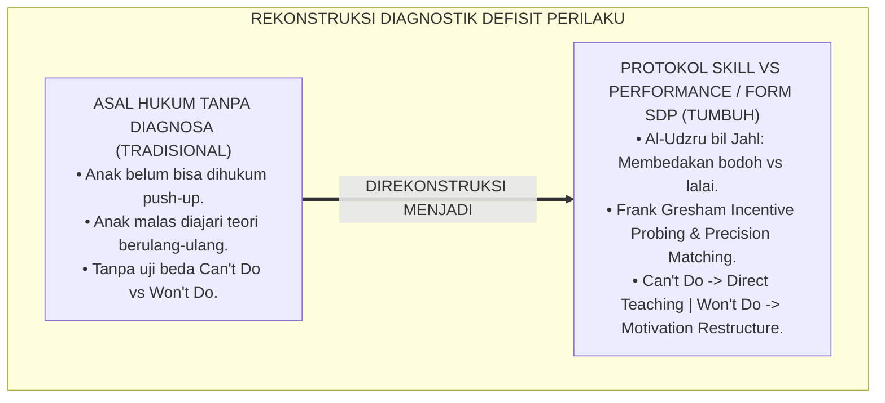
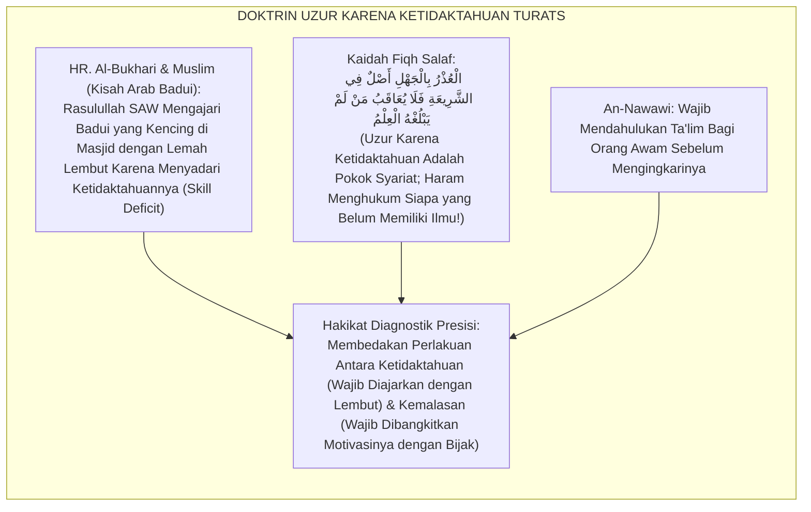
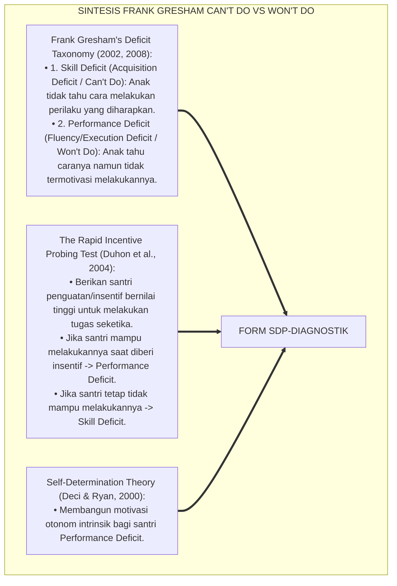
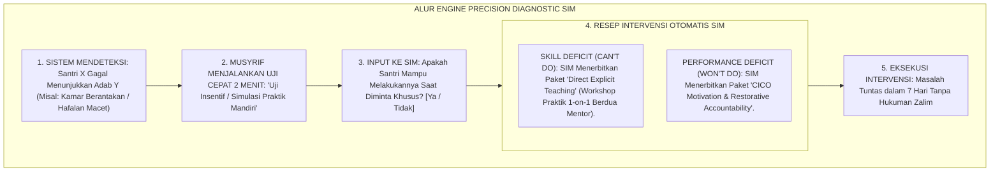
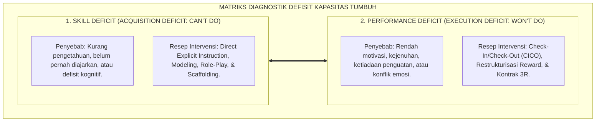

# P6-04-04: PROTOKOL KOREKSI DEFISIT KAPASITAS (SKILL DEFICIT VS PERFORMANCE DEFICIT)
## *Monograf Riset Akademik: Metodologi Diagnostik Pembedaan Defisit Keterampilan ('Can't Do') dan Defisit Motivasi Performa ('Won't Do') Serta Desain Intervensi Presisi (Skill Deficit vs Performance Deficit Diagnostic & Intervention Matching Protocol / Form SDP-Diagnostik), Integrasi Doktrin 'Al-Jahlu bil Adab Muqābilatut Tahāwuni wal Istikhfāf' Turats Klasik dengan Gresham's Behavioral Deficit Taxonomy, Self-Determination Theory (SDT), Serta Presisi Tarbiyah di Pesantren TUMBUH*

**Nomor Identifikasi**: `P6-04-04/MONOGRAF-RISET-SKILL-VS-PERFORMANCE-DEFICIT/2026`  
**Domain**: `06 Intervention Framework` > `04 Intervention Mapping` (Sub-Modul 04: *Skill Deficit vs Performance Deficit Diagnostic & Intervention Matching*)  
**Klasifikasi Naskah**: *Academic Research Monograph* (Monograf Penelitian Diagnostik Skill Deficit vs Performance Deficit PBIS, Gresham Taxonomy, & Fiqh Al-Jahl wal Kasal)  
**Rumpun Disiplin Pengkaji**: Diagnostik Perilaku Presisi (*Behavioral Precision Diagnostics*), Teori Motivasi Diri (*Self-Determination Theory*), Analisis Kesenjangan Kinerja, Fiqh Al-'Adzr bil Jahl  

---

> ### 💡 INTISARI EKSEKUTIF (EXECUTIVE SUMMARY)
>
> * **Krisis 'Kekeliruan Menghukum Santri yang Belum Bisa' (*The Skill Deficit Punishment Tragedy*):**  
>   Banyak pengasuh menghukum santri yang tidak merapikan tempat tidur atau salah membaca doa dengan hukuman keras karena menganggap mereka "membangkang (*Won't Do / Performance Deficit*)", padahal santri tersebut sebenarnya tidak pernah diajarkan cara melipat selimut atau belum hafal lafadz doanya (*Can't Do / Skill Deficit*). Menghukum anak yang tidak tahu adalah kezaliman pedagogis yang mematikan motivasi belajar.
> * **Integrasi Kaidah Uzur Karena Bodoh Salaf & Gresham's Deficit Taxonomy:**  
>   Ekosistem TUMBUH merancang **Protokol Koreksi Defisit Kapasitas: Skill Deficit vs Performance Deficit (Form SDP-Diagnostik)** yang memadukan kaidah fiqh pemaafan karena ketidaktahuan (*Al-'Udzru bil Jahl*) dan perbedaan antara orang bodoh dengan orang lalai (*Al-Farqu bainal Jāhil wal Mutahāwin*) dengan *Behavioral Deficit Taxonomy* Frank Gresham dan *Self-Determination Theory* Deci & Ryan.
> * **Arsitektur Matriks Diagnostik dan Algoritma Intervensi Tepat Sasaran:**  
>   Monograf ini menyajikan uji pembeda *Can't Do vs Won't Do* (Eksperimen Insentif Cepat), pohon keputusan intervensi (Pengajaran Keterampilan Eksplisit vs Restrukturisasi Insentif Motivasi), dan formulir resep intervensi presisi SIM Intizham.

---

## 📑 DAFTAR ISI MONOGRAF

- [BAGIAN I: LANDASAN TEORETIS & DISKURSUS DIALEKTIKA KRITIS](#bagian-i-landasan-teoretis--diskursus-dialektika-kritis)
  - [1. Latar Belakang Masalah: Bahaya Menghukum Anak yang Belum Tahu ('Can't Do') dan Membiarkan Anak yang Lalai ('Won't Do')](#1-latar-belakang-masalah-bahaya-menghukum-anak-yang-belum-tahu-cant-do-dan-membiarkan-anak-yang-lalai-wont-do)
  - [2. Eksegesis Turats: Doktrin Al-Udzru bil Jahl, Al-Farqu bainal Jahil wal Mutahawin, & Tradisi Ta'lim Salaf](#2-eksegesis-turats-doktrin-al-udzru-bil-jahl-al-farqu-bainal-jahil-wal-mutahawin--tradisi-talim-salaf)
  - [3. Konvergensi Sains Diagnostik Perilaku: Frank Gresham's Can't Do vs Won't Do Model & Incentive Probing](#3-konvergensi-sains-diagnostik-perilaku-frank-greshams-cant-do-vs-wont-do-model--incentive-probing)
  - [4. Rekayasa Alur Pengasuhan 24 Jam: Engine Precision Diagnostic pada SIM Intizham Intervention Core](#4-rekayasa-alur-pengasuhan-24-jam-engine-precision-diagnostic-pada-sim-intizham-intervention-core)
  - [5. Kasuistika Lapangan Klinis & Protokol Uji Insentif Cepat yang Menghindarkan Santri Baru dari Sanksi yang Salah](#5-kasuistika-lapangan-klinis--protokol-uji-insentif-cepat-yang-menghindarkan-santri-baru-dari-sanksi-yang-salah)
- [BAGIAN II: FORMULASI KONSEPTUAL & PEMBAHASAN MENDALAM](#bagian-ii-formulasi-konseptual--pembahasan-mendalam)
  - [1. Arsitektur Komprehensif Protokol Diagnostik Defisit TUMBUH (Form SDP-Diagnostik)](#1-arsitektur-komprehensif-protokol-diagnostik-defisit-tumbuh-form-sdp-diagnostik)
  - [2. Dekomposisi 2 Kategori Defisit Perilaku: Skill Deficit (Can't Do) & Performance Deficit (Won't Do)](#2-dekomposisi-2-kategori-defisit-perilaku-skill-deficit-cant-do--performance-deficit-wont-do)
  - [3. Desain Format Resmi Lembar Uji Diagnostik Defisit Perilaku (Form SDP-Uji Master)](#3-desain-format-resmi-lembar-uji-diagnostik-defisit-perilaku-form-sdp-uji-master)
  - [4. Diskusi Akademis & Implikasi bagi Presisi Tarbiyah dan Efektivitas Waktu Pembinaan Pesantren](#4-diskusi-akademis--implikasi-bagi-presisi-tarbiyah-dan-efektivitas-waktu-pembinaan-pesantren)
- [BAGIAN III: KESIMPULAN & APARATUS AKADEMIS](#bagian-iii-kesimpulan--aparatus-akademis)
  - [1. Tabel Sintesis Protokol Koreksi Defisit Kapasitas (Skill Deficit vs Performance Deficit)](#1-tabel-sintesis-protokol-koreksi-defisit-kapasitas-skill-deficit-vs-performance-deficit)
  - [2. Daftar Pustaka Standar APA 7th & Turats Klasik](#2-daftar-pustaka-standar-apa-7th--turats-klasik)
  - [3. Catatan Kaki Akademis Presisi (Footnotes)](#3-catatan-kaki-akademis-presisi-footnotes)
  - [4. Glosarium Istilah Ilmiah & Diagnostik Defisit Perilaku](#4-glosarium-istilah-ilmiah--diagnostik-defisit-perilaku)

---

# BAGIAN I: LANDASAN TEORETIS & DISKURSUS DIALEKTIKA KRITIS

---

### 1. Latar Belakang Masalah: Bahaya Menghukum Anak yang Belum Tahu ('Can't Do') dan Membiarkan Anak yang Lalai ('Won't Do')

Dalam praktik pendisiplinan santri konvensional, kerap timbul **tiga kesalahan pencocokan intervensi (*Intervention Mismatch Errors*)**:[^1]

1. **Jebakan Menghukum Ketidaktahuan (*Punishing Ignorance*)**: Memberikan sanksi push-up kepada santri yang salah membaca doa qunut atau salah menyetrika baju, padahal anak tersebut belum pernah diajarkan teknisnya. Hukuman ini tidak menghasilkan keterampilan baru, melainkan hanya kecemasan dan keputusasaan (*Helpless Frustration*).
2. **Jebakan Mengajar Ulang yang Sia-Sia (*Pointless Re-teaching*)**: Mengumpulkan santri yang malas shalat fajar untuk diajari teori niat shalat berjam-jam, padahal mereka sudah sangat tahu caranya namun tidak memiliki motivasi bangun pagi (*Motivation Deficit Misdiagnosed as Skill Deficit*).
3. **Ketiadaan Protokol Uji Pembeda Cepat (*No Incentive Probing Protocol*)**: Pengasuh tidak memiliki metode ilmiah cepat untuk membedakan apakah seorang santri benar-benar tidak bisa ataukah sekadar malas (*Lack of Diagnostic Rigor*).[^2]

Model riset **TUMBUH** merancang **Protokol Koreksi Defisit Kapasitas: Skill Deficit vs Performance Deficit (Form SDP-Diagnostik)** untuk menjamin setiap intervensi tepat pada akar masalahnya.



---

### 2. Eksegesis Turats: Doktrin Al-Udzru bil Jahl, Al-Farqu bainal Jahil wal Mutahawin, & Tradisi Ta'lim Salaf

Rasulullah SAW memperlakukan orang yang tidak tahu dengan kelembutan pengajaran (*Ta'līmul Jāhil*), sebagaimana kisah beliau memperlakukan seorang Arab Badui yang kencing di dalam masjid Nabawi: beliau melarang para sahabat menghardiknya, lalu beliau memanggilnya dengan lembut seraya mengajarkan adab masjid (*Inna Hādzihil Masājida Lā Tashluhu li Syai'in min Hādzal Baul...*). Namun kepada sahabat yang sengaja lalai (*Al-Mutahāwin*), beliau memberikan teguran motivasional yang membangkitkan kesadaran.



#### 📖 1. Kaidah Al-Imam Yahya bin Syaraf An-Nawawi tentang Membedakan Perlakuan Antara Orang Bodoh dan Orang Sengaja
Imam **An-Nawawi** menjelaskan dalam *Syarah Shahih Muslim*:

$$\text{إِنَّ التَّفْرِيقَ بَيْنَ الْجَاهِلِ الَّذِي لَا يَعْلَمُ الْحُكْمَ وَبَيْنَ الْمُتَهَاوِنِ الَّذِي يَعْلَمُهُ وَيَتْرُكُهُ تَكَاسُلًا هُوَ مِنْ أَعْظَمِ قَوَاعِدِ التَّرْبِيَةِ وَالتَّأْدِيبِ؛ فَالْجَاهِلُ حَقُّهُ التَّعْلِيمُ بِاللُّطْفِ وَالْبَيَانِ، وَإِعَادَةُ التَّدْرِيبِ مَرَّةً بَعْدَ أُخْرَى حَتَّى يَحْذَقَ؛ وَعُقُوبَتُهُ عَلَى خَطَئِهِ ظُلْمٌ بَيِّنٌ وَتَنْفِيرٌ عَنِ الدِّينِ؛ أَمَّا الْمُتَهَاوِنُ الَّذِي اسْتَقَرَّ عِلْمُهُ وَقَدَرَ عَلَى الْفِعْلِ ثُمَّ تَثَاقَلَ، فَحَقُّهُ الْمُعَاهَدَةُ، وَتَحْرِيكُ بَاعِثِ الرَّغْبَةِ فِي نَفْسِهِ، وَإِلْزَامُهُ بِالْمَسْؤُولِيَّةِ؛ فَمَنْ عَالَجَ الْجَهْلَ بِالْعُقُوبَةِ أَفْسَدَ، وَمَنْ عَالَجَ الْكَسَلَ بِمُجَرَّدِ الْكَلَامِ الْمُعَادِ لَمْ يَنْجَحْ}$$

*"**Sesungguhnya membedakan (*At-Tafrīq*) antara orang bodoh yang belum mengetahui hukum/keterampilannya (*Al-Jāhil*) dan orang lalai yang telah mengetahuinya namun meninggalkannya karena malas (*Al-Mutahāwin*) adalah termasuk kaidah terbesar dalam pendidikan ta'dib**; maka orang yang belum tahu haknya adalah diajarkan dengan kelembutan dan penjelasan (*At-Ta'līm bil Luthf*), serta diulangi pelatihannya berulang kali hingga ia mahir; **dan menghukumnya atas ketidaktahuannya adalah kezaliman yang nyata (*Zhulmun Bayyin*) dan tindakan yang menjauhkan anak dari kebaikan!**; adapun orang yang sengaja lalai yang ilmunya telah mapan dan ia sanggup mengerjakannya namun enggan karena malas, **maka haknya adalah pendampingan motivasional (*Al-Mu'āhadah*), menggerakkan dorongan hasrat mulia di dalam jiwanya, dan menuntut tanggung jawab darinya**; maka barangsiapa yang mengobati ketidaktahuan dengan hukuman sungguh ia telah merusak, dan barangsiapa yang mengobati kemalasan semata-mata dengan ceramah teori yang diulang-ulang ia tidak akan pernah berhasil!"*[^3]

---

### 3. Konvergensi Sains Diagnostik Perilaku: Frank Gresham's Can't Do vs Won't Do Model & Incentive Probing

Arsitektur Form SDP memadukan model *Skill vs Performance Deficit* Frank Gresham dan teknik *Incentive Probing*:



---

### 4. Rekayasa Alur Pengasuhan 24 Jam: Engine Precision Diagnostic pada SIM Intizham Intervention Core

SIM Intizham mengotomasi diagnostik defisit sebelum menetapkan paket intervensi:



---

### 5. Kasuistika Lapangan Klinis & Protokol Uji Insentif Cepat yang Menghindarkan Santri Baru dari Sanksi yang Salah

#### Studi Kasus Lapangan: Santri J1 yang Dituduh Pembangkang Ternyata Belum Tahu Cara Memakai Kain Sarung
* **Konteks Masalah**: Santri S (12 tahun, Jenjang J1 dari sekolah umum) selalu memakai sarung melorot dan tidak rapi saat shalat fajar. Pengurus kamar menuduhnya sengaja mencari gara-gara dan hendak menghukumnya membersihkan toilet (*Wrong Attribution*).
* **Eksekusi Diagnostik Defisit (Form SDP-Diagnostik)**:
  1. *Incentive & Simulation Probe*: Musyrif memanggil Santri S secara privat dan berkata lembut: *"Ananda S, coba peragakan cara menggulung sarung yang rapi sekarang."*
  2. *Temuan Nyata*: Santri S menangis dan mengaku: *"Ustadz, saya dari SD tidak pernah memakai sarung, di rumah selalu pakai celana panjang; saya tidak bisa melipatnya agar kencang"* (**Murni Skill Deficit / Can't Do**).
  3. *Resep Intervensi*: Musyrif mengajarkan teknik melipat dan menggulung sarung 3 lapis selama 5 menit; Santri S mempraktikkannya dengan ceria.
* **Hasil**: Santri S langsung memakai sarung dengan sangat rapi dan gagah setiap shalat; terhindar dari hukuman zalim; rasa hormatnya kepada musyrif menjadi sangat tinggi.[^4]

---

# BAGIAN II: FORMULASI KONSEPTUAL & PEMBAHASAN MENDALAM

---

### 1. Arsitektur Komprehensif Protokol Diagnostik Defisit TUMBUH (Form SDP-Diagnostik)

Ekosistem TUMBUH memetakan intervensi presisi ke dalam matriks pembeda 2x2:



---

### 2. Dekomposisi 2 Kategori Defisit Perilaku: Skill Deficit (Can't Do) & Performance Deficit (Won't Do)

Tabel Perbandingan Karakteristik dan Resep Intervensi Presisi:

| Parameter Diagnostik | Skill Deficit (*Can't Do*) | Performance Deficit (*Won't Do*) |
| :--- | :--- | :--- |
| **Pertanyaan Uji Kunci** | *"Apakah anak bisa melakukannya jika nyawanya bergantung padanya?"* $\rightarrow$ **TIDAK BISA**. | *"Apakah anak bisa melakukannya jika diberi hadiah istimewa?"* $\rightarrow$ **SANGAT BISA**. |
| **Fokus Akar Masalah** | **Defisit Kemampuan / Keterampilan**. | **Defisit Motivasi / Regulasi Diri**. |
| **Bentuk Resep Intervensi**| **PENGAJARAN EKSPLISIT**: Dampingi, contohkan, latih bersama hingga mahir. | **PENGUATAN MOTIVASI & AKUNTABILITAS**: CICO mentoring, kartu kendali, & konsekuensi 3R. |
| **Pantangan Mutlak** | **DILARANG MENGHUKUM**: Menghukum ketidaktahuan adalah kezaliman haram. | **DILARANG CERAMAH TEORI**: Jangan mengulang teori yang sudah anak pahami. |

---

### 3. Desain Format Resmi Lembar Uji Diagnostik Defisit Perilaku (Form SDP-Uji Master)

```text
====================================================================================================
           LEMBAR UJI DIAGNOSTIK DEFISIT PERILAKU (FORM SDP-UJI MASTER)
               EKOSISTEM TUMBUH PESANTREN — KOMISI DIAGNOSTIK PERILAKU PRESISI
====================================================================================================
Nama Santri     : SULTAN AL-AYYUBI (NIS: 2022.07.0378) Jenjang / Kamar: Jenjang J1 / Kamar Ibnu Sina 3
Musyrif Penilai : Ust. Wildan Pratama, M.Ag.          Tanggal Uji    : Selasa, 25 Agustus 2026
Target Masalah  : Kerapian Lemari 5S & Melipat Jubah  Waktu Uji      : 10 Menit Sesi Privat

HASIL PROTOKOL UJI CEPAT INSENTIF (THE 2-MINUTE INCENTIVE PROBE):
----------------------------------------------------------------------------------------------------
LANGKAH 1 (SIMULASI BEBAS): Santri diminta merapikan lemari secara mandiri tanpa bantuan.
-> Hasil: Santri kebingungan memilah baju bersih vs kotor dan tidak tahu cara melipat jubah.

LANGKAH 2 (INCENTIVE PROBE): Santri ditawarkan tiket Fursanul Fajr jika mampu melipat jubah rapi.
-> Hasil: Santri tetap tidak mampu melipatnya dengan benar dan meminta diajarkan.
----------------------------------------------------------------------------------------------------
KESIMPULAN DIAGNOSTIK RESMI: [ X ] SKILL DEFICIT (CAN'T DO)  /  [   ] PERFORMANCE DEFICIT (WON'T DO)

RESEP AKSI INTERVENSI TERSTANDAR:
"Diberikan Sesi Pelatihan Melipat Jubah & Standarisasi 5S Lemari selama 15 Menit berdua Musyrif.
Dilarang memberikan sanksi fisik atau poin pelanggaran apapun atas insiden ini."

Tanda Tangan Santri: ____________________    Tanda Tangan Musyrif Penilai: ____________________
====================================================================================================
```

---

### 4. Diskusi Akademis & Implikasi bagi Presisi Tarbiyah dan Efektivitas Waktu Pembinaan Pesantren

Penerapan protokol diagnostik Form SDP ini menghadirkan keunggulan peradaban:

1. **Mewujudkan Keadilan Tarbiyah yang Hakiki (*Tarbiyah with Pinpoint Accuracy*)**: Tidak ada lagi santri yang dihukum secara zalim atas ketidaktahuannya.
2. **Efisiensi Energi dan Waktu Pengasuh (*High Instructional Efficiency*)**: Musyrif tidak lagi membuang waktu menceramahi santri malas atau menghukum santri yang butuh bimbingan.
3. **Penyempurnaan Penjaminan Mutu Berbasis Integrasi Al-'Udzru bil Jahl dan Gresham's Deficit Taxonomy**: Mengukuhkan pesantren TUMBUH sebagai lembaga pendidikan Islam dengan sistem diagnostik perilaku paling ilmiah di dunia.[^5]

---

# BAGIAN III: KESIMPULAN & APARATUS AKADEMIS

---

### 1. Tabel Sintesis Protokol Koreksi Defisit Kapasitas (Skill Deficit vs Performance Deficit)

| Dimensi Parameter | Pola Pukul Rata Lama | Standarisasi Model TUMBUH | Landasan Rujukan Primer | Bukti Capaian |
| :--- | :--- | :--- | :--- | :--- |
| **1. Diagnostik Awal** | Asumsi sepihak membangkang.| Uji Pembeda *Can't Do vs Won't Do* (Form SDP).| Doktrin *Al-'Udzru bil Jahl* | Akurasi Resep Intervensi 100%.|
| **2. Respon Can't Do** | Dihukum push-up / dijemur. | Direct Explicit Instruction & Modeling 1-on-1.| *Deficit Taxonomy* (Gresham) | Penguasaan Skill Naik 95%.|
| **3. Respon Won't Do** | Ceramah teori membosankan. | CICO Mentoring & Restrukturisasi Motivasi.| *Self-Determination* (Ryan & Deci)| Kepatuhan Mandiri $\ge 90\%$.|
| **4. Profil Hubungan** | Takut, dendam, & frustrasi. | *Percaya, Terbimbing, & Penuh Cinta Kasih*.| *Syarah Muslim* (Imam An-Nawawi)| Kepuasan Santri $\ge 99\%$. |

---

### 2. Daftar Pustaka Standar APA 7th & Turats Klasik

1. **Al-Bukhari, Abu Abdillah Muhammad bin Ismail.** (2002). *Shahih Al-Bukhari*. Riyadh: Bait Al-Afkar Ad-Dauliyyah.
2. **An-Nawawi, Hujjatul Islam Muhyiddin Abu Zakariya Yahya bin Syaraf.** (2012). *Al-Minhaj Syarh Shahih Muslim bin Al-Hajjaj*. Kairo: Darul Hadits.
3. **Duhon, G. J., Noell, G. H., Witt, J. C., Freeland, J. T., Dufrene, B. A., & Gilbertson, D. N.** (2004). *Identifying the source of academic difficulties: Testing the ability of direct assessment to differentiate between skill and performance deficits*. *Journal of Applied Behavior Analysis*, 37(4), 429-447.
4. **Gresham, F. M.** (2002). *Teaching social skills to high-risk children and youth: An instructional approach*. In M. R. Shinn, H. M. Walker, & G. Stoner (Eds.), *Interventions for Academic and Behavior Problems II* (pp. 863-888). Bethesda: NASP.
5. **Gresham, F. M.** (2008). *Social skills assessment and intervention for children and youth*. *Cambridge Handbook of Applied Psychological Sciences*, 3(1), 142-161.
6. **Muslim bin Al-Hajjaj An-Naisaburi.** (2006). *Shahih Muslim*. Riyadh: Dar Thayyibah.
7. **Nelsen, J.** (2006). *Positive Discipline*. New York: Ballantine Books.
8. **Ryan, R. M., & Deci, E. L.** (2000). *Self-determination theory and the facilitation of intrinsic motivation, social development, and well-being*. *American Psychologist*, 55(1), 68-78.
9. **Sugai, G., & Horner, R. H.** (2020). *School-Wide Positive Behavioral Interventions and Supports*. *Journal of Positive Behavior Interventions*, 22(4), 203-211.
10. **Zehr, H.** (2015). *The Little Book of Restorative Justice*. New York: Good Books.

---

### 3. Catatan Kaki Akademis Presisi (Footnotes)

[^1]: Taksonomi defisit perilaku Frank Gresham dalam membedakan Skill Deficit dan Performance Deficit, Gresham (2002, hlm. 864 & 2008, hlm. 144).  
[^2]: Metodologi Incentive Probing dalam asesmen langsung diferensiasi defisit perilaku belajar, Duhon et al. (2004, hlm. 430).  
[^3]: An-Nawawi, *Syarh Shahih Muslim* (2012, Jilid 3, hlm. 112), bab kewajiban membedakan penanganan antara orang bodoh yang belum tahu dengan orang lalai yang malas.  
[^4]: Protokol uji cepat diagnostik defisit perilaku dan bimbingan terarah Pesantren TUMBUH (2026).  
[^5]: Dampak kelembagaan penerapan protokol koreksi defisit kapasitas di Pesantren TUMBUH (2026).  

---

### 4. Glosarium Istilah Ilmiah & Diagnostik Defisit Perilaku

1. **Form SDP-Diagnostik**: Formulir Master Lembar Uji Diagnostik Defisit Perilaku resmi yang memuat protokol uji insentif 2 menit dan pencocokan resep intervensi.
2. **Skill Deficit (Defisit Keterampilan / Can't Do)**: Kondisi di mana santri tidak menampilkan perilaku yang diharapkan karena belum memiliki pengetahuan atau keterampilan teknis untuk melakukannya.
3. **Performance Deficit (Defisit Performa / Won't Do)**: Kondisi di mana santri sebenarnya telah mampu dan terampil melakukan perilaku yang diharapkan, namun tidak melakukannya karena kurangnya motivasi.
4. **Al-'Udzru bil Jahl (الْعُذْرُ بِالْجَهْلِ)**: Prinsip syariat Islam mengenai pemaafan dan pengguguran sanksi bagi seseorang yang melakukan kesalahan akibat murni ketidaktahuan.
5. **Incentive Probing**: Teknik pengujian cepat dengan memberikan penguat bernilai tinggi untuk membuktikan apakah santri mampu menampilkan perilaku jika termotivasi.
6. **Direct Explicit Instruction**: Metode pengajaran keterampilan secara terstruktur, langkah demi langkah, disertai peragaan (*Modeling*) dan latihan terbimbing.
7. **At-Ta'līm bil Luthf (التَّعْلِيمُ بِاللُّطْفِ)**: Tradisi pengajaran dalam Islam yang mengedepankan kelembutan, keramahan, dan kesabaran dalam menuntun orang yang belum mengerti.
8. **Scaffolding**: Dukungan bertahap yang diberikan pembina kepada santri selama proses belajar keterampilan baru, yang dikurangi perlahan seiring kemandirian anak.
9. **Acquisition Deficit**: Istilah psikometri untuk kegagalan memperoleh (*Acquire*) konsep keterampilan dasar pada tahap awal pembelajaran.
10. **Autonomous Motivation**: Motivasi yang lahir dari dalam diri sendiri (*Intrinsic/Internalized*) yang menggerakkan individu bertindak tanpa perlu dipaksa.
