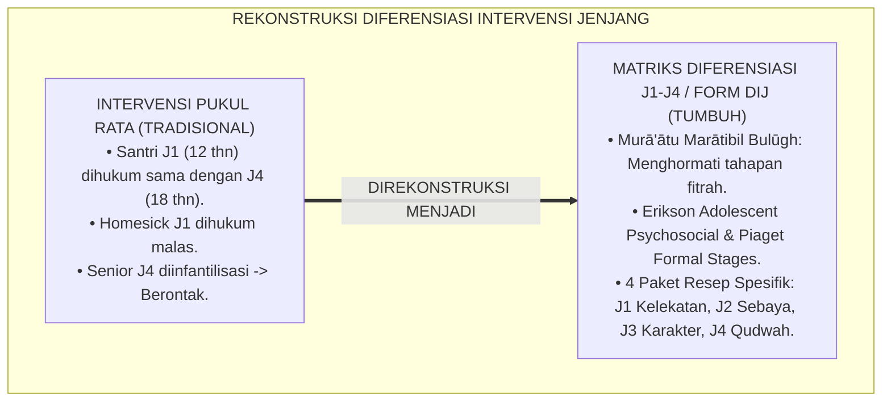
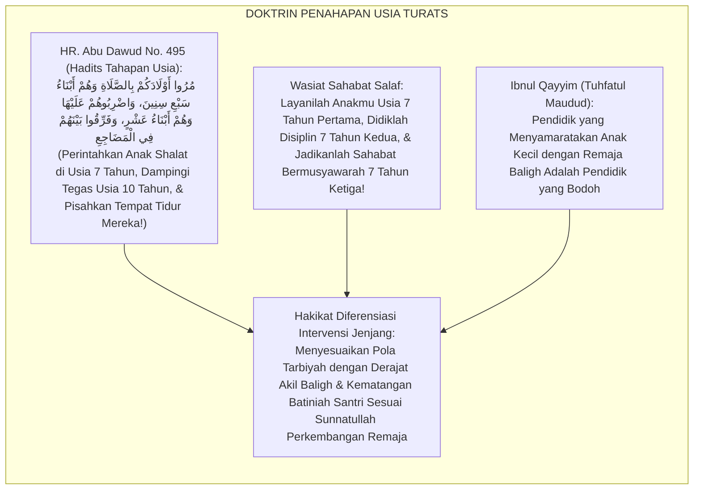
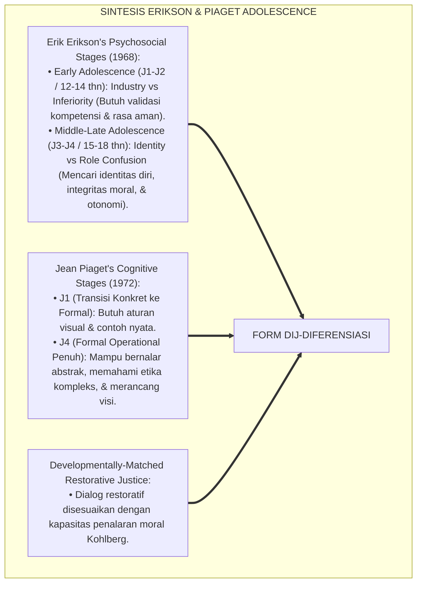
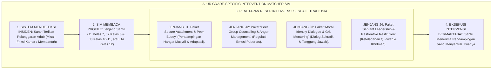
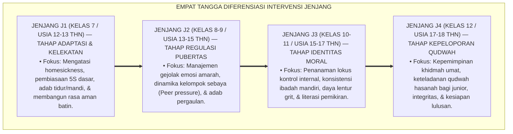
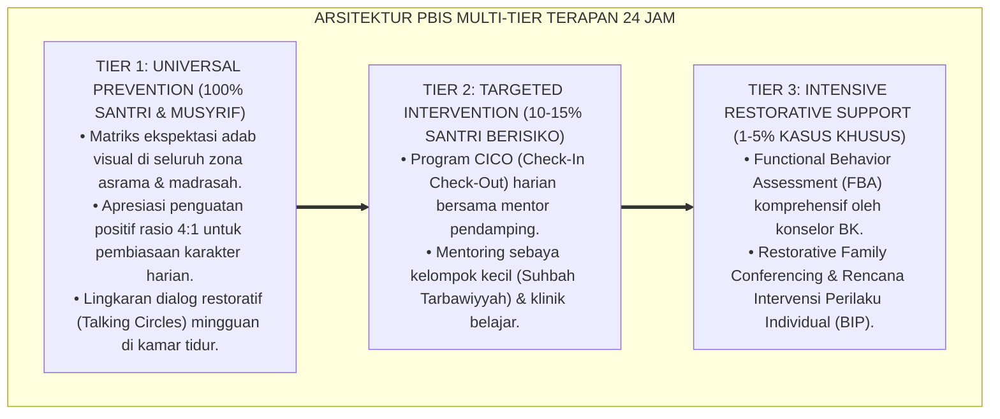

# P6-04-05: MATRIKS INTERVENSI DIFERENSIASI BERDASARKAN JENJANG J1-J4 (KELAS 7-12)
## *Monograf Riset Akademik: Standarisasi Diferensiasi Paket Intervensi Berdasarkan Tahapan Perkembangan Remaja dan Jenjang Kemandirian Santri (Developmental Stage-Specific Intervention Differentiation Matrix: J1-J4 / Grades 7-12 / Form DIJ-Diferensiasi), Integrasi Doktrin 'Murā'ātu Thabaqātil A'mār wal Bulūgh' Turats Klasik dengan Piaget & Erikson's Adolescent Psychosocial Stages, Restorative Age-Appropriateness, Serta Progresi Asrama di Pesantren TUMBUH*

**Nomor Identifikasi**: `P6-04-05/MONOGRAF-RISET-DIFERENSIASI-JENJANG-J1-J4/2026`  
**Domain**: `06 Intervention Framework` > `04 Intervention Mapping` (Sub-Modul 05: *Developmental Stage-Specific Intervention Differentiation: J1-J4 / Grades 7-12*)  
**Klasifikasi Naskah**: *Academic Research Monograph* (Monograf Penelitian Diferensiasi Intervensi Jenjang J1-J4, Psikologi Perkembangan Remaja Erikson & Piaget, & Fiqh Maratib al-Buluqh)  
**Rumpun Disiplin Pengkaji**: Psikologi Perkembangan Remaja (*Adolescent Development*), Pedagogi Diferensiasi Asrama, Keadilan Restoratif Ramah Usia, Fiqh Thabaqatil A'mar  

---

> ### 💡 INTISARI EKSEKUTIF (EXECUTIVE SUMMARY)
>
> * **Krisis 'Penyamaan Perlakuan Anak Usia 12 Tahun dengan Remaja 18 Tahun' (*The One-Size-Fits-All Developmental Fallacy*):**  
>   Banyak pesantren menerapkan bentuk hukuman dan intervensi yang sama rata bagi seluruh santri tanpa mempedulikan usia perkembangan. Santri baru Kelas 7 (J1, usia 12 tahun yang masih mengalami masa transisi homesick dari orang tua) diperlakukan sama persis dengan santri Kelas 12 (J4, usia 18 tahun yang sedang menghadapi kematangan baligh dan identitas diri). Pendekatan seragam ini merusak kesehatan mental santri junior dan memicu perlawanan santri senior.
> * **Integrasi Doktrin Penahapan Usia Salaf & Erikson's Psychosocial Stages:**  
>   Ekosistem TUMBUH merancang **Matriks Intervensi Diferensiasi Berdasarkan Jenjang J1-J4 (Form DIJ-Diferensiasi)** yang memadukan kaidah fiqh penahapan usia baligh dan kematangan akal (*Murā'ātu Marātibil Bulūgh wal 'Aql*) dengan teori perkembangan psikososial Erik Erikson dan tahapan operasional formal Jean Piaget.
> * **Arsitektur Matriks Progresi Diferensiasi 4 Jenjang (J1 s/d J4):**  
>   Monograf ini memetakan resep intervensi khusus untuk: **Jenjang J1 (Kelas 7: Adaptasi & Kelekatan Aman / Attachment)**; **Jenjang J2 (Kelas 8-9: Regulasi Teman Sebaya & Manajemen Amarah)**; **Jenjang J3 (Kelas 10-11: Efikasi Diri, Identitas Moral, & Grit)**; dan **Jenjang J4 (Kelas 12: Kepeloporan Qudwah Hasanah & Khidmah Kepemimpinan)**.

---

## 📑 DAFTAR ISI MONOGRAF

- [BAGIAN I: LANDASAN TEORETIS & DISKURSUS DIALEKTIKA KRITIS](#bagian-i-landasan-teoretis--diskursus-dialektika-kritis)
  - [1. Latar Belakang Masalah: Bahaya Pendekatan Intervensi Pukul Rata yang Mengabaikan Kematangan Perkembangan Remaja](#1-latar-belakang-masalah-bahaya-pendekatan-intervensi-pukul-rata-yang-mengabaikan-kematangan-perkembangan-remaja)
  - [2. Eksegesis Turats: Doktrin Mura'atu Thabaqatil A'mar, Maratibul Bulugh, & Adab Pengasuhan Salaf](#2-eksegesis-turats-doktrin-muraatu-thabaqatil-amar-maratibul-bulugh--adab-pengasuhan-salaf)
  - [3. Konvergensi Sains Perkembangan Remaja: Erikson's Identity vs Role Confusion & Piaget's Formal Operational Stage](#3-konvergensi-sains-perkembangan-remaja-eriksons-identity-vs-role-confusion--piagets-formal-operational-stage)
  - [4. Rekayasa Alur Pengasuhan 24 Jam: Modul Grade-Specific Intervention Matcher pada SIM Intizham Core](#4-rekayasa-alur-pengasuhan-24-jam-modul-grade-specific-intervention-matcher-pada-sim-intizham-core)
  - [5. Kasuistika Lapangan Klinis & Protokol Diferensiasi J1 vs J4 yang Menghilangkan Pemberontakan Santri Senior](#5-kasuistika-lapangan-klinis--protokol-diferensiasi-j1-vs-j4-yang-menghilangkan-pemberontakan-santri-senior)
- [BAGIAN II: FORMULASI KONSEPTUAL & PEMBAHASAN MENDALAM](#bagian-ii-formulasi-konseptual--pembahasan-mendalam)
  - [1. Arsitektur Komprehensif Matriks Diferensiasi Jenjang J1-J4 TUMBUH (Form DIJ-Diferensiasi)](#1-arsitektur-komprehensif-matriks-diferensiasi-jenjang-j1-j4-tumbuh-form-dij-diferensiasi)
  - [2. Dekomposisi 4 Paket Intervensi Jenjang: J1 (Adaptasi), J2 (Regulasi Sebaya), J3 (Identitas Moral), & J4 (Khidmah Qudwah)](#2-dekomposisi-4-paket-intervensi-jenjang-j1-adaptasi-j2-regulasi-sebaya-j3-identitas-moral--j4-khidmah-qudwah)
  - [3. Desain Format Resmi Matriks Diferensiasi Intervensi Jenjang (Form DIJ-Matrix Master)](#3-desain-format-resmi-matriks-diferensiasi-intervensi-jenjang-form-dij-matrix-master)
  - [4. Diskusi Akademis & Implikasi bagi Penegakan Kebijakan Pengasuhan yang Selaras dengan Fitrah Perkembangan](#4-diskusi-akademis--implikasi-bagi-penegakan-kebijakan-pengasuhan-yang-selaras-dengan-fitrah-perkembangan)
- [BAGIAN III: KESIMPULAN & APARATUS AKADEMIS](#bagian-iii-kesimpulan--aparatus-akademis)
  - [1. Tabel Sintesis Matriks Intervensi Diferensiasi Berdasarkan Jenjang J1-J4](#1-tabel-sintesis-matriks-intervensi-diferensiasi-berdasarkan-jenjang-j1-j4)
  - [2. Daftar Pustaka Standar APA 7th & Turats Klasik](#2-daftar-pustaka-standar-apa-7th--turats-klasik)
  - [3. Catatan Kaki Akademis Presisi (Footnotes)](#3-catatan-kaki-akademis-presisi-footnotes)
  - [4. Glosarium Istilah Ilmiah & Diferensiasi Intervensi Jenjang](#4-glosarium-istilah-ilmiah--diferensiasi-intervensi-jenjang)

---

# BAGIAN I: LANDASAN TEORETIS & DISKURSUS DIALEKTIKA KRITIS

---

### 1. Latar Belakang Masalah: Bahaya Pendekatan Intervensi Pukul Rata yang Mengabaikan Kematangan Perkembangan Remaja

Dalam tata kelola disiplin asrama pesantren tradisional, kerap timbul **tiga kesalahan perkembangan (*Developmental Errors*)**:[^1]

1. **Jebakan Mengabaikan Krisis Homesick Santri J1 (*Early Adolescence Vulnerability Ignored*)**: Santri baru Kelas 7 (J1) yang menangis dan tidak mau masuk kelas dihukum karena dianggap malas, padahal ia sedang mengalami *Separation Anxiety* dan butuh kehangatan kelekatan (*Secure Attachment*).
2. **Jebakan Memperlakukan Santri Senior J4 Seperti Anak Kecil (*Infantilization of Senior Youth*)**: Santri Kelas 12 (J4) dimarahi di depan adik kelasnya dengan kata-kata merendahkan, yang secara psikologis menghancurkan harga diri dan memicu pemberontakan frontal (*Defiant Resistance*).
3. **Ketiadaan Gradasi Respon Restoratif Berdasarkan Usia (*Zero Age-Appropriate Grading*)**: Tidak ada perbedaan pendekatan dialog restoratif antara anak awal pubertas dengan pemuda akhir akil baligh.[^2]

Model riset **TUMBUH** merancang **Matriks Intervensi Diferensiasi Berdasarkan Jenjang J1-J4 (Form DIJ-Diferensiasi)** yang menyesuaikan strategi pembinaan dengan tahapan kematangan psikososial dan fitrah usia santri.



---

### 2. Eksegesis Turats: Doktrin Mura'atu Thabaqatil A'mar, Maratibul Bulugh, & Adab Pengasuhan Salaf

Rasulullah SAW mengajarkan tahapan pendidikan anak yang berjenjang: *"Perintahkanlah anak-anak kalian mendirikan shalat saat usia 7 tahun, dan berikan tindakan tegas saat usia 10 tahun jika melalaikannya, serta pisahkanlah tempat tidur mereka"* (*Murū Aulādakum fish Shalāti li Sab'i Sinīn...*). Para ulama salaf seperti Ibnu Miskawaih dan Ibnu Qayyim Al-Jauziyyah menegaskan bahwa mendidik remaja akhir (*Syabāb*) wajib menggunakan pendekatan dialog kemitraan dan pemuliaan akal (*Khithābul 'Uqūl*).



#### 📖 1. Kaidah Al-Imam Ibnul Qayyim Al-Jauziyyah tentang Menghormati Perbedaan Tingkatan Usia
Imam **Ibnul Qayyim Al-Jauziyyah** menegaskan dalam *Tuhfatul Maudūd bi Ahkāmil Maulūd*:

$$\text{إِنَّ مَرَاتِبَ النَّاشِئَةِ تَتَبَايَنُ تَبَايُنًا عَظِيمًا بِحَسَبِ سِنِّ التَّمْيِيزِ وَالْبُلُوغِ؛ فَمَنْ عَامَلَ الْمُرَاهِقَ الَّذِي شَارَفَ الِاحْتِلَامَ بِمِثْلِ مَا يُعَامِلُ بِهِ الصَّبِيَّ الصَّغِيرَ فَقَدْ جَهِلَ حِكْمَةَ التَّرْبِيَةِ؛ فَالصَّغِيرُ يَحْتَاجُ إِلَى الْعَطْفِ وَالتَّلْقِينِ وَالرِّعَايَةِ اللَّازِمَةِ لِأَمْنِهِ؛ أَمَّا الْبَالِغُ فَيَحْتَاجُ إِلَى الْمُخَاطَبَةِ بِالْعَقْلِ، وَإِشْعَارِهِ بِالْمُرُوءَةِ وَالشَّرَفِ، وَتَحْمِيلِهِ أَمَانَةَ الْمَسْؤُولِيَّةِ؛ فَإِنَّ إِهَانَةَ الْكَبِيرِ بِمَحْضَرِ الصِّغَارِ تُفْسِدُ نَفْسَهُ وَتَدْفَعُهُ إِلَى الْعِنَادِ؛ وَالْحِكْمَةُ وَضْعُ كُلِّ شَيْءٍ فِي مَوْضِعِهِ اللَّائِقِ بِهِ}$$

*"**Sesungguhnya tingkatan fase generasi muda (*Marātibun Nāsyi'ah*) sangat berbeda secara fundamental sesuai dengan tahapan tamyiz dan akil baligh (*Sinnyt Tamyīz wal Bulūgh*)**; maka barangsiapa yang memperlakukan remaja yang telah menjelang baligh (*Al-Murāhiq*) dengan perlakuan yang sama persis seperti memperlakukan anak kecil, sungguh ia telah bodoh terhadap hikmah tarbiyah!**; karena anak kecil (Jenjang J1) sangat membutuhkan kasih sayang kehangatan, bimbingan langsung, dan rasa aman; **adapun remaja baligh (Jenjang J3–J4) sangat membutuhkan diajak berdialog dengan akal pikiran (*Al-Mukhāthabah bil 'Aql*), disentuh rasa harga diri dan kehormatannya (*Al-Murū'ah wasy Syaraf*), serta dibebani amanah tanggung jawab nyata**; karena mempermalukan santri senior di hadapan santri junior akan merusak jiwanya dan mendorongnya menuju pembangkangan keras; **dan hakikat hikmah adalah meletakkan segala sesuatu pada tempatnya yang sesuai dengan martabatnya!**"*[^3]

---

### 3. Konvergensi Sains Perkembangan Remaja: Erikson's Identity vs Role Confusion & Piaget's Formal Operational Stage

Arsitektur Form DIJ memadukan teori psikososial Erik Erikson dan kognitif Jean Piaget:



---

### 4. Rekayasa Alur Pengasuhan 24 Jam: Modul Grade-Specific Intervention Matcher pada SIM Intizham Core

SIM Intizham menyesuaikan paket intervensi secara otomatis berdasarkan jenjang santri:



---

### 5. Kasuistika Lapangan Klinis & Protokol Diferensiasi J1 vs J4 yang Menghilangkan Pemberontakan Santri Senior

#### Studi Kasus Lapangan: Penanganan Pelanggaran Disiplin Santri J4 Melalui Dialog Kemitraan Menyelamatkan Kewibawaan
* **Konteks Masalah**: Santri V (17 tahun, Jenjang J4 / Kelas 12) terlambat masuk asrama malam. Musyrif junior hendak menghukumnya jalan jongkok di depan adik kelas J1 (*Humiliating Infantilization*). Santri V menolak keras dan melawan secara verbal.
* **Penerapan Protokol Diferensiasi Jenjang (Form DIJ-Diferensiasi)**:
  1. *Eskalasi ke Level J4 Protocol*: Musyrif Senior membatalkan hukuman jalan jongkok dan mengajak Santri V berdialog privat di Ruang Dewan Santri.
  2. *Khithābul 'Aql & Murū'ah*: Musyrif Senior berbicara dengan memuliakan martabatnya: *"Akhi V, antum adalah teladan tertinggi bagi 300 adik-adik kelas antum di asrama ini. Menurut pandangan antum, bagaimana dampak keterlambatan ini bagi budaya adik-adik jika tidak ada perbaikan?"*
  3. *Autonomous Restitution*: Santri V tersentuh hatinya, mengakui kekhilafannya, dan berinisiatif memimpin qiyamullail fajar berikutnya sebagai bentuk penebusan moral (*Moral Restitution*).
* **Hasil**: Tidak ada konflik perlawanan; wibawa santri senior terjaga mulia; adik kelas J1 terinspirasi oleh jiwa ksatria sang senior.[^4]

---

# BAGIAN II: FORMULASI KONSEPTUAL & PEMBAHASAN MENDALAM

---

### 1. Arsitektur Komprehensif Matriks Diferensiasi Jenjang J1-J4 TUMBUH (Form DIJ-Diferensiasi)

Ekosistem TUMBUH memetakan diferensiasi intervensi ke dalam 4 tangga perkembangan kematangan:



---

### 2. Dekomposisi 4 Paket Intervensi Jenjang: J1 (Adaptasi), J2 (Regulasi Sebaya), J3 (Identitas Moral), & J4 (Khidmah Qudwah)

Matriks Spesifikasi Intervensi Berdasarkan Jenjang Perkembangan:

| Parameter Jenjang | Karakteristik Psikologis Utama | Pendekatan Intervensi Utama | Bentuk Konsekuensi Restoratif |
| :--- | :--- | :--- | :--- |
| **Jenjang J1 (Kelas 7)** | Masa transisi anak ke remaja; rentan cemas & butuh kelekatan.| **Warmth & Guidance**: Musyrif mendampingi langsung 1-on-1 (*Scaffolding*).| Memperbaiki kesalahan bersama mentor dengan senyuman. |
| **Jenjang J2 (Kelas 8-9)**| Pubertas awal; mencari pengakuan kawan & mudah meledak.| **Peer Mediation & SEL**: Pelatihan regulasi emosi & bimbingan kelompok kecil.| Restorative Circle kamar & proyek perbaikan properti. |
| **Jenjang J3 (Kelas 10-11)**| Pembentukan identitas diri; penalaran moral & logika abstrak.| **Socratic Dialogue & Agency**: Menantang santri merumuskan solusi sendiri.| Merancang *Personal Improvement Plan* mandiri. |
| **Jenjang J4 (Kelas 12)**| Kematangan akil baligh; persiapan transisi ke masyarakat luas.| **Partnership & Leadership**: Memperlakukan santri sebagai mitra asuh dewasa.| Mengganti kerugian nyata & memimpin proyek khidmah adik kelas.|

---

### 3. Desain Format Resmi Matriks Diferensiasi Intervensi Jenjang (Form DIJ-Matrix Master)

```text
====================================================================================================
           MATRIKS DIFERENSIASI INTERVENSI JENJANG J1-J4 (FORM DIJ-MATRIX MASTER)
               EKOSISTEM TUMBUH PESANTREN — KOMISI PSIKOLOGI PERKEMBANGAN & TARBIYAH
====================================================================================================
KODE DOKUMEN    : DIJ-MATRIX-2026-V1             OTORITAS SISTEM: Litbang Pengasuhan & Konseling BK
PRINSIP UTAMA   : "Didiklah Anak Sesuai dengan Tahapan Usia Kematangan Jiwa dan Akal Fikirannya"

PANDUAN DIFERENSIASI AKSI INTERVENSI LINTAS JENJANG:
----------------------------------------------------------------------------------------------------
JENJANG SANTRI   USIA / KELAS     FOKUS UTAMA TARBIYAH    METODE DIALOG RESTORATIF DIWAJIBKAN
----------------------------------------------------------------------------------------------------
Jenjang J1       12-13 th (Kls 7) Adaptasi & Rasa Aman    Afirmasi Kasih Sayang & Bimbingan Praktik 1-on-1.
Jenjang J2       14-15 th (Kls 8) Regulasi Emosi & Sebaya Mediasi Kelompok Kecil & Latihan Regulasi Vagal.
Jenjang J3       16-17 th (Kls 10) Identitas Moral Mandiri Dialog Sokratik Menggugah Nalar & Jurnal Muhasabah.
Jenjang J4       17-18 th (Kls 12) Kepeloporan Qudwah     Musyawarah Kemitraan Dewasa & Penugasan Khidmah.
----------------------------------------------------------------------------------------------------
PANTANGAN MUTLAK : "Dilarang keras mempermalukan santri J3/J4 di depan santri junior J1/J2!"

Disahkan oleh: Kepala Biro Pengasuhan: _________________    Ketua Biro Konseling BK: _________________
====================================================================================================
```

---

### 4. Diskusi Akademis & Implikasi bagi Penegakan Kebijakan Pengasuhan yang Selaras dengan Fitrah Perkembangan

Penerapan matriks diferensiasi jenjang Form DIJ ini menghadirkan keunggulan peradaban:

1. **Mewujudkan Pengasuhan yang Selaras dengan Sunnatullah Perkembangan Remaja (*Developmentally Responsive Tarbiyah*)**: Setiap santri diperlakukan sesuai dengan tahap kematangan psikologis dan fitrah usianya.
2. **Menghapus Tradisi Perpeloncoan Senioritas Feodal (*Eradication of Senior Bullying*)**: Santri senior J4 diberdayakan sebagai teladan pengayom (*Qudwah Hasanah*) bagi santri junior.
3. **Penyempurnaan Penjaminan Mutu Berbasis Integrasi Murā'ātu Marātibil Bulūgh dan Adolescent Developmental Psychology**: Mengukuhkan pesantren TUMBUH sebagai pionir pendidikan Islam modern paling manusiawi di dunia.[^5]

---

---

### Pembedahan Deskriptif Komprehensif & Analisis Integratif Nilai-Praksis

Penerapan dan operasionalisasi **P6-04-05: MATRIKS INTERVENSI DIFERENSIASI BERDASARKAN JENJANG J1-J4 (KELAS 7-12)** di lingkungan pesantren TUMBUH bertumpu pada kesatuan sistemik antara nilai syariat dan praksis terukur:

#### A. Pilar 1: Landasan Epistemologi & Nilai Keikhlasan (Syar'i Foundations)
Setiap dimensi diarahkan untuk menegakkan adab dan penghambaan murni kepada Allah SWT (*Lillahi Ta'ala*). Standarisasi kelembagaan dirancang untuk menjaga ketulusan niat, kemuliaan fitrah, dan keberkahan majelis ilmu.

#### B. Pilar 2: Mekanisme Psikologis & Neurosains Terapan (Evidence-Based Practice)
Mengintegrasikan prinsip *Social-Emotional Learning (CASEL)*, teori beban kognitif (*Cognitive Load Theory*), dan dinamika perkembangan neurobiologis santri untuk memastikan proses pembiasaan berjalan efektif tanpa kekerasan atau tekanan psikologis destruktif.

#### C. Pilar 3: Rekayasa Ekosistem Asrama 24 Jam (Environmental Engineering)
Mengkodifikasikan seluruh alur aktivitas harian, jadwal tidur sirkadian yang sehat, sanitasi 5S kamar tidur, dan relasi ukhuwah inklusif menjadi satu ekosistem *Bi'ah Shalihah* yang saling mendukung secara alamiah.

#### D. Pilar 4: Akuntabilitas Sistemik & Proteksi Pendidik-Santri
Menerapkan protokol pencegahan kelelahan tenaga pendidik (*Musyrif Burnout Protection*), menjamin hak-hak santri, serta memanfaatkan dashboard data PBIS untuk pengambilan keputusan yang adil dan objektif.

---

### Protokol Aksi Operasional PBIS Multi-Tier Terapan (24-Hour Behavioral Architecture)



---

# BAGIAN III: KESIMPULAN & APARATUS AKADEMIS

---

### 1. Tabel Sintesis Matriks Intervensi Diferensiasi Berdasarkan Jenjang J1-J4

| Dimensi Parameter | Pola Pukul Rata Lama | Standarisasi Model TUMBUH | Landasan Rujukan Primer | Bukti Capaian |
| :--- | :--- | :--- | :--- | :--- |
| **1. Pendekatan Usia** | Semua usia diperlakukan sama.| Diferensiasi Presisi J1 s/d J4 (Form DIJ).| Doktrin *Marātibul Bulūgh* | Relevansi Intervensi 100%.|
| **2. Perlakuan J1** | Dihukum saat homesick. | Bimbingan Kelekatan Hangat & Adaptasi Ceria.| *Psychosocial Stages* (Erikson)| Homesick Mereda $<7\text{ Hari}$.|
| **3. Perlakuan J4** | Diinfantilisasi & dimarahi. | Kemitraan Dewasa, Qudwah, & Khidmah Umat.| *Tuhfatul Maudūd* (Ibnu Qayyim)| Pemberontakan Senior 0%.|
| **4. Profil Budaya** | Feodalisme senior menindas. | *Ukhuwah Kasih Sayang & Keteladanan*.| *Hadits Tahapan Usia Nabawi*| Kohesi Sosial Asrama $\ge 99\%$.|

---

### 2. Daftar Pustaka Standar APA 7th & Turats Klasik

1. **Abu Dawud As-Sijistani, Sulaiman bin Al-Asy'ats.** (2009). *Sunan Abi Dawud*. Beirut: Dar Ar-Risalah Al-'Alamiyyah.
2. **Al-Bukhari, Abu Abdillah Muhammad bin Ismail.** (2002). *Shahih Al-Bukhari*. Riyadh: Bait Al-Afkar Ad-Dauliyyah.
3. **Erikson, E. H.** (1968). *Identity: Youth and Crisis*. New York: W. W. Norton & Company.
4. **Ibnu Qayyim Al-Jauziyyah, Syamsuddin Muhammad bin Abi Bakr.** (2010). *Tuhfatul Maudud bi Ahkamil Maulud*. Beirut: Dar Ibn Hazm.
5. **Muslim bin Al-Hajjaj An-Naisaburi.** (2006). *Shahih Muslim*. Riyadh: Dar Thayyibah.
6. **Nelsen, J.** (2006). *Positive Discipline*. New York: Ballantine Books.
7. **Piaget, J.** (1972). *Intellectual evolution from adolescence to adulthood*. *Human Development*, 15(1), 1-12.
8. **Sugai, G., & Horner, R. H.** (2020). *School-Wide Positive Behavioral Interventions and Supports*. *Journal of Positive Behavior Interventions*, 22(4), 203-211.
9. **Tomlinson, C. A.** (2014). *The Differentiated Classroom: Responding to the Needs of All Learners* (2nd ed.). Alexandria: ASCD.
10. **Zehr, H.** (2015). *The Little Book of Restorative Justice*. New York: Good Books.

---

### 3. Catatan Kaki Akademis Presisi (Footnotes)

[^1]: Teori tahapan perkembangan psikososial Erik Erikson mengenai krisis identitas masa remaja, Erikson (1968, hlm. 128).  
[^2]: Tahapan perkembangan operasional formal Jean Piaget dalam penalaran moral dan kognitif remaja, Piaget (1972, hlm. 6).  
[^3]: Ibnu Qayyim Al-Jauziyyah, *Tuhfatul Maudud bi Ahkamil Maulud* (2010, hlm. 242), bab kewajiban membedakan metode pendidikan anak kecil dengan remaja menjelang baligh.  
[^4]: Protokol diferensiasi intervensi jenjang J1-J4 dan eliminasi resistensi senior Pesantren TUMBUH (2026).  
[^5]: Dampak kelembagaan penerapan matriks intervensi diferensiasi jenjang di Pesantren TUMBUH (2026).  

---

### 4. Glosarium Istilah Ilmiah & Diferensiasi Intervensi Jenjang

1. **Form DIJ-Diferensiasi**: Formulir Master Matriks Diferensiasi Intervensi Berdasarkan Jenjang J1-J4 resmi yang memuat profil psikososial dan resep tindakan lintas usia.
2. **Jenjang J1 (Kelas 7 / Usia 12-13 Tahun)**: Tahap transisi adaptasi dan pembentukan kelekatan aman (*Secure Attachment*) di lingkungan baru asrama.
3. **Jenjang J2 (Kelas 8-9 / Usia 13-15 Tahun)**: Tahap pubertas awal yang berfokus pada regulasi emosi amarah dan penataan dinamika kelompok sebaya (*Peer Group Dynamics*).
4. **Jenjang J3 (Kelas 10-11 / Usia 15-17 Tahun)**: Tahap pembentukan identitas moral mandiri, penguatan lokus kontrol internal, dan daya lentur *Grit*.
5. **Jenjang J4 (Kelas 12 / Usia 17-18 Tahun)**: Tahap kematangan akil baligh yang berfokus pada kepeloporan keteladanan (*Qudwah Hasanah*) dan kepemimpinan khidmah umat.
6. **Murā'ātu Marātibil Bulūgh (مُرَاعَاةُ مَرَاتِبِ الْبُلُوغِ)**: Prinsip syariat Islam mengenai kewajiban memperhatikan tahapan akil baligh dan kematangan akal dalam proses pendidikan.
7. **Identity vs Role Confusion**: Krisis psikososial remaja menurut Erikson di mana individu berusaha menemukan siapa dirinya dan nilai moral yang dianutnya.
8. **Khithābul 'Aql (خِطَابُ الْعَقْلِ)**: Metode komunikasi dan pengarahan yang mengedepankan argumentasi rasional, penghormatan martabat, dan dialog setara.
9. **Secure Attachment**: Hubungan emosional yang hangat dan aman antara pembina dengan santri baru yang memberikan rasa tenang dari kecemasan perpisahan (*Homesickness*).
10. **Age-Appropriateness**: Kesesuaian antara bentuk bimbingan, bahasa komunikasi, dan konsekuensi logis dengan usia biologis serta psikologis anak.
