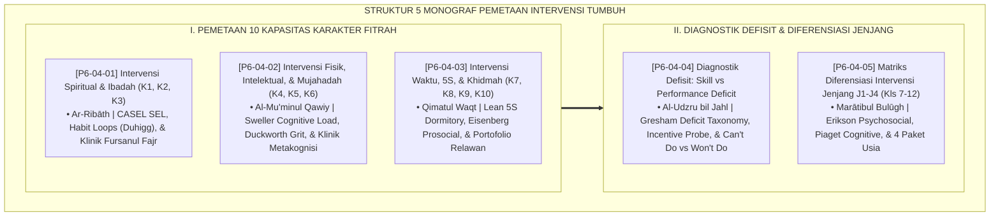

# P6-04: DOKUMEN INDUK PEMETAAN INTERVENSI 10 KARAKTER MUWASHAFAT
## *Arsitektur dan Rekayasa Pemetaan Presisi Intervensi Berjenjang untuk 10 Kapasitas Fitrah Insan, Diagnostik Defisit Keterampilan vs Motivasi, Serta Matriks Diferensiasi Jenjang J1-J4 (Intervensi Spiritual K1-K3 Form PIK, Intervensi Fisik & Nalar K4-K6 Form PIM, Intervensi Waktu & Khidmah K7-K10 Form PWK, Diagnostik Skill vs Performance Deficit Form SDP, Serta Diferensiasi Jenjang J1-J4 Form DIJ) di Ekosistem TUMBUH Pesantren*

**Nomor Identifikasi**: `P6-04/DOKUMEN-INDUK-PEMETAAN-INTERVENSI-10-KARAKTER/2026`  
**Domain**: `06 Intervention Framework` > `04 Intervention Mapping` (Gugus Sub-Domain 04: *Comprehensive 10-Character Intervention Mapping, Precision Behavioral Diagnostics, & Developmental Differentiation*)  
**Klasifikasi Naskah**: *Master Architecture & Navigation Monograph* (Dokumen Induk Peta Jalan Riset & Navigasi 5 Monograf Ilmiah Pemetaan Intervensi 10 Karakter Muwashafat)  
**Rumpun Disiplin Pengkaji**: Desain Kurikulum Intervensi Karakter, Diagnostik Perilaku Presisi, Psikologi Perkembangan Remaja, Fiqh Takmilul Akhlaq  

---

> ### 💡 INTISARI EKSEKUTIF (EXECUTIVE SUMMARY)
>
> * **Kedudukan Strategis Gugus Pemetaan Intervensi 10 Karakter Muwashafat:**  
>   Gugus *Intervention Mapping (Pemetaan Intervensi 10 Karakter Muwashafat)* merupakan pusat presisi resep pembinaan (*The Prescription & Clinical Mapping Core*) dalam ekosistem TUMBUH. Gugus ini menjembatani taksonomi kapasitas karakter santri dengan paket intervensi nyata di lapangan, memastikan bahwa setiap kelemahan karakter tertangani dengan resep yang tepat: **K1–K3 (Spiritual & Moral)**, **K4–K6 (Fisik, Intelektual, & Mujahadah)**, **K7–K10 (Waktu, Keteraturan, Kemandirian, & Khidmah)**, **Diagnostik Can't Do vs Won't Do**, dan **Diferensiasi Jenjang J1–J4**.
> * **Integrasi Holistik Turats & Konsensus Sains Pemetaan Intervensi:**  
>   Gugus riset ini memadukan khazanah agung Islam tentang penyempurnaan akhlaq (*Innamā Bu'itstu li Utammima Makārimal Akhlāq*), penahapan usia (*Murā'ātu Thabaqātil A'mār*), uzur kebodohan (*Al-'Udzru bil Jahl*), dan mahalnya waktu (*Qīmatuz Zaman*) dengan konsensus sains dunia (*CASEL SEL, Sweller Cognitive Load Theory, Angela Duckworth Grit, Lean 5S Organization, Frank Gresham Deficit Taxonomy, dan Erikson Psychosocial Stages*).
> * **Struktur Lengkap 5 Berkas Monograf Riset Ilmiah:**  
>   Dokumen induk ini memetakan dan menghubungkan 5 berkas monograf penelitian akademik komprehensif (~145 KB total riset) yang menyajikan menu intervensi terstandar K1–K10, modul habituasi Fursanul Fajr, protokol klinik metakognisi tahfizh, audit 5S asrama, lembar uji insentif 2 menit, dan matriks tindakan diferensiasi Kelas 7–12.

---

## 📑 PETA NAVIGASI LIMA MONOGRAF RISET PEMETAAN INTERVENSI

Berikut adalah daftar lengkap 5 monograf riset akademik dalam gugus **`04 Intervention Mapping`**:

---

## 📚 DESKRIPSI RINGKAS 5 BERKAS MONOGRAF

1. **[P6-04-01: Pemetaan Intervensi Karakter Spiritual dan Ibadah (K1, K2, K3)](file:///c:/xampp/htdocs/tumbuh/06%20Intervention%20Framework/04%20Intervention%20Mapping/P6-04-01-Pemetaan-Intervensi-Karakter-Spiritual-dan-Ibadah.md)**  
   *Membahas menu intervensi berjenjang untuk Aqidah Salimah (K1), Ibadah Shahihah (K2), dan Akhlaq Karimah (K3), doktrin Ar-Ribath & Hubbus Shalah, habit loops, sleep hygiene fajar, dan form Form PIK-Spiritual.*
2. **[P6-04-02: Pemetaan Intervensi Karakter Fisik, Intelektual, dan Mujahadah (K4, K5, K6)](file:///c:/xampp/htdocs/tumbuh/06%20Intervention%20Framework/04%20Intervention%20Mapping/P6-04-02-Pemetaan-Intervensi-Karakter-Fisik-Intelektual-dan-Mujahadah.md)**  
   *Membahas intervensi Qawiyyul Jismi (K4), Mutsaqqaful Fikri (K5), dan Mujahidun Linafsihi (K6), doktrin Al-Mu'minul Qawiy, Sweller Cognitive Load Theory, Angela Duckworth Grit, klinik metakognisi tahfizh, dan form Form PIM-Mujahadah.*
3. **[P6-04-03: Pemetaan Intervensi Karakter Waktu, Keteraturan, Kemandirian, dan Khidmah (K7, K8, K9, K10)](file:///c:/xampp/htdocs/tumbuh/06%20Intervention%20Framework/04%20Intervention%20Mapping/P6-04-03-Pemetaan-Intervensi-Karakter-Waktu-Keteraturan-dan-Khidmah.md)**  
   *Membahas intervensi Harishun ala Waqtihi (K7), Munazzhamun fi Syu'unihi (K8), Qadirun alal Kasbi (K9), dan Nafi'un Lighairihi (K10), doktrin Qimatuz Zaman, Lean 5S Dormitory Organization, prosocial engagement, dan form Form PWK-Khidmah.*
4. **[P6-04-04: Protokol Koreksi Defisit Kapasitas (Skill Deficit vs Performance Deficit)](file:///c:/xampp/htdocs/tumbuh/06%20Intervention%20Framework/04%20Intervention%20Mapping/P6-04-04-Protokol-Koreksi-Defisit-Kapasitas-Skill-Deficit-vs-Performance-Deficit.md)**  
   *Membahas metodologi diagnostik pembedaan Can't Do vs Won't Do, doktrin Al-'Udzru bil Jahl, Frank Gresham Deficit Taxonomy, uji insentif cepat 2 menit, presisi resep aksi, dan form Form SDP-Diagnostik.*
5. **[P6-04-05: Matriks Intervensi Diferensiasi Berdasarkan Jenjang J1-J4 (Kelas 7-12)](file:///c:/xampp/htdocs/tumbuh/06%20Intervention%20Framework/04%20Intervention%20Mapping/P6-04-05-Matriks-Intervensi-Diferensiasi-Berdasarkan-Jenjang-J1-J4.md)**  
   *Membahas standarisasi diferensiasi paket bimbingan berdasarkan tahapan usia remaja, doktrin Maratibul Bulugh, teori psikososial Erik Erikson, tahapan operasional formal Jean Piaget, penghapusan senioritas feodal, dan form Form DIJ-Diferensiasi.*

---

## 🎯 STANDAR PENJAMINAN MUTU PEMETAAN INTERVENSI

Penerapan gugus **Pemetaan Intervensi 10 Karakter Muwashafat (Intervention Mapping)** menjamin bahwa:
1. **Setiap Defisit Perilaku Memiliki Resep Intervensi yang Presisi dan Berbasis Bukti Ilmiah (*Precision Behavioral Prescription*)**: Menghilangkan tindakan coba-coba atau hukuman sembarangan di lapangan.
2. **Keadilan Diagnostik Ditegakkan Sempurna (*Diagnostic Justice*)**: Santri yang belum tahu (*Can't Do*) diajarkan dengan kelembutan, dan santri yang lalai (*Won't Do*) dibangkitkan motivasi batinnya.
3. **Pembinaan Selaras dengan Sunnatullah Tahapan Perkembangan Usia Santri (*Developmentally Tailored Tarbiyah*)**: Jenjang J1 diasuh dengan kehangatan kelekatan, sementara Jenjang J4 diberdayakan sebagai teladan kepemimpinan khidmah umat.
