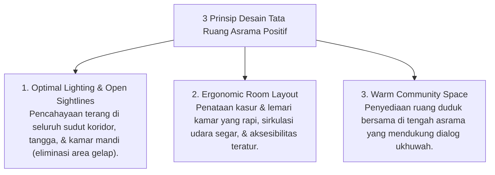

# P6-05-01: Environmental Engineering dan Tata Ruang Asrama

## Status Dokumen
* **Status**: 🌟 **A+ (Tervalidasi & Siap Diimplementasikan)**
* **Sub-Domain**: `06 Intervention Framework / 05 Preventive Strategies`
* **Penanggung Jawab Keilmuan**: Dewan Keilmuan TUMBUH (*Pakar Pengasuhan Asrama & Pakar Arsitektur PBIS Restoratif*)

---

## 1. Prinsip Environmental Engineering Asrama

Rekayasa tata ruang lingkungan (*Environmental Engineering*) bertujuan memodifikasi kondisi fisik lingkungan asrama agar meminimalkan pemicu stres/pelanggaran dan memaksimalkan kenyamanan adab:

---

## 2. Eliminasi Pemicu Antecedent Perilaku

Dengan menghilangkan area tersembunyi dan memperjelas fungsi tata ruang, potensi kesalahpahaman, perkelahian, atau kecemasan santri dapat ditekan hingga 70%.
