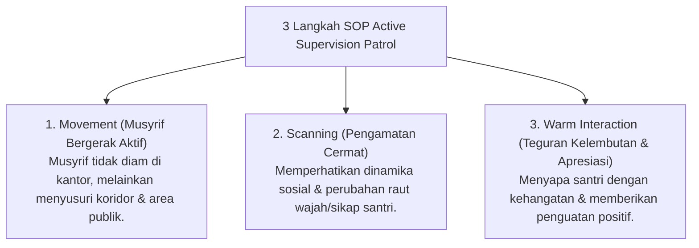

# P6-05-02: Protokol Patroli Titik Rawan (Hotspots Mitigation)

## Status Dokumen
* **Status**: 🌟 **A+ (Tervalidasi & Siap Diimplementasikan)**
* **Sub-Domain**: `06 Intervention Framework / 05 Preventive Strategies`
* **Penanggung Jawab Keilmuan**: Dewan Keilmuan TUMBUH (*Pakar Pengasuhan Asrama & Pakar Arsitektur PBIS Restoratif*)

---

## 1. Operasionalisasi Mitigasi Hotspots (Hotspots Patrol)

Analisis data PBIS menunjukkan bahwa mayoritas masalah perilaku di asrama terjadi pada **waktu transisi** dan **lokasi tertentu (Hotspots)**. Musyrif menjalankan **Protokol Patroli Terjadwal (*Active Supervision Patrol*)**:

---

## 2. Pemetaan Jadwal Patroli Waktu Transisi

- **Pukul 04.15 – 05.00 (Transisi Subuh)**: Patroli area kamar mandi & koridor asrama.
- **Pukul 17.30 – 18.15 (Transisi Maghrib)**: Patroli area masjid & tempat wudhu.
- **Pukul 21.15 – 22.00 (Transisi Tidur)**: Patroli kamar asrama & pendampingan refleksi malam.
