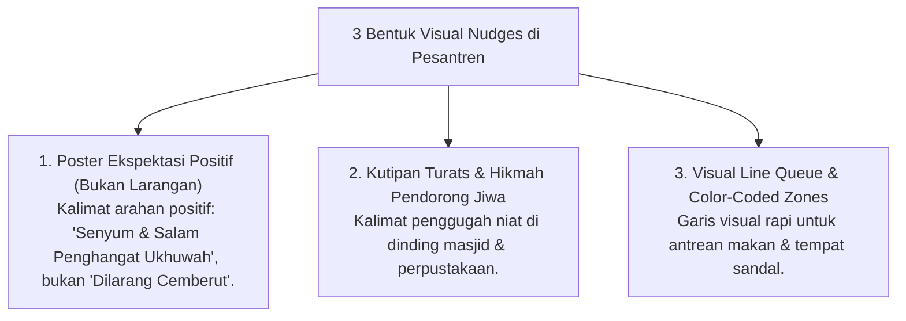

# P6-05-03: Arsitektur Nudges Visual dan Budaya Bi'ah Shalihah

## Status Dokumen
* **Status**: 🌟 **A+ (Tervalidasi & Siap Diimplementasikan)**
* **Sub-Domain**: `06 Intervention Framework / 05 Preventive Strategies`
* **Penanggung Jawab Keilmuan**: Dewan Keilmuan TUMBUH (*Pakar Desain Kurikulum Adab & Pakar Psikologi Sosial Santri*)

---

## 1. Konseptualisasi Visual Nudge Theory

Visual Nudges adalah petunjuk lingkungan non-verbal yang secara halus mendorong pilihan perilaku adab tanpa pemaksaan (*Choice Architecture*):

---

## 2. Penguatan Budaya Bi'ah Shalihah

Integrasi visual nudges memperkuat suasana keimanan dan persaudaraan (*Bi'ah Shalihah*) di mana kebaikan menjadi pilihan paling alami dan mudah dilakukan oleh santri.
