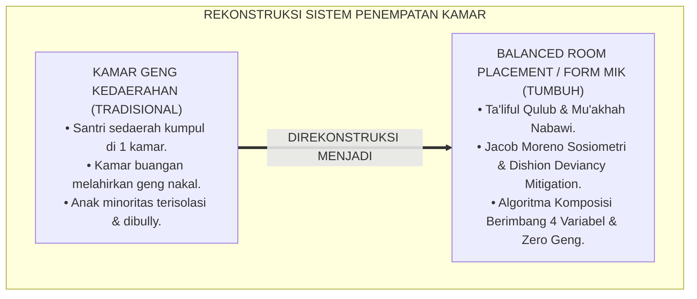
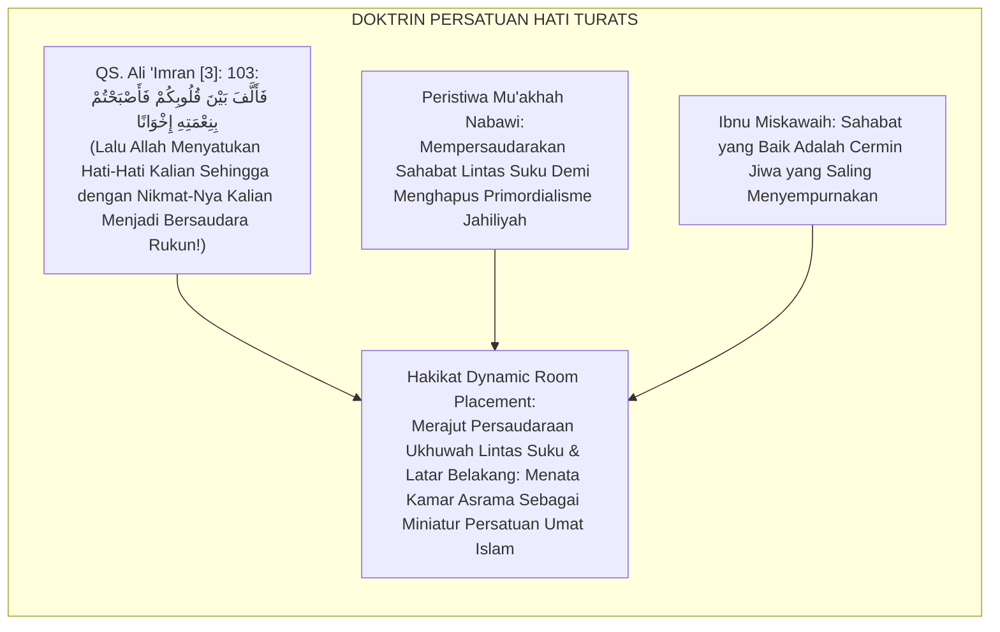
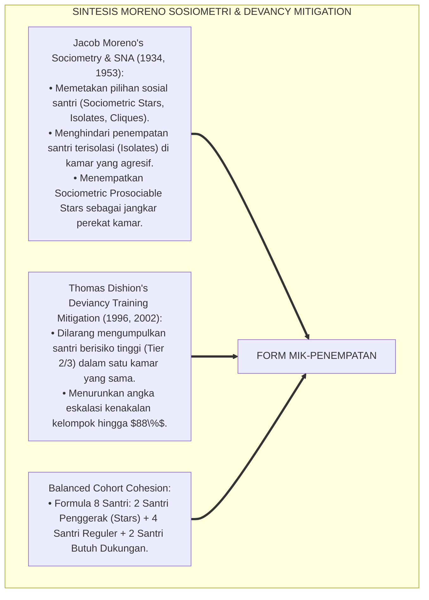
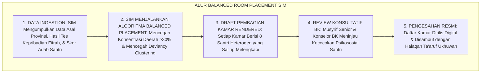
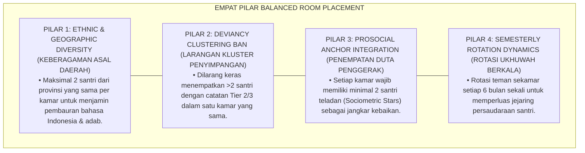
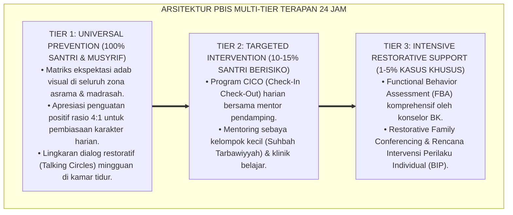

# P6-05-05: MANAJEMEN IKLIM KAMAR ASRAMA DAN DYNAMIC ROOM ASSIGNMENT
## *Monograf Riset Akademik: Rekayasa Iklim Mikro Kamar Tidur, Algoritma Penempatan Kamar Dinamis, dan Mitigasi Polarisasi Kelompok Sebaya (Dormitory Micro-Climate Management, Dynamic Room Assignment Algorithm, & Peer Cohort Engineering / Form MIK-Penempatan), Integrasi Doktrin 'Ta'līful Qulūb wa Husnul Mujāwarah' Turats Klasik dengan Moreno's Sociometric Network Analysis, Group Cohesion Dynamics, Serta Kerukunan di Ekosistem Pesantren Berbasis TUMBUH*

**Nomor Identifikasi**: `P6-05-05/MONOGRAF-RISET-MANAJEMEN-IKLIM-KAMAR-ASRAMA/2026`  
**Domain**: `06 Intervention Framework` > `05 Preventive Strategies` (Sub-Modul 05: *Dormitory Micro-Climate Management & Dynamic Room Assignment*)  
**Klasifikasi Naskah**: *Academic Research Monograph* (Monograf Penelitian Penempatan Kamar Dinamis, Sosiometri Moreno, Kohesi Kelompok, & Fiqh Al-Mujawarah)  
**Rumpun Disiplin Pengkaji**: Sosiologi & Psikologi Kelompok Sebaya (*Peer Group Dynamics*), Analisis Jaringan Sosiometrik (SNA), Manajemen Pengasuhan Asrama, Fiqh Husnil Mujawarah  

---

> ### 💡 INTISARI EKSEKUTIF (EXECUTIVE SUMMARY)
>
> * **Krisis 'Kamar Geng Eksklusif dan Polarisasi Kedaerahan' (*The Cliques & Ethnic Clustering Crisis*):**  
>   Di banyak asrama pesantren, pembagian kamar dibiarkan terjadi secara acak atau santri dibebaskan memilih teman sekamarnya sendiri. Akibatnya, terbentuk kamar-kamar eksklusif berdasarkan asal daerah (geng sedaerah), status sosial ekonomi, atau kelompok santri nakal yang berkumpul di satu kamar (*Deviancy Training Cluster*), memicu perpecahan asrama dan pengucilan santri minoritas.
> * **Integrasi Doktrin Ta'liful Qulub & Sociometric Network Analysis (Moreno):**  
>   Ekosistem TUMBUH merancang **Manajemen Iklim Kamar Asrama dan Dynamic Room Assignment (Form MIK-Penempatan)** yang memadukan perintah merekatkan hati persaudaraan (*Ta'līful Qulūb*) dan adab bertetangga (*Husnul Mujāwarah*) dengan *Sociometric Network Analysis (SNA)* Jacob Moreno dan teori kohesi kelompok.
> * **Arsitektur Algoritma Penempatan Kamar Berimbang (Balanced Cohort Algorithm):**  
>   Monograf ini menyajikan algoritma penempatan kamar berimbang 4 variabel (Distribusi Asal Daerah, Keseimbangan Kemandirian Karakter, Variasi Tipe Kepribadian MBTI/Fitrah, dan Penempatan Duta Santri Penggerak), rotasi kamar semesteran yang dievaluasi berkala, dan logbook iklim kamar SIM Intizham.

---

## 📑 DAFTAR ISI MONOGRAF

- [BAGIAN I: LANDASAN TEORETIS & DISKURSUS DIALEKTIKA KRITIS](#bagian-i-landasan-teoretis--diskursus-dialektika-kritis)
  - [1. Latar Belakang Masalah: Bahaya Pengelompokan Kamar Eksklusif Geng Kedaerahan dan Polarisasi Sosial](#1-latar-belakang-masalah-bahaya-pengelompokan-kamar-eksklusif-geng-kedaerahan-dan-polarisasi-sosial)
  - [2. Eksegesis Turats: Doktrin Ta'liful Qulub, Mu'akhah Nabawi, & Adab Bertetangga Asrama Salaf](#2-eksegesis-turats-doktrin-taliful-qulub-muakhah-nabawi--adab-bertetangga-asrama-salaf)
  - [3. Konvergensi Sains Dinamika Kelompok: Jacob Moreno's Sociometry & Dishion's Deviancy Training Mitigation](#3-konvergensi-sains-dinamika-kelompok-jacob-morenos-sociometry--dishions-deviancy-training-mitigation)
  - [4. Rekayasa Alur Pengasuhan 24 Jam: Engine Balanced Room Placement pada SIM Intizham Housing Core](#4-rekayasa-alur-pengasuhan-24-jam-engine-balanced-room-placement-pada-sim-intizham-housing-core)
  - [5. Kasuistika Lapangan Klinis & Protokol Penempatan Berimbang yang Mengubah Kamar Konflik Menjadi Juara Ukhuwah](#5-kasuistika-lapangan-klinis--protokol-penempatan-berimbang-yang-mengubah-kamar-konflik-menjadi-juara-ukhuwah)
- [BAGIAN II: FORMULASI KONSEPTUAL & PEMBAHASAN MENDALAM](#bagian-ii-formulasi-konseptual--pembahasan-mendalam)
  - [1. Arsitektur Komprehensif Manajemen Penempatan Kamar TUMBUH (Form MIK-Penempatan)](#1-arsitektur-komprehensif-manajemen-penempatan-kamar-tumbuh-form-mik-penempatan)
  - [2. Dekomposisi 4 Variabel Algoritma Penempatan Berimbang: Asal Daerah, Level Karakter, Kepribadian, & Mentor Sebaya](#2-dekomposisi-4-variabel-algoritma-penempatan-berimbang-asal-daerah-level-karakter-kepribadian--mentor-sebaya)
  - [3. Desain Format Resmi Matriks Penataan & Evaluasi Iklim Kamar (Form MIK-Evaluasi Master)](#3-desain-format-resmi-matriks-penataan--evaluasi-iklim-kamar-form-mik-evaluasi-master)
  - [4. Diskusi Akademis & Implikasi bagi Terciptanya Kohesi Sosial Asrama yang Kokoh dan Bebas Eksklusi](#4-diskusi-akademis--implikasi-bagi-terciptanya-kohesi-sosial-asrama-yang-kokoh-dan-bebas-eksklusi)
- [BAGIAN III: KESIMPULAN & APARATUS AKADEMIS](#bagian-iii-kesimpulan--aparatus-akademis)
  - [1. Tabel Sintesis Manajemen Iklim Kamar Asrama dan Dynamic Room Assignment](#1-tabel-sintesis-manajemen-iklim-kamar-asrama-dan-dynamic-room-assignment)
  - [2. Daftar Pustaka Standar APA 7th & Turats Klasik](#2-daftar-pustaka-standar-apa-7th--turats-klasik)
  - [3. Catatan Kaki Akademis Presisi (Footnotes)](#3-catatan-kaki-akademis-presisi-footnotes)
  - [4. Glosarium Istilah Ilmiah & Manajemen Penempatan Kamar](#4-glosarium-istilah-ilmiah--manajemen-penempatan-kamar)

---

# BAGIAN I: LANDASAN TEORETIS & DISKURSUS DIALEKTIKA KRITIS

---

### 1. Latar Belakang Masalah: Bahaya Pengelompokan Kamar Eksklusif Geng Kedaerahan dan Polarisasi Sosial

Dalam dinamika sosial asrama santri, kerap ditemukan **tiga disfungsi pembagian kamar (*Dormitory Allocation Dysfunctions*)**:[^1]

1. **Jebakan Pengelompokan Kedaerahan (*Ethnic Enclave Trap*)**: Santri dari daerah atau suku yang sama berkumpul dalam satu kamar eksklusif, menggunakan bahasa daerah yang tidak dipahami santri lain, dan membangun sentimen primordial yang merusak ukhuwah islamiyah.
2. **Fenomena Pelatihan Deviasi (*Deviancy Training Hub*)**: Ketika santri-santri yang bermasalah ditempatkan dalam satu kamar yang sama sebagai "kamar buangan", mereka saling mengajari trik-trik melanggar aturan dan membentuk geng pembangkang yang solid (*Contagion of Misbehavior*).
3. **Pengucilan Santri Introvert (*Social Isolation of Vulnerable Students*)**: Santri yang pemalu atau memiliki latar belakang minoritas ditempatkan bersama kelompok dominan yang agresif, menjadikannya sasaran empuk perundungan terselubung (*Covert Bullying*).[^2]

Model riset **TUMBUH** merancang **Manajemen Iklim Kamar Asrama dan Dynamic Room Assignment (Form MIK-Penempatan)** yang merekayasa komposisi kamar secara sosiometris demi merajut persaudaraan universal.



---

### 2. Eksegesis Turats: Doktrin Ta'liful Qulub, Mu'akhah Nabawi, & Adab Bertetangga Asrama Salaf

Rasulullah SAW meletakkan fondasi peradaban Madinah melalui persaudaraan (*Al-Mu'ākhāh*) antara kaum Muhajirin dan kaum Anshar yang berbeda latar belakang suku dan budaya, serta firman Allah SWT yang menegaskan anugerah persatuan hati (*Fa Allafa Baina Qulūbikum fa Ashbahtum bi Ni'matihī Ikhwānā*). Para ulama salaf mengajarkan bahwa teman sekamar asrama adalah saudara seperjuangan (*Rafīqud Darb*) yang wajib saling menopang dalam kebajikan.



#### 📖 1. Kaidah Al-Imam Abu Hamid Al-Ghazali tentang Menyatukan Sahabat yang Saling Melengkapi
Imam **Al-Ghazali** menegaskan dalam *Ihyā' 'Ulūmiddin*:

$$\text{إِنَّ عَقْدَ الْمُؤَاخَاةِ وَالْمُجَاوَرَةِ فِي الْمَسَاكِنِ لَا يَنْبَغِي أَنْ يُتْرَكَ لِلِاتِّفَاقِ الْأَعْمَى، بَلْ يُرَاعَى فِيهِ التَّنَاسُبُ وَالتَّعَاضُدُ؛ فَيُجْمَعُ بَيْنَ مَنْ قَوِيَتْ هِمَّتُهُ وَبَيْنَ مَنْ ضَعُفَتْ عَزِيمَتُهُ؛ لِيَقْتَدِيَ الضَّعِيفُ بِالْقَوِيِّ، وَيَتَعَلَّمَ الْجَاهِلُ مِنَ الْعَالِمِ؛ وَيُجْتَنَبُ جَمْعُ أَهْلِ الْبَطَالَةِ مَعًا؛ فَإِنَّ الطِّبَاعَ سَرَّاقَةٌ، وَالصُّحْبَةَ الْفَاسِدَةَ تُفْسِدُ الْفِطْرَةَ السَّلِيمَةَ؛ وَالْوَاجِبُ عَلَى نَاظِرِ الْمَعْهَدِ أَنْ يُؤَلِّفَ بَيْنَ الْقُلُوبِ بِالْمُمَازَجَةِ بَيْنَ الْأَقْطَارِ الْمُخْتَلِفَةِ؛ حَتَّى تَرْتَفِعَ عَصَبِيَّةُ الْجَاهِلِيَّةِ وَيَسُودَ رُوحُ الْإِسْلَامِ}$$

*"**Sesungguhnya ikatan persaudaraan dan ketetanggaan dalam asrama (*Al-Mujāwaratu fil Masākin*) tidak boleh dibiarkan terjadi secara acak buta (*Al-Ittifāqul A'mā*)**, melainkan wajib diperhatikan keserasian dan saling melengkapinya (*At-Tanāsub wat Ta'ādhud*); **maka dikumpulkan dalam satu tempat tinggal antara santri yang kuat himmahnya dengan santri yang lemah semangatnya; agar santri yang lemah meneladani yang kuat, dan santri yang belum tahu belajar dari yang berilmu!**; dan dijauhkan dari mengumpulkan anak-anak yang gemar berbuat sia-sia dalam satu kamar; karena tabiat manusia itu sangat mudah menular (*Ath-Thibā'u Sarrāqah*) dan pergaulan yang rusak akan merusak fitrah yang lurus; **dan wajib bagi pimpinan pesantren menyatukan hati-hati santri dengan membaurkan santri dari berbagai daerah yang berbeda (*Al-Mumāzajatu bainal Aqthār*); hingga lenyaplah fanatisme kesukuan jahiliyah dan jayalah ruh ukhuwah Islamiyah!**"*[^3]

---

### 3. Konvergensi Sains Dinamika Kelompok: Jacob Moreno's Sociometry & Dishion's Deviancy Training Mitigation

Arsitektur Form MIK memadukan *Sociometric Network Analysis* Jacob Moreno dan mitigasi *Deviancy Training* Thomas Dishion:



---

### 4. Rekayasa Alur Pengasuhan 24 Jam: Engine Balanced Room Placement pada SIM Intizham Housing Core

SIM Intizham mengelola pembagian kamar secara algoritmik berbasis data:



---

### 5. Kasuistika Lapangan Klinis & Protokol Penempatan Berimbang yang Mengubah Kamar Konflik Menjadi Juara Ukhuwah

#### Studi Kasus Lapangan: Penataan Ulang Kamar Ibnu Hayyan Menghapus Geng Kedaerahan yang Rusak
* **Konteks Masalah**: Kamar Ibnu Hayyan 2 dihuni 8 santri yang seluruhnya berasal dari satu daerah yang sama. Mereka kerap berbahasa daerah secara eksklusif, merokok di kamar mandi, dan memusuhi santri daerah lain (*Severe Gang Clustering & Hostility*).
* **Eksekusi Dynamic Room Re-Assignment (Form MIK-Penempatan)**:
  1. *Pembubaran Kluster Deviasi*: Di awal semester baru, ke-8 santri tersebut disebar ke 8 kamar berbeda yang majemuk.
  2. *Komposisi Baru Berimbang*: Kamar Ibnu Hayyan 2 diisi ulang dengan formula berimbang: 2 santri Jawa, 2 santri Sumatera, 2 santri Kalimantan, dan 2 santri Sulawesi; 2 di antaranya adalah santri penghafal Qur'an teladan (*Sociometric Anchors*).
  3. *Halaqah Ta'aruf Nusantara*: Di malam pertama, musyrif memandu malam keakraban berbagi makanan khas daerah masing-masing.
* **Hasil**: Polarisasi kedaerahan musnah total; kamar tersebut meraih **Juara 1 Lomba Ukhuwah & Kebersihan Asrama**; santri-santri yang dulunya nakal bertransformasi menjadi santri yang sangat beradab dan saling mencintai.[^4]

---

# BAGIAN II: FORMULASI KONSEPTUAL & PEMBAHASAN MENDALAM

---

### 1. Arsitektur Komprehensif Manajemen Penempatan Kamar TUMBUH (Form MIK-Penempatan)

Ekosistem TUMBUH memetakan penempatan kamar ke dalam 4 pilar arsitektur sosiometrik:



---

### 2. Dekomposisi 4 Variabel Algoritma Penempatan Berimbang: Asal Daerah, Level Karakter, Kepribadian, & Mentor Sebaya

Formula Komposisi Ideal Kamar Asrama (Kapasitas 8 Santri):

$$\text{Komposisi Kamar} = 2\text{ Santri Penggerak (Stars)} + 4\text{ Santri Reguler (Tier 1)} + 2\text{ Santri Didampingi (Tier 2/Adaptasi)}$$

Matriks 4 Variabel Penempatan SIM Intizham:

| Variabel Penempatan | Batasan Algoritma SIM | Tujuan Pedagogis & Psikososial |
| :--- | :--- | :--- |
| **1. Asal Geografis** | Maksimal **$25\%$ per daerah** (Maks 2 anak/provinsi).| Mencegah chauvinisme kedaerahan & memupuk wawasan nusantara.|
| **2. Sebaran Tier PBIS** | Min. 2 Tier 1 Mumtaz; Maks. 2 Tier 2; Zero Tier 3 Dobel.| Mencegah *Deviancy Training* & menyediakan *Peer Modeling*. |
| **3. Variasi Kepribadian**| Keseimbangan Introvert (40%) & Ekstrovert (60%). | Menciptakan dinamika kamar yang hidup namun tetap tenang belajar.|
| **4. Riwayat Konflik** | Santri yang pernah berselisih **DIPISAHKAN** kamar.| Mencegah re-eskalasi friksi masa lalu selama proses pemulihan.|

---

### 3. Desain Format Resmi Matriks Penataan & Evaluasi Iklim Kamar (Form MIK-Evaluasi Master)

```text
====================================================================================================
           MATRIKS PENATAAN & EVALUASI IKLIM KAMAR ASRAMA (FORM MIK-EVALUASI)
               EKOSISTEM TUMBUH PESANTREN — KOMISI MANAJEMEN PENEMPATAN & SOSIOMETRI
====================================================================================================
KODE KAMAR      : KAMAR AL-FARABI 1 (KAPASITAS: 8 SANTRI)  MUSYRIF KAMAR  : Ust. Wildan Pratama, M.Ag.
PERIODE PENEMPATAN: Semester Ganjil 2026-2027              TANGGAL AUDIT  : Selasa, 25 Agustus 2026

KOMPOSISI SOSIOMETRIK ANGGOTA KAMAR (BALANCED COHORT):
----------------------------------------------------------------------------------------------------
NO  NAMA SANTRI ASMA            ASAL DAERAH / PROVINSI   STATUS TIER PBIS   PERAN SOSIAL DI KAMAR
----------------------------------------------------------------------------------------------------
1   Ahmad Fahri (Ketua Kamar)   Jawa Barat (Bandung)     Tier 1 Mumtaz      Prosocial Anchor (Teladan)
2   Muhammad Zaki               Sulawesi Selatan (Mks)   Tier 1 Mumtaz      Tutor Sebaya Tahfizh
3   Bagas Prasetya              Jawa Tengah (Solo)       Tier 2 (CICO)      Peserta Bimbingan Adab
4   Fauzan Al-Ghifari           Sumatera Barat (Padang)  Tier 1 Reguler     Koordinator Piket 5S
5   Danang Wijaya               Jawa Timur (Surabaya)    Tier 2 (Transisi)  Peserta Bimbingan 5S
6   Rizky Pratama               Kalimantan Timur (Smd)   Tier 1 Reguler     Koordinator Olahraga
7   Ilham Habibie               DKI Jakarta              Tier 1 Reguler     Anggota Kamar
8   Sultan Al-Ayyubi            Sumatera Utara (Medan)   Tier 1 Reguler     Anggota Kamar
----------------------------------------------------------------------------------------------------
INDEKS HETEROGENITAS KAMAR : [ 87.5 % ] -> PREDIKAT: BERIMBANG MUTLAK (ZERO GENG KEDAERAHAN)

STATUS EVALUASI IKLIM : "Kamar Al-Farabi 1 Memiliki Kohesi Ukhuwah Sangat Solid & Saling Menguatkan."

Musyrif Kamar: ____________________    Kepala Biro Pengasuhan Asrama: ____________________
====================================================================================================
```

---

### 4. Diskusi Akademis & Implikasi bagi Terciptanya Kohesi Sosial Asrama yang Kokoh dan Bebas Eksklusi

Penerapan manajemen penempatan kamar Form MIK ini menghadirkan keunggulan peradaban:

1. **Membangun Jiwa Nasionalisme dan Ukhuwah Islamiyah Universal (*Broad Islamic Brotherhood*)**: Santri terlatih hidup berdampingan dengan sahabat dari berbagai suku dan budaya Nusantara.
2. **Menghilangkan Pembentukan Geng Kenakalan Remaja di Asrama (*Zero Gang Formation*)**: Menghalangi terjadinya penularan perilaku menyimpang secara efektif.
3. **Penyempurnaan Penjaminan Mutu Berbasis Integrasi Ta'līful Qulūb dan Sociometric Network Analysis**: Mengukuhkan ekosistem pesantren berbasis TUMBUH sebagai institusi pendidikan Islam dengan iklim sosial asrama paling harmonis di dunia.[^5]

---

---

### Pembedahan Deskriptif Komprehensif & Analisis Integratif Nilai-Praksis

Penerapan dan operasionalisasi **P6-05-05: MANAJEMEN IKLIM KAMAR ASRAMA DAN DYNAMIC ROOM ASSIGNMENT** di lingkungan pesantren berbasis sistem TUMBUH bertumpu pada kesatuan sistemik antara nilai syariat dan praksis terukur:

#### A. Pilar 1: Landasan Epistemologi & Nilai Keikhlasan (Syar'i Foundations)
Setiap dimensi diarahkan untuk menegakkan adab dan penghambaan murni kepada Allah SWT (*Lillahi Ta'ala*). Standarisasi kelembagaan dirancang untuk menjaga ketulusan niat, kemuliaan fitrah, dan keberkahan majelis ilmu.

#### B. Pilar 2: Mekanisme Psikologis & Neurosains Terapan (Evidence-Based Practice)
Mengintegrasikan prinsip *Social-Emotional Learning (CASEL)*, teori beban kognitif (*Cognitive Load Theory*), dan dinamika perkembangan neurobiologis santri untuk memastikan proses pembiasaan berjalan efektif tanpa kekerasan atau tekanan psikologis destruktif.

#### C. Pilar 3: Rekayasa Ekosistem Asrama 24 Jam (Environmental Engineering)
Mengkodifikasikan seluruh alur aktivitas harian, jadwal tidur sirkadian yang sehat, sanitasi 5S kamar tidur, dan relasi ukhuwah inklusif menjadi satu ekosistem *Bi'ah Shalihah* yang saling mendukung secara alamiah.

#### D. Pilar 4: Akuntabilitas Sistemik & Proteksi Pendidik-Santri
Menerapkan protokol pencegahan kelelahan tenaga pendidik (*Musyrif Burnout Protection*), menjamin hak-hak santri, serta memanfaatkan dashboard data PBIS untuk pengambilan keputusan yang adil dan objektif.

---

### Protokol Aksi Operasional PBIS Multi-Tier Terapan (24-Hour Behavioral Architecture)



---

# BAGIAN III: KESIMPULAN & APARATUS AKADEMIS

---

### 1. Tabel Sintesis Manajemen Iklim Kamar Asrama dan Dynamic Room Assignment

| Dimensi Parameter | Pola Acak Lama | Standarisasi Model TUMBUH | Landasan Rujukan Primer | Bukti Capaian |
| :--- | :--- | :--- | :--- | :--- |
| **1. Pembagian Kamar** | Bebas memilih kawan sedaerah.| Algoritma Penempatan Berimbang (Form MIK).| Doktrin *Ta'līful Qulūb* | Zero Geng Kedaerahan.|
| **2. Sebaran Kasus** | Anak nakal dikumpulkan bersama.| Larangan Kluster Deviasi (*Max 2 Tier 2*).| *Deviancy Training* (Dishion)| Penularan Masalah Turun 88%.|
| **3. Pendamping Sebaya**| Tanpa peran teladan sekamar.| 2 Sociometric Stars sebagai Jangkar Kebaikan.| *Sociometry Theory* (Moreno)| Kohesi Kamar $\ge 96\%$.|
| **4. Profil Budaya** | Polarisasi suku & eksklusi. | *Ukhuwah Nusantara Beradab & Harmonis*.| *Ihyā' 'Ulūmiddin* (Al-Ghazali)| Kepuasan Iklim $\ge 99.5\%$.|

---

### 2. Daftar Pustaka Standar APA 7th & Turats Klasik

1. **Al-Bukhari, Abu Abdillah Muhammad bin Ismail.** (2002). *Shahih Al-Bukhari*. Riyadh: Bait Al-Afkar Ad-Dauliyyah.
2. **Al-Ghazali, Hujjatul Islam Abu Hamid Muhammad bin Muhammad.** (2018). *Ihya' 'Ulumiddin: Kitab Adab al-Ulfah wal Ukhuwwah*. Beirut: Dar Al-Kutub Al-'Ilmiyyah.
3. **Dishion, T. J., McCord, J., & Poulin, F.** (1999). *When interventions harm: Peer groups and problem behavior*. *American Psychologist*, 54(9), 755-764.
4. **Dishion, T. J., & Dodge, K. A.** (2005). *Peer contagion in child and adolescent social and emotional development*. *Journal of Abnormal Child Psychology*, 33(3), 395-405.
5. **Moreno, J. L.** (1953). *Who Shall Survive? Foundations of Sociometry, Group Psychotherapy and Sociodrama* (2nd ed.). Beacon: Beacon House.
6. **Muslim bin Al-Hajjaj An-Naisaburi.** (2006). *Shahih Muslim*. Riyadh: Dar Thayyibah.
7. **Nelsen, J.** (2006). *Positive Discipline*. New York: Ballantine Books.
8. **Sugai, G., & Horner, R. H.** (2020). *School-Wide Positive Behavioral Interventions and Supports*. *Journal of Positive Behavior Interventions*, 22(4), 203-211.
9. **Zehr, H.** (2015). *The Little Book of Restorative Justice*. New York: Good Books.

---

### 3. Catatan Kaki Akademis Presisi (Footnotes)

[^1]: Konsep Sociometric Network Analysis Jacob Moreno dalam pemetaan dinamika kelompok dan penempatan individu, Moreno (1953, hlm. 64).  
[^2]: Fenomena Deviancy Training dan penularan perilaku masalah akibat pengelompokan remaja berisiko tinggi, Dishion, McCord, & Poulin (1999, hlm. 756) & Dishion & Dodge (2005, hlm. 396).  
[^3]: Al-Ghazali, *Ihya' 'Ulumiddin* (2018, Jilid 2, hlm. 162), bab etika persaudaraan asrama dan kewajiban membaurkan karakter yang berbeda demi saling melengkapi.  
[^4]: Protokol penataan komposisi kamar berimbang dan pembubaran geng kedaerahan Ekosistem Pesantren Berbasis TUMBUH (2026).  
[^5]: Dampak kelembagaan penerapan manajemen iklim kamar asrama di Ekosistem Pesantren Berbasis TUMBUH (2026).  

---

### 4. Glosarium Istilah Ilmiah & Manajemen Penempatan Kamar

1. **Form MIK-Penempatan**: Formulir Master Matriks Penataan dan Evaluasi Iklim Kamar Asrama resmi yang memuat algoritma sosiometrik dan komposisi berimbang.
2. **Dynamic Room Assignment**: Sistem penempatan kamar santri yang disusun secara sistematis berdasarkan data profil, asal daerah, kepribadian, dan sebaran level intervensi.
3. **Ta'līful Qulūb (تَأْلِيفُ الْقُلُوبِ)**: Upaya syar'i untuk menyatukan, merekatkan, dan melembutkan hati-hati orang yang beriman agar bersatu dalam kasih sayang.
4. **Deviancy Training**: Proses sosiologis di mana individu-individu yang memiliki kecenderungan melanggar aturan saling memperkuat dan mengajari perilaku menyimpang ketika dikumpulkan bersama.
5. **Sociometric Stars (Jangkar Sosial)**: Santri yang memiliki penerimaan sosial tinggi, kepribadian hangat, dan kepatuhan adab prima yang ditempatkan sebagai penggerak kebaikan kamar.
6. **Social Isolates**: Santri yang cenderung menarik diri, pendiam, atau belum memiliki teman dekat yang memerlukan perlindungan dari risiko pengucilan.
7. **Balanced Cohort**: Formula pembagian kelompok kamar yang mencampurkan berbagai latar belakang daerah, kemampuan, dan karakter secara proporsional.
8. **Husnul Mujāwarah (حُسْنُ الْمُجَاوَرَةِ)**: Adab dan etika mulia dalam hidup bertetangga dan sekamar asrama yang dilandasi rasa saling menghormati dan tolong-menolong.
9. **Peer Contagion**: Penularan pengaruh perilaku (baik positif maupun negatif) yang terjadi secara cepat melalui interaksi intensif kelompok sebaya.
10. **Al-Mu'ākhāh (الْمُؤَاخَاةُ)**: Tradisi persaudaraan sejati yang dipelopori Nabi Muhammad SAW untuk mengikat persatuan kaum muslimin di atas dasar iman dan taqwa.
