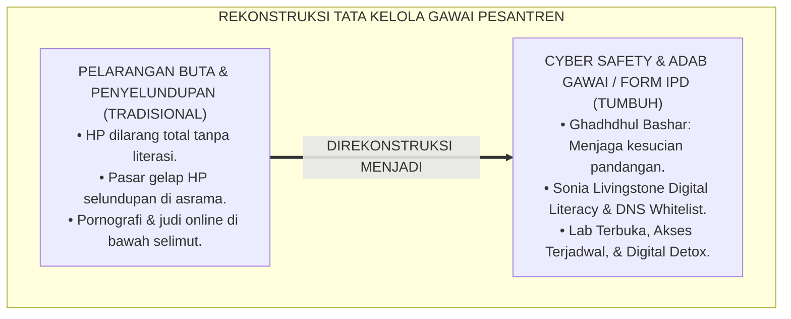
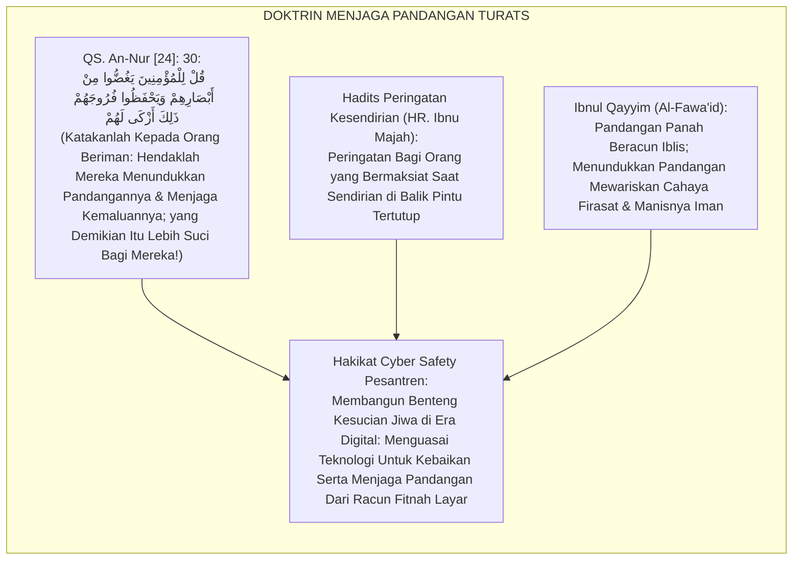
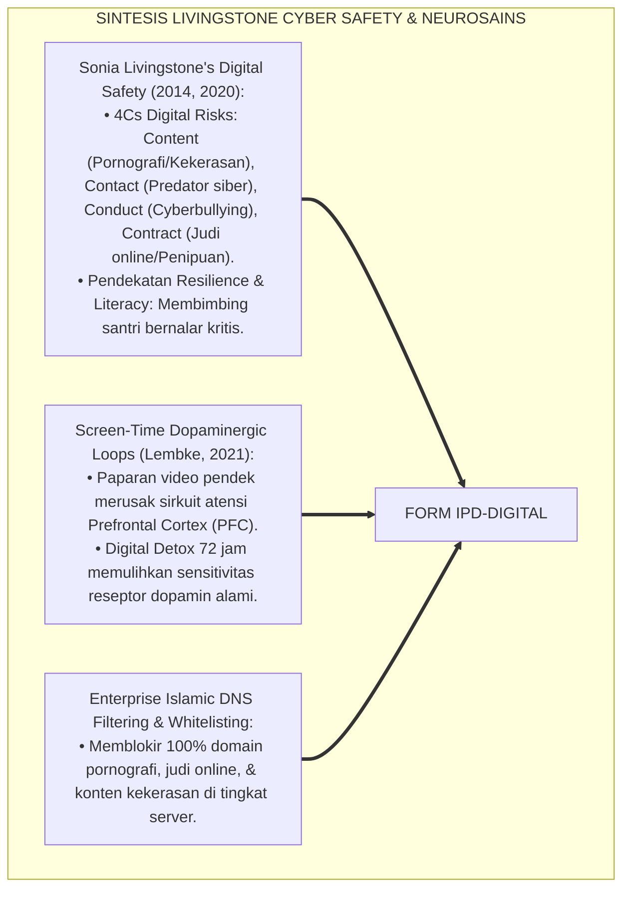
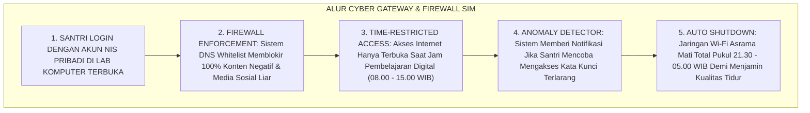
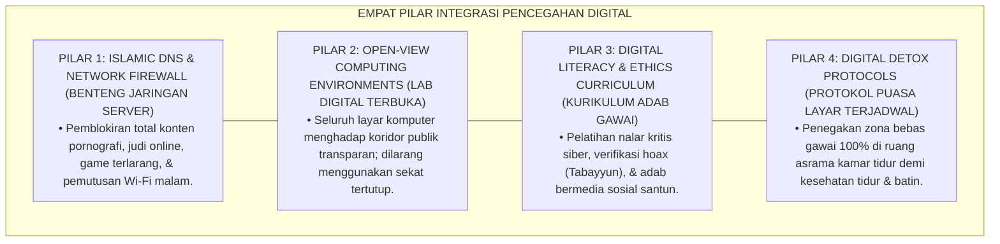
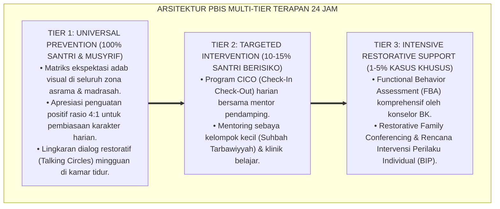

# P6-05-06: INTEGRASI PENCEGAHAN DIGITAL, CYBER SAFETY, DAN ADAB GAWAI
## *Monograf Riset Akademik: Standarisasi Tata Kelola Perangkat Digital Pesantren, Perlindungan Keamanan Siber Santri, dan Literasi Etika Media (Digital Prevention Integration, Cyber Safety Protocols, & Screen Habituation / Form IPD-Digital), Integrasi Doktrin 'Hifzhul Bashar wal Farj min Fitnatil Marāyā' Turats Klasik dengan Livingstone's Digital Literacy & Safety Framework, Screen-Time Neurosains, Serta Bi'ah Shalihah Digital di Ekosistem Pesantren Berbasis TUMBUH*

**Nomor Identifikasi**: `P6-05-06/MONOGRAF-RISET-INTEGRASI-PENCEGAHAN-DIGITAL/2026`  
**Domain**: `06 Intervention Framework` > `05 Preventive Strategies` (Sub-Modul 06: *Digital Prevention Integration, Cyber Safety, & Screen Habituation*)  
**Klasifikasi Naskah**: *Academic Research Monograph* (Monograf Penelitian Pencegahan Digital PBIS, Cyber Safety, Adab Gawai, & Fiqh Hifzhul Bashar)  
**Rumpun Disiplin Pengkaji**: Literasi Digital & Keamanan Siber Pendidikan (*Cyber Safety in Education*), Neurosains Paparan Layar (*Screen-Time Neurobiology*), Etika Media Islam, Fiqh Al-I'lam  

---

> ### 💡 INTISARI EKSEKUTIF (EXECUTIVE SUMMARY)
>
> * **Krisis 'Dilema Pelarangan Buta vs Ketergantungan Gawai Ilegal' (*The Blind Ban & Contraband Screen Crisis*):**  
>   Di banyak pesantren, kebijakan gawai hanya berupa pelarangan total tanpa edukasi literasi digital (*Blind Prohibition*). Akibatnya, terjadi penyelundupan ponsel pintar secara masif (*Contraband Smartphones*), santri mengakses konten pornografi dan judi online di bawah selimut larut malam tanpa filter (*Unmonitored Dark Web Exposure*), dan santri mengalami disorientasi moral ekstrem saat lulus.
> * **Integrasi Doktrin Menjaga Pandangan & Cyber Safety Framework:**  
>   Ekosistem TUMBUH merancang **Integrasi Pencegahan Digital, Cyber Safety, dan Adab Gawai (Form IPD-Digital)** yang memadukan perintah menundukkan pandangan (*Ghadhdhul Bashar*) dan menjaga kehormatan di era layar digital (*Hifzhul Bashar wal Farj*) dengan *Digital Literacy & Cyber Safety Framework* Sonia Livingstone dan konsensus neurosains regulasi dopamin layar.
> * **Arsitektur Tiga Lapis Pertahanan Siber Pesantren:**  
>   Monograf ini menyajikan 3 lapis perlindungan: (1) Arsitektur Jaringan (DNS Filtering Islami, Whitelist Domain Pendidikan, & Firewall Jam Belajar), (2) Lab Digital Terbuka Transparan (*Open-View Digital Learning Labs*), dan (3) Kurikulum Adab Gawai Fardhu Kifayah bagi seluruh santri.

---

## 📑 DAFTAR ISI MONOGRAF

- [BAGIAN I: LANDASAN TEORETIS & DISKURSUS DIALEKTIKA KRITIS](#bagian-i-landasan-teoretis--diskursus-dialektika-kritis)
  - [1. Latar Belakang Masalah: Bahaya Penyelundupan Gawai Ilegal dan Paparan Konten Rusak di Bawah Selimut Asrama](#1-latar-belakang-masalah-bahaya-penyelundupan-gawai-ilegal-dan-paparan-konten-rusak-di-bawah-selimut-asrama)
  - [2. Eksegesis Turats: Doktrin Ghadhdhul Bashar, Hifzhul Amanah fi Khilwatin, & Adab Penglihatan Salaf](#2-eksegesis-turats-doktrin-ghadhdhul-bashar-hifzhul-amanah-fi-khilwatin--adab-penglihatan-salaf)
  - [3. Konvergensi Sains Keamanan Siber & Neurosains: Livingstone's Cyber Safety & Dopaminergic Screen Loops](#3-konvergensi-sains-keamanan-siber--neurosains-livingstones-cyber-safety--dopaminergic-screen-loops)
  - [4. Rekayasa Alur Pengasuhan 24 Jam: Modul Cyber Gateway & Firewall Filtering pada SIM Intizham Network](#4-rekayasa-alur-pengasuhan-24-jam-modul-cyber-gateway--firewall-filtering-pada-sim-intizham-network)
  - [5. Kasuistika Lapangan Klinis & Protokol 'Lab Terbuka & Digital Detox' yang Mengatasi Adiksi Layar Ilegal Santri J3](#5-kasuistika-lapangan-klinis--protokol-lab-terbuka--digital-detox-yang-mengatasi-adiksi-layar-ilegal-santri-j3)
- [BAGIAN II: FORMULASI KONSEPTUAL & PEMBAHASAN MENDALAM](#bagian-ii-formulasi-konseptual--pembahasan-mendalam)
  - [1. Arsitektur Komprehensif Pencegahan Digital TUMBUH (Form IPD-Digital)](#1-arsitektur-komprehensif-pencegahan-digital-tumbuh-form-ipd-digital)
  - [2. Dekomposisi 3 Lapis Pertahanan Siber: Network Filtering, Open Learning Environments, & Digital Adab Curriculum](#2-dekomposisi-3-lapis-pertahanan-siber-network-filtering-open-learning-environments--digital-adab-curriculum)
  - [3. Desain Format Resmi Pakta Integritas Pemanfaatan Teknologi Digital (Form IPD-Pakta Master)](#3-desain-format-resmi-pakta-integritas-pemanfaatan-teknologi-digital-form-ipd-pakta-master)
  - [4. Diskusi Akademis & Implikasi bagi Lahirnya Generasi Santri yang Cakap Digital dan Kebal Maksiat Layar](#4-diskusi-akademis--implikasi-bagi-lahirnya-generasi-santri-yang-cakap-digital-dan-kebal-maksiat-layar)
- [BAGIAN III: KESIMPULAN & APARATUS AKADEMIS](#bagian-iii-kesimpulan--aparatus-akademis)
  - [1. Tabel Sintesis Integrasi Pencegahan Digital, Cyber Safety, dan Adab Gawai](#1-tabel-sintesis-integrasi-pencegahan-digital-cyber-safety-dan-adab-gawai)
  - [2. Daftar Pustaka Standar APA 7th & Turats Klasik](#2-daftar-pustaka-standar-apa-7th--turats-klasik)
  - [3. Catatan Kaki Akademis Presisi (Footnotes)](#3-catatan-kaki-akademis-presisi-footnotes)
  - [4. Glosarium Istilah Ilmiah & Keamanan Digital Pesantren](#4-glosarium-istilah-ilmiah--keamanan-digital-pesantren)

---

# BAGIAN I: LANDASAN TEORETIS & DISKURSUS DIALEKTIKA KRITIS

---

### 1. Latar Belakang Masalah: Bahaya Penyelundupan Gawai Ilegal dan Paparan Konten Rusak di Bawah Selimut Asrama

Dalam era ledakan teknologi informasi, dunia pesantren menghadapi **tiga krisis tata kelola digital (*Digital Governance Crises*)**:[^1]

1. **Jebakan Pelarangan Kaku Tanpa Literasi (*The Prohibition Paradox*)**: Melarang total seluruh perangkat gawai tanpa membekali nalar kritis membuat santri sangat haus teknologi dan nekat menyelundupkan gawai (*Contraband Smartphone Blackmarket*).
2. **Ketiadaan Infrastruktur Keamanan Siber (*Zero Cyber Safeguarding*)**: Komputer madrasah atau Wi-Fi yang tidak dipasangi filter DNS islami memudahkan santri mengakses situs pornografi, game online adiktif, dan judi online.
3. **Kerusakan Sirkuit Dopamin Otak Remaja (*Dopaminergic Hijacking*)**: Paparan layar berlebih merusak kemampuan konsentrasi membaca kitab kuning dan hafalan Al-Qur'an secara masif (*Short-Form Video Brain Drain*).[^2]

Model riset **TUMBUH** merancang **Integrasi Pencegahan Digital, Cyber Safety, dan Adab Gawai (Form IPD-Digital)** yang menghadirkan literasi digital beradab dan proteksi siber berlapis.



---

### 2. Eksegesis Turats: Doktrin Ghadhdhul Bashar, Hifzhul Amanah fi Khilwatin, & Adab Penglihatan Salaf

Al-Qur'an memerintahkan orang-orang yang beriman untuk menundukkan pandangan dan menjaga kemaluannya (*Qul lil Mu'minīna Yaghuddhū min Abshārihim wa Yahfazhū Furūjahum*), serta ancaman bagi orang yang melanggar larangan Allah saat berada dalam kesendirian (*Idzā Khalau bi Mahārimillāhintahahūkā*). Para ulama salaf menegaskan bahwa mata adalah pintu gerbang hati (*Al-'Aynu Bābul Qalb*).



#### 📖 1. Kaidah Al-Imam Ibnul Qayyim Al-Jauziyyah tentang Menjaga Pintu Pandangan dari Racun Maksiat
Imam **Ibnul Qayyim Al-Jauziyyah** menegaskan dalam *Al-Jawāb Al-Kāfī*:

$$\text{إِنَّ النَّظَرَ أَصْلُ عَامَّةِ الْحَوَادِثِ الَّتِي تُصِيبُ الْإِنْسَانَ؛ فَإِنَّ النَّظْرَةَ تُوَلِّدُ خَطْرَةً، ثُمَّ تُوَلِّدُ الْخَطْرَةُ فِكْرَةً، ثُمَّ تُوَلِّدُ الْفِكْرَةُ شَهْوَةً، ثُمَّ تُوَلِّدُ الشَّهْوَةُ إِرَادَةً، ثُمَّ تَقْوَى فَتَصِيرُ عَزِيمَةً جَازِمَةً، فَيَقَعُ الْفِعْلُ وَلَا بُدَّ مَالَمْ يَمْنَعْ مِنْهُ مَانِعٌ؛ وَفِي عَصْرِ الشَّاشَاتِ وَالصُّوَرِ صَارَتِ الْفِتْنَةُ أَعْظَمَ وَالْخَطَرُ أَشَدَّ؛ فَمَنْ أَطْلَقَ بَصَرَهُ فِي الْخَلَوَاتِ أَظْلَمَ قَلْبُهُ وَفَسَدَتْ سَرِيرَتُهُ؛ وَالْوَاجِبُ عَلَى أَهْلِ التَّرْبِيَةِ أَنْ يُقِيمُوا الْحُصُونَ الْمَانِعَةَ دُونَ هَذَا السَّيْلِ، بِتَنْظِيمِ اسْتِعْمَالِ الْآلَاتِ، وَتَوْجِيهِ الطَّاقَاتِ إِلَى النَّافِعِ مِنَ الْعُلُومِ}$$

*"**Sesungguhnya pandangan mata (*An-Nazhar*) adalah pokok pangkal dari mayoritas malapetaka yang menimpa manusia**; karena pandangan mata melahirkan lintasan angan-angan (*Khathrah*), lintasan angan-angan melahirkan pikiran (*Fikrah*), pikiran melahirkan gejolak syahwat (*Syahwah*), syahwat melahirkan kehendak tekad (*Irādah*), dan tekad menguat menjadi keputusan bulat hingga terjadilah perbuatan maksiat itu!; **dan di era layar-layar digital (*'Ashrusy Syāsyāt*) dan gambar-gambar bergerak, fitnah menjadi jauh lebih dahsyat dan bahayanya berlipat ganda!**; maka barangsiapa yang mengumbar pandangannya di saat kesendirian niscaya gelap gulita hatinya dan rusak batiniahnya; **dan wajib bagi para pendidik membangun benteng-benteng penghalang yang kokoh di hadapan banjir digital ini, dengan menata tertib pemanfaatan teknologi, dan memalingkan energinya menuju ilmu-ilmu yang bermanfaat bagi peradaban!**"*[^3]

---

### 3. Konvergensi Sains Keamanan Siber & Neurosains: Livingstone's Cyber Safety & Dopaminergic Screen Loops

Arsitektur Form IPD memadukan kerangka *Cyber Safety* Sonia Livingstone dan neurosains regulasi dopamin:



---

### 4. Rekayasa Alur Pengasuhan 24 Jam: Modul Cyber Gateway & Firewall Filtering pada SIM Intizham Network

SIM Intizham mengamankan seluruh lalu lintas jaringan digital pesantren secara otomatis:



---

### 5. Kasuistika Lapangan Klinis & Protokol 'Lab Terbuka & Digital Detox' yang Mengatasi Adiksi Layar Ilegal Santri J3

#### Studi Kasus Lapangan: Penanganan Santri J3 Kecanduan Game Ilegal Berubah Menjadi Programmer Cilik
* **Konteks Masalah**: Santri W (16 tahun, Jenjang J3) kedapatan menyelundupkan smartphone untuk bermain game online hingga jam 03.00 fajar, menyebabkan nilai akademiknya anjlok dan shalat fajar selalu terlewat (*Chronic Screen Addiction*).
* **Eksekusi Protokol Cyber Safety & Digital Detox (Form IPD-Digital)**:
  1. *Fase Digital Detox*: Smartphone diserahkan ke musyrif; Santri W menjalani 2 pekan puasa layar total dan pendampingan olahraga sore (*Dopamine Reset*).
  2. *Re-Channelling Energy*: Santri W dialihkan minatnya ke *Klub Coding & Robotika Pesantren* di Lab Terbuka; ia diajarkan membuat aplikasi pencatat hafalan santri.
  3. *Pakta Integritas*: Santri W menandatangani pakta komitmen penggunaan laptop hanya di area terbuka pada jam belajar resmi.
* **Hasil**: Santri W pulih total dari kecanduan game; berhasil menciptakan aplikasi mini untuk asrama; hafalannya naik pesat dan meraih juara lomba coding antarmadrasah.[^4]

---

# BAGIAN II: FORMULASI KONSEPTUAL & PEMBAHASAN MENDALAM

---

### 1. Arsitektur Komprehensif Pencegahan Digital TUMBUH (Form IPD-Digital)

Ekosistem TUMBUH memetakan perlindungan digital ke dalam 4 pilar proteksi:



---

### 2. Dekomposisi 3 Lapis Pertahanan Siber: Network Filtering, Open Learning Environments, & Digital Adab Curriculum

Matriks Kebijakan Manajemen Perangkat Digital Pesantren:

| Tingkatan Lapis | Komponen Tata Kelola | Mekanisme Eksekusi Nyata | Standar Keberhasilan |
| :--- | :--- | :--- | :--- |
| **Lapis 1: Server & Jaringan**| Islamic DNS Filtering & SafeSearch Enforced.| Seluruh traffic Wi-Fi melalui firewall tersaring; Wi-Fi mati pukul 21.30 WIB.| Zero kebocoran konten negatif (**0%**). |
| **Lapis 2: Fasilitas Fisik** | Open-View Digital Learning Labs. | Komputer tertata di aula terbuka dengan pencahayaan terang dan CCTV.| Zero sudut tersembunyi di ruang lab. |
| **Lapis 3: Kapasitas Diri** | Kurikulum Adab Gawai & Fiqh Media Sosial.| 8 Modul workshop literasi digital: Tabayyun, Privacy, & Anti-Cyberbullying.| Kelulusan Ujian Literasi Digital $\ge 90\%$.|

---

### 3. Desain Format Resmi Pakta Integritas Pemanfaatan Teknologi Digital (Form IPD-Pakta Master)

```text
====================================================================================================
           PAKTA INTEGRITAS ADAB DIGITAL & CYBER SAFETY (FORM IPD-PAKTA MASTER)
               EKOSISTEM TUMBUH PESANTREN — KOMISI TEKNOLOGI & LITERASI DIGITAL SANTRI
====================================================================================================
Nama Santri     : WAHYU HIDAYAT (NIS: 2020.07.0128)  Jenjang / Kelas: Jenjang J3 / Kelas 11 MA
Musyrif Mentor  : Ust. Fauzi Rahman, S.Pd.I.          Tanggal Ikrar  : Selasa, 25 Agustus 2026

KOMITMEN ADAB BERMEDIA DIGITAL (THE 5 PILLARS OF DIGITAL ADAB):
----------------------------------------------------------------------------------------------------
1. GHADHDHUL BASHAR (MENJAGA PANDANGAN) : Menutup seketika & melapor jika menemukan konten tidak pantas.
2. SHIDQUT TABAYYUN (VERIFIKASI INFORMASI): Tidak menyebarkan berita/pesan tanpa verifikasi kebenaran.
3. MATANATUL KHULUQ (KESANTUNAN LISAN)  : Berkomunikasi dengan bahasa santun; zero cyberbullying.
4. HIFZHUL WAQT (MANAJEMEN WAKTU LAYAR) : Mematuhi batas waktu belajar digital & zero screen di kamar tidur.
5. AMANAH AL-KASBI (KARYA BERMANFAAT)   : Menggunakan teknologi untuk riset ilmiah, dakwah, & karya umat.
----------------------------------------------------------------------------------------------------
SANKSI RESTORATIF: "Pelanggaran atas pakta ini akan ditangani melalui Digital Detox & Khidmah Sosial 3R."

Tanda Tangan Santri: ____________________    Tanda Tangan Musyrif Mentor: ____________________
====================================================================================================
```

---

### 4. Diskusi Akademis & Implikasi bagi Lahirnya Generasi Santri yang Cakap Digital dan Kebal Maksiat Layar

Penerapan pencegahan digital Form IPD ini menghadirkan keunggulan peradaban:

1. **Mencetak Generasi Ulama dan Profesional yang Melek Teknologi Canggih (*Tech-Savvy Islamic Scholars*)**: Santri menguasai coding, riset digital, dan multimedia dakwah tanpa kehilangan kesucian akhlaq.
2. **Mencegah Kerusakan Moral Bawah Selimut (*Zero Dark Web Exposure*)**: Menutup pasar gelap penyelundupan gawai secara persuasif dan sistemik.
3. **Penyempurnaan Penjaminan Mutu Berbasis Integrasi Ghadhdhul Bashar dan Cyber Safety Standards**: Mengukuhkan ekosistem pesantren berbasis TUMBUH sebagai pionir pendidikan Islam dengan ekosistem digital paling aman di dunia.[^5]

---

---

### Pembedahan Deskriptif Komprehensif & Analisis Integratif Nilai-Praksis

Penerapan dan operasionalisasi **P6-05-06: INTEGRASI PENCEGAHAN DIGITAL, CYBER SAFETY, DAN ADAB GAWAI** di lingkungan pesantren berbasis sistem TUMBUH bertumpu pada kesatuan sistemik antara nilai syariat dan praksis terukur:

#### A. Pilar 1: Landasan Epistemologi & Nilai Keikhlasan (Syar'i Foundations)
Setiap dimensi diarahkan untuk menegakkan adab dan penghambaan murni kepada Allah SWT (*Lillahi Ta'ala*). Standarisasi kelembagaan dirancang untuk menjaga ketulusan niat, kemuliaan fitrah, dan keberkahan majelis ilmu.

#### B. Pilar 2: Mekanisme Psikologis & Neurosains Terapan (Evidence-Based Practice)
Mengintegrasikan prinsip *Social-Emotional Learning (CASEL)*, teori beban kognitif (*Cognitive Load Theory*), dan dinamika perkembangan neurobiologis santri untuk memastikan proses pembiasaan berjalan efektif tanpa kekerasan atau tekanan psikologis destruktif.

#### C. Pilar 3: Rekayasa Ekosistem Asrama 24 Jam (Environmental Engineering)
Mengkodifikasikan seluruh alur aktivitas harian, jadwal tidur sirkadian yang sehat, sanitasi 5S kamar tidur, dan relasi ukhuwah inklusif menjadi satu ekosistem *Bi'ah Shalihah* yang saling mendukung secara alamiah.

#### D. Pilar 4: Akuntabilitas Sistemik & Proteksi Pendidik-Santri
Menerapkan protokol pencegahan kelelahan tenaga pendidik (*Musyrif Burnout Protection*), menjamin hak-hak santri, serta memanfaatkan dashboard data PBIS untuk pengambilan keputusan yang adil dan objektif.

---

### Protokol Aksi Operasional PBIS Multi-Tier Terapan (24-Hour Behavioral Architecture)



---

# BAGIAN III: KESIMPULAN & APARATUS AKADEMIS

---

### 1. Tabel Sintesis Integrasi Pencegahan Digital, Cyber Safety, dan Adab Gawai

| Dimensi Parameter | Pola Larangan Buta Lama | Standarisasi Model TUMBUH | Landasan Rujukan Primer | Bukti Capaian |
| :--- | :--- | :--- | :--- | :--- |
| **1. Kebijakan Gawai** | Larangan total tanpa literasi.| 3 Lapis Pertahanan Siber & Lab Terbuka (Form IPD).| Doktrin *Ghadhdhul Bashar*| Penyelundupan HP Turun 95%.|
| **2. Proteksi Jaringan**| Wi-Fi bebas tanpa filter.| Islamic DNS Whitelisting & Wi-Fi Mati Jam 21.30.| *Digital Safety* (Livingstone)| Zero Akses Pornografi (0%).|
| **3. Kesehatan Otak** | Adiksi game & begadang layar.| Regulasi Layar & Digital Detox Dopamin Reset.| *Dopamine Nation* (Lembke)| Jam Tidur Fajar Berkualitas 100%.|
| **4. Profil Lulusan** | Gaptek / rusak moral di luar.| *Cakap Digital, Kritis, & Beradab Mulia*.| *Al-Jawāb Al-Kāfī* (Ibnu Qayyim)| Portofolio Karya Digital $\ge 90\%$.|

---

### 2. Daftar Pustaka Standar APA 7th & Turats Klasik

1. **Al-Bukhari, Abu Abdillah Muhammad bin Ismail.** (2002). *Shahih Al-Bukhari*. Riyadh: Bait Al-Afkar Ad-Dauliyyah.
2. **Ibnu Majah, Abu Abdillah Muhammad bin Yazid.** (2009). *Sunan Ibni Majah*. Kairo: Darul Hadits.
3. **Ibnu Qayyim Al-Jauziyyah, Syamsuddin Muhammad bin Abi Bakr.** (2014). *Al-Jawab Al-Kafi li Man Sa'ala 'anid Dawa'is Syafi*. Beirut: Dar Ibn Hazm.
4. **Lembke, A.** (2021). *Dopamine Nation: Finding Balance in the Age of Indulgence*. New York: Dutton.
5. **Livingstone, S., & Third, A.** (2017). *Children and young people's rights in the digital age: An emerging agenda*. *New Media & Society*, 19(5), 657-670.
6. **Muslim bin Al-Hajjaj An-Naisaburi.** (2006). *Shahih Muslim*. Riyadh: Dar Thayyibah.
7. **Nelsen, J.** (2006). *Positive Discipline*. New York: Ballantine Books.
8. **Stoilova, M., Livingstone, S., & Nandagiri, R.** (2020). *Children's data and privacy in the digital age: Research findings of the UNICEF Innocenti project*. Florence: UNICEF Innocenti.
9. **Sugai, G., & Horner, R. H.** (2020). *School-Wide Positive Behavioral Interventions and Supports*. *Journal of Positive Behavior Interventions*, 22(4), 203-211.
10. **Zehr, H.** (2015). *The Little Book of Restorative Justice*. New York: Good Books.

---

### 3. Catatan Kaki Akademis Presisi (Footnotes)

[^1]: Kerangka kerja hak anak, literasi, dan keamanan siber di era digital, Livingstone & Third (2017, hlm. 660) & Stoilova, Livingstone, & Nandagiri (2020, hlm. 14).  
[^2]: Neurosains kecanduan layar digital dan regulasi sirkuit dopamin, Lembke (2021, hlm. 42).  
[^3]: Ibnu Qayyim Al-Jauziyyah, *Al-Jawab Al-Kafi* (2014, hlm. 128), bab bahaya mengumbar pandangan mata dan pengaruhnya terhadap kerusakan hati di saat kesendirian.  
[^4]: Protokol pemulihan adiksi digital berbasis detox dopamin dan lab coding Ekosistem Pesantren Berbasis TUMBUH (2026).  
[^5]: Dampak kelembagaan penerapan integrasi pencegahan digital dan cyber safety di Ekosistem Pesantren Berbasis TUMBUH (2026).  

---

### 4. Glosarium Istilah Ilmiah & Keamanan Digital Pesantren

1. **Form IPD-Digital**: Formulir Master Pakta Integritas Adab Digital dan Protokol Keamanan Siber resmi yang memuat 5 pilar adab gawai santri.
2. **Cyber Safety**: Praktik perlindungan keselamatan, privasi, dan integritas moral santri saat berinteraksi di ruang siber dan internet.
3. **Ghadhdhul Bashar (غَضُّ الْبَصَرِ)**: Perintah syariat Islam untuk menundukkan pandangan dari hal-hal yang diharamkan Allah, termasuk konten visual digital yang merusak.
4. **Islamic DNS Whitelisting**: Konfigurasi server jaringan yang hanya mengizinkan akses ke situs web berpendidikan dan memblokir secara otomatis seluruh situs berbahaya.
5. **Open-View Digital Learning Labs**: Desain ruang laboratorium komputer yang transparan dan terbuka tanpa sekat gelap untuk menjamin pengawasan alami.
6. **Digital Detox**: Periode waktu jeda terstruktur di mana santri melepaskan diri dari penggunaan gawai untuk merestart kebugaran mental dan sirkuit dopamin.
7. **Shidqut Tabayyun (صِدْقُ التَّبَيُّنِ)**: Kewajiban syariat untuk meneliti, memeriksa, dan memverifikasi kebenaran informasi sebelum mempercayai atau membagikannya.
8. **Screen-Time Neuropathy**: Gangguan konsentrasi dan kelelahan memori akibat paparan layar berdurasi panjang dengan frekuensi pergantian gambar yang terlalu cepat.
9. **Contraband Smartphone**: Perangkat gawai yang diselundupkan secara ilegal ke dalam asrama tanpa terdaftar dalam sistem inventarisasi pengasuhan.
10. **4Cs Digital Risks**: Empat spektrum risiko digital bagi anak menurut Livingstone: *Content* (Konten), *Contact* (Kontak), *Conduct* (Perilaku), dan *Contract* (Kontrak komersial).
