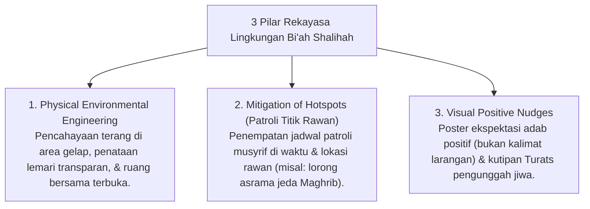

# P6-05: Strategi Pencegahan Primer dan Rekayasa Bi'ah Shalihah

## Status Dokumen
* **Status**: 🌟 **A+ (Tervalidasi & Siap Diimplementasikan)**
* **Sub-Domain**: `06 Intervention Framework / 05 Preventive Strategies`
* **Penanggung Jawab Keilmuan**: Dewan Keilmuan TUMBUH (*Pakar Arsitektur PBIS Restoratif & Pakar Pengasuhan Asrama*)

---

## 1. Konseptualisasi Environmental Engineering & Bi'ah Shalihah

Pencegahan terbaik terhadap masalah perilaku adalah **desain lingkungan positif (*Bi'ah Shalihah*)** yang secara alami mendorong perilaku adab dan menutup peluang pemicu pelanggaran (*Antecedent Modification*).

---

## 2. Matriks Mitigasi Hotspots (Waktu & Lokasi Rawan)

| Titik Rawan (Hotspot) | Risiko Perilaku | Tindakan Pencegahan Primer (Tier 1) |
| :--- | :--- | :--- |
| **Lorong Asrama Jeda Maghrib-Isya** | Perkelahian / Gaduh. | Penempatan Musyrif Piket di lorong & pemutaran muraja'ah audio. |
| **Area Loundry / Kamar Mandi Subuh** | Antrean penyerobotan & caci maki. | Sistem antrean bernomor & visual nudges adab antre. |
| **Jam Belajar Malam Kamar** | Mengantuk / Berbual kosong. | *Warm Presence* Musyrif mendampingi di tengah kamar. |
