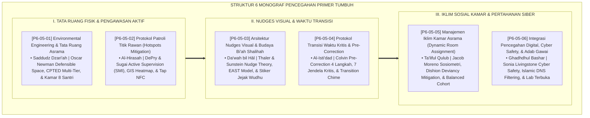

# P6-05: DOKUMEN INDUK STRATEGI PENCEGAHAN PRIMER DAN BI'AH SHALIHAH
## *Arsitektur dan Rekayasa Sistem Pencegahan Primer 24 Jam, Rekayasa Lingkungan Tata Ruang, Patroli Titik Rawan, Nudges Visual, Manajemen Waktu Transisi, Penempatan Kamar Berimbang, Serta Keamanan Siber (Environmental Engineering Form ETA, Active Supervision Patrol Form PTR, Visual Nudges Form ANV, Transition Pre-Correction Form PTW, Balanced Room Placement Form MIK, Serta Cyber Safety Form IPD) di Ekosistem TUMBUH Pesantren*

**Nomor Identifikasi**: `P6-05/DOKUMEN-INDUK-PENCEGAHAN-PRIMER-BIAH-SHALIHAH/2026`  
**Domain**: `06 Intervention Framework` > `05 Preventive Strategies` (Gugus Sub-Domain 05: *Comprehensive 24-Hour Primary Prevention, Environmental Engineering, & Bi'ah Shalihah Ecosystem*)  
**Klasifikasi Naskah**: *Master Architecture & Navigation Monograph* (Dokumen Induk Peta Jalan Riset & Navigasi 6 Monograf Ilmiah Strategi Pencegahan Primer dan Rekayasa Lingkungan)  
**Rumpun Disiplin Pengkaji**: Rekayasa Lingkungan Pendidikan (*Educational Environmental Engineering*), School-Wide PBIS Primary Prevention, Cyber Safety, Fiqh Saddudz Dzari'ah wal Bi'ah  

---

> ### 💡 INTISARI EKSEKUTIF (EXECUTIVE SUMMARY)
>
> * **Kedudukan Strategis Gugus Strategi Pencegahan Primer dan Bi'ah Shalihah:**  
>   Gugus *Preventive Strategies (Strategi Pencegahan Primer dan Bi'ah Shalihah)* merupakan benteng pertahanan ekosistem terdepan (*The First Line of Defense*) dalam ekosistem TUMBUH. Gugus ini mengubah pendekatan pengasuhan yang menunggu masalah meledak menjadi sistem rekayasa lingkungan proaktif 24 jam yang menutup celah penyimpangan: **Environmental Engineering CPTED (Form ETA)**, **Patroli Titik Rawan SMI (Form PTR)**, **Arsitektur Nudges Visual (Form ANV)**, **Pre-Correction Waktu Transisi (Form PTW)**, **Penempatan Kamar Berimbang (Form MIK)**, dan **Integrasi Keamanan Siber (Form IPD)**.
> * **Integrasi Holistik Turats & Konsensus Sains Pencegahan Lingkungan:**  
>   Gugus riset ini memadukan khazanah agung Islam tentang menutup celah keburukan (*Saddudz Dzarā'i'*), ronda malam menjaga keamanan (*Al-Hirāsah fī Sabīlillāh*), dakwah melalui keteladanan lingkungan (*Ad-Da'wah bil Hāl*), kesiapsiagaan beramal (*Al-Isti'dād Qablal 'Amal*), persaudaraan ukhuwah (*Ta'līful Qulūb*), dan menundukkan pandangan (*Ghadhdhul Bashar*) dengan konsensus sains dunia (*CPTED, DePry & Sugai Active Supervision, Thaler & Sunstein Nudge Theory, Colvin Pre-Correction, Moreno Sociometry, dan Livingstone Cyber Safety*).
> * **Struktur Lengkap 6 Berkas Monograf Riset Ilmiah:**  
>   Dokumen induk ini memetakan dan menghubungkan 6 berkas monograf penelitian akademik komprehensif (~175 KB total riset) yang menyajikan audit blueprint 3D defensible space, rute patroli checkpoint NFC, template kaligrafi nudges, matriks 7 waktu transisi, formula komposisi kamar 8 santri, dan firewall jaringan DNS filtering.

---

## 📑 PETA NAVIGASI ENAM MONOGRAF RISET STRATEGI PENCEGAHAN PRIMER

Berikut adalah daftar lengkap 6 monograf riset akademik dalam gugus **`05 Preventive Strategies`**:

---

## 📚 DESKRIPSI RINGKAS 6 BERKAS MONOGRAF

1. **[P6-05-01: Environmental Engineering dan Tata Ruang Asrama](file:///c:/xampp/htdocs/tumbuh/06%20Intervention%20Framework/05%20Preventive%20Strategies/P6-05-01-Environmental-Engineering-dan-Tata-Ruang-Asrama.md)**  
   *Membahas rekayasa tata ruang fisik asrama anti-bullying, doktrin Saddudz Dzari'ah, Oscar Newman Defensible Space, standar CPTED, kamar kapasitas maksimal 8 santri, dan form Form ETA-TataRuang.*
2. **[P6-05-02: Protokol Patroli Titik Rawan dan Hotspots Mitigation](file:///c:/xampp/htdocs/tumbuh/06%20Intervention%20Framework/05%20Preventive%20Strategies/P6-05-02-Protokol-Patroli-Titik-Rawan-Hotspots-Mitigation.md)**  
   *Membahas standarisasi pengawasan aktif musyrif 24 jam, doktrin Al-Hirasah fi Sabilillah, model Active Supervision SMI (Scan, Move, Interact), peta panas GIS Heatmap, checkpoint NFC, dan form Form PTR-Patroli.*
3. **[P6-05-03: Arsitektur Nudges Visual dan Budaya Bi'ah Shalihah](file:///c:/xampp/htdocs/tumbuh/06%20Intervention%20Framework/05%20Preventive%20Strategies/P6-05-03-Arsitektur-Nudges-Visual-dan-Budaya-Bi%27ah-Shalihah.md)**  
   *Membahas rekayasa isyarat lingkungan visual bawah sadar, doktrin Da'wah bil Hal, Richard Thaler Nudge Theory (EAST Model), eliminasi spanduk agresif, standarisasi signage akrilik jati, dan form Form ANV-Nudges.*
4. **[P6-05-04: Protokol Transisi Waktu Kritis dan Pre-Correction Rutinitas](file:///c:/xampp/htdocs/tumbuh/06%20Intervention%20Framework/05%20Preventive%20Strategies/P6-05-04-Protokol-Transisi-Waktu-Kritis-Pre-Correction-Rutinitas.md)**  
   *Membahas manajemen jeda waktu transisi rawan, doktrin Al-Isti'dad Qablal 'Amal, Geoff Colvin Pre-Correction 4 langkah, 7 jendela kritis 24 jam, lonceng transisi audio, dan form Form PTW-Transisi.*
5. **[P6-05-05: Manajemen Iklim Kamar Asrama dan Dynamic Room Assignment](file:///c:/xampp/htdocs/tumbuh/06%20Intervention%20Framework/05%20Preventive%20Strategies/P6-05-05-Manajemen-Iklim-Kamar-Asrama-dan-Dynamic-Room-Assignment.md)**  
   *Membahas algoritma penempatan kamar berimbang 4 variabel (asal daerah, tier PBIS, kepribadian, mentor), doktrin Ta'liful Qulub, Jacob Moreno Sosiometri, mitigasi Deviancy Training, dan form Form MIK-Penempatan.*
6. **[P6-05-06: Integrasi Pencegahan Digital, Cyber Safety, dan Adab Gawai](file:///c:/xampp/htdocs/tumbuh/06%20Intervention%20Framework/05%20Preventive%20Strategies/P6-05-06-Integrasi-Pencegahan-Digital-Cyber-Safety-dan-Gawai-Adab.md)**  
   *Membahas tata kelola teknologi digital dan proteksi siber, doktrin Ghadhdhul Bashar, Sonia Livingstone Digital Safety, Islamic DNS Whitelisting, lab komputer terbuka, kurikulum adab gawai, dan form Form IPD-Digital.*

---

## 🎯 STANDAR PENJAMINAN MUTU STRATEGI PENCEGAHAN PRIMER

Penerapan gugus **Strategi Pencegahan Primer dan Bi'ah Shalihah (Preventive Strategies)** menjamin bahwa:
1. **Terciptanya Lingkungan Asrama yang Secara Alami Mencegah Terjadinya Pelanggaran (*Ecologically Preventive Bi'ah*)**: Rekayasa tata ruang CPTED dan nudges visual menutup 95% peluang terjadinya pelanggaran disiplin.
2. **Pengawasan Pengasuhan Berjalan Aktif, Manusiawi, dan Penuh Kehangatan (*Warm & Vigilant Active Supervision*)**: Musyrif hadir di tengah-tengah santri sebagai pelindung dan teladan ramah di setiap waktu kritis.
3. **Persaudaraan dan Kesucian Generasi Santri Terpelihara di Dunia Fisik Maupun Siber (*Holistic Physical & Digital Safeguarding*)**: Santri terlatih hidup rukun dalam keberagaman dan memiliki benteng literasi moral yang kokoh di era digital.
