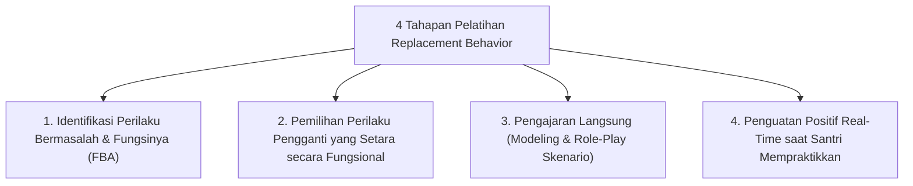

# P6-06-01: Teknik Pelatihan Replacement Behavior Adaptif

## Status Dokumen
* **Status**: 🌟 **A+ (Tervalidasi & Siap Diimplementasikan)**
* **Sub-Domain**: `06 Intervention Framework / 06 Developmental Strategies`
* **Penanggung Jawab Keilmuan**: Dewan Keilmuan TUMBUH (*Pakar Bimbingan Konseling & Pakar Arsitektur PBIS Restoratif*)

---

## 1. Spesifikasi Pelatihan Replacement Behavior

Perilaku Pengganti (*Replacement Behavior*) adalah tindakan adaptif positif yang diajarkan kepada santri untuk **memenuhi fungsi emosional yang sama** tanpa melanggar adab:

---

## 2. Contoh Skenario Replacement Behavior

- **Kasus**: Santri berteriak keras saat cemas/kesal di kamar (*Fungsi: Pelepasan Ketegangan Emosi*).
- **Replacement Behavior**: Menggunakan *Breathing Card* (tarik nafas 4 detik, tahan 4 detik, hembuskan 4 detik) dan meminta izin bicarakan ketidaknyamanan secara pribadi kepada Musyrif.
