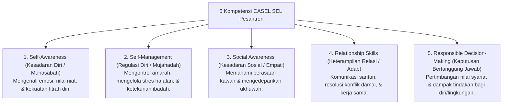

# P6-06-02: Kurikulum Pelatihan CASEL SEL Kelompok Kecil

## Status Dokumen
* **Status**: 🌟 **A+ (Tervalidasi & Siap Diimplementasikan)**
* **Sub-Domain**: `06 Intervention Framework / 06 Developmental Strategies`
* **Penanggung Jawab Keilmuan**: Dewan Keilmuan TUMBUH (*Pakar Neurosains Perkembangan & Pakar Bimbingan Konseling*)

---

## 1. 5 Domain Kompetensi CASEL SEL Terintegrasi

Sesi kelompok kecil Tier 2 (4-6 santri) menjalankan kurikulum pelatihan **Social-Emotional Learning (SEL)** 6-pekan yang mengawinkan CASEL SEL dengan adab Islami:

---

## 2. Struktur Modul Mingguan (6-Sesi)

- Sesi 1: Mengenali Peta Emosi Jiwa (*Tazkiyatun Nafs*).
- Sesi 2: Manajemen Amarah & Teknik Wudhu Sunnah.
- Sesi 3: Seni Mendengar Aktif & Empati Ukhuwah.
- Sesi 4: Menolak Tekanan Kawan Sebaya (*Peer Pressure Resistance*).
- Sesi 5: Resolusi Konflik Tanpa Kekerasan.
- Sesi 6: Evaluasi Diri & Rencana Kepemimpinan Qudwah.
