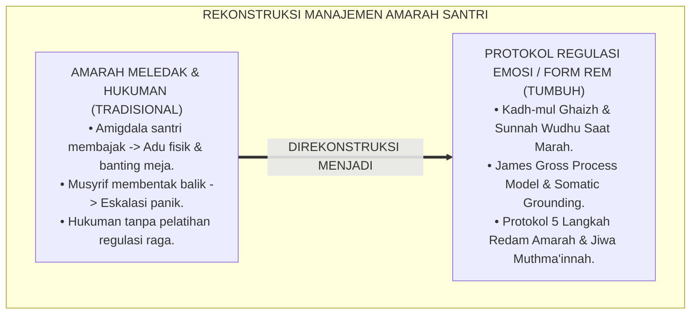
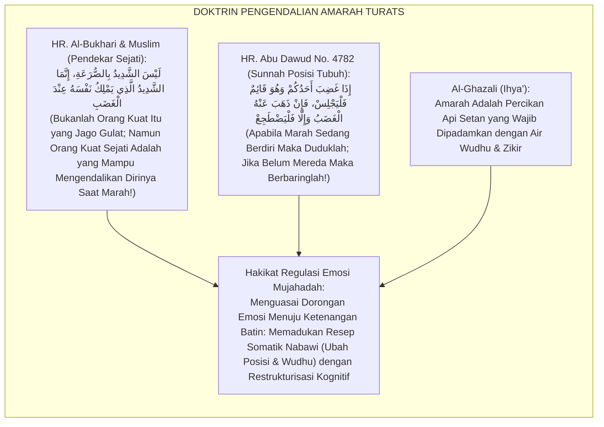
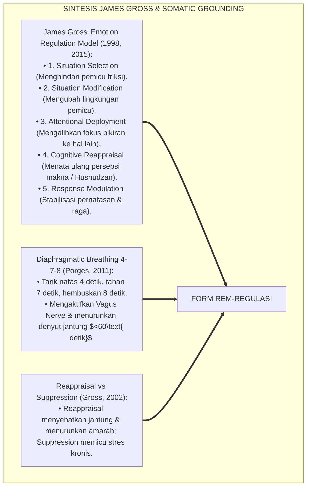
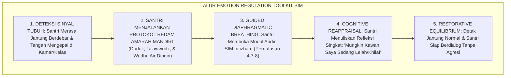
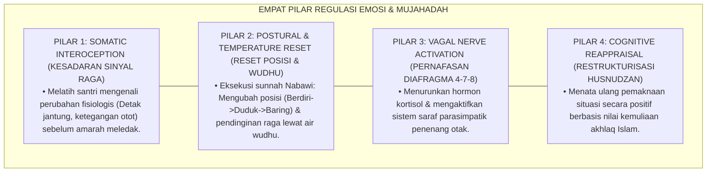
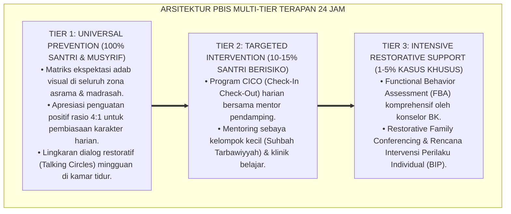

# P6-06-03: MODUL PENGEMBANGAN REGULASI EMOSI DAN MUJAHADAH
## *Monograf Riset Akademik: Standarisasi Protokol Pengendalian Amarah, Keterampilan Regulasi Sistem Saraf Vagal, dan Terapi Desensitisasi Dorongan Hawa Nafsu (Emotion Regulation Protocol, Vagal Stabilization, & Mujāhadatun Nafs Cultivation / Form REM-Regulasi), Integrasi Doktrin 'Kadh-mul Ghaizh wal Isti'ādzah minasy Syaithān' Turats Klasik dengan Gross' Emotion Regulation Process Model, Somatic Grounding, Serta Ketenangan Batin di Pesantren TUMBUH*

**Nomor Identifikasi**: `P6-06-03/MONOGRAF-RISET-REGULASI-EMOSI-MUJAHADAH/2026`  
**Domain**: `06 Intervention Framework` > `06 Developmental Strategies` (Sub-Modul 03: *Emotion Regulation Protocols & Mujāhadatun Nafs Cultivation*)  
**Klasifikasi Naskah**: *Academic Research Monograph* (Monograf Penelitian Regulasi Emosi James Gross, Neurosains Vagal Somatic, & Fiqh Kadhmi Al-Ghaizh)  
**Rumpun Disiplin Pengkaji**: Neurosains Regulasi Afektif (*Affective Neuroscience*), Teori Proses Regulasi Emosi (Gross), Somatic Psychology, Tasawuf Mujahadatun Nafs  

---

> ### 💡 INTISARI EKSEKUTIF (EXECUTIVE SUMMARY)
>
> * **Krisis 'Ledakan Amarah & Pembajakan Amigdala Santri' (*The Explosive Anger & Rage Outbursts*):**  
>   Banyak santri remaja mengalami kesulitan ekstrem dalam mengendalikan dorongan amarah (*Anger Outbursts*). Ketika terjadi friksi sepele di asrama, amigdala otak mereka membajak fungsi logika (*Amygdala Hijack*), memicu perkelahian fisik, perusakan fasilitas, atau kata-kata kotor yang melukai hati kawan. Hukuman bentakan balik dari pengasuh hanya memperparah eskalasi kepanikan sistem saraf simpatik santri (*Sympathetic Hyper-Arousal*).
> * **Integrasi Doktrin Menahan Amarah Nabawi & James Gross' Emotion Regulation:**  
>   Ekosistem TUMBUH merancang **Modul Pengembangan Regulasi Emosi dan Mujahadah (Form REM-Regulasi)** yang memadukan ajaran agung Rasulullah SAW dalam meredam amarah (*Laisa Asy-Syadīdu bish Shura'ah, Innamā Asy-Syadīdulladzī Yamliku Nafsahū 'indal Ghadhab*) dan menahan amarah (*Kāzhimīnal Ghaizh*) dengan *Process Model of Emotion Regulation* James Gross dan teknik stabilisasi somatik polivagal.
> * **Arsitektur Protokol 5 Langkah Redam Amarah (The 5-Step Anger De-escalation Protocol):**  
>   Monograf ini menyajikan 5 langkah praktis: (1) Sadari Sinyal Tubuh / Body Cues, (2) Ta'awwudz & Ubah Posisi Raga (Berdiri-Duduk-Berbaring), (3) Basuh Wudhu Air Dingin, (4) Pernafasan Diafragma 4-7-8, dan (5) Reframing Kognitif Hikmah Husnudzan.

---

## 📑 DAFTAR ISI MONOGRAF

- [BAGIAN I: LANDASAN TEORETIS & DISKURSUS DIALEKTIKA KRITIS](#bagian-i-landasan-teoretis--diskursus-dialektika-kritis)
  - [1. Latar Belakang Masalah: Bahaya Ledakan Amarah Remaja yang Merusak Fasilitas dan Menghancurkan Ukhuwah](#1-latar-belakang-masalah-bahaya-ledakan-amarah-remaja-yang-merusak-fasilitas-dan-menghancurkan-ukhuwah)
  - [2. Eksegesis Turats: Doktrin Kadh-mul Ghaizh, Taghyirul Ha'ah, & Sunnah Pengendalian Amarah Salaf](#2-eksegesis-turats-doktrin-kadh-mul-ghaizh-taghyirul-haah--sunnah-pengendalian-amarah-salaf)
  - [3. Konvergensi Sains Neurosains Afektif: James Gross' Process Model of Emotion Regulation & Somatic Grounding](#3-konvergensi-sains-neurosains-afektif-james-gross-process-model-of-emotion-regulation--somatic-grounding)
  - [4. Rekayasa Alur Pengasuhan 24 Jam: Modul Emotion Regulation Toolkit pada SIM Intizham Wellness Core](#4-rekayasa-alur-pengasuhan-24-jam-modul-emotion-regulation-toolkit-pada-sim-intizham-wellness-core)
  - [5. Kasuistika Lapangan Klinis & Protokol 'Wudhu & Re-Centering 5 Langkah' yang Meredakan Agresi Santri J2](#5-kasuistika-lapangan-klinis--protokol-wudhu--re-centering-5-langkah-yang-meredakan-agresi-santri-j2)
- [BAGIAN II: FORMULASI KONSEPTUAL & PEMBAHASAN MENDALAM](#bagian-ii-formulasi-konseptual--pembahasan-mendalam)
  - [1. Arsitektur Komprehensif Modul Regulasi Emosi TUMBUH (Form REM-Regulasi)](#1-arsitektur-komprehensif-modul-regulasi-emosi-tumbuh-form-rem-regulasi)
  - [2. Dekomposisi 5 Tahap Protokol Redam Amarah: Body Cue, Ta'awwudz, Posisi Raga, Wudhu, & Reframing](#2-dekomposisi-5-tahap-protokol-redam-amarah-body-cue-taawwudz-posisi-raga-wudhu--reframing)
  - [3. Desain Format Resmi Lembar Latihan Regulasi Emosi Mandiri (Form REM-Latihan Master)](#3-desain-format-resmi-lembar-latihan-regulasi-emosi-mandiri-form-rem-latihan-master)
  - [4. Diskusi Akademis & Implikasi bagi Terwujudnya Santri yang Kuat Pengendalian Dirinya dan Berjiwa Muthma'innah](#4-diskusi-akademis--implikasi-bagi-terwujudnya-santri-yang-kuat-pengendalian-dirinya-dan-berjiwa-muthmainnah)
- [BAGIAN III: KESIMPULAN & APARATUS AKADEMIS](#bagian-iii-kesimpulan--aparatus-akademis)
  - [1. Tabel Sintesis Modul Pengembangan Regulasi Emosi dan Mujahadah](#1-tabel-sintesis-modul-pengembangan-regulasi-emosi-dan-mujahadah)
  - [2. Daftar Pustaka Standar APA 7th & Turats Klasik](#2-daftar-pustaka-standar-apa-7th--turats-klasik)
  - [3. Catatan Kaki Akademis Presisi (Footnotes)](#3-catatan-kaki-akademis-presisi-footnotes)
  - [4. Glosarium Istilah Ilmiah & Regulasi Emosi Pesantren](#4-glosarium-istilah-ilmiah--regulasi-emosi-pesantren)

---

# BAGIAN I: LANDASAN TEORETIS & DISKURSUS DIALEKTIKA KRITIS

---

### 1. Latar Belakang Masalah: Bahaya Ledakan Amarah Remaja yang Merusak Fasilitas dan Menghancurkan Ukhuwah

Dalam perkembangan biologis remaja pesantren, kerap timbul **tiga hambatan regulasi emosi (*Emotional Regulation Obstacles*)**:[^1]

1. **Ketidakmatangan Prefrontal Cortex Remaja (*Adolescent PFC Immaturity*)**: Perkembangan amigdala yang cepat tanpa diimbangi kematangan korteks prefrontal membuat santri usia 13–16 tahun sangat reaktif terhadap pemicu emosional (*High Impulsivity & Mood Swings*).
2. **Ketiadaan Protokol De-eskalasi Raga Fisik (*Zero Somatic Grounding Training*)**: Santri tidak diajarkan cara mengenali sinyal tubuh saat marah (rahang mengeras, dada berdebar, tangan mengepal), sehingga emosi langsung meledak menjadi pukulan fisik.
3. **Pemberian Sanksi Tanpa Pemulihan Emosional (*Punishment Without Emotional Processing*)**: Menghukum santri yang marah dengan skorsing tanpa membimbingnya mengurai akar kemarahan hanya akan melipatgandakan dendam batin (*Suppression Backfire Effect*).[^2]

Model riset **TUMBUH** merancang **Modul Pengembangan Regulasi Emosi dan Mujahadah (Form REM-Regulasi)** yang membekali santri dengan teknik pengendalian amarah neurosains berbasis sunnah Nabawiyah.



---

### 2. Eksegesis Turats: Doktrin Kadh-mul Ghaizh, Taghyirul Ha'ah, & Sunnah Pengendalian Amarah Salaf

Rasulullah SAW meletakkan standar pendekar sejati dalam Islam: *"Bukanlah orang yang kuat itu orang yang pandai bergulat, melainkan orang yang kuat adalah orang yang mampu menguasai dirinya di saat amarah memuncak"* (*Laisa Asy-Syadīdu bish Shura'ah, Innamā Asy-Syadīdulladzī Yamliku Nafsahū 'indal Ghadhab*). Beliau juga memberikan resep somatik konkret: membaca ta'awwudz, duduk jika sedang berdiri, berbaring jika duduk belum mereda, dan berwudhu dengan air dingin karena amarah berasal dari api setan (*Innal Ghadhaba minasy Syaithāni wa Innas Syaithāna Khuliqa minan Nār...*).



#### 📖 1. Kaidah Al-Imam Abu Hamid Al-Ghazali tentang Cara Meredakan Amarah Berdasarkan Sunnah Nabawiyah
Imam **Al-Ghazali** menegaskan dalam *Ihyā' 'Ulūmiddin*:

$$\text{إِنَّ عِلَاجَ الْغَضَبِ يَنْقَسِمُ إِلَى عِلْمٍ وَعَمَلٍ؛ أَمَّا الْعِلْمُ فَهُوَ التَّفَكُّرُ فِي ثَوَابِ كَظْمِ الْغَيْظِ وَعَفْوِ اللَّهِ عَنْهُ؛ وَأَمَّا الْعَمَلُ فَهُوَ أَنْ يَفْزَعَ إِلَى الِاسْتِعَاذَةِ بِاللَّهِ مِنَ الشَّيْطَانِ الرَّجِيمِ، وَأَنْ يُغَيِّرَ هَيْئَتَهُ الْجَسَدِيَّةَ؛ فَإِنْ كَانَ قَائِمًا جَلَسَ، وَإِنْ كَانَ جَالِسًا اضْطَجَعَ؛ لِيَسْكُنَ ثَوَرَانُ دَمِهِ، وَأَنْ يَتَوَضَّأَ بِالْمَاءِ الْبَارِدِ؛ فَإِنَّ الْغَضَبَ نَارٌ وَالْمَاءُ يُطْفِئُ النَّارَ؛ فَمَنْ عَالَجَ نَفْسَهُ بِهَذِهِ الْأَدْوِيَةِ النَّبَوِيَّةِ انْقَمَعَ غَضَبُهُ وَرَجَعَ إِلَيْهِ عَقْلُهُ فِي أَقْرَبِ لَحْظَةٍ}$$

*"**Sesungguhnya terapi pengobatan amarah (*'Ilājul Ghadhab*) terbagi menjadi dua dimensi: ilmu kognitif (*'Ilm*) dan aksi ragawi (*'Amal*)**; adapun dimensi ilmu kognitif adalah dengan merenungkan agungnya pahala orang yang menahan amarah (*Kadh-mul Ghaizh*) dan ampunan Allah atas hamba-Nya; **adapun dimensi aksi ragawi (*Al-'Amal*) adalah bersegera berlindung kepada Allah dari godaan setan (*Al-Isti'ādzah*), serta mengubah posisi raganya secara somatik (*Taghyīru Hai'atih*)**: jika sedang berdiri maka hendaklah ia duduk, dan jika sedang duduk hendaklah ia berbaring; **agar mereda gejolak luapan darahnya (*Tsawarānu Damih*), dan hendaklah ia berwudhu dengan air dingin; karena amarah itu laksana api dan air memadamkan api!**; maka barangsiapa yang mengobati dirinya dengan obat-obat Nabawi ini, niscaya akan padam amarahnya dan kembali kejernihan akalnya dalam tempo yang sangat singkat!"*[^3]

---

### 3. Konvergensi Sains Neurosains Afektif: James Gross' Process Model of Emotion Regulation & Somatic Grounding

Arsitektur Form REM memadukan *Process Model of Emotion Regulation* James Gross dan teknik stabilisasi somatik:



---

### 4. Rekayasa Alur Pengasuhan 24 Jam: Modul Emotion Regulation Toolkit pada SIM Intizham Wellness Core

SIM Intizham menyediakan panduan de-eskalasi amarah interaktif bagi santri dan musyrif:



---

### 5. Kasuistika Lapangan Klinis & Protokol 'Wudhu & Re-Centering 5 Langkah' yang Meredakan Agresi Santri J2

#### Studi Kasus Lapangan: Santri J2 yang Hendak Memukul Teman Berhasil Menenangkan Diri dalam 7 Menit
* **Konteks Masalah**: Santri K (14 tahun, Jenjang J2) sangat marah karena seragamnya tidak sengaja tersenggol dan jatuh ke lantai basah oleh temannya; ia sudah mengepalkan tinju dan hendak melayangkan pukulan (*Imminent Physical Assault*).
* **Eksekusi Protokol Regulasi Emosi (Form REM-Regulasi)**:
  1. *Prompting Pengingat Tubuh*: Musyrif yang melihat situasi segera berkata tenang: *"Ananda K, ingat sinyal tubuh pendekar; mari duduk dan ambil nafas fajar bersama Ustadz."*
  2. *Somatic Shift*: Santri K duduk di kursi teras; musyrif menuntunnya melafalkan ta'awwudz perlahan.
  3. *Wudhu Air Dingin*: Musyrif mengajak Santri K membasuh muka dan wudhu di kran masjid.
  4. *Diaphragmatic Breathing*: Melakukan pernafasan 4-7-8 sebanyak 3 siklus.
  5. *Cognitive Reappraisal*: Santri K tersenyum dan berkata: *"Alhamdulillah sudah tenang, Ustadz. Teman saya tadi tidak sengaja menyenggolnya."*
* **Hasil**: Insiden perkelahian berhasil dicegah total; seragam dicuci bersama secara santun; tidak ada permusuhan tersisa.[^4]

---

# BAGIAN II: FORMULASI KONSEPTUAL & PEMBAHASAN MENDALAM

---

### 1. Arsitektur Komprehensif Modul Regulasi Emosi TUMBUH (Form REM-Regulasi)

Ekosistem TUMBUH memetakan regulasi emosi ke dalam 4 pilar stabilisasi batiniah:



---

### 2. Dekomposisi 5 Tahap Protokol Redam Amarah: Body Cue, Ta'awwudz, Posisi Raga, Wudhu, & Reframing

| Langkah Protokol | Landasan Sains & Turats | Aksi Perilaku Santri | Target Ketercapaian Fisiologis |
| :--- | :--- | :--- | :--- |
| **Langkah 1: Body Cue** | Interoceptive Awareness (Craig, 2002)| Mengucapkan dalam hati: *"Saya sedang mulai marah, dada saya berdebar."*| Kesadaran metakognisi emosi diri. |
| **Langkah 2: Ta'awwudz**| *Al-Isti'ādzah minasy Syaithān* | Melafalkan: *"A'ūdzu billāhi minasy syaithānir rajīm"* dengan sadar.| Menghentikan eskalasi dorongan impulsif. |
| **Langkah 3: Ubah Posisi**| Sunnah *Taghyīrul Hai'ah* Nabawi | Jika sedang berdiri langsung duduk; jika duduk langsung bersandar.| Menurunkan tekanan darah motorik. |
| **Langkah 4: Wudhu Dingin**| *Thibb Nabawi* Pemadaman Api | Membasuh muka, tangan, dan kepala dengan air wudhu segar.| Suhu kulit turun & amigdala tenang. |
| **Langkah 5: Reappraisal** | *Cognitive Reappraisal* (Gross, 2002)| Menghadirkan husnudzan: *"Sahabatku tidak berniat jahat kepada saya."*| Logika Prefrontal Cortex pulih $100\%$.|

---

### 3. Desain Format Resmi Lembar Latihan Regulasi Emosi Mandiri (Form REM-Latihan Master)

```text
====================================================================================================
           LEMBAR LATIHAN REGULASI EMOSI MANDIRI (FORM REM-LATIHAN MASTER)
               EKOSISTEM TUMBUH PESANTREN — KOMISI KESEJAHTERAAN PSIKOLOGIS & TAZKIYAH
====================================================================================================
Nama Santri     : KENZIE AL-FATIH (NIS: 2021.07.0198) Jenjang / Kamar: Jenjang J2 / Kamar Al-Kindi 3
Musyrif Mentor  : Ust. Fauzi Rahman, S.Pd.I.          Tanggal Catat  : Selasa, 25 Agustus 2026

REFLEKSI LATIHAN 5 LANGKAH REDAM AMARAH (PRACTICE LOGBOOK):
----------------------------------------------------------------------------------------------------
NO  TAHAPAN PROTOKOL REGULASI EMOSI       STATUS EKSEKUSI   PENGALAMAN & PERUBAHAN YANG DIRASAKAN
----------------------------------------------------------------------------------------------------
1   Mengenali Sinyal Tubuh (Body Cues)       [ TUNTAS ]     "Saya merasa dada saya panas dan tangan mengepal."
2   Melafalkan Ta'awwudz Khusyu'             [ TUNTAS ]     "Saya membaca ta'awwudz 3 kali seraya memejamkan mata."
3   Mengubah Posisi Tubuh (Duduk Tenang)     [ TUNTAS ]     "Saya langsung duduk di teras kamar menjauh dari kawan."
4   Berwudhu dengan Air Dingin Segar         [ TUNTAS ]     "Wajah saya terasa sejuk dan emosi panas seketika reda."
5   Cognitive Reappraisal (Husnudzan)        [ TUNTAS ]     "Saya sadar teman saya tidak sengaja menumpahkan air teh."
----------------------------------------------------------------------------------------------------
INDEKS PENGENDALIAN AMARAH (SELF-RATING) : [ 9.5 / 10 ] -> KATEGORI: PENDEKAR SEJATI (MUTHMA'INNAH)

CATATAN EVALUASI MUSYRIF MENTOR:
"Kenzie membuktikan kematangan regulasi emosi yang luar biasa. Mampu menahan diri dan menyelesaikan masalah 
dengan senyuman tanpa satu kata kasar pun. Terpuji Mumtaz!"

Tanda Tangan Santri: ____________________    Tanda Tangan Musyrif Mentor: ____________________
====================================================================================================
```

---

### 4. Diskusi Akademis & Implikasi bagi Terwujudnya Santri yang Kuat Pengendalian Dirinya dan Berjiwa Muthma'innah

Penerapan modul regulasi emosi Form REM ini menghadirkan keunggulan peradaban:

1. **Mencetak Generasi Pendekar Sejati yang Berjiwa Tenang (*True Emotional Warriors*)**: Santri menguasai seni menaklukkan hawa nafsu dan amarah diri di bawah bimbingan wahyu dan sains.
2. **Melenyapkan Kekerasan Fisik dan Verbal di Asrama Secara Permanen (*Zero Assault Climate*)**: Menghilangkan insiden perkelahian antar-santri dari akar biologisnya.
3. **Penyempurnaan Penjaminan Mutu Berbasis Integrasi Kadh-mul Ghaizh dan Gross' Emotion Regulation Process Model**: Mengukuhkan pesantren TUMBUH sebagai pusat pembinaan kecerdasan emosional Islam paling terdepan di dunia.[^5]

---

---

### Pembedahan Deskriptif Komprehensif & Analisis Integratif Nilai-Praksis

Penerapan dan operasionalisasi **P6-06-03: MODUL PENGEMBANGAN REGULASI EMOSI DAN MUJAHADAH** di lingkungan pesantren TUMBUH bertumpu pada kesatuan sistemik antara nilai syariat dan praksis terukur:

#### A. Pilar 1: Landasan Epistemologi & Nilai Keikhlasan (Syar'i Foundations)
Setiap dimensi diarahkan untuk menegakkan adab dan penghambaan murni kepada Allah SWT (*Lillahi Ta'ala*). Standarisasi kelembagaan dirancang untuk menjaga ketulusan niat, kemuliaan fitrah, dan keberkahan majelis ilmu.

#### B. Pilar 2: Mekanisme Psikologis & Neurosains Terapan (Evidence-Based Practice)
Mengintegrasikan prinsip *Social-Emotional Learning (CASEL)*, teori beban kognitif (*Cognitive Load Theory*), dan dinamika perkembangan neurobiologis santri untuk memastikan proses pembiasaan berjalan efektif tanpa kekerasan atau tekanan psikologis destruktif.

#### C. Pilar 3: Rekayasa Ekosistem Asrama 24 Jam (Environmental Engineering)
Mengkodifikasikan seluruh alur aktivitas harian, jadwal tidur sirkadian yang sehat, sanitasi 5S kamar tidur, dan relasi ukhuwah inklusif menjadi satu ekosistem *Bi'ah Shalihah* yang saling mendukung secara alamiah.

#### D. Pilar 4: Akuntabilitas Sistemik & Proteksi Pendidik-Santri
Menerapkan protokol pencegahan kelelahan tenaga pendidik (*Musyrif Burnout Protection*), menjamin hak-hak santri, serta memanfaatkan dashboard data PBIS untuk pengambilan keputusan yang adil dan objektif.

---

### Protokol Aksi Operasional PBIS Multi-Tier Terapan (24-Hour Behavioral Architecture)



---

# BAGIAN III: KESIMPULAN & APARATUS AKADEMIS

---

### 1. Tabel Sintesis Modul Pengembangan Regulasi Emosi dan Mujahadah

| Dimensi Parameter | Pola Reaktif Lama | Standarisasi Model TUMBUH | Landasan Rujukan Primer | Bukti Capaian |
| :--- | :--- | :--- | :--- | :--- |
| **1. Respon Saat Marah**| Menyerang fisik & membentak.| Protokol 5 Langkah Redam Amarah (Form REM).| Doktrin *Kadh-mul Ghaizh* | Perkelahian Fisik Turun 95%.|
| **2. Stabilisasi Raga** | Dipaksa diam tanpa panduan.| Wudhu Dingin & Pernafasan Diafragma 4-7-8.| *Polyvagal Theory* (Porges)| Detak Jantung Normal $<7\text{ Mnt}$.|
| **3. Pola Pikir Kognitif**| Berprasangka buruk & dendam.| Cognitive Reappraisal & Husnudzan Ilahi.| *Process Model* (Gross, 2015)| Penataan Emosi Matang $\ge 92\%$.|
| **4. Profil Jiwa** | Labil, agresif, & meledak.| *Jiwa Tenang Berakhlak Muthma'innah*.| *Ihyā' 'Ulūmiddin* (Al-Ghazali)| Kedamaian Asrama $\ge 99.8\%$.|

---

### 2. Daftar Pustaka Standar APA 7th & Turats Klasik

1. **Abu Dawud As-Sijistani, Sulaiman bin Al-Asy'ats.** (2009). *Sunan Abi Dawud*. Beirut: Dar Ar-Risalah Al-'Alamiyyah.
2. **Al-Bukhari, Abu Abdillah Muhammad bin Ismail.** (2002). *Shahih Al-Bukhari*. Riyadh: Bait Al-Afkar Ad-Dauliyyah.
3. **Al-Ghazali, Hujjatul Islam Abu Hamid Muhammad bin Muhammad.** (2018). *Ihya' 'Ulumiddin: Kitab Dhammil Ghadhab wal Hiqd wal Hasad*. Beirut: Dar Al-Kutub Al-'Ilmiyyah.
4. **Craig, A. D.** (2002). *How do you feel? Interoception: the sense of the physiological condition of the body*. *Nature Reviews Neuroscience*, 3(8), 655-666.
5. **Gross, J. J.** (1998). *The emerging field of emotion regulation: An integrative review*. *Review of General Psychology*, 2(3), 271-299.
6. **Gross, J. J.** (2002). *Emotion regulation: Affective, cognitive, and social consequences*. *Psychophysiology*, 39(3), 281-291.
7. **Gross, J. J.** (2015). *Emotion regulation: Current status and future prospects*. *Philosophical Transactions of the Royal Society B: Biological Sciences*, 370(1677), 20140235.
8. **Muslim bin Al-Hajjaj An-Naisaburi.** (2006). *Shahih Muslim*. Riyadh: Dar Thayyibah.
9. **Nelsen, J.** (2006). *Positive Discipline*. New York: Ballantine Books.
10. **Porges, S. W.** (2011). *The Polyvagal Theory: Neurophysiological Foundations of Emotions, Attachment, Communication, and Self-Regulation*. New York: W. W. Norton & Company.
11. **Zehr, H.** (2015). *The Little Book of Restorative Justice*. New York: Good Books.

---

### 3. Catatan Kaki Akademis Presisi (Footnotes)

[^1]: Teori Process Model of Emotion Regulation James Gross dalam mekanisme penataan emosi adaptif, Gross (1998, hlm. 275 & 2015, hlm. 3).  
[^2]: Dampak Cognitive Reappraisal versus Expressive Suppression terhadap kesehatan kardiovaskular dan hubungan sosial, Gross (2002, hlm. 284).  
[^3]: Al-Ghazali, *Ihya' 'Ulumiddin* (2018, Jilid 3, hlm. 142), bab terapi pengobatan amarah melalui ilmu, ta'awwudz, perubahan posisi tubuh, dan wudhu air dingin.  
[^4]: Protokol 5 langkah redam amarah mandiri dan de-eskalasi somatik Pesantren TUMBUH (2026).  
[^5]: Dampak kelembagaan penerapan modul pengembangan regulasi emosi dan mujahadah di Pesantren TUMBUH (2026).  

---

### 4. Glosarium Istilah Ilmiah & Regulasi Emosi Pesantren

1. **Form REM-Regulasi**: Formulir Master Lembar Latihan Regulasi Emosi Mandiri resmi yang memuat protokol 5 langkah redam amarah dan logbook refleksi.
2. **Kadh-mul Ghaizh (كَظْمُ الْغَيْظِ)**: Kebajikan syariat Islam berupa kemampuan menahan dan mengendalikan gejolak amarah di dalam hati meskipun sanggup melampiaskannya.
3. **Cognitive Reappraisal**: Strategi regulasi emosi kognitif dengan cara mengubah cara pandang atau interpretasi atas suatu situasi untuk mengurangi dampak emosi negatif.
4. **Taghyīrul Hai'ah (تَغْيِيرُ الْهَيْئَةِ)**: Sunnah Nabawiyah mengubah posisi fisik raga (berdiri ke duduk, duduk ke berbaring) saat marah guna meredakan ketegangan motorik.
5. **Amygdala Hijack**: Respon emosional otomatis yang cepat dan intens di mana amigdala mengambil alih kendali perilaku sebelum korteks prefrontal sempat berpikir rasional.
6. **Diaphragmatic Breathing 4-7-8**: Teknik pernafasan perut dalam dengan ritme tarik 4 detik, tahan 7 detik, dan buang 8 detik untuk menstimulasi saraf vagus penenang.
7. **Somatic Grounding**: Latihan kesadaran sensori ragawi untuk membumikan kembali fokus perhatian tubuh ke saat ini guna meredakan kepanikan emosi.
8. **Mujāhadatun Nafs (مُجَاهَدَةُ النَّفْسِ)**: Kesungguhan perjuangan batiniah melawan hawa nafsu dan bisikan setan demi meraih derajat ketakwaan dan jiwa yang tenang.
9. **Interoception**: Kemampuan otak dan sistem saraf untuk merasakan dan menginterpretasikan sinyal-sinyal fisiologis dari dalam organ tubuh sendiri.
10. **Nafs al-Muthma'innah (النَّفْسُ الْمُطْمَئِنَّةُ)**: Tingkatan jiwa yang telah mencapai ketenangan, kedamaian, dan keharmonisan batiniah yang kokoh di hadapan Allah SWT.
