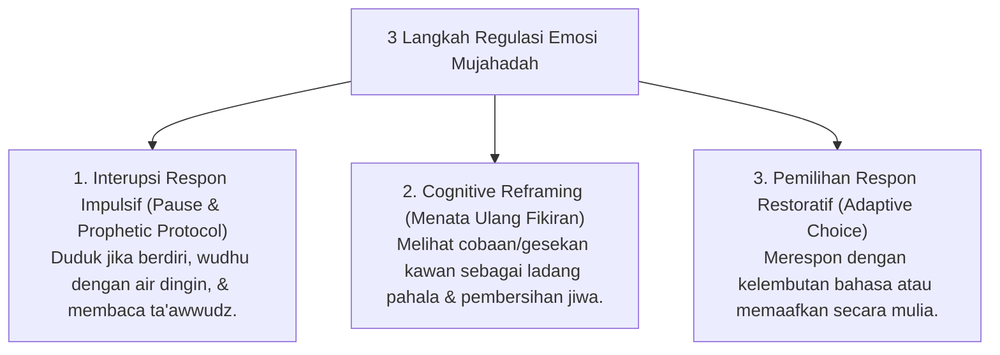

# P6-06-03: Modul Pengembangan Regulasi Emosi dan Mujahadah

## Status Dokumen
* **Status**: 🌟 **A+ (Tervalidasi & Siap Diimplementasikan)**
* **Sub-Domain**: `06 Intervention Framework / 06 Developmental Strategies`
* **Penanggung Jawab Keilmuan**: Dewan Keilmuan TUMBUH (*Pakar Epistemologi Turats & Pakar Neurosains Perkembangan*)

---

## 1. Integrasi Mujahadatun Linafsih & Cognitive Reframing

Modul ini melatih santri mengendalikan kecenderungan amarah/impulsif melalui sintesis antara **Mujahadatun Linafsih** (Perjuangan menundukkan hawa nafsu) dan **Cognitive Reframing**:

---

## 2. Jurnal Mujahadah Harian

Santri mencatat keberhasilan menahan amarah dan memilih respon sabar dalam jurnal mutabaah reflektif pribadi.
