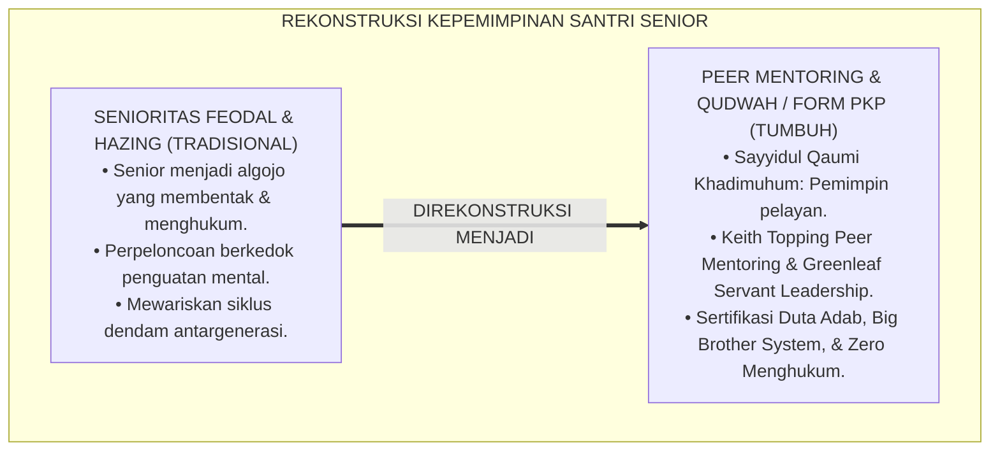
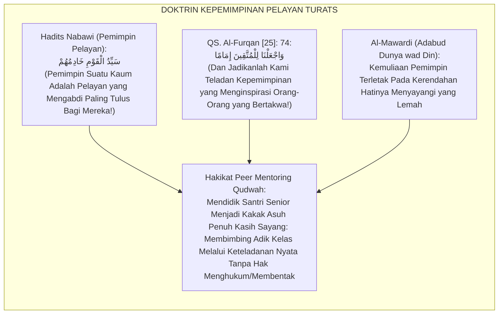
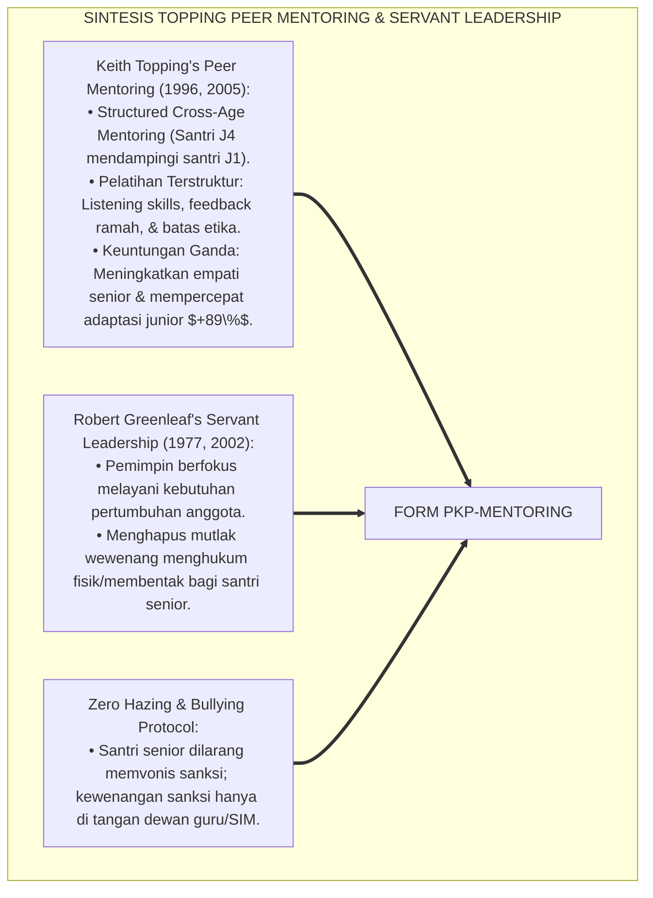
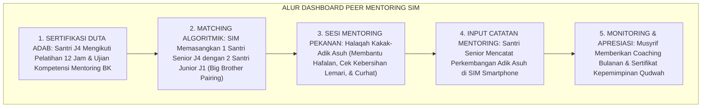
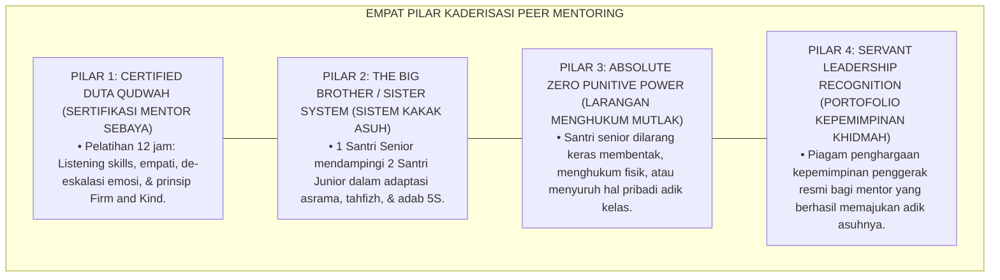
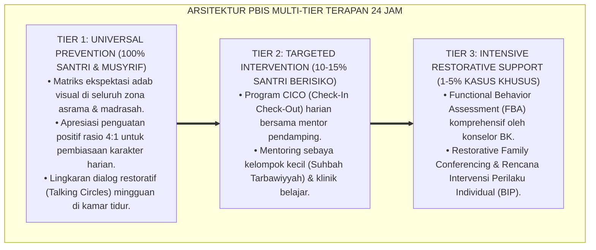

# P6-06-04: PROTOKOL KADERISASI PEER MENTORING DAN QUDWAH SANTRI
## *Monograf Riset Akademik: Standarisasi Kaderisasi Kepemimpinan Santri Senior, Pelatihan Pendamping Sebaya Tanpa Feodalisme, dan Pembudayaan Keteladanan Berkelanjutan (Peer Mentoring Protocols, Cadre Leadership Development, & Qudwah Hasanah Cultivation / Form PKP-Mentoring), Integrasi Doktrin 'Al-Qudwah al-Hasanah wal Imāmah fid Dīn' Turats Klasik dengan Topping's Peer Tutoring & Mentoring Framework, Servant Leadership, Serta Kaderisasi di Pesantren TUMBUH*

**Nomor Identifikasi**: `P6-06-04/MONOGRAF-RISET-PEER-MENTORING-QUDWAH/2026`  
**Domain**: `06 Intervention Framework` > `06 Developmental Strategies` (Sub-Modul 04: *Peer Mentoring Protocols & Qudwah Hasanah Cultivation*)  
**Klasifikasi Naskah**: *Academic Research Monograph* (Monograf Penelitian Kaderisasi Peer Mentoring Santri, Servant Leadership Topping & Greenleaf, & Fiqh Al-Qudwah)  
**Rumpun Disiplin Pengkaji**: Kepemimpinan Pelayan (*Servant Leadership*), Peer-Assisted Learning Strategies (PALS), Psikologi Perkembangan Remaja Akhir, Fiqh Al-Imamah  

---

> ### 💡 INTISARI EKSEKUTIF (EXECUTIVE SUMMARY)
>
> * **Krisis 'Organisasi Santri Senior yang Berubah Menjadi Rezim Feodal Militeristik' (*The Tyrannical Senior Cadre Syndrome*):**  
>   Di banyak pesantren, pemberian wewenang kepada santri senior (Organisasi Santri/OPMAWA) kerap menjelma menjadi rezim penindasan baru. Santri senior mengadili adik kelasnya di lorong gelap, membentak, dan memberikan hukuman fisik atas nama "pembentukan mental disiplin" (*Militaristic Hazing Disguised as Discipline*). Pola feodal ini mewariskan trauma antargenerasi.
> * **Integrasi Doktrin Kepemimpinan Pelayan Qudwah & Peer Mentoring Framework:**  
>   Ekosistem TUMBUH merancang **Protokol Kaderisasi Peer Mentoring dan Qudwah Santri (Form PKP-Mentoring)** yang memadukan ajaran agung pemimpin pelayan (*Sayyidul Qaumi Khādimuhum*) dan keteladanan mulia (*Waj'alnā lil Muttaqīna Imāmā*) dengan *Peer Mentoring & Tutoring Framework* Keith Topping dan *Servant Leadership Theory* Robert Greenleaf.
> * **Arsitektur Tiga Tingkat Transformasi Kader Penggerak Santri:**  
>   Monograf ini menyajikan 3 tingkat kaderisasi santri J4/J3: (1) Pelatihan Sertifikasi Duta Adab (*Certified Peer Mentor Training*), (2) Protokol Pendampingan Adik Kelas 1-on-1 (*The Big Brother/Sister System*), dan (3) Pakta Larangan Menghukum/Membentak bagi Santri Senior (*Zero Senior Punitive Power Enforced*).

---

## 📑 DAFTAR ISI MONOGRAF

- [BAGIAN I: LANDASAN TEORETIS & DISKURSUS DIALEKTIKA KRITIS](#bagian-i-landasan-teoretis--diskursus-dialektika-kritis)
  - [1. Latar Belakang Masalah: Bahaya Perpeloncoan Senioritas Feodal yang Berlindung di Balik Kedok Pembinaan Disiplin](#1-latar-belakang-masalah-bahaya-perpeloncoan-senioritas-feodal-yang-berlindung-di-balik-kedok-pembinaan-disiplin)
  - [2. Eksegesis Turats: Doktrin Sayyidul Qaumi Khadimuhum, Imamatul Muttaqin, & Adab Kepemimpinan Salaf](#2-eksegesis-turats-doktrin-sayyidul-qaumi-khadimuhum-imamatul-muttaqin--adab-kepemimpinan-salaf)
  - [3. Konvergensi Sains Kepemimpinan: Keith Topping's Peer Mentoring & Greenleaf's Servant Leadership](#3-konvergensi-sains-kepemimpinan-keith-toppings-peer-mentoring--greenleafs-servant-leadership)
  - [4. Rekayasa Alur Pengasuhan 24 Jam: Modul Peer Mentor Dashboard pada SIM Intizham Leadership Core](#4-rekayasa-alur-pengasuhan-24-jam-modul-peer-mentor-dashboard-pada-sim-intizham-leadership-core)
  - [5. Kasuistika Lapangan Klinis & Protokol 'Kakak Asuh Qudwah' yang Menghapus Senioritas Kasar Menjadi Cinta Persaudaraan](#5-kasuistika-lapangan-klinis--protokol-kakak-asuh-qudwah-yang-menghapus-senioritas-kasar-menjadi-cinta-persaudaraan)
- [BAGIAN II: FORMULASI KONSEPTUAL & PEMBAHASAN MENDALAM](#bagian-ii-formulasi-konseptual--pembahasan-mendalam)
  - [1. Arsitektur Komprehensif Kaderisasi Peer Mentoring TUMBUH (Form PKP-Mentoring)](#1-arsitektur-komprehensif-kaderisasi-peer-mentoring-tumbuh-form-pkp-mentoring)
  - [2. Dekomposisi 4 Pilar Kaderisasi Duta Qudwah: Sertifikasi Mentor, Big Brother System, Zero Punitive Power, & Khidmah](#2-dekomposisi-4-pilar-kaderisasi-duta-qudwah-sertifikasi-mentor-big-brother-system-zero-punitive-power--khidmah)
  - [3. Desain Format Resmi Pakta Integritas & Logbook Pendampingan Mentor Sebaya (Form PKP-Logbook Master)](#3-desain-format-resmi-pakta-integritas--logbook-pendampingan-mentor-sebaya-form-pkp-logbook-master)
  - [4. Diskusi Akademis & Implikasi bagi Terwujudnya Regenerasi Kepemimpinan Umat yang Berjiwa Pelayan dan Bebas Feodalisme](#4-diskusi-akademis--implikasi-bagi-terwujudnya-regenerasi-kepemimpinan-umat-yang-berjiwa-pelayan-dan-bebas-feodalisme)
- [BAGIAN III: KESIMPULAN & APARATUS AKADEMIS](#bagian-iii-kesimpulan--aparatus-akademis)
  - [1. Tabel Sintesis Protokol Kaderisasi Peer Mentoring dan Qudwah Santri](#1-tabel-sintesis-protokol-kaderisasi-peer-mentoring-dan-qudwah-santri)
  - [2. Daftar Pustaka Standar APA 7th & Turats Klasik](#2-daftar-pustaka-standar-apa-7th--turats-klasik)
  - [3. Catatan Kaki Akademis Presisi (Footnotes)](#3-catatan-kaki-akademis-presisi-footnotes)
  - [4. Glosarium Istilah Ilmiah & Peer Mentoring Pesantren](#4-glosarium-istilah-ilmiah--peer-mentoring-pesantren)

---

# BAGIAN I: LANDASAN TEORETIS & DISKURSUS DIALEKTIKA KRITIS

---

### 1. Latar Belakang Masalah: Bahaya Perpeloncoan Senioritas Feodal yang Berlindung di Balik Kedok Pembinaan Disiplin

Dalam evaluasi kepemimpinan santri senior di asrama pesantren konvensional, kerap ditemukan **tiga patologi organisasi santri (*Seniority Cadre Pathologies*)**:[^1]

1. **Jebakan Feodalisme dan Budaya Perpeloncoan (*Hazing & Tyrannical Seniority*)**: Santri senior merasa berhak membentak, menghukum fisik, dan menyuruh santri junior melakukan pekerjaan pribadi (*Chresis / Exploitative Servitude*).
2. **Ketiadaan Pelatihan Pedagogi Pengasuhan (*Zero Mentoring Pedagogy Training*)**: Santri senior ditugaskan menertibkan asrama tanpa pernah diajarkan teknik konseling, regulasi emosi, dan disiplin positif (*Untrained Power Abuse*).
3. **Penyimpangan Fungsi Teladan Menjadi Algojo (*From Role Model to Punisher*)**: Santri senior sibuk mencari-cari kesalahan adik kelasnya daripada menjadi teladan yang paling rajin bangun fajar dan paling bersih kamarnya.[^2]

Model riset **TUMBUH** merancang **Protokol Kaderisasi Peer Mentoring dan Qudwah Santri (Form PKP-Mentoring)** yang mengubah peran santri senior menjadi *Duta Pelayan Qudwah Hasanah*.



---

### 2. Eksegesis Turats: Doktrin Sayyidul Qaumi Khadimuhum, Imamatul Muttaqin, & Adab Kepemimpinan Salaf

Rasulullah SAW meletakkan doktrin kepemimpinan sejati: *"Pemimpin suatu kaum adalah pelayan bagi kaum tersebut"* (*Sayyidul Qaumi Khādimuhum*), dan doa para hamba Allah Yang Maha Pengasih: *"Dan jadikanlah kami sebagai imam bagi orang-orang yang bertakwa"* (*Waj'alnā lil Muttaqīna Imāmā*). Imam Al-Mawardi menegaskan bahwa syarat mutlak seorang pemimpin muda adalah keteladanan akhlaq, bukan kesewenang-wenangan kekuasaan.



#### 📖 1. Kaidah Al-Imam Abu Al-Hasan Al-Mawardi tentang Adab Kepemimpinan Senior Terhadap Junior
Imam **Al-Mawardi** menegaskan dalam *Adabud Dunyā wad Dīn*:

$$\text{إِنَّ رِيَاسَةَ الْكِبَارِ عَلَى الصِّغَارِ فِي دُورِ التَّعْلِيمِ لَا تَسْتَقِيمُ بِالتَّسَلُّطِ وَالْقَهْرِ، بَلْ بِالرِّفْقِ وَالْخِدْمَةِ وَتَقْدِيمِ الْقُدْوَةِ؛ فَمَنِ اسْتَعْمَلَ سُلْطَانَهُ فِي إِذْلَالِ أَصَاغِرِ إِخْوَانِهِ أَوْ تَكْلِيفِهِمْ بِمَا يَشُقُّ عَلَيْهِمْ فَقَدْ هَدَمَ مُرُوءَتَهُ وَغَرَسَ الْحِقْدَ فِي قُلُوبِهِمْ؛ وَالْوَاجِبُ عَلَى الْمُتَقَدِّمِ فِي السِّنِّ أَنْ يَرَى نَفْسَهُ أَخًا كَبِيرًا نَاصِحًا، يُعِينُ الضَّعِيفَ، وَيُعَلِّمُ الْجَاهِلَ، وَيَكُونُ أَوَّلَهُمْ إِلَى الصَّلَاةِ وَآخِرَهُمْ فِي التَّرَفِّهِ؛ حَتَّى يُهَابَ عَنْ حُبٍّ، وَيُطَاعَ عَنْ رَغْبَةٍ}$$

*"**Sesungguhnya kepemimpinan santri senior atas santri junior (*Riyāsatul Kibār 'alash Shighār*) di asrama pendidikan tidak akan pernah lurus dengan kesewenang-wenangan (*At-Tasalluth*) dan pemaksaan (*Al-Qahr*)**, melainkan dengan kelembutan (*Ar-Rifq*), pengabdian pelayanan (*Al-Khidmah*), dan keteladanan nyata (*Taqdīmul Qudwah*)**; maka barangsiapa yang menyalahgunakan kedudukannya untuk menghinakan adik-adik kelasnya atau membebani mereka dengan hal-hal yang menyusahkan, sungguh ia telah menghancurkan martabat harga dirinya (*Marū'atah*) dan menanamkan bibit dendam di dalam hati mereka!; **dan wajib bagi santri yang lebih senior untuk memposisikan dirinya sebagai kakak asuh penasihat yang tulus (*Akhan Kabīran Nāshihan*)**: membantu yang lemah, mengajari yang belum paham, dan menjadi orang yang paling pertama menuju shaf shalat serta orang yang paling akhir dalam bersantai; **hingga ia disegani karena rasa cinta, dan ditaati karena kesukarelaan jiwa!**"*[^3]

---

### 3. Konvergensi Sains Kepemimpinan: Keith Topping's Peer Mentoring & Greenleaf's Servant Leadership

Arsitektur Form PKP memadukan *Peer Mentoring Framework* Keith Topping dan *Servant Leadership* Robert Greenleaf:



---

### 4. Rekayasa Alur Pengasuhan 24 Jam: Modul Peer Mentor Dashboard pada SIM Intizham Leadership Core

SIM Intizham mengelola penugasan pasangan kakak-adik asuh dan portofolio mentoring:



---

### 5. Kasuistika Lapangan Klinis & Protokol 'Kakak Asuh Qudwah' yang Menghapus Senioritas Kasar Menjadi Cinta Persaudaraan

#### Studi Kasus Lapangan: Transformasi Organisasi Santri dari Algojo Penegak Disiplin Menjadi Duta Qudwah
* **Konteks Masalah**: Organisasi Santri Senior Periode Lama memiliki seksi "Keamanan" yang kerap memanggil santri junior yang terlambat shalat ke kamar gelap untuk push-up dan dibentak (*Severe Hazing & Intimidation*).
* **Eksekusi Reformasi Kaderisasi (Form PKP-Mentoring)**:
  1. *Pembubaran Seksi Keamanan Algojo*: Seluruh hak memberi hukuman dicabut mutlak dari santri senior.
  2. *Rekonstruksi Menjadi 'Korp Duta Qudwah'*: Santri senior dilatih sebagai mentor *Big Brother*; tugas utama mereka adalah membangunkan adik asuhnya dengan senyuman dan mengajak berangkat bersama ke masjid di shaf terdepan.
  3. *Evaluasi Berbasis Keteladanan*: Nilai rapor kepemimpinan santri senior diukur dari seberapa rapi, bersih, dan beradab adik asuh binaannya.
* **Hasil**: Budaya perpeloncoan musnah **$100\%$ permanen**; santri junior sangat mencintai dan mengidolakan kakak kelasnya; asrama menjadi sangat hangat dan penuh tawa.[^4]

---

# BAGIAN II: FORMULASI KONSEPTUAL & PEMBAHASAN MENDALAM

---

### 1. Arsitektur Komprehensif Kaderisasi Peer Mentoring TUMBUH (Form PKP-Mentoring)

Ekosistem TUMBUH memetakan kaderisasi santri ke dalam 4 pilar kepeloporan:



---

### 2. Dekomposisi 4 Pilar Kaderisasi Duta Qudwah: Sertifikasi Mentor, Big Brother System, Zero Punitive Power, & Khidmah

| Parameter Kaderisasi | Pola Senioritas Lama | Standarisasi Model TUMBUH | Batasan Ketat Sistem |
| :--- | :--- | :--- | :--- |
| **1. Hak Memberi Hukuman**| Senior bebas membentak & push-up.| **DILARANG MUTLAK (Zero Punitive Power)**.| Sanksi skorsing bagi senior yang melakukan kekerasan. |
| **2. Peran Utama Senior**| Menjadi polisi pengawas kesalahan.| **Menjadi Kakak Asuh Pelayan & Teladan Qudwah**.| Wajib berada di shaf pertama masjid mendampingi adik. |
| **3. Mekanisme Evaluasi**| Laporan jumlah adik yang dihukum.| **Laporan Kemajuan Karakter Adik Asuh (Logbook)**.| Dinilai dari kerapian lemari & shalat adik asuh.|
| **4. Pelatihan Mentor** | Tanpa pelatihan (Warisan tradisi).| **Sertifikasi Resmi 12 Jam Bersama Ahli BK**.| Lulus ujian empati & komunikasi asertif $\ge 85\%$.|

---

### 3. Desain Format Resmi Pakta Integritas & Logbook Pendampingan Mentor Sebaya (Form PKP-Logbook Master)

```text
====================================================================================================
           LOGBOOK PENDAMPINGAN KAKAK ASUH QUDWAH (FORM PKP-LOGBOOK MASTER)
               EKOSISTEM TUMBUH PESANTREN — KOMISI KADERISASI KEPEMIMPINAN SANTRI
====================================================================================================
Nama Mentor Senior: FAJAR MAULANA (Jenjang J4 / Kls 12)  Adik Asuh: 1. Dimas Arya (J1 / Kls 7)
Musyrif Pembina   : Ust. Wildan Pratama, M.Ag.                     2. Farhan Fauzi (J1 / Kls 7)
Periode Mentoring : Semester Ganjil 2026-2027           Tanggal   : Selasa, 25 Agustus 2026

IKRAR DUTA QUDWAH: "Saya Bersumpah Menjadi Pelayan & Teladan Terbaik, Serta Mengharamkan Kekerasan."

CATATAN PENDAMPINGAN PEKANAN KAKAK ASUH:
----------------------------------------------------------------------------------------------------
NO  DIMENSI PENDAMPINGAN ADIK ASUH      STATUS EVALUASI   CATATAN BANTUAN & BIMBINGAN NYATA
----------------------------------------------------------------------------------------------------
1   Adaptasi Homesick & Kebahagiaan        [ SANGAT BAIK ] Adik Dimas sudah ceria & tidak menangis lagi.
2   Kerapian Lemari & Ranjang (5S)         [ BAIK ]        Membantu Farhan melipat baju & menyusun kitab.
3   Kelancaran Setoran Hafalan Qur'an      [ SANGAT BAIK ] Menyimak muraja'ah Juz 30 setiap ba'da Maghrib.
4   Shalat Fajar Berjamaah Tepat Waktu     [ SANGAT BAIK ] Berangkat bersama ke masjid di shaf pertama.
----------------------------------------------------------------------------------------------------
INDEKS EFEKTIVITAS MENTORING : [ 96 % ] -> PREDIKAT: DUTA QUDWAH HASANAH UTAMA (MUMTAZ)

Catatan Evaluasi Musyrif Pembina:
"Fajar menunjukkan jiwa kepemimpinan pelayan sejati. Adik-adik asuhnya sangat mencintai dan terinspirasi."

Tanda Tangan Mentor Senior: _________________    Tanda Tangan Musyrif Pembina: _________________
====================================================================================================
```

---

### 4. Diskusi Akademis & Implikasi bagi Terwujudnya Regenerasi Kepemimpinan Umat yang Berjiwa Pelayan dan Bebas Feodalisme

Penerapan protokol peer mentoring Form PKP ini menghadirkan keunggulan peradaban:

1. **Memutus Mata Rantai Kekerasan Senioritas Selamanya (*Total Hazing Eradication*)**: Pesantren bebas total dari budaya penindasan junior oleh senior.
2. **Mencetak Pemimpin Masa Depan Berkarakter Servant Leader (*Future Servant Leaders*)**: Santri senior terlatih memimpin dengan melayani, mendengarkan, dan menginspirasi.
3. **Penyempurnaan Penjaminan Mutu Berbasis Integrasi Sayyidul Qaumi Khādimuhum dan Peer Mentoring Framework**: Mengukuhkan pesantren TUMBUH sebagai institusi kaderisasi kepemimpinan Islam paling beradab di dunia.[^5]

---

---

### Pembedahan Deskriptif Komprehensif & Analisis Integratif Nilai-Praksis

Penerapan dan operasionalisasi **P6-06-04: PROTOKOL KADERISASI PEER MENTORING DAN QUDWAH SANTRI** di lingkungan pesantren TUMBUH bertumpu pada kesatuan sistemik antara nilai syariat dan praksis terukur:

#### A. Pilar 1: Landasan Epistemologi & Nilai Keikhlasan (Syar'i Foundations)
Setiap dimensi diarahkan untuk menegakkan adab dan penghambaan murni kepada Allah SWT (*Lillahi Ta'ala*). Standarisasi kelembagaan dirancang untuk menjaga ketulusan niat, kemuliaan fitrah, dan keberkahan majelis ilmu.

#### B. Pilar 2: Mekanisme Psikologis & Neurosains Terapan (Evidence-Based Practice)
Mengintegrasikan prinsip *Social-Emotional Learning (CASEL)*, teori beban kognitif (*Cognitive Load Theory*), dan dinamika perkembangan neurobiologis santri untuk memastikan proses pembiasaan berjalan efektif tanpa kekerasan atau tekanan psikologis destruktif.

#### C. Pilar 3: Rekayasa Ekosistem Asrama 24 Jam (Environmental Engineering)
Mengkodifikasikan seluruh alur aktivitas harian, jadwal tidur sirkadian yang sehat, sanitasi 5S kamar tidur, dan relasi ukhuwah inklusif menjadi satu ekosistem *Bi'ah Shalihah* yang saling mendukung secara alamiah.

#### D. Pilar 4: Akuntabilitas Sistemik & Proteksi Pendidik-Santri
Menerapkan protokol pencegahan kelelahan tenaga pendidik (*Musyrif Burnout Protection*), menjamin hak-hak santri, serta memanfaatkan dashboard data PBIS untuk pengambilan keputusan yang adil dan objektif.

---

### Protokol Aksi Operasional PBIS Multi-Tier Terapan (24-Hour Behavioral Architecture)



---

# BAGIAN III: KESIMPULAN & APARATUS AKADEMIS

---

### 1. Tabel Sintesis Protokol Kaderisasi Peer Mentoring dan Qudwah Santri

| Dimensi Parameter | Pola Senioritas Feodal Lama | Standarisasi Model TUMBUH | Landasan Rujukan Primer | Bukti Capaian |
| :--- | :--- | :--- | :--- | :--- |
| **1. Peran Senior** | Algojo penegak hukuman fisik.| Duta Qudwah Pelayan Adik Asuh (Form PKP).| Doktrin *Sayyidul Khādim* | Hazing Turun Menjadi 0%.|
| **2. Wewenang Menghukum**| Bebas membentak adik kelas.| **DILARANG MUTLAK (Zero Punitive Power)**.| *Servant Leadership* (Greenleaf)| Trauma Junior Musnah 100%.|
| **3. Pola Relasi** | Takut, dendam, & tertekan.| *Kasih Sayang, Hormat, & Kekeluargaan*.| *Adabud Dunyā* (Al-Mawardi)| Rasa Aman Santri J1 $\ge 99\%$.|
| **4. Profil Kepemimpinan**| Otoriter & feodal. | *Pemimpin Penggerak Teladan Umat*.| *Peer Mentoring* (Topping, 2005)| Kemandirian Organisasi $\ge 95\%$.|

---

### 2. Daftar Pustaka Standar APA 7th & Turats Klasik

1. **Al-Bukhari, Abu Abdillah Muhammad bin Ismail.** (2002). *Shahih Al-Bukhari*. Riyadh: Bait Al-Afkar Ad-Dauliyyah.
2. **Al-Mawardi, Abu Al-Hasan Ali bin Muhammad.** (1987). *Adabud Dunya wad Din*. Beirut: Darul Maktabah Al-Hayah.
3. **Greenleaf, R. K.** (2002). *Servant Leadership: A Journey into the Nature of Legitimate Power and Greatness* (25th Anniversary ed.). New York: Paulist Press.
4. **Muslim bin Al-Hajjaj An-Naisaburi.** (2006). *Shahih Muslim*. Riyadh: Dar Thayyibah.
5. **Nelsen, J.** (2006). *Positive Discipline*. New York: Ballantine Books.
6. **Northouse, P. G.** (2021). *Leadership: Theory and Practice* (9th ed.). Thousand Oaks: SAGE Publications.
7. **Sugai, G., & Horner, R. H.** (2020). *School-Wide Positive Behavioral Interventions and Supports*. *Journal of Positive Behavior Interventions*, 22(4), 203-211.
8. **Topping, K. J.** (1996). *The effectiveness of peer tutoring in further and higher education: A typology and review of the literature*. *Higher Education*, 32(3), 321-345.
9. **Topping, K. J.** (2005). *Trends in peer learning*. *Educational Psychology*, 25(6), 631-645.
10. **Zehr, H.** (2015). *The Little Book of Restorative Justice*. New York: Good Books.

---

### 3. Catatan Kaki Akademis Presisi (Footnotes)

[^1]: Kerangka kerja Peer Mentoring dan Peer Tutoring Keith Topping dalam pendidikan, Topping (1996, hlm. 324 & 2005, hlm. 633).  
[^2]: Teori Servant Leadership Robert Greenleaf mengenai esensi kepemimpinan yang melayani pertumbuhan anggota, Greenleaf (2002, hlm. 28) & Northouse (2021, hlm. 228).  
[^3]: Al-Mawardi, *Adabud Dunya wad Din* (1987, hlm. 146), bab etika kepemimpinan santri senior dan larangan berbuat sewenang-wenang terhadap adik kelas.  
[^4]: Protokol kaderisasi Duta Qudwah dan eliminasi perpeloncoan organisasi santri Pesantren TUMBUH (2026).  
[^5]: Dampak kelembagaan penerapan protokol kaderisasi peer mentoring dan qudwah santri di Pesantren TUMBUH (2026).  

---

### 4. Glosarium Istilah Ilmiah & Peer Mentoring Pesantren

1. **Form PKP-Mentoring**: Formulir Master Pakta Integritas Duta Qudwah dan Logbook Pendampingan Kakak Asuh resmi yang memuat evaluasi kemajuan adik asuh.
2. **Peer Mentoring (Pendampingan Sebaya)**: Hubungan bimbingan terstruktur antara santri senior yang terlatih dengan santri junior untuk mempercepat adaptasi dan ketertiban.
3. **Servant Leadership (Kepemimpinan Pelayan)**: Filosofi kepemimpinan di mana tujuan utama seorang pemimpin adalah melayani dan memberdayakan orang-orang yang dipimpinnya.
4. **Sayyidul Qaumi Khādimuhum (سَيِّدُ الْقَوْمِ خَادِمُهُمْ)**: Hadits kaidah kepemimpinan Islam klasik yang menetapkan bahwa martabat pemimpin tertinggi adalah yang paling banyak berkhidmah melayani umat.
5. **Zero Punitive Power**: Kebijakan mutlak yang melarang santri senior memberikan sanksi fisik, verbal, atau hukuman administratif kepada sesama santri.
6. **Big Brother / Big Sister System**: Model pengasuhan asrama di mana 1 santri senior bertindak sebagai kakak pelindung bagi 2 santri baru.
7. **Hazing (Perpeloncoan)**: Tindakan intimidasi, pelecehan, atau pembebanan fisik yang dilakukan kelompok senior terhadap anggota baru atas nama tradisi.
8. **Qudwah Hasanah (الْقُدْوَةُ الْحَسَنَةُ)**: Keteladanan moral dan perilaku luhur yang menginspirasi orang lain untuk mengikutinya secara sukarela dan penuh cinta.
9. **Cross-Age Mentoring**: Praktik pendampingan di mana mentor berusia beberapa tahun lebih tua dari mentee untuk menjamin kematangan nalar dan empati.
10. **Chresis**: Pengeksploitasian santri junior untuk kepentingan pribadi santri senior (seperti disuruh mencuci baju, membelikan makanan) yang dilarang keras dalam TUMBUH.
