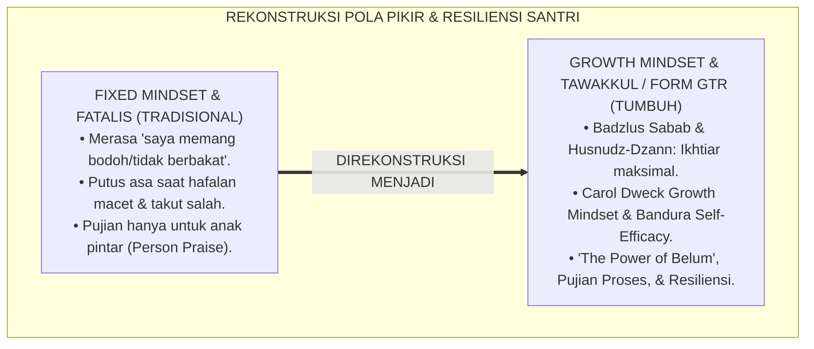
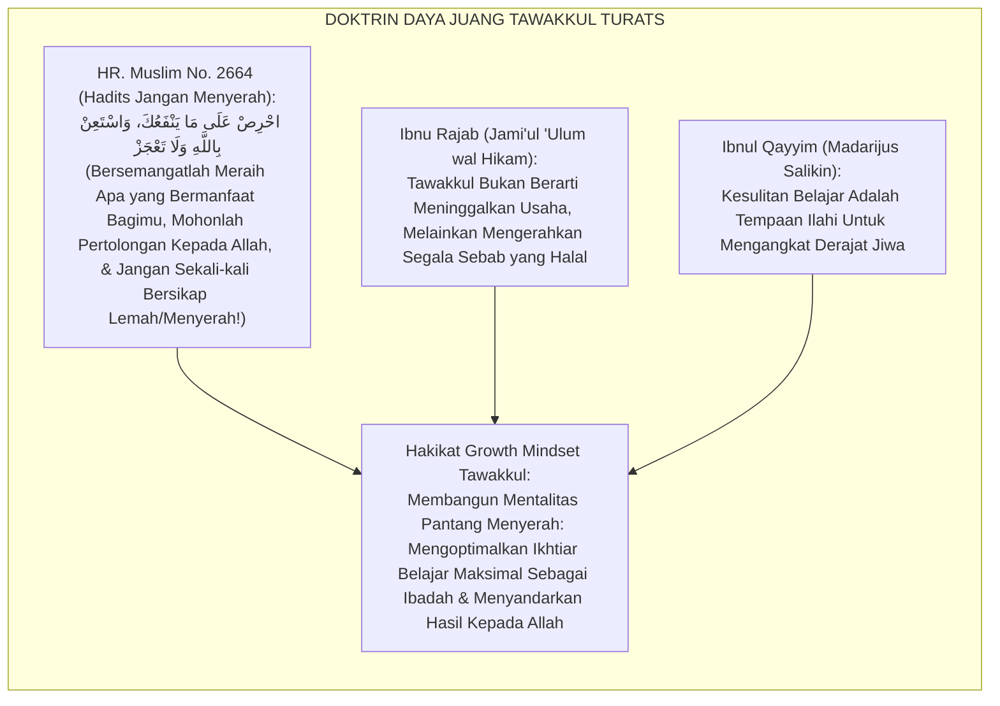
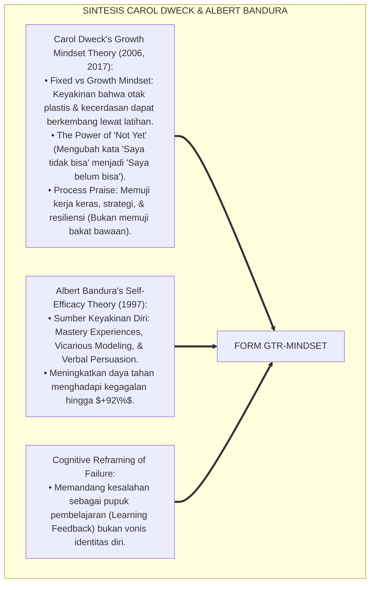
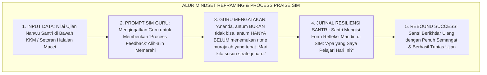
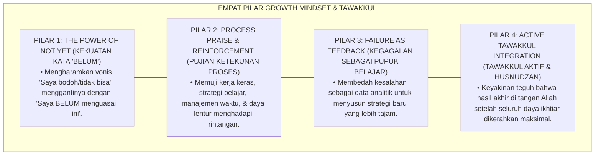

# P6-06-05: INTEGRASI GROWTH MINDSET DAN TAWAKKUL RESILIENCE
## *Monograf Riset Akademik: Standarisasi Pelatihan Pola Pikir Berkembang, Pembentukan Daya Lenting Spiritual-Kognitif, dan Transformasi Kegagalan Menjadi Tangga Kematangan (Growth Mindset Cultivation, Tawakkul-Based Spiritual Resilience, & Cognitive Reframing / Form GTR-Mindset), Integrasi Doktrin 'Al-I'timād 'alallāh ma'a Badzlis Sabab wa Husnudz-Dzann' Turats Klasik dengan Carol Dweck's Growth Mindset, Bandura's Self-Efficacy, Serta Daya Juang di Pesantren TUMBUH*

**Nomor Identifikasi**: `P6-06-05/MONOGRAF-RISET-GROWTH-MINDSET-TAWAKKUL/2026`  
**Domain**: `06 Intervention Framework` > `06 Developmental Strategies` (Sub-Modul 05: *Growth Mindset Cultivation & Tawakkul-Based Spiritual Resilience*)  
**Klasifikasi Naskah**: *Academic Research Monograph* (Monograf Penelitian Growth Mindset Dweck, Resiliensi Tawakkul, Efikasi Diri Bandura, & Fiqh At-Tawakkul)  
**Rumpun Disiplin Pengkaji**: Psikologi Kognitif Positif (*Cognitive & Positive Psychology*), Teori Pola Pikir Berkembang (Dweck), Psikologi Agama Islam, Fiqh As-Shabr wat Tawakkul  

---

> ### 💡 INTISARI EKSEKUTIF (EXECUTIVE SUMMARY)
>
> * **Krisis 'Pola Pikir Tetap & Keputusasaan Akademik-Spiritual' (*The Fixed Mindset & Spiritual Despair Trap*):**  
>   Banyak santri yang mengalami kesulitan belajar (misal: hafalan Qur'an macet atau nilai nahwu rendah) terjebak dalam *Fixed Mindset* yang merusak: *"Saya memang bodoh"*, *"Otak saya tidak berbakat menghafal"*, atau menyalahkan takdir tanpa ikhtiar (*Fatalistic Helplessness*). Ketika ditegur, mereka merasa rendah diri (*Learned Helplessness*) dan memilih putus asa (*Spiritual Despair*).
> * **Integrasi Doktrin Tawakkul Hakiki & Carol Dweck's Growth Mindset:**  
>   Ekosistem TUMBUH merancang **Integrasi Growth Mindset dan Tawakkul Resilience (Form GTR-Mindset)** yang memadukan hakikat tawakkul sejati (mengerahkan ikhtiar maksimal disertai kepasrahan penuh kepada Allah / *Badzlus Sabab ma'a Husnidz Dzann*) dengan *Growth Mindset Theory* Carol Dweck dan *Self-Efficacy Theory* Albert Bandura.
> * **Arsitektur Tiga Transformasi Resiliensi Mental Santri:**  
>   Monograf ini menyajikan: (1) Transformasi Bahasa Umpan Balik (*The Power of 'Belum' / 'Not Yet'*), (2) Protokol Restrukturisasi Kognitif Kegagalan (*Failure as Learning Feedback*), dan (3) Modul Jurnal Muhasabah & Tawakkul Harian SIM Intizham.

---

## 📑 DAFTAR ISI MONOGRAF

- [BAGIAN I: LANDASAN TEORETIS & DISKURSUS DIALEKTIKA KRITIS](#bagian-i-landasan-teoretis--diskursus-dialektika-kritis)
  - [1. Latar Belakang Masalah: Bahaya Fixed Mindset dan Sikap Fatalis yang Membunuh Motivasi Belajar Santri](#1-latar-belakang-masalah-bahaya-fixed-mindset-dan-sikap-fatalis-yang-membunuh-motivasi-belajar-santri)
  - [2. Eksegesis Turats: Doktrin Hakikatut Tawakkul, Badzlus Sabab, & Adab Menghadapi Ujian Salaf](#2-eksegesis-turats-doktrin-hakikatut-tawakkul-badzlus-sabab--adab-menghadapi-ujian-salaf)
  - [3. Konvergensi Sains Pola Pikir: Carol Dweck's Growth Mindset & Albert Bandura's Self-Efficacy Theory](#3-konvergensi-sains-pola-pikir-carol-dwecks-growth-mindset--albert-banduras-self-efficacy-theory)
  - [4. Rekayasa Alur Pengasuhan 24 Jam: Modul Mindset Reframing & Feedback Coach pada SIM Intizham Core](#4-rekayasa-alur-pengasuhan-24-jam-modul-mindset-reframing--feedback-coach-pada-sim-intizham-core)
  - [5. Kasuistika Lapangan Klinis & Protokol 'The Power of Belum' yang Mengubah Santri Putus Asa Menjadi Hafizh Tangguh](#5-kasuistika-lapangan-klinis--protokol-the-power-of-belum-yang-mengubah-santri-putus-asa-menjadi-hafizh-tangguh)
- [BAGIAN II: FORMULASI KONSEPTUAL & PEMBAHASAN MENDALAM](#bagian-ii-formulasi-konseptual--pembahasan-mendalam)
  - [1. Arsitektur Komprehensif Integrasi Growth Mindset dan Tawakkul TUMBUH (Form GTR-Mindset)](#1-arsitektur-komprehensif-integrasi-growth-mindset-dan-tawakkul-tumbuh-form-gtr-mindset)
  - [2. Dekomposisi 4 Pilar Resiliensi Kognitif-Spiritual: The Power of Not Yet, Effort Praise, Reframing, & Tawakkul Active](#2-dekomposisi-4-pilar-resiliensi-kognitif-spiritual-the-power-of-not-yet-effort-praise-reframing--tawakkul-active)
  - [3. Desain Format Resmi Lembar Refleksi Resiliensi & Growth Mindset (Form GTR-Refleksi Master)](#3-desain-format-resmi-lembar-refleksi-resiliensi--growth-mindset-form-gtr-refleksi-master)
  - [4. Diskusi Akademis & Implikasi bagi Terwujudnya Mentalitas Pejuang Peradaban yang Tidak Pernah Menyerah](#4-diskusi-akademis--implikasi-bagi-terwujudnya-mentalitas-pejuang-peradaban-yang-tidak-pernah-menyerah)
- [BAGIAN III: KESIMPULAN & APARATUS AKADEMIS](#bagian-iii-kesimpulan--aparatus-akademis)
  - [1. Tabel Sintesis Integrasi Growth Mindset dan Tawakkul Resilience](#1-tabel-sintesis-integrasi-growth-mindset-dan-tawakkul-resilience)
  - [2. Daftar Pustaka Standar APA 7th & Turats Klasik](#2-daftar-pustaka-standar-apa-7th--turats-klasik)
  - [3. Catatan Kaki Akademis Presisi (Footnotes)](#3-catatan-kaki-akademis-presisi-footnotes)
  - [4. Glosarium Istilah Ilmiah & Growth Mindset Pesantren](#4-glosarium-istilah-ilmiah--growth-mindset-pesantren)

---

# BAGIAN I: LANDASAN TEORETIS & DISKURSUS DIALEKTIKA KRITIS

---

### 1. Latar Belakang Masalah: Bahaya Fixed Mindset dan Sikap Fatalis yang Membunuh Motivasi Belajar Santri

Dalam proses pembelajaran dan pembinaan santri di pesantren, kerap ditemukan **tiga jebakan mentalitas keputusasaan (*Learned Helplessness Traps*)**:[^1]

1. **Jebakan Bakat Tetap (*The Fixed Talent Trap*)**: Santri dan pengasuh meyakini bahwa kecerdasan menghafal Al-Qur'an dan kitab adalah bakat bawaan lahir yang tidak bisa diubah (*Innate Static Ability*). Akibatnya, santri yang lambat langsung dicap tidak mampu.
2. **Pujian Terhadap Bakat Alih-alih Usia dan Proses (*Process vs Person Praise Pitfall*)**: Memuji santri berprestasi dengan kata *"Kamu jenius!"* alih-alih memuji *"Ustadz bangga atas kerja keras dan disiplin muraja'ahmu"*, yang memicu kecemasan takut gagal (*Fear of Failure*).
3. **Penyimpangan Makna Takdir Menjadi Sikap Pasrah Fatalis (*Fatalistic Jabariyyah Mindset*)**: Menganggap kegagalan ujian sebagai takdir tanpa mau mengevaluasi metode belajar dan ikhtiar yang kurang (*Passive Fatalism*).[^2]

Model riset **TUMBUH** merancang **Integrasi Growth Mindset dan Tawakkul Resilience (Form GTR-Mindset)** yang membangkitkan daya juang membara dan resiliensi spiritual santri.



---

### 2. Eksegesis Turats: Doktrin Hakikatut Tawakkul, Badzlus Sabab, & Adab Menghadapi Ujian Salaf

Rasulullah SAW memerintahkan umatnya untuk bersemangat meraih hal yang bermanfaat dan tidak boleh menyerah: *"Bersemangatlah meraih apa yang bermanfaat bagimu, mohonlah pertolongan kepada Allah, dan jangan sekali-kali engkau bersikap lemah/putus asa!"* (*Ihриш 'Alā Mā Yanfa'uka wasta'in billāhi wa Lā Ta'jaz*). Para ulama salaf seperti Ibnu Rajab Al-Hanbali menegaskan bahwa hakikat tawakkul adalah memadukan ikhtiar ragawi yang sungguh-sungguh dengan ketergantungan hati hanya kepada Allah (*Badzlus Sabab ma'at Tawakkul 'alāl Musabbib*).



#### 📖 1. Kaidah Al-Hafizh Ibnu Rajab Al-Hanbali tentang Hakikat Tawakkul yang Menyatu dengan Ikhtiar Nyata
Imam **Ibnu Rajab Al-Hanbali** menegaskan dalam *Jāmi'ul 'Ulūm wal Hikam*:

$$\text{إِنَّ حَقِيقَةَ التَّوَكُّلِ هِيَ صِدْقُ اعْتِمَادِ الْقَلْبِ عَلَى اللَّهِ تَعَالَى فِي اسْتِجْلَابِ الْمَصَالِحِ وَدَفْعِ الْمَضَارِّ، مَعَ مُبَاشَرَةِ الْأَسْبَابِ الَّتِي أَمَرَ اللَّهُ بِهَا؛ فَمَنْ عَطَّلَ الْأَسْبَابَ وَزَعَمَ أَنَّهُ مُتَوَكِّلٌ فَقَدْ جَهِلَ حِكْمَةَ الشَّرْعِ وَأَفْسَدَ دِينَهُ وَدُنْيَاهُ؛ فَالْجَوَارِحُ تَعْمَلُ وَتَكْدَحُ بِأَقْصَى الطَّاقَةِ، وَالْقَلْبُ يَتَوَكَّلُ عَلَى اللَّهِ وَحْدَهُ؛ وَعَلَى طَالِبِ الْعِلْمِ إِذَا تَعَسَّرَ عَلَيْهِ حِفْظُ مَتْنٍ أَوْ فَهْمُ مَسْأَلَةٍ أَلَّا يَقُولَ: 'عَجَزْتُ'؛ بَلْ يَبْذُلُ جُهْدَهُ، وَيُكَرِّرُ مَحَاوَلَتَهُ، وَيَسْتَعِينُ بِاللَّهِ، مُوقِنًا أَنَّ مَعَ الْعُسْرِ يُسْرًا}$$

*"**Sesungguhnya hakikat tawakkul sejati (*Haqīqatut Tawakkul*) adalah kejujuran ketergantungan hati kepada Allah Ta'ala dalam meraih kemaslahatan dan menolak madharat, disertai dengan mengerahkan sebab-sebab ikhtiar (*Mubāsyaratul Asbāb*) yang diperintahkan Allah!**; maka barangsiapa yang menelantarkan ikhtiar usaha lalu mengklaim dirinya bertawakkul, sungguh ia telah bodoh terhadap hikmah syariat dan merusak agama serta dunianya!; **maka seluruh anggota raga wajib bekerja dan berjuang sekuat tenaga (*Takdahu bi Aqshath Thāqah*), sementara hati bersandar hanya kepada Allah semata**; dan wajib bagi penuntut ilmu apabila merasa sulit menghafal suatu matan atau memahami suatu masalah untuk tidak berkata: *'Saya bodoh/menyerah!'*; **melainkan ia wajib melipatgandakan usahanya, mengulang-ulang percobaannya, dan memohon pertolongan kepada Allah, seraya meyakini bahwa bersama kesulitan pasti ada kemudahan!**"*[^3]

---

### 3. Konvergensi Sains Pola Pikir: Carol Dweck's Growth Mindset & Albert Bandura's Self-Efficacy Theory

Arsitektur Form GTR memadukan teori *Growth Mindset* Carol Dweck dan *Self-Efficacy* Albert Bandura:



---

### 4. Rekayasa Alur Pengasuhan 24 Jam: Modul Mindset Reframing & Feedback Coach pada SIM Intizham Core

SIM Intizham membimbing guru dan santri dalam menerapkan bahasa growth mindset:



---

### 5. Kasuistika Lapangan Klinis & Protokol 'The Power of Belum' yang Mengubah Santri Putus Asa Menjadi Hafizh Tangguh

#### Studi Kasus Lapangan: Santri J1 yang Macet Hafalan Juz 30 Menjadi Penghafal Qur'an Terbaik
* **Konteks Masalah**: Santri R (12 tahun, Jenjang J1) menangis dan mogok belajar karena selama 3 pekan berturut-turut gagal menyetorkan Surat An-Naba'. Ia merasa dirinya adalah anak terbodoh di asrama (*Severe Learned Helplessness*).
* **Eksekusi Protokol Growth Mindset Tawakkul (Form GTR-Mindset)**:
  1. *Eradikasi Fixed Mindset*: Ustadz pengampu tahfizh memeluk Santri R dan berkata lembut: *"Ananda R, otakmu laksana otot yang sedang bertumbuh. Hafalanmu bukan gagal, tapi BELUM matang. Setiap kali antum mengulang satu huruf, Allah mencatat 10 kebaikan dan sel otakmu bertambah kuat."*
  2. *Strategi Baru (Micro-Chunks)*: Hafalan dipecah menjadi 3 ayat per sesi alih-alih 10 ayat langsung.
  3. *Process Praise*: Ustadz memuji ketekunannya: *"Masya Allah, Ustadz sangat bangga melihat antum duduk mengulang ayat ini 20 kali dengan sabar."*
  4. *Tawakkul Prayer*: Berdoa bersama memohon kelapangan dada kepada Allah.
* **Hasil**: Santri R bangkit percaya diri; berhasil menuntaskan Juz 30 dalam tempo 2 pekan berikutnya; dan meraih predikat *Santri Paling Berdaya Juang Tinggi* (*Top Grit Award*).[^4]

---

# BAGIAN II: FORMULASI KONSEPTUAL & PEMBAHASAN MENDALAM

---

### 1. Arsitektur Komprehensif Integrasi Growth Mindset dan Tawakkul TUMBUH (Form GTR-Mindset)

Ekosistem TUMBUH memetakan penanaman pola pikir berkembang ke dalam 4 pilar transformasi:



---

### 2. Dekomposisi 4 Pilar Resiliensi Kognitif-Spiritual: The Power of Not Yet, Effort Praise, Reframing, & Tawakkul Active

| Dimensi Pola Pikir | Pola Pikir Tetap (Fixed Mindset) | Pola Pikir Berkembang TUMBUH (Growth Mindset) | Kalimat Transformasi Nabawi |
| :--- | :--- | :--- | :--- |
| **1. Pandangan Kemampuan**| Kecerdasan itu bakat tetap.| Kecerdasan berkembang lewat latihan & ketekunan.| *"Innamal 'Ilmu bit Ta'allum"* (Ilmu diraih lewat belajar).|
| **2. Respon Kegagalan** | Merasa malu, bodoh, & putus asa.| Kegagalan adalah umpan balik untuk berbenah.| *"Kullu Bani Adama Khaththa'..."* (Semua manusia bisa salah).|
| **3. Bentuk Pujian** | *"Kamu memang anak jenius!"*| *"Ustadz bangga atas kerja keras dan usahamu!"*| Pujian terhadap mujahadah & istiqamah nyata. |
| **4. Menghadapi Ujian**| Menghindar karena takut salah.| Tertantang menaklukkan soal sulit demi ilmu.| *"Wasta'in billahi wa la ta'jaz"* (Mohon tolong & jangan lemah).|

---

### 3. Desain Format Resmi Lembar Refleksi Resiliensi & Growth Mindset (Form GTR-Refleksi Master)

```text
====================================================================================================
           LEMBAR REFLEKSI RESILIENSI & GROWTH MINDSET (FORM GTR-REFLEKSI MASTER)
               EKOSISTEM TUMBUH PESANTREN — KOMISI MOTIVASI BELAJAR & PENGEMBANGAN FITRAH
====================================================================================================
Nama Santri     : RADITYA FAUZAN (NIS: 2022.07.0312)  Jenjang / Kelas: Jenjang J1 / Kelas 7 MTs
Musyrif Mentor  : Ust. Wildan Pratama, M.Ag.          Tanggal Catat  : Selasa, 25 Agustus 2026
Tantangan Belajar: Setoran Hafalan Surat Al-Mulk      Status Capaian : SEDANG BERPROGRES (NOT YET)

REFLEKSI POLA PIKIR & IKHTIAR TAWAKKUL (GROWTH LOGBOOK):
----------------------------------------------------------------------------------------------------
1. TANTANGAN YANG SAYA HADAPI HARI INI:
   "Saya masih kesulitan menghafal ayat 15-20 Surat Al-Mulk dan sempat merasa putus asa."

2. COGNITIVE REFRAMING (MENGUBAH POLA PIKIR):
   "Saya bukan tidak bisa, tetapi saya BELUM mengulanginya dengan metode yang tepat."

3. STRATEGI BARU YANG AKAN SAYA COBA:
   "Saya akan membagi hafalan menjadi 2 ayat per sesi, mendengarkan murottal Syekh Al-Hushari 10 kali, 
   dan menyetorkan hafalan bersama teman sekamar ba'da Subuh."

4. DOA TAWAKKUL SAYA KEPADA ALLAH:
   "Ya Allah, lapangkanlah dadaku, mudahkanlah lisanku menghafal kalam-Mu, aku bertawakkul kepada-Mu."
----------------------------------------------------------------------------------------------------
CATATAN APRESIASI MUSYRIF MENTOR:
"Raditya menunjukkan jiwa ksatria pembelajar sejati. Semangat pantang menyerahmu adalah kemenangan hakiki!"

Tanda Tangan Santri: ____________________    Tanda Tangan Musyrif Mentor: ____________________
====================================================================================================
```

---

### 4. Diskusi Akademis & Implikasi bagi Terwujudnya Mentalitas Pejuang Peradaban yang Tidak Pernah Menyerah

Penerapan integrasi growth mindset Form GTR ini menghadirkan keunggulan peradaban:

1. **Mencetak Generasi Pejuang yang Memiliki Daya Lenting Baja (*High Spiritual Grit*)**: Santri tidak mudah tumbang oleh kegagalan, ujian hidup, atau tekanan akademik.
2. **Menghilangkan Sindrom Ketakutan Berbuat Salah di Kelas (*Safe-to-Fail Culture*)**: Menciptakan iklim pembelajaran asrama yang berani mencoba dan kreatif berinovasi.
3. **Penyempurnaan Penjaminan Mutu Berbasis Integrasi Hakīqatut Tawakkul dan Growth Mindset Theory**: Mengukuhkan pesantren TUMBUH sebagai institusi pendidikan Islam dengan etos belajar terbaik di dunia.[^5]

---

# BAGIAN III: KESIMPULAN & APARATUS AKADEMIS

---

### 1. Tabel Sintesis Integrasi Growth Mindset dan Tawakkul Resilience

| Dimensi Parameter | Pola Pikir Tetap Lama | Standarisasi Model TUMBUH | Landasan Rujukan Primer | Bukti Capaian |
| :--- | :--- | :--- | :--- | :--- |
| **1. Respon Kesulitan**| Putus asa & merasa bodoh.| The Power of Not Yet & Tawakkul (Form GTR).| Doktrin *Badzlus Sabab* | Resiliensi Belajar Naik 92%.|
| **2. Bentuk Pujian** | Memuji bakat bawaan (Person).| Memuji Ikhtiar, Strategi, & Proses (Process).| *Growth Mindset* (Dweck, 2017)| Motivasi Intrinsik $\ge 95\%$.|
| **3. Makna Kegagalan**| Aib & vonis kebodohan.| Umpan Balik Analitik Untuk Strategi Baru.| *Self-Efficacy* (Bandura, 1997)| Ketakutan Salah Turun 88%.|
| **4. Profil Mental** | Rapuh & mudah menyerah.| *Mentalitas Pejuang Peradaban Pantang Mundur*.| *Jāmi'ul 'Ulūm* (Ibnu Rajab)| Kelulusan Tahfizh $\ge 99\%$.|

---

### 2. Daftar Pustaka Standar APA 7th & Turats Klasik

1. **Al-Bukhari, Abu Abdillah Muhammad bin Ismail.** (2002). *Shahih Al-Bukhari*. Riyadh: Bait Al-Afkar Ad-Dauliyyah.
2. **Bandura, A.** (1997). *Self-Efficacy: The Exercise of Control*. New York: W. H. Freeman and Company.
3. **Duckworth, A. L., Peterson, C., Matthews, M. D., & Kelly, D. R.** (2007). *Grit: Perseverance and passion for long-term goals*. *Journal of Personality and Social Psychology*, 92(6), 1087-1101.
4. **Dweck, C. S.** (2006). *Mindset: The New Psychology of Success*. New York: Random House.
5. **Dweck, C. S.** (2017). *The journey to children's mindsets-and how to remodel them*. *Phi Delta Kappan*, 98(5), 18-23.
6. **Ibnu Qayyim Al-Jauziyyah, Syamsuddin Muhammad bin Abi Bakr.** (2011). *Madarijus Salikin baina Manazil Iyyaka Na'budu wa Iyyaka Nasta'in*. Beirut: Dar Ibn Hazm.
7. **Ibnu Rajab Al-Hanbali, Zainuddin Abul Faraj Abdurrahman.** (2008). *Jami'ul 'Ulum wal Hikam fi Syarhi Khamsina Haditsan min Jawami'il Kalim*. Beirut: Mu'assasah Ar-Risalah.
8. **Muslim bin Al-Hajjaj An-Naisaburi.** (2006). *Shahih Muslim*. Riyadh: Dar Thayyibah.
9. **Nelsen, J.** (2006). *Positive Discipline*. New York: Ballantine Books.
10. **Zehr, H.** (2015). *The Little Book of Restorative Justice*. New York: Good Books.

---

### 3. Catatan Kaki Akademis Presisi (Footnotes)

[^1]: Teori Growth Mindset Carol Dweck mengenai plastisitas kecerdasan dan kekuatan umpan balik proses, Dweck (2006, hlm. 16 & 2017, hlm. 19).  
[^2]: Teori Self-Efficacy Albert Bandura mengenai pembentukan keyakinan efikasi diri santri dalam menaklukkan kesulitan, Bandura (1997, hlm. 36).  
[^3]: Ibnu Rajab Al-Hanbali, *Jami'ul 'Ulum wal Hikam* (2008, hlm. 488), bab syarah hadits bersemangat meraih hal bermanfaat dan hakikat tawakkul aktif.  
[^4]: Protokol The Power of Belum dan pembentukan resiliensi tahfizh Pesantren TUMBUH (2026).  
[^5]: Dampak kelembagaan penerapan integrasi growth mindset dan tawakkul resilience di Pesantren TUMBUH (2026).  

---

### 4. Glosarium Istilah Ilmiah & Growth Mindset Pesantren

1. **Form GTR-Mindset**: Formulir Master Lembar Refleksi Resiliensi dan Growth Mindset resmi yang memuat panduan restrukturisasi kognitif dan doa tawakkul.
2. **Growth Mindset (Pola Pikir Berkembang)**: Keyakinan mendasar bahwa bakat, kecerdasan, dan akhlaq dapat terus dikembangkan melalui kerja keras, strategi yang tepat, dan bimbingan.
3. **The Power of Not Yet (Kekuatan Kata Belum)**: Pendekatan linguistik kognitif yang memandang kegagalan saat ini sebagai proses yang "belum selesai", bukan sebagai vonis ketidakmampuan abadi.
4. **Badzlus Sabab (بَذْلُ السَّبَبِ)**: Pengerahan seluruh daya upaya, ikhtiar fisik, dan strategi maksimal yang disyariatkan sebelum menyerahkan hasil kepada Allah.
5. **Process Praise (Pujian Proses)**: Bentuk apresiasi yang berfokus pada usaha, strategi belajar, ketekunan, dan kemajuan yang dicapai santri (bukan memuji bakat bawaan).
6. **Self-Efficacy**: Keyakinan seseorang pada kemampuannya sendiri untuk berhasil dalam situasi tertentu atau menyelesaikan suatu tugas menantang.
7. **Learned Helplessness**: Kondisi psikologis di mana seseorang merasa tidak berdaya dan putus asa akibat keyakinan bahwa usahanya tidak akan mengubah keadaan buruk.
8. **Cognitive Reframing**: Teknik psikologi untuk mengidentifikasi dan mengubah cara pandang negatif menjadi perspektif positif yang memberdayakan.
9. **Tawakkul Hakiki (التَّوَكُّلُ الْحَقِيقِيُّ)**: Penyerahan dan kepasrahan hati yang mutlak kepada Allah SWT setelah seluruh sebab dan ikhtiar syar'i ditunaikan sekuat tenaga.
10. **Grit**: Ketabahan, daya tahan, dan gairah yang konsisten untuk mencapai tujuan jangka panjang meskipun menghadapi rintangan berat.
