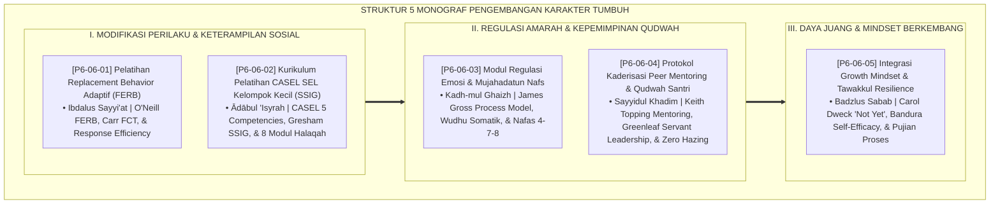

# P6-06: DOKUMEN INDUK STRATEGI PENGEMBANGAN KARAKTER DAN SEL
## *Arsitektur dan Rekayasa Strategi Pengembangan Karakter Positif, Pelatihan Replacement Behavior, Kurikulum CASEL SEL SSIG, Regulasi Emosi Mujahadah, Kaderisasi Peer Mentoring Qudwah, Serta Growth Mindset & Tawakkul Resilience (FERB Training Form PRB, CASEL SEL Small-Group Form KPS, Emotion Regulation Form REM, Peer Mentoring Form PKP, Serta Growth Mindset Form GTR) di Ekosistem TUMBUH Pesantren*

**Nomor Identifikasi**: `P6-06/DOKUMEN-INDUK-PENGEMBANGAN-KARAKTER-SEL/2026`  
**Domain**: `06 Intervention Framework` > `06 Developmental Strategies` (Gugus Sub-Domain 06: *Comprehensive Character Development, CASEL SEL Integration, & Cadre Leadership Cultivation*)  
**Klasifikasi Naskah**: *Master Architecture & Navigation Monograph* (Dokumen Induk Peta Jalan Riset & Navigasi 5 Monograf Ilmiah Strategi Pengembangan Karakter dan Kompetensi Sosio-Emosional)  
**Rumpun Disiplin Pengkaji**: Social-Emotional Learning (CASEL), Modifikasi Perilaku Kognitif (FERB/ABA), Kepemimpinan Pelayan (*Servant Leadership*), Fiqh Tahdzibil Akhlaq  

---

> ### 💡 INTISARI EKSEKUTIF (EXECUTIVE SUMMARY)
>
> * **Kedudukan Strategis Gugus Strategi Pengembangan Karakter dan SEL:**  
>   Gugus *Developmental Strategies (Strategi Pengembangan Karakter dan SEL)* merupakan motor pertumbuhan kapasitas diri santri (*The Capacity Growth Engine*) dalam ekosistem TUMBUH. Gugus ini memastikan bahwa santri tidak hanya dicegah dari berbuat buruk, melainkan secara aktif dibekali dengan keterampilan hidup, kematangan emosi, dan kepemimpinan luhur: **Pelatihan Replacement Behavior (Form PRB)**, **Kurikulum CASEL SEL SSIG (Form KPS)**, **Modul Regulasi Emosi Somatik (Form REM)**, **Kaderisasi Peer Mentoring Qudwah (Form PKP)**, dan **Growth Mindset & Tawakkul (Form GTR)**.
> * **Integrasi Holistik Turats & Konsensus Sains Pengembangan Diri:**  
>   Gugus riset ini memadukan khazanah agung Islam tentang penghalusan jiwa (*Tahdzībul Akhlāq*), adab pergaulan (*Ādābul 'Isyrah*), menahan amarah (*Kadh-mul Ghaizh*), pemimpin pelayan (*Sayyidul Qaumi Khādimuhum*), dan tawakkul aktif (*Badzlus Sabab*) dengan konsensus sains dunia (*O'Neill FERB, CASEL 5 SEL, James Gross Emotion Regulation, Keith Topping Peer Mentoring, Carol Dweck Growth Mindset, dan Albert Bandura Self-Efficacy*).
> * **Struktur Lengkap 5 Berkas Monograf Riset Ilmiah:**  
>   Dokumen induk ini memetakan dan menghubungkan 5 berkas monograf penelitian akademik komprehensif (~145 KB total riset) yang menyajikan panduan role-play FERB, silabus 8 modul SSIG, protokol 5 langkah wudhu de-eskalasi somatik, sistem kakak asuh bersertifikat, dan instrumen refleksi The Power of Belum.

---

## 📑 PETA NAVIGASI LIMA MONOGRAF RISET STRATEGI PENGEMBANGAN KARAKTER

Berikut adalah daftar lengkap 5 monograf riset akademik dalam gugus **`06 Developmental Strategies`**:

---

## 📚 DESKRIPSI RINGKAS 5 BERKAS MONOGRAF

1. **[P6-06-01: Teknik Pelatihan Replacement Behavior Adaptif](file:///c:/xampp/htdocs/tumbuh/06%20Intervention%20Framework/06%20Developmental%20Strategies/P6-06-01-Teknik-Pelatihan-Replacement-Behavior-Adaptif.md)**  
   *Membahas metodologi pengajaran perilaku pengganti fungsional ekivalen, doktrin Ibdalus Sayyi'at bil Hasanat, model O'Neill FERB, Functional Communication Training (FCT), dan form Form PRB-Replacement.*
2. **[P6-06-02: Kurikulum Pelatihan CASEL SEL Kelompok Kecil](file:///c:/xampp/htdocs/tumbuh/06%20Intervention%20Framework/06%20Developmental%20Strategies/P6-06-02-Kurikulum-Pelatihan-CASEL-SEL-Kelompok-Kecil.md)**  
   *Membahas standarisasi modul bimbingan kelompok kecil 4-6 santri, doktrin Adabul 'Isyrah wa Huququl Ukhuwwah, 5 kompetensi CASEL SEL, model SSIG Frank Gresham, silabus 8 modul halaqah adab, dan form Form KPS-Kurikulum.*
3. **[P6-06-03: Modul Pengembangan Regulasi Emosi dan Mujahadah](file:///c:/xampp/htdocs/tumbuh/06%20Intervention%20Framework/06%20Developmental%20Strategies/P6-06-03-Modul-Pengembangan-Regulasi-Emosi-dan-Mujahadah.md)**  
   *Membahas standarisasi de-eskalasi amarah dan penstabilan sistem saraf vagus, doktrin Kadh-mul Ghaizh, James Gross Emotion Regulation Model, teknik wudhu somatik, pernafasan 4-7-8, dan form Form REM-Regulasi.*
4. **[P6-06-04: Protokol Kaderisasi Peer Mentoring dan Qudwah Santri](file:///c:/xampp/htdocs/tumbuh/06%20Intervention%20Framework/06%20Developmental%20Strategies/P6-06-04-Protokol-Kaderisasi-Peer-Mentoring-dan-Qudwah-Santri.md)**  
   *Membahas kaderisasi santri senior sebagai pelayan teladan tanpa feodalisme, doktrin Sayyidul Qaumi Khadimuhum, Keith Topping Peer Mentoring, Robert Greenleaf Servant Leadership, larangan perpeloncoan mutlak, dan form Form PKP-Mentoring.*
5. **[P6-06-05: Integrasi Growth Mindset dan Tawakkul Resilience](file:///c:/xampp/htdocs/tumbuh/06%20Intervention%20Framework/06%20Developmental%20Strategies/P6-06-05-Integrasi-Growth-Mindset-dan-Tawakkul-Resilience.md)**  
   *Membahas pembentukan daya lentur mental-spiritual menghadapi kegagalan, doktrin Badzlus Sabab ma'at Tawakkul, Carol Dweck Growth Mindset, The Power of Not Yet, Albert Bandura Self-Efficacy, dan form Form GTR-Mindset.*

---

## 🎯 STANDAR PENJAMINAN MUTU STRATEGI PENGEMBANGAN KARAKTER

Penerapan gugus **Strategi Pengembangan Karakter dan SEL (Developmental Strategies)** menjamin bahwa:
1. **Santri Memiliki Perilaku Alternatif Adaptif untuk Setiap Tantangan Hidup (*Equipped with Functional Life Skills*)**: Menghilangkan respons agresi dan kekacauan emosional melalui keterampilan komunikasi asertif.
2. **Kecerdasan Sosial dan Pengendalian Emosi Tertanam Kuat (*High Emotional & Social Maturity*)**: Santri mampu mengendalikan amarah, berempati kepada sesama, dan menyelesaikan konflik secara damai.
3. **Lahirnya Pemimpin Santri yang Berjiwa Pelayan dan Pantang Menyerah (*Resilient Servant Leaders*)**: Santri senior mendampingi adik kelas dengan penuh cinta, dan seluruh santri memiliki mentalitas pejuang peradaban berdaya juang tinggi.
