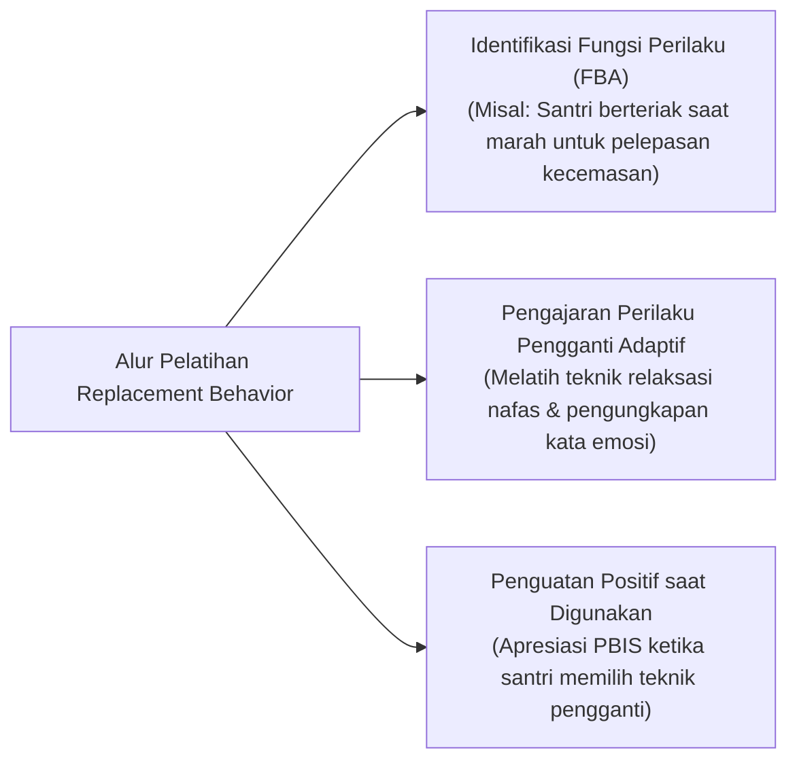

# P6-06: Strategi Pengembangan Karakter dan Pelatihan Replacement Behavior

## Status Dokumen
* **Status**: 🌟 **A+ (Tervalidasi & Siap Diimplementasikan)**
* **Sub-Domain**: `06 Intervention Framework / 06 Developmental Strategies`
* **Penanggung Jawab Keilmuan**: Dewan Keilmuan TUMBUH (*Pakar Neurosains Perkembangan & Pakar Bimbingan Konseling*)

---

## 1. Konseptualisasi Replacement Behavior Training

Dalam kerangka PBIS, melarang perilaku salah saja tidak cukup. Musyrif dan Konselor BK wajib mengajarkan **Perilaku Pengganti Positif (*Replacement Behavior*)** yang memenuhi fungsi kebutuhan emosional santri secara adaptif.

---

## 2. Modul Pelatihan CASEL SEL dalam Kelompok Kecil

- **Modul Regulasi Amarah (*Mujahadah*)**: Melatih santri mengenali sinyal fisik emosi amarah (detak jantung cepat) dan mempraktikkan wudhu/berpindah posisi sesuai Sunnah.
- **Modul Komunikasi Assertif Restoratif**: Melatih santri mengungkapkan ketidaksetujuan secara santun tanpa menggunakan kata-kata kasar.
