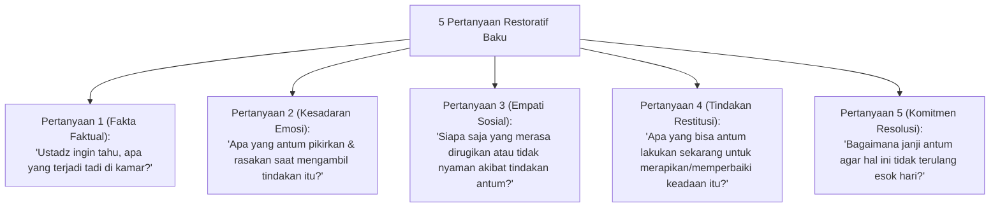

# P6-07-01: Panduan Praktis Restorative Chat 5-Pertanyaan

## Status Dokumen
* **Status**: 🌟 **A+ (Tervalidasi & Siap Diimplementasikan)**
* **Sub-Domain**: `06 Intervention Framework / 07 Corrective Strategies`
* **Penanggung Jawab Keilmuan**: Dewan Keilmuan TUMBUH (*Pakar Arsitektur PBIS Restoratif & Pakar Bimbingan Konseling*)

---

## 1. Naskah Baku Restorative Chat (5-Pertanyaan Restoratif)

Restorative Chat adalah alat pembinaan utama Musyrif Kamar untuk menangani pelanggaran minor secara pribadi tanpa luapan emosi:

---

## 2. Sikap Tubuh & Suara Musyrif

- Posisi duduk sejajar (mata saling bertatap lembut).
- Suara tenang tanpa intonasi membentak atau menyindir.
- Memberikan waktu santri berpikir dan menjawab tanpa diinterupsi.
