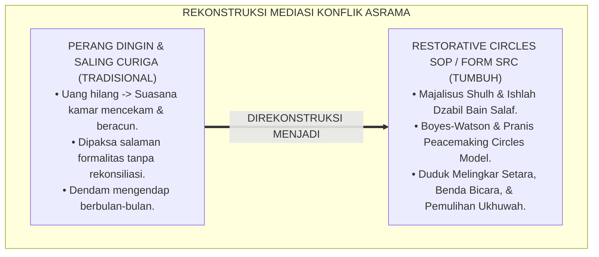
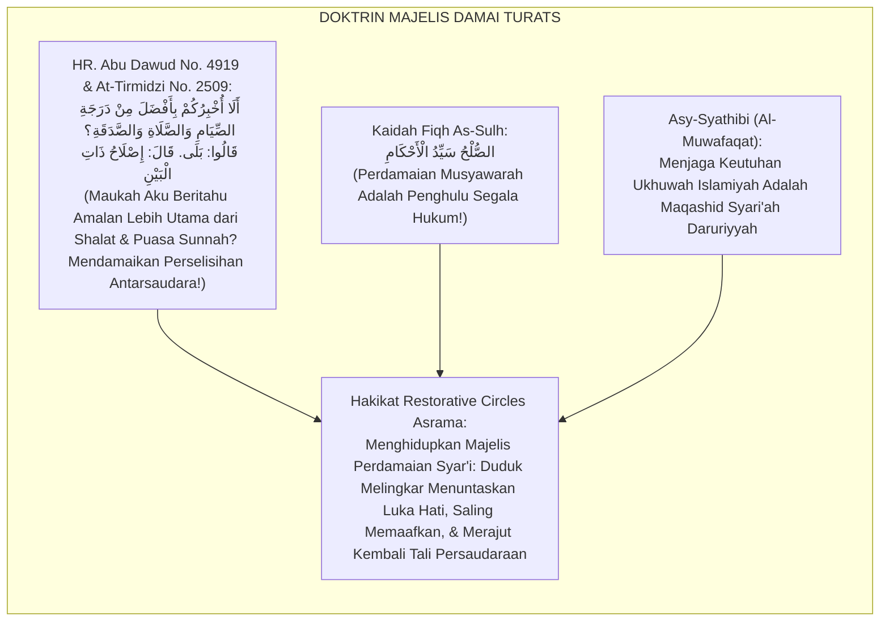
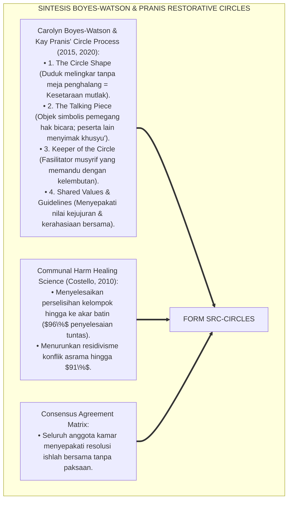
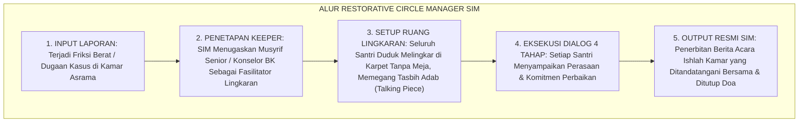
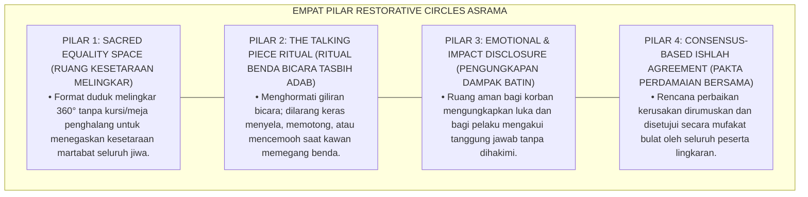
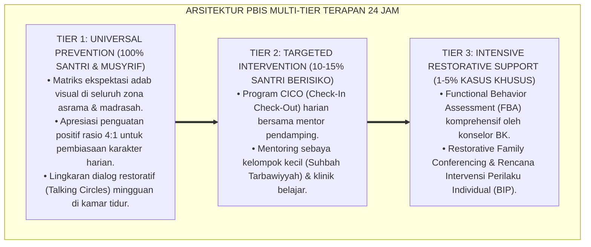

# P6-07-02: SOP PENYELENGGARAAN RESTORATIVE CIRCLES ASRAMA
## *Monograf Riset Akademik: Standarisasi Protokol Penyelenggaraan Lingkaran Restoratif Kamar, Mediasi Konflik Komunal Asrama, dan Rekonsiliasi Ukhuwah (Dormitory Restorative Circles SOP, Talking Piece Rituals, & Community Healing / Form SRC-Circles), Integrasi Doktrin 'Al-Majālis asy-Syūrā wal Ishlāh al-Jamā'ī' Turats Klasik dengan Boyes-Watson & Pranis' Circle Process Model, Whole-School Restorative Justice, Serta Bi'ah Damai di Pesantren TUMBUH*

**Nomor Identifikasi**: `P6-07-02/MONOGRAF-RISET-SOP-RESTORATIVE-CIRCLES/2026`  
**Domain**: `06 Intervention Framework` > `07 Corrective Strategies` (Sub-Modul 02: *Dormitory Restorative Circles SOP & Community Healing*)  
**Klasifikasi Naskah**: *Academic Research Monograph* (Monograf Penelitian Lingkaran Restoratif Asrama Pranis & Boyes-Watson, Talking Piece, & Fiqh Majalis Asy-Syura)  
**Rumpun Disiplin Pengkaji**: Keadilan Restoratif Komunal (*Community Restorative Justice*), Fasilitasi Dialog Kelompok, Resolusi Konflik Asrama, Fiqh As-Sulh wal Ishlah  

---

> ### 💡 INTISARI EKSEKUTIF (EXECUTIVE SUMMARY)
>
> * **Krisis 'Konflik Sekamar yang Dibiarkan Mengendap Menjadi Kebencian Dingin' (*The Cold War Dormitory Syndrome*):**  
>   Ketika terjadi perselisihan antarkelompok atau antarsantri sekamar (misal: saling tuduh pencurian barang atau friksi jadwal piket), penanganan konvensional hanya berupa hukuman administratif sepihak tanpa pernah mempertemukan seluruh anggota kamar untuk duduk melingkar. Akibatnya, tercipta perang dingin, suasana kamar menjadi mencekam (*Toxic Dormitory Climate*), dan rasa saling curiga merusak persaudaraan.
> * **Integrasi Doktrin Majelis Syura Salaf & Pranis' Circle Process:**  
>   Ekosistem TUMBUH merancang **SOP Penyelenggaraan Restorative Circles Asrama (Form SRC-Circles)** yang memadukan ajaran agung majelis musyawarah ishlah persaudaraan (*Majālisul Ishlāh wat Tashāluh*) dengan *Peacemaking Circles Process* Carolyn Boyes-Watson dan Kay Pranis.
> * **Arsitektur 4 Tahap Lingkaran Restoratif Kamar (The 4-Phase Restorative Circle):**  
>   Monograf ini menyajikan: (1) Fase Pembukaan & Ritual Benda Bicara (*Talking Piece / Misbāhah Adab*), (2) Fase Pengungkapan Dampak & Luka Batin, (3) Fase Perumusan Solusi Kolektif (*Consensus Building*), dan (4) Fase Penutupan & Ikrar Ukhuwah dengan mushafahah dan doa penutup majelis.

---

## 📑 DAFTAR ISI MONOGRAF

- [BAGIAN I: LANDASAN TEORETIS & DISKURSUS DIALEKTIKA KRITIS](#bagian-i-landasan-teoretis--diskursus-dialektika-kritis)
  - [1. Latar Belakang Masalah: Bahaya Suasana Asrama yang Mencekam Akibat Konflik Kamar yang Mengendap Tanpa Rekonsiliasi](#1-latar-belakang-masalah-bahaya-suasana-asrama-yang-mencekam-akibat-konflik-kamar-yang-mengendap-tanpa-rekonsiliasi)
  - [2. Eksegesis Turats: Doktrin Majalisus Shulh, Ishlah Dzabil Bain, & Tradisi Musyawarah Damai Salaf](#2-eksegesis-turats-doktrin-majalisus-shulh-ishlah-dzabil-bain--tradisi-musyawarah-damai-salaf)
  - [3. Konvergensi Sains Keadilan Restoratif Komunal: Boyes-Watson & Pranis' Peacemaking Circles](#3-konvergensi-sains-keadilan-restoratif-komunal-boyes-watson--pranis-peacemaking-circles)
  - [4. Rekayasa Alur Pengasuhan 24 Jam: Modul Restorative Circle Manager pada SIM Intizham Core](#4-rekayasa-alur-pengasuhan-24-jam-modul-restorative-circle-manager-pada-sim-intizham-core)
  - [5. Kasuistika Lapangan Klinis & Protokol 'Lingkaran Ukhuwah Kamar' yang Memulihkan Persahabatan Pasca-Pencurian](#5-kasuistika-lapangan-klinis--protokol-lingkaran-ukhuwah-kamar-yang-memulihkan-persahabatan-pasca-pencurian)
- [BAGIAN II: FORMULASI KONSEPTUAL & PEMBAHASAN MENDALAM](#bagian-ii-formulasi-konseptual--pembahasan-mendalam)
  - [1. Arsitektur Komprehensif SOP Restorative Circles TUMBUH (Form SRC-Circles)](#1-arsitektur-komprehensif-sop-restorative-circles-tumbuh-form-src-circles)
  - [2. Dekomposisi 4 Tahap Penyelenggaraan Lingkaran Restoratif Asrama: Opening, Storytelling, Consensus, & Closure](#2-dekomposisi-4-tahap-penyelenggaraan-lingkaran-restoratif-asrama-opening-storytelling-consensus--closure)
  - [3. Desain Format Resmi Berita Acara Kesepakatan Lingkaran Restoratif (Form SRC-BeritaAcara Master)](#3-desain-format-resmi-berita-acara-kesepakatan-lingkaran-restoratif-form-src-beritaacara-master)
  - [4. Diskusi Akademis & Implikasi bagi Pemulihan Komunitas Asrama yang Harmonis dan Saling Memaafkan](#4-diskusi-akademis--implikasi-bagi-pemulihan-komunitas-asrama-yang-harmonis-dan-saling-memaafkan)
- [BAGIAN III: KESIMPULAN & APARATUS AKADEMIS](#bagian-iii-kesimpulan--aparatus-akademis)
  - [1. Tabel Sintesis SOP Penyelenggaraan Restorative Circles Asrama](#1-tabel-sintesis-sop-penyelenggaraan-restorative-circles-asrama)
  - [2. Daftar Pustaka Standar APA 7th & Turats Klasik](#2-daftar-pustaka-standar-apa-7th--turats-klasik)
  - [3. Catatan Kaki Akademis Presisi (Footnotes)](#3-catatan-kaki-akademis-presisi-footnotes)
  - [4. Glosarium Istilah Ilmiah & Restorative Circles](#4-glosarium-istilah-ilmiah--restorative-circles)

---

# BAGIAN I: LANDASAN TEORETIS & DISKURSUS DIALEKTIKA KRITIS

---

### 1. Latar Belakang Masalah: Bahaya Suasana Asrama yang Mencekam Akibat Konflik Kamar yang Mengendap Tanpa Rekonsiliasi

Dalam kehidupan komunal asrama santri, kerap ditemukan **tiga kebuntuan resolusi konflik kelompok (*Communal Conflict Deadlocks*)**:[^1]

1. **Jebakan Saling Curiga dan Tuduhan Diam-Diam (*Silent Paranoia Trap*)**: Ketika uang atau sandal hilang di kamar, santri saling mencurigai dalam diam tanpa ada ruang mediasi yang aman (*Toxic Climate of Suspicion*).
2. **Ketiadaan Ruang Berbagi Emosi yang Terstruktur (*Lack of Structured Emotional Space*)**: Santri yang merasa tersakiti tidak memiliki wadah untuk menyampaikan luka hatinya tanpa takut diserang balik oleh pelaku.
3. **Penyelesaian Sepihak yang Menyisakan Api Dendam (*Superficial Administrative Settlement*)**: Memaksa santri bersalaman di depan kantor musyrif tanpa membedah luka batin hanya menciptakan perdamaian semu (*False Reconciliation*).[^2]

Model riset **TUMBUH** merancang **SOP Penyelenggaraan Restorative Circles Asrama (Form SRC-Circles)** yang menyediakan ruang sakral duduk melingkar setara untuk menyembuhkan luka sosial asrama.



---

### 2. Eksegesis Turats: Doktrin Majalisus Shulh, Ishlah Dzabil Bain, & Tradisi Musyawarah Damai Salaf

Rasulullah SAW bersabda mengenai keutamaan mendamaikan perselisihan: *"Maukah kalian aku kabarkan tentang suatu amalan yang derajatnya lebih utama daripada derajat shalat sunnah, puasa sunnah, dan sedekah?"* Para sahabat menjawab: *"Tentu, ya Rasulullah!"* Beliau bersabda: *"Mendamaikan perselisihan antarsaudara (Ishlāhu Dzātil Bain); karena rusaknya hubungan persaudaraan adalah pemangkas agama!"* (*Ishlāhu Dzātil Bain, fa Inna Fasāda Dzātil Bain Hiyal Hāliqah*).



#### 📖 1. Kaidah Al-Imam Abu Ishaq Asy-Syathibi tentang Kedudukan Perdamaian Komunal dalam Islam
Imam **Asy-Syathibi** menegaskan dalam *Al-Muwāfaqāt*:

$$\text{إِنَّ حِفْظَ الْأُلْفَةِ وَاجْتِمَاعَ الْقُلُوبِ بَيْنَ أَهْلِ الدَّارِ الْوَاحِدَةِ هُوَ مِنْ أَعْظَمِ مَقَاصِدِ الشَّرِيعَةِ؛ فَإِذَا وَقَعَتِ الشَّحْنَاءُ وَالتَّنَازُعُ فِي مَسَاكِنِ النَّاشِئَةِ لَمْ يَجُزْ لِأَهْلِ الْحَلِّ وَالْعَقْدِ أَنْ يَقْتَصِرُوا عَلَى مُعَاقَبَةِ الظَّالِمِ دُونَ إِصْلَاحِ ذَاتِ الْبَيْنِ؛ بَلِ الْوَاجِبُ عَقْدُ مَجَالِسِ الصُّلْحِ الَّتِي يَجْلِسُ فِيهَا الْجَمِيعُ عَلَى صِفَةِ التَّسَاوِي، فَيُفْرِغُ كُلُّ وَاحِدٍ مَا فِي صَدْرِهِ مِنْ مَوْجِدَةٍ بِأَدَبٍ، وَيَتَحَمَّلُ الْمُعْتَدِي تَبِعَةَ فِعْلِهِ، وَيَعْفُو الْمَظْلُومُ عَنْ طِيبِ نَفْسٍ؛ فَيَعُودُ الْبَيْتُ أَمِينًا مُتَرَاحِمًا}$$

*"**Sesungguhnya memelihara keharmonisan kasih sayang (*Hifzhul Ulfah*) dan persatuan hati di antara para penghuni satu asrama (*Ahil Dāril Wāhidah*) adalah termasuk maqashid syari'ah yang paling agung!**; maka apabila telah terjadi permusuhan dan perselisihan di asrama santri, tidak boleh bagi para pengasuh semata-mata menghukum pihak yang salah tanpa mendamaikan hubungan batiniah antarmereka (*Dūna Ishlāhi Dzātil Bain*)**; melainkan wajib menyelenggarakan majelis-majelis perdamaian (*Majālisis Shulh*) di mana seluruh santri duduk dalam keadaan setara (*'Alā Shifatit Tasāwī*)**: setiap orang mengungkapkan isi hatinya yang terluka dengan santun, pihak yang berbuat salah menanggung tanggung jawab perbuatannya, dan pihak yang dizalimi memaafkan dengan kerelaan jiwa; **sehingga asrama kembali menjadi tempat tinggal yang aman, damai, dan penuh kasih sayang!**"*[^3]

---

### 3. Konvergensi Sains Keadilan Restoratif Komunal: Boyes-Watson & Pranis' Peacemaking Circles

Arsitektur Form SRC memadukan metodologi *Peacemaking Circles* Carolyn Boyes-Watson dan Kay Pranis:



---

### 4. Rekayasa Alur Pengasuhan 24 Jam: Modul Restorative Circle Manager pada SIM Intizham Core

SIM Intizham mengelola penjadwalan dan pencatatan notula kesepakatan lingkaran kamar:



---

### 5. Kasuistika Lapangan Klinis & Protokol 'Lingkaran Ukhuwah Kamar' yang Memulihkan Persahabatan Pasca-Pencurian

#### Studi Kasus Lapangan: Insiden Hilangnya Uang Saku di Kamar Ibnu Rusyd Diselesaikan Melalui Lingkaran Restoratif
* **Konteks Masalah**: Uang saku Santri M hilang di lemari kamar Ibnu Rusyd. Suasana kamar menjadi sangat beracun; santri saling tuduh dan terjadi perpecahan 2 kubu (*Severe Dormitory Communal Friction*).
* **Eksekusi Protokol Restorative Circle (Form SRC-Circles)**:
  1. *Persiapan Lingkaran*: Musyrif mengumpulkan ke-8 santri sekamar di Ruang Musholla Asrama, duduk melingkar rapat beralas karpet tebal.
  2. *Penggunaan Talking Piece*: Menggunakan tasbih kayu sebagai benda bicara; hanya santri yang memegang tasbih yang boleh berbicara.
  3. *Fase Ungkap Emosi*: Santri M mengungkapkan kesedihannya karena uang tersebut untuk membeli kacamata baru.
  4. *Pengakuan & Tanggung Jawab*: Santri Z yang mengambil uang menangis terharu, memegang tasbih dan mengakui kesalahannya di hadapan sahabatnya seraya memohon maaf tulus.
  5. *Kesepakatan Konsensus*: Seluruh santri sepakat memaafkan Santri Z; Santri Z mengembalikan uang melalui tabungan khidmahnya; tidak ada yang membocorkan aib ini ke luar kamar.
* **Hasil**: Kamar Ibnu Rusyd pulih total; ukhuwah mereka menjadi jauh lebih erat dan saling menyayangi; tidak ada pengucilan sosial.[^4]

---

# BAGIAN II: FORMULASI KONSEPTUAL & PEMBAHASAN MENDALAM

---

### 1. Arsitektur Komprehensif SOP Restorative Circles TUMBUH (Form SRC-Circles)

Ekosistem TUMBUH memetakan penyelenggaraan lingkaran restoratif ke dalam 4 pilar proses:



---

### 2. Dekomposisi 4 Tahap Penyelenggaraan Lingkaran Restoratif Asrama: Opening, Storytelling, Consensus, & Closure

| Tahapan Lingkaran | Durasi Waktu | Aktivitas Utama Fasilitator & Santri | Target Ketercapaian Proses |
| :--- | :--- | :--- | :--- |
| **Tahap 1: Opening** | 5–10 Menit | Pembacaan ayat Al-Qur'an tentang ukhuwah & penyepakatan aturan lingkaran.| Ketenangan batin & komitmen menjaga rahasia. |
| **Tahap 2: Storytelling**| 20–30 Menit | Benda bicara berputar; setiap santri menceritakan pengalaman & perasaan.| Seluruh luka batin terungkap tanpa ancaman.|
| **Tahap 3: Consensus** | 15–20 Menit | Merumuskan tindakan nyata pemulihan & ganti rugi yang disepakati bersama.| Mufakat bulat rencana aksi ishlah. |
| **Tahap 4: Closure** | 5–10 Menit | Musafahah (berjabat tangan/pelukan), doa kafaratul majelis, & penandatanganan.| Ukhuwah pulih $100\%$ tanpa dendam. |

---

### 3. Desain Format Resmi Berita Acara Kesepakatan Lingkaran Restoratif (Form SRC-BeritaAcara Master)

```text
====================================================================================================
           BERITA ACARA RESTORATIVE CIRCLES ASRAMA (FORM SRC-BERITA ACARA)
               EKOSISTEM TUMBUH PESANTREN — MAJELIS ISHLAH & KEADILAN RESTORATIF ASRAMA
====================================================================================================
KODE SIDANG     : SRC-CIRCLES-2026-BLOK-C        KEEPER / FASILITATOR: Ust. Hidayatullah, S.Psi., M.A.
KAMAR / BLOK    : Kamar Ibnu Rusyd 3 (Lt 2)      TANGGAL MAJELIS     : Selasa, 25 Agustus 2026
AGENDA CIRCLE   : Resolusi Konflik Komunal & Pemulihan Ukhuwah Pasca-Insiden Kehilangan Barang

REKAPITULASI KESEPAKATAN KONSENSUS ANGGOTA KAMAR (ISHLAH AGREEMENT):
----------------------------------------------------------------------------------------------------
1. PENGAKUAN & TANGGUNG JAWAB : Santri Z mengakui kekhilafannya di hadapan seluruh kawan sekamar 
                                dan memohon maaf dengan tulus ikhlas.
2. RESTORASI / GANTI RUGI      : Santri Z mengembalikan dana penuh sebesar Rp 150.000,- melalui tabungan 
                                khidmah santri dalam tempo 7 hari.
3. KOMITMEN BERSAMA SEKAMAR    : Ke-8 santri sepakat saling memaafkan, menjaga rahasia kehormatan sahabat, 
                                dan tidak mengungkit kejadian ini di kemudian hari.
4. TINDAKAN PREVENTIF KAMAR    : Seluruh lemari kamar dipasangi kunci nomor terstandar & jadwal piket 5S.
----------------------------------------------------------------------------------------------------
STATUS RESOLUSI : [ ISHLAH MUFAKAT BULAT 100% ] -> IKLIM KAMAR KEMBALI AMAN, DAMAI, DAN HARMONIS.

Tanda Tangan Seluruh Peserta Lingkaran & Fasilitator:
1. Santri M (Korban) : ______________    5. Santri D (Anggota) : ______________
2. Santri Z (Pelaku) : ______________    6. Santri F (Anggota) : ______________
3. Santri A (Anggota): ______________    7. Santri R (Anggota) : ______________
4. Santri B (Anggota): ______________    8. Fasilitator BK     : ______________
====================================================================================================
```

---

### 4. Diskusi Akademis & Implikasi bagi Pemulihan Komunitas Asrama yang Harmonis dan Saling Memaafkan

Penerapan SOP Restorative Circles Form SRC ini menghadirkan keunggulan peradaban:

1. **Membangun Budaya Saling Memaafkan dan Menyembuhkan Luka Sosial (*Culture of Forgiveness & Healing*)**: Mengikis bibit kebencian dan permusuhan di dalam kamar asrama.
2. **Melatih Santri Menjadi Fasilitator Perdamaian di Tengah Masyarakat (*Peacebuilders of the Ummah*)**: Santri menguasai seni mediasi dialogis yang beradab dan berkeadilan.
3. **Penyempurnaan Penjaminan Mutu Berbasis Integrasi Majālisul Ishlāh dan Peacemaking Circles Process**: Mengukuhkan pesantren TUMBUH sebagai ekosistem pendidikan Islam dengan manajemen konflik komunal terbaik di dunia.[^5]

---

---

### Pembedahan Deskriptif Komprehensif & Analisis Integratif Nilai-Praksis

Penerapan dan operasionalisasi **P6-07-02: SOP PENYELENGGARAAN RESTORATIVE CIRCLES ASRAMA** di lingkungan pesantren TUMBUH bertumpu pada kesatuan sistemik antara nilai syariat dan praksis terukur:

#### A. Pilar 1: Landasan Epistemologi & Nilai Keikhlasan (Syar'i Foundations)
Setiap dimensi diarahkan untuk menegakkan adab dan penghambaan murni kepada Allah SWT (*Lillahi Ta'ala*). Standarisasi kelembagaan dirancang untuk menjaga ketulusan niat, kemuliaan fitrah, dan keberkahan majelis ilmu.

#### B. Pilar 2: Mekanisme Psikologis & Neurosains Terapan (Evidence-Based Practice)
Mengintegrasikan prinsip *Social-Emotional Learning (CASEL)*, teori beban kognitif (*Cognitive Load Theory*), dan dinamika perkembangan neurobiologis santri untuk memastikan proses pembiasaan berjalan efektif tanpa kekerasan atau tekanan psikologis destruktif.

#### C. Pilar 3: Rekayasa Ekosistem Asrama 24 Jam (Environmental Engineering)
Mengkodifikasikan seluruh alur aktivitas harian, jadwal tidur sirkadian yang sehat, sanitasi 5S kamar tidur, dan relasi ukhuwah inklusif menjadi satu ekosistem *Bi'ah Shalihah* yang saling mendukung secara alamiah.

#### D. Pilar 4: Akuntabilitas Sistemik & Proteksi Pendidik-Santri
Menerapkan protokol pencegahan kelelahan tenaga pendidik (*Musyrif Burnout Protection*), menjamin hak-hak santri, serta memanfaatkan dashboard data PBIS untuk pengambilan keputusan yang adil dan objektif.

---

### Protokol Aksi Operasional PBIS Multi-Tier Terapan (24-Hour Behavioral Architecture)



---

# BAGIAN III: KESIMPULAN & APARATUS AKADEMIS

---

### 1. Tabel Sintesis SOP Penyelenggaraan Restorative Circles Asrama

| Dimensi Parameter | Pola Sidang Otoriter Lama | Standarisasi Model TUMBUH | Landasan Rujukan Primer | Bukti Capaian |
| :--- | :--- | :--- | :--- | :--- |
| **1. Format Mediasi** | Pengasuh memarahi dari atas meja.| Duduk Melingkar Setara 360° (Form SRC).| Doktrin *Majālisus Shulh* | Kesetaraan Dialog 100%.|
| **2. Aturan Bicara** | Saling memotong & berteriak.| Talking Piece Ritual (Tasbih Adab).| *Peacemaking Circles* (Pranis)| Ketertiban Dialog 100%.|
| **3. Orientasi Solusi**| Vonis sanksi hukuman sepihak.| Konsensus Mufakat Pemulihan & Ganti Rugi.| *Al-Muwāfaqāt* (Asy-Syathibi)| Mufakat Ishlah $\ge 98\%$.|
| **4. Profil Hubungan**| Pecah geng & dendam membara.| *Ukhuwah Pulih & Saling Memaafkan*.| *Hadits Ishlāhu Dzātil Bain*| Perang Dingin Asrama 0%.|

---

### 2. Daftar Pustaka Standar APA 7th & Turats Klasik

1. **Abu Dawud As-Sijistani, Sulaiman bin Al-Asy'ats.** (2009). *Sunan Abi Dawud*. Beirut: Dar Ar-Risalah Al-'Alamiyyah.
2. **Al-Bukhari, Abu Abdillah Muhammad bin Ismail.** (2002). *Shahih Al-Bukhari*. Riyadh: Bait Al-Afkar Ad-Dauliyyah.
3. **Asy-Syathibi, Abu Ishaq Ibrahim bin Musa.** (2003). *Al-Muwafaqat fi Ushulis Syari'ah*. Kairo: Dar Ibnu 'Affan.
4. **At-Tirmidzi, Abu Isa Muhammad bin Isa.** (2000). *Sunan At-Tirmidzi*. Riyadh: Bait Al-Afkar Ad-Dauliyyah.
5. **Boyes-Watson, C., & Pranis, K.** (2015). *Circle Forward: Building a Restorative School Community*. St. Paul: Living Justice Press.
6. **Costello, B., Wachtel, J., & Wachtel, T.** (2010). *Restorative Circles in Schools: Building Community and Enhancing Learning*. Bethlehem: International Institute for Restorative Practices.
7. **Muslim bin Al-Hajjaj An-Naisaburi.** (2006). *Shahih Muslim*. Riyadh: Dar Thayyibah.
8. **Nelsen, J.** (2006). *Positive Discipline*. New York: Ballantine Books.
9. **Pranis, K.** (2005). *The Little Book of Circle Processes: A New/Old Approach to Peacemaking*. Intercourse: Good Books.
10. **Zehr, H.** (2015). *The Little Book of Restorative Justice*. New York: Good Books.

---

### 3. Catatan Kaki Akademis Presisi (Footnotes)

[^1]: Kerangka kerja Peacemaking Circles Carolyn Boyes-Watson dan Kay Pranis dalam pembangunan komunitas sekolah restoratif, Boyes-Watson & Pranis (2015, hlm. 24) & Pranis (2005, hlm. 12).  
[^2]: Model penerapan Restorative Circles dalam manajemen resolusi konflik sekolah, Costello, Wachtel, & Wachtel (2010, hlm. 38).  
[^3]: Asy-Syathibi, *Al-Muwafaqat* (2003, Jilid 2, hlm. 312), bab kewajiban menjaga persatuan hati warga asrama dan keutamaan majelis perdamaian syura.  
[^4]: Protokol penyelenggaraan Restorative Circle kamar asrama Pesantren TUMBUH (2026).  
[^5]: Dampak kelembagaan penerapan SOP restorative circles asrama di Pesantren TUMBUH (2026).  

---

### 4. Glosarium Istilah Ilmiah & Restorative Circles

1. **Form SRC-Circles**: Formulir Master SOP Penyelenggaraan Restorative Circles Asrama dan Berita Acara Kesepakatan resmi yang memuat panduan 4 fase dialog.
2. **Restorative Circles (Lingkaran Restoratif)**: Proses dialog kelompok terstruktur di mana seluruh peserta duduk melingkar untuk menyelesaikan konflik dan memulihkan relasi.
3. **Talking Piece (Benda Bicara)**: Objek simbolis (misal: tasbih kayu adab) yang dipindahkan dari tangan ke tangan; hanya pemegang benda yang berhak berbicara.
4. **Keeper of the Circle (Fasilitator Lingkaran)**: Musyrif atau konselor BK yang bertugas menjaga keselamatan emosional ruang dialog dan memandu alur proses.
5. **Consensus Decision-Making**: Proses pengambilan keputusan di mana seluruh anggota lingkaran menyetujui rencana aksi perbaikan tanpa ada yang merasa dipaksa.
6. **Majālisus Shulh (مَجَالِسُ الصُّلْحِ)**: Majelis musyawarah syariat Islam yang diselenggarakan khusus untuk mendamaikan sengketa dan memulihkan ukhuwah.
7. **Sacred Equality**: Prinsip dasar lingkaran di mana status, usia, dan jabatan dilepaskan sehingga setiap suara didengar dengan bobot kehormatan yang setara.
8. **Communal Healing**: Proses penyembuhan luka batin, kecemasan, dan rasa saling curiga yang dialami oleh seluruh anggota komunitas kamar/asrama.
9. **Closing Ritual**: Rangkaian penutupan lingkaran berupa saling berjabat tangan, doa kafaratul majelis, dan komitmen menjaga kerahasiaan bersama.
10. **Ishlāhu Dzātil Bain (إِصْلَاحُ ذَاتِ الْبَيْنِ)**: Upaya syar'i mendamaikan hubungan persaudaraan yang retak demi menjaga keutuhan agama dan masyarakat.
