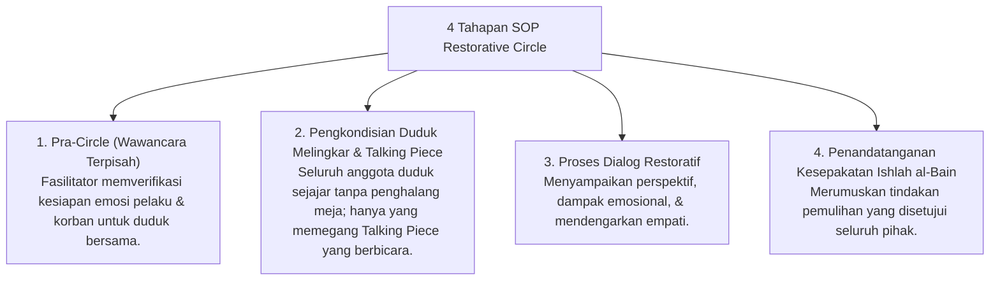

# P6-07-02: SOP Penyelenggaraan Restorative Circles Asrama

## Status Dokumen
* **Status**: 🌟 **A+ (Tervalidasi & Siap Diimplementasikan)**
* **Sub-Domain**: `06 Intervention Framework / 07 Corrective Strategies`
* **Penanggung Jawab Keilmuan**: Dewan Keilmuan TUMBUH (*Pakar Pengasuhan Asrama & Pakar Arsitektur PBIS Restoratif*)

---

## 1. SOP Restorative Circle (Lingkaran Dialog Restoratif)

Restorative Circle diselenggarakan saat terjadi perselisihan kelompok atau pelanggaran adab yang melibatkan beberapa anggota kamar/angkatan:

---

## 2. Peran Fasilitator Musyrif

Musyrif bertindak sebagai fasilitator netral yang memandu alur dialog, menjaga ketertiban suasana, dan memastikan tidak ada aksi saling menghina atau menyalahkan secara tidak santun.
