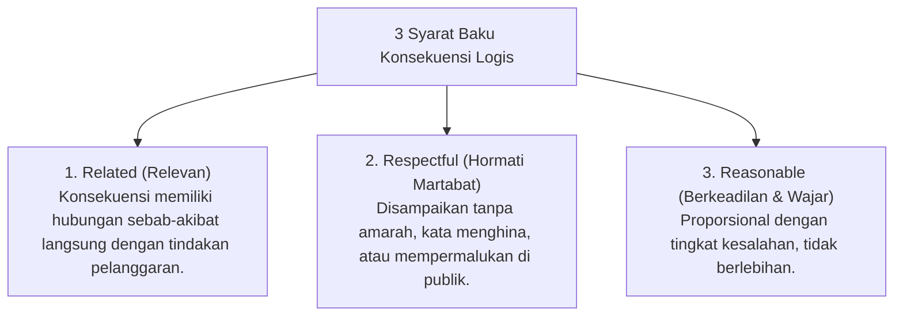

# P6-07-03: Penerapan Konsekuensi Logis dan Ishlah al-Bain

## Status Dokumen
* **Status**: 🌟 **A+ (Tervalidasi & Siap Diimplementasikan)**
* **Sub-Domain**: `06 Intervention Framework / 07 Corrective Strategies`
* **Penanggung Jawab Keilmuan**: Dewan Keilmuan TUMBUH (*Pakar Arsitektur PBIS Restoratif & Pakar Filosofi TUMBUH*)

---

## 1. Tiga Syarat Konsekuensi Logis (Logical Consequences)

Agar sebuah konsekuensi bersifat mendidik dan restoratif (*bukan hukuman punitive*), konsekuensi wajib memenuhi **3 Syarat Utama (3R)**:

---

## 2. Contoh Kasus Konsekuensi Logis vs Hukuman

- **Pelanggaran**: Santri menumpahkan makanan di lantai kamar saat bercanda.
- **Hukuman Punitive (Dilarang)**: Menyuruh santri lari keliling lapangan 10 kali atau memukul.
- **Konsekuensi Logis Restoratif (Diwajibkan)**: Santri membersihkan & mengepel lantai kamar yang kotor hingga bersih kembali (*Restitusi Faktual*).
