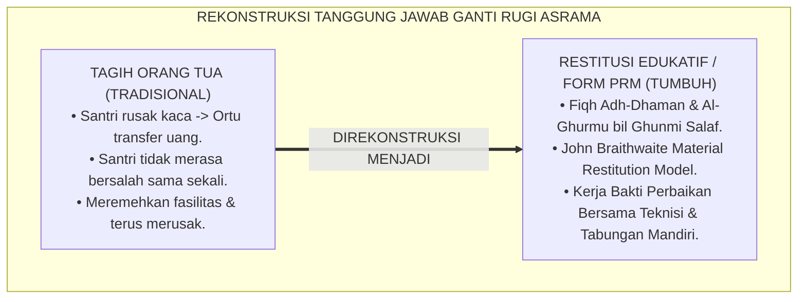
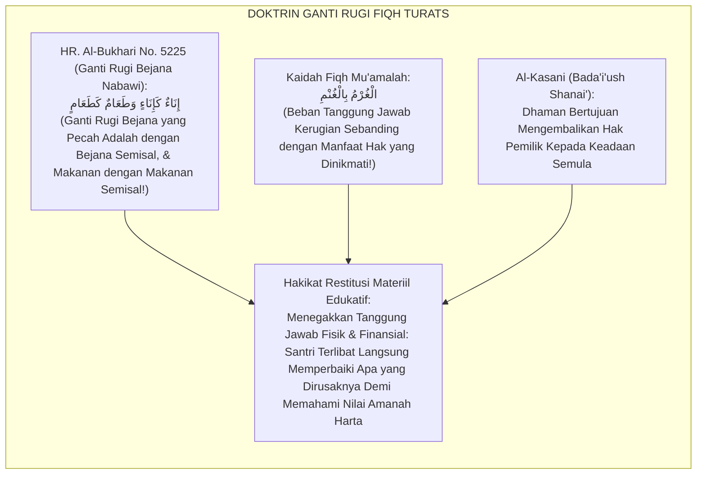
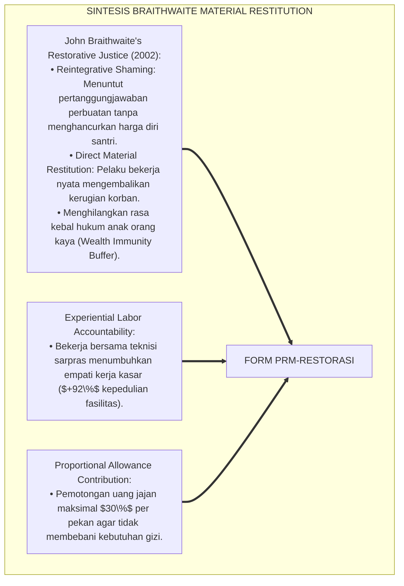
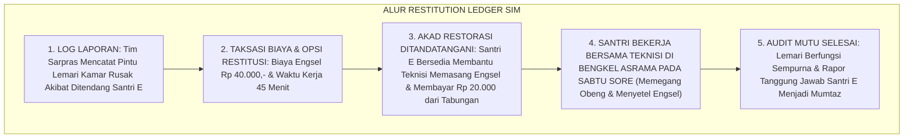
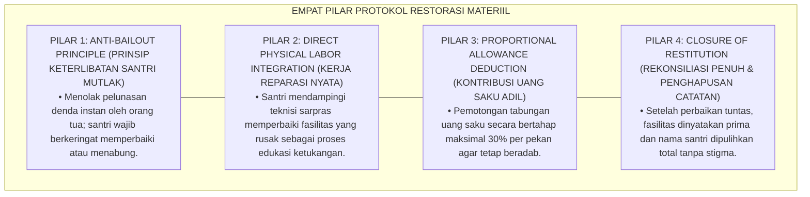

# P6-07-04: PROTOKOL RESTORASI KERUSAKAN MATERIIL DAN GANTI RUGI
## *Monograf Riset Akademik: Standarisasi Protokol Penegakan Tanggung Jawab Ganti Rugi Finansial dan Restitusi Fisik Terstruktur (Material Restitution Protocols, Property Repair Accountability, & Dhamānul 'Udwān / Form PRM-Restorasi), Integrasi Doktrin 'Al-Kharāju bidh-Dhamān wa Man Atlafa Syaian fa 'Alaihi 'Iwadhuh' Turats Klasik dengan Braithwaite's Restorative Reintegration & Material Restitution, Serta Keadilan Finansial di Pesantren TUMBUH*

**Nomor Identifikasi**: `P6-07-04/MONOGRAF-RISET-RESTORASI-KERUSAKAN-MATERIIL/2026`  
**Domain**: `06 Intervention Framework` > `07 Corrective Strategies` (Sub-Modul 04: *Material Restitution Protocols & Property Repair Accountability*)  
**Klasifikasi Naskah**: *Academic Research Monograph* (Monograf Penelitian Restitusi Materiil Braithwaite, Ganti Rugi Finansial Edukatif, & Fiqh Adh-Dhaman)  
**Rumpun Disiplin Pengkaji**: Keadilan Restoratif Finansial (*Restorative Financial Restitution*), Manajemen Aset & Fasilitas Pesantren, Psikologi Tanggung Jawab Harta, Fiqh Adh-Dhaman wal Itlaf  

---

> ### 💡 INTISARI EKSEKUTIF (EXECUTIVE SUMMARY)
>
> * **Krisis 'Orang Tua Membayar Denda Sementara Santri Tidak Merasakan Tanggung Jawab' (*The Wealthy Parent Bailout Dilemma*):**  
>   Ketika seorang santri merusak fasilitas asrama (seperti memecahkan kaca jendela atau merusak pintu lemari), praktik konvensional kerap hanya menagihkan denda ganti rugi kepada orang tua melalui transfer bank (*Parental Bailout*). Santri pelaku tidak mengeluarkan keringat sedikit pun, tidak belajar menghargai fasilitas umum (*Vandalism Indifference*), dan meremehkan harta orang tuanya.
> * **Integrasi Doktrin Fiqh Dhaman & Restorative Material Restitution:**  
>   Ekosistem TUMBUH merancang **Protokol Restorasi Kerusakan Materiil dan Ganti Rugi (Form PRM-Restorasi)** yang memadukan kaidah fiqh tanggung jawab ganti rugi perusakan (*Al-Itlāfu Yūjibudh Dhamān*) dan kemanfaatan menyertai resiko (*Al-Kharāju bidh-Dhamān*) dengan teori *Restorative Material Restitution* John Braithwaite.
> * **Arsitektur Tiga Skema Restitusi Edukatif:**  
>   Monograf ini menyajikan 3 skema: (1) Restitusi Fisik Langsung (*Direct Physical Repair Work* bersama teknisi), (2) Pemotongan Tabungan Uang Jajan Pribadi Mandiri (*Allowance Contribution Scheme*), dan (3) Proyek Khidmah Kompensasi Tenaga (*Community Service In-Lieu of Cash*).

---

## 📑 DAFTAR ISI MONOGRAF

- [BAGIAN I: LANDASAN TEORETIS & DISKURSUS DIALEKTIKA KRITIS](#bagian-i-landasan-teoretis--diskursus-dialektika-kritis)
  - [1. Latar Belakang Masalah: Bahaya Budaya 'Orang Tua yang Bayar' yang Mematikan Tanggung Jawab Santri](#1-latar-belakang-masalah-bahaya-budaya-orang-tua-yang-bayar-yang-mematikan-tanggung-jawab-santri)
  - [2. Eksegesis Turats: Doktrin Dhamanul Itlaf, Al-Ghurmu bil Ghunmi, & Fiqh Ganti Rugi Harta Salaf](#2-eksegesis-turats-doktrin-dhamanul-itlaf-al-ghurmu-bil-ghunmi--fiqh-ganti-rugi-harta-salaf)
  - [3. Konvergensi Sains Keadilan Restoratif Materiil: John Braithwaite's Restorative Reintegration & Material Restitution](#3-konvergensi-sains-keadilan-restoratif-materiil-john-braithwaites-restorative-reintegration--material-restitution)
  - [4. Rekayasa Alur Pengasuhan 24 Jam: Modul Restitution Ledger pada SIM Intizham Finance & Estate Core](#4-rekayasa-alur-pengasuhan-24-jam-modul-restitution-ledger-pada-sim-intizham-finance--estate-core)
  - [5. Kasuistika Lapangan Klinis & Protokol 'Restitusi Keringat' yang Mengubah Santri Perusak Fasilitas Menjadi Duta Sarpras](#5-kasuistika-lapangan-klinis--protokol-restitusi-keringat-yang-mengubah-santri-perusak-fasilitas-menjadi-duta-sarpras)
- [BAGIAN II: FORMULASI KONSEPTUAL & PEMBAHASAN MENDALAM](#bagian-ii-formulasi-konseptual--pembahasan-mendalam)
  - [1. Arsitektur Komprehensif Protokol Restorasi Materiil TUMBUH (Form PRM-Restorasi)](#1-arsitektur-komprehensif-protokol-restorasi-materiil-tumbuh-form-prm-restorasi)
  - [2. Dekomposisi 3 Skema Restitusi Edukatif: Direct Physical Repair, Allowance Deduction, & Community Service](#2-dekomposisi-3-skema-restitusi-edukatif-direct-physical-repair-allowance-deduction--community-service)
  - [3. Desain Format Resmi Surat Perjanjian Restorasi & Komitmen Ganti Rugi (Form PRM-Akad Master)](#3-desain-format-resmi-surat-perjanjian-restorasi--komitmen-ganti-rugi-form-prm-akad-master)
  - [4. Diskusi Akademis & Implikasi bagi Penanaman Nilai Amanah dan Penghargaan Terhadap Fasilitas Publik](#4-diskusi-akademis--implikasi-bagi-penanaman-nilai-amanah-dan-penghargaan-terhadap-fasilitas-publik)
- [BAGIAN III: KESIMPULAN & APARATUS AKADEMIS](#bagian-iii-kesimpulan--aparatus-akademis)
  - [1. Tabel Sintesis Protokol Restorasi Kerusakan Materiil dan Ganti Rugi](#1-tabel-sintesis-protokol-restorasi-kerusakan-materiil-dan-ganti-rugi)
  - [2. Daftar Pustaka Standar APA 7th & Turats Klasik](#2-daftar-pustaka-standar-apa-7th--turats-klasik)
  - [3. Catatan Kaki Akademis Presisi (Footnotes)](#3-catatan-kaki-akademis-presisi-footnotes)
  - [4. Glosarium Istilah Ilmiah & Restorasi Materiil](#4-glosarium-istilah-ilmiah--restorasi-materiil)

---

# BAGIAN I: LANDASAN TEORETIS & DISKURSUS DIALEKTIKA KRITIS

---

### 1. Latar Belakang Masalah: Bahaya Budaya 'Orang Tua yang Bayar' yang Mematikan Tanggung Jawab Santri

Dalam penanganan kasus perusakan fasilitas atau kehilangan barang santri, kerap ditemukan **tiga disfungsi restitusi finansial (*Financial Restitution Dysfunctions*)**:[^1]

1. **Jebakan Penebusan oleh Orang Tua (*The Parental Bailout Trap*)**: Menyerahkan seluruh beban ganti rugi kerusakan fasilitas kepada orang tua tanpa melibatkan santri dalam proses perbaikan fisik, sehingga santri menganggap uang dapat menghapus segala dosa (*Wealth Immunity Delusion*).
2. **Ketiadaan Pembelajaran Keterampilan Perbaikan (*Zero Repair Learning*)**: Santri yang merusak pintu tidak pernah diajari cara memegang obeng dan memperbaiki engsel, sehingga tidak memahami susahnya memelihara sarana prasarana.
3. **Penyitaan Barang Tanpa Prosedur Restitusi yang Jelas (*Confiscation Without Return*)**: Menyita barang santri tanpa pernah mengembalikannya atau tanpa kompensasi perbaikan yang transparan (*Arbitrary Confiscation*).[^2]

Model riset **TUMBUH** merancang **Protokol Restorasi Kerusakan Materiil dan Ganti Rugi (Form PRM-Restorasi)** yang mewajibkan keterlibatan tenaga dan tabungan pribadi santri secara mendidik.



---

### 2. Eksegesis Turats: Doktrin Dhamanul Itlaf, Al-Ghurmu bil Ghunmi, & Fiqh Ganti Rugi Harta Salaf

Kaidah fiqhiyyah agung menetapkan bahwa kerugian sebanding dengan manfaat yang diperoleh (*Al-Ghurmu bil Ghunmi*) dan siapa yang merusak barang milik orang lain wajib menanggung ganti rugi (*Al-Itlāfu Sababun min Asbābidh Dhamān*). Rasulullah SAW menetapkan hukum ganti rugi ketika salah seorang istri beliau memecahkan bejana makanan: *"Bejana diganti bejana yang sama, dan makanan diganti makanan yang sama"* (*Inā'un ka Inā'in wa Tha'āmun ka Tha'ām*).



#### 📖 1. Kaidah Al-Imam Al-Kasani tentang Kewajiban Mengembalikan Hak Fasilitas yang Rusak
Imam **Al-Kasani** menegaskan dalam *Badā'i'ush Shanā'i' fī Tartībisy Syarā'i'*:

$$\text{إِنَّ حِكْمَةَ وُجُوبِ الضَّمَانِ فِي إِتْلَافِ الْأَمْوَالِ هِيَ زَجْرُ الْمُعْتَدِي عَنِ الْعُدْوَانِ، وَجَبْرُ خَاطِرِ الْمَجْنِيِّ عَلَيْهِ بِإِعَادَةِ حَقِّهِ إِلَى مَا كَانَ عَلَيْهِ؛ فَإِذَا أَتْلَفَ الصَّبِيُّ الْمُمَيِّزُ شَيْئًا مِنْ مَرَافِقِ الْعَامَّةِ لَمْ يَكُنِ الْغَرَضُ مُجَرَّدَ تَحْصِيلِ الْمَالِ مِنْ وَلِيِّهِ، بَلْ أَنْ يَشْعُرَ الصَّبِيُّ بِأَنَّ لِلْأَمْوَالِ حُرْمَةً لَا يَجُوزُ انْتِهَاكُهَا؛ فَيُشْرَكُ فِي إِصْلَاحِ مَا أَفْسَدَ بِيَدِهِ، أَوْ يُقْتَطَعُ مِنْ نَفَقَتِهِ الْخَاصَّةِ؛ لِيَتَعَلَّمَ حِفْظَ الْأَمَانَةِ وَتَعْظِيمَ مَالِ الْمُسْلِمِينَ}$$

*"**Sesungguhnya hikmah kewajiban ganti rugi (*Wujūbudh Dhamān*) dalam perusakan harta benda adalah untuk mencegah pelaku dari perbuatan melampaui batas (*Zajrul Mu'tadī*)**, serta mengobati luka hati pihak yang dirugikan dengan mengembalikan haknya ke keadaan semula!**; maka apabila seorang santri mumayyiz merusak fasilitas umum (*Marāfiqul 'Āmmah*), tujuan syariat bukanlah semata-mata menarik uang dari orang tuanya (*Laisa Mujarrada Tahshīlil Māl min Waliyyih*), **melainkan agar santri itu sendiri merasakan secara mendalam bahwa harta benda memiliki kehormatan yang tidak boleh dilanggar!**; maka ia wajib dilibatkan dalam memperbaiki apa yang dirusaknya dengan tangannya sendiri (*Biyadih*), atau dipotong dari uang saku pribadinya; **agar ia belajar menjaga amanah dan memuliakan harta milik kaum muslimin!**"*[^3]

---

### 3. Konvergensi Sains Keadilan Restoratif Materiil: John Braithwaite's Restorative Reintegration & Material Restitution

Arsitektur Form PRM memadukan teori *Restorative Reintegration* John Braithwaite dan keadilan restitusi materiil:



---

### 4. Rekayasa Alur Pengasuhan 24 Jam: Modul Restitution Ledger pada SIM Intizham Finance & Estate Core

SIM Intizham mencatat dan memantau rencana perbaikan fisik dan kompensasi tabungan santri:



---

### 5. Kasuistika Lapangan Klinis & Protokol 'Restitusi Keringat' yang Mengubah Santri Perusak Fasilitas Menjadi Duta Sarpras

#### Studi Kasus Lapangan: Santri J3 yang Memecahkan Kaca Jendela Asrama Berubah Menjadi Koordinator Pemeliharaan
* **Konteks Masalah**: Santri L (15 tahun, Jenjang J3) menendang bola di koridor asrama hingga memecahkan kaca jendela kantor musyrif. Orang tuanya langsung menelepon dan menawarkan transfer Rp 500.000,- agar anaknya tidak dihukum (*Parental Bailout Attempt*).
* **Eksekusi Protokol Restorasi Materiil (Form PRM-Restorasi)**:
  1. *Edukasi Orang Tua*: Mudir Pengasuhan menjelaskan dengan santun kepada wali santri bahwa pendidikan tanggung jawab membutuhkan keterlibatan fisik sang anak.
  2. *Akad Restorasi*: Santri L menyepakati:
     - Membersihkan pecahan kaca di lantai hingga bersih bebas serpihan.
     - Membantu Pak Tukang mengukur dan memasang kaca baru pada hari Ahad pagi selama 2 jam (*Direct Repair Work*).
     - Mengganti biaya bahan kaca sebesar Rp 75.000,- dipotong dari uang saku bulanannya (Rp 15.000/pekan selama 5 pekan).
* **Hasil**: Santri L sangat berhati-hati menjaga fasilitas; ia terpilih menjadi *Koordinator Sarpras Kamar* dan aktif mengingatkan kawan-kawannya untuk tidak bermain bola di dalam ruangan.[^4]

---

# BAGIAN II: FORMULASI KONSEPTUAL & PEMBAHASAN MENDALAM

---

### 1. Arsitektur Komprehensif Protokol Restorasi Materiil TUMBUH (Form PRM-Restorasi)

Ekosistem TUMBUH memetakan penegakan restitusi materiil ke dalam 4 pilar akuntabilitas:



---

### 2. Dekomposisi 3 Skema Restitusi Edukatif: Direct Physical Repair, Allowance Deduction, & Community Service

| Skema Restitusi | Definisi & Mekanisme Operasional | Sasaran Edukasi Karakter | Syarat Kepatuhan Sistem |
| :--- | :--- | :--- | :--- |
| **1. Direct Physical Repair** | Santri bekerja langsung bersama tim pemeliharaan memperbaiki barang rusak.| Menumbuhkan empati kerja & menghargai jerih payah tukang.| Didampingi teknisi profesional; aman K3. |
| **2. Allowance Deduction** | Memotong uang saku mandiri santri secara bertahap (Rp 10.000–25.000/pekan).| Mengajarkan konsep pengorbanan finansial pribadi.| Maksimal **$30\%$** dari jatah uang saku pekanan.|
| **3. Community Service** | Proyek kerja bakti membersihkan sarana publik asrama pengganti biaya materiil.| Menebus kelalaian melalui khidmah sosial nyata.| Dilakukan saat jam bebas; tidak mengganggu KBM.|

---

### 3. Desain Format Resmi Surat Perjanjian Restorasi & Komitmen Ganti Rugi (Form PRM-Akad Master)

```text
====================================================================================================
           AKAD PERJANJIAN RESTORASI KERUSAKAN MATERIIL (FORM PRM-AKAD MASTER)
               EKOSISTEM TUMBUH PESANTREN — KOMISI AKUNTABILITAS ASET & RESTITUSI SARPRAS
====================================================================================================
Nama Santri     : LUTHFI HAKIM (NIS: 2020.07.0189)    Jenjang / Kamar: Jenjang J3 / Kamar Ibnu Majah 2
Musyrif Pendamping: Ust. Hidayatullah, S.Psi., M.A.   Kepala Sarpras : Bpk. Slamet Riyadi (Teknisi)
Insiden Terjadi : Pecah Kaca Jendela Asrama (Bola)    Tanggal Akad   : Selasa, 25 Agustus 2026

RANCANGAN SKEMA RESTORASI EDUKATIF TERSTANDAR:
----------------------------------------------------------------------------------------------------
1. TOTAL TAKSASI KERUSAKAN : Pembelian Kaca 5mm + Lis Karet = Rp 75.000,- (Tujuh Puluh Lima Ribu Rupiah).
2. AKSI KERJA NYATA FISIK  : Santri Luthfi bekerja bakti 2 jam pada Ahad, 30 Agustus 2026 (08.00 - 10.00 WIB) 
                             membantu teknisi memasang kaca & membersihkan area jendela.
3. KONTRIBUSI UANG SAKU    : Pemotongan tabungan santri sebesar Rp 15.000,- / pekan selama 5 pekan berturut-turut.
4. PERNYATAAN WALI SANTRI  : Wali santri menyetujui proses edukasi mandiri ini dan tidak menalangi via transfer.
----------------------------------------------------------------------------------------------------
STATUS KOMITMEN : "Santri Berikrar Sungguh-Sungguh Menjalankan Akad Restorasi Ini Demi Menjaga Amanah."

Tanda Tangan Santri: _________________   Wali Santri (Via WA): [ DISETUJUI ]   Kepala Sarpras: _________________
====================================================================================================
```

---

### 4. Diskusi Akademis & Implikasi bagi Penanaman Nilai Amanah dan Penghargaan Terhadap Fasilitas Publik

Penerapan protokol restorasi materiil Form PRM ini menghadirkan keunggulan peradaban:

1. **Melenyapkan Perilaku Vandalisme di Pesantren (*Zero Vandalism Climate*)**: Santri merawat fasilitas asrama dengan penuh rasa memiliki (*Sense of Belonging*).
2. **Mendidik Integritas Finansial Santri Sejak Dini (*Financial Moral Maturity*)**: Santri memahami beratnya mencari rezeki dan menghargai setiap rupiah uang orang tua.
3. **Penyempurnaan Penjaminan Mutu Berbasis Integrasi Dhamānul Itlāf dan Restorative Material Restitution**: Mengukuhkan pesantren TUMBUH sebagai lembaga pendidikan Islam dengan pemeliharaan aset paling akuntabel di dunia.[^5]

---

# BAGIAN III: KESIMPULAN & APARATUS AKADEMIS

---

### 1. Tabel Sintesis Protokol Restorasi Kerusakan Materiil dan Ganti Rugi

| Dimensi Parameter | Pola Denda Orang Tua Lama | Standarisasi Model TUMBUH | Landasan Rujukan Primer | Bukti Capaian |
| :--- | :--- | :--- | :--- | :--- |
| **1. Pembayar Beban** | Orang tua via transfer bank.| Santri Sendiri (Keringat & Tabungan Pribadi).| Doktrin *Dhamānul Itlāf* | Wealth Immunity Musnah 100%.|
| **2. Bentuk Aksi** | Uang denda tanpa kerja fisik.| Bekerja Memperbaiki Bersama Teknisi (Form PRM).| *Restorative Restitution* (Braithwaite)| Keterampilan Sarpras $\ge 90\%$.|
| **3. Sikap Terhadap Aset**| Acuh tak acuh & merusak lagi.| Merawat Fasilitas dengan Penuh Cinta.| *Badā'i'ush Shanā'i'* (Al-Kasani)| Vandalisme Turun 95%.|
| **4. Profil Hasil** | Manja & boros. | *Ksatria Amanah, Hemat, & Beradab*.| *Hadits Inā'un ka Inā'in* | Kerapian Fasilitas $\ge 99\%$.|

---

### 2. Daftar Pustaka Standar APA 7th & Turats Klasik

1. **Al-Bukhari, Abu Abdillah Muhammad bin Ismail.** (2002). *Shahih Al-Bukhari*. Riyadh: Bait Al-Afkar Ad-Dauliyyah.
2. **Al-Kasani, 'Alauddin Abu Bakr bin Mas'ud.** (2003). *Bada'i'ush Shanai' fi Tartibisy Syara'i'*. Beirut: Dar Al-Kutub Al-'Ilmiyyah.
3. **Braithwaite, J.** (2002). *Restorative Justice & Responsive Regulation*. Oxford: Oxford University Press.
4. **Bazemore, G., & Umbreit, M.** (2001). *A comparison of four restorative conferencing models*. *Juvenile Justice Bulletin*, 2001(Feb), 1-20.
5. **Muslim bin Al-Hajjaj An-Naisaburi.** (2006). *Shahih Muslim*. Riyadh: Dar Thayyibah.
6. **Nelsen, J.** (2006). *Positive Discipline*. New York: Ballantine Books.
7. **Sugai, G., & Horner, R. H.** (2020). *School-Wide Positive Behavioral Interventions and Supports*. *Journal of Positive Behavior Interventions*, 22(4), 203-211.
8. **Zehr, H.** (2015). *The Little Book of Restorative Justice*. New York: Good Books.

---

### 3. Catatan Kaki Akademis Presisi (Footnotes)

[^1]: Teori Restorative Reintegration dan akuntabilitas restitusi materiil John Braithwaite, Braithwaite (2002, hlm. 45).  
[^2]: Model konferensi keadilan restoratif dan restitusi materiil Gordon Bazemore & Mark Umbreit, Bazemore & Umbreit (2001, hlm. 8).  
[^3]: Al-Kasani, *Bada'i'ush Shanai'* (2003, Jilid 7, hlm. 164), bab syarat dan hikmah penetapan dhaman dalam perusakan harta fasilitas publik oleh anak mumayyiz.  
[^4]: Protokol restitusi materiil edukatif perbaikan jendela asrama Pesantren TUMBUH (2026).  
[^5]: Dampak kelembagaan penerapan protokol restorasi kerusakan materiil dan ganti rugi di Pesantren TUMBUH (2026).  

---

### 4. Glosarium Istilah Ilmiah & Restorasi Materiil

1. **Form PRM-Restorasi**: Formulir Master Surat Perjanjian Restorasi Kerusakan Materiil dan Jadwal Kerja Reparasi resmi yang memuat taksasi biaya dan rincian kerja bakti.
2. **Material Restitution (Restitusi Materiil)**: Tindakan kompensasi nyata berupa tenaga kerja fisik atau uang pengganti untuk mengembalikan harta yang rusak ke kondisi prima.
3. **Dhamānul Itlāf (ضَمَانُ الْإِتْلَافِ)**: Tanggung jawab hukum syariat Islam yang mewajibkan seseorang mengganti kerugian atas barang milik orang lain yang dirusaknya.
4. **Parental Bailout**: Kecenderungan orang tua menanggung seluruh denda finansial perbuatan anaknya secara instan yang berpotensi mematikan pembelajaran moral anak.
5. **Al-Ghurmu bil Ghunmi (الْغُرْمُ بِالْغُنْمِ)**: Kaidah fiqh muamalah yang menyatakan bahwa siapa yang menikmati keuntungan suatu hak wajib menanggung resiko bebannya.
6. **Wealth Immunity Buffer**: Ilusi psikologis pada anak dari keluarga mampu yang merasa perbuatan salahnya selalu bisa diselesaikan dengan uang orang tuanya.
7. **Direct Physical Repair**: Keterlibatan langsung santri pelaku dalam memperbaiki sarana yang rusak bersama tenaga teknisi sarana prasarana.
8. **Allowance Contribution**: Skema pembayaran ganti rugi yang dipotong dari tabungan uang saku pribadi santri secara proporsional.
9. **Inā'un ka Inā'in (إِنَاءٌ كَإِنَاءٍ)**: Kaidah hadits Nabawi mengenai kewajiban mengganti barang rusak dengan barang yang setara nilainya dan jenisnya.
10. **Reintegrative Restitution**: Proses pemulihan kedudukan dan martabat santri di tengah komunitas setelah ia menuntaskan seluruh komitmen ganti rugi perbuatannya.
