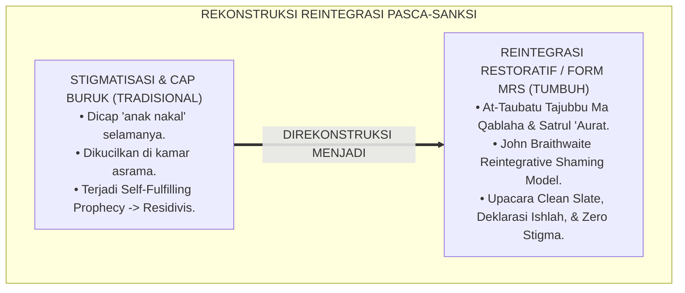
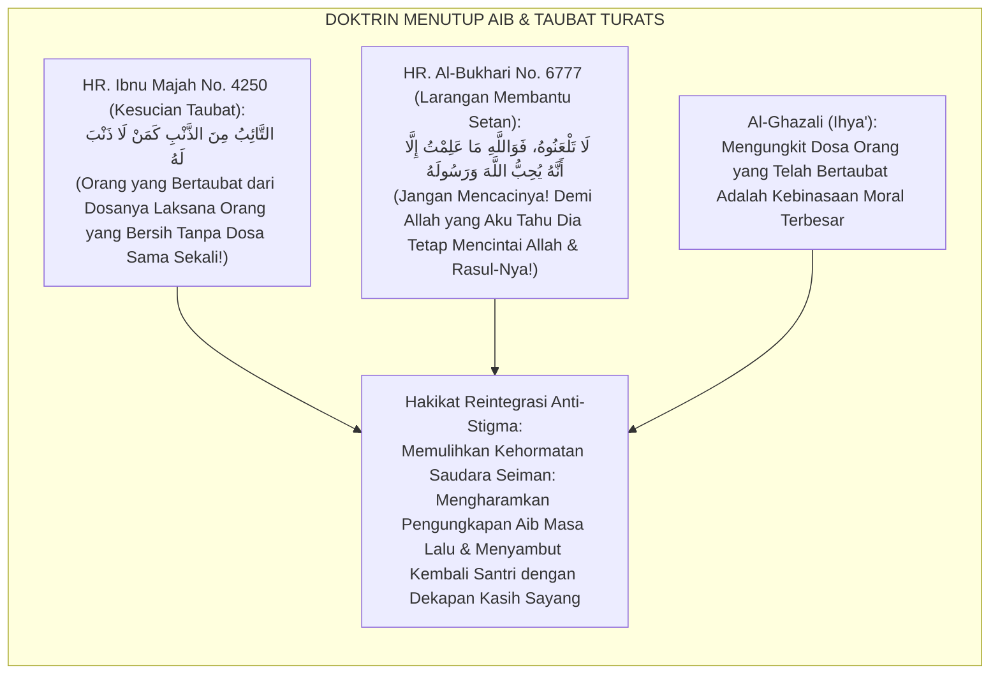
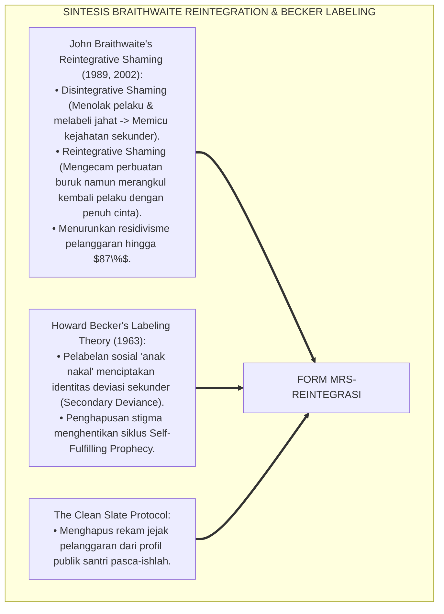
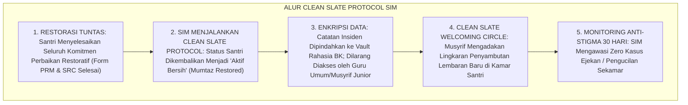
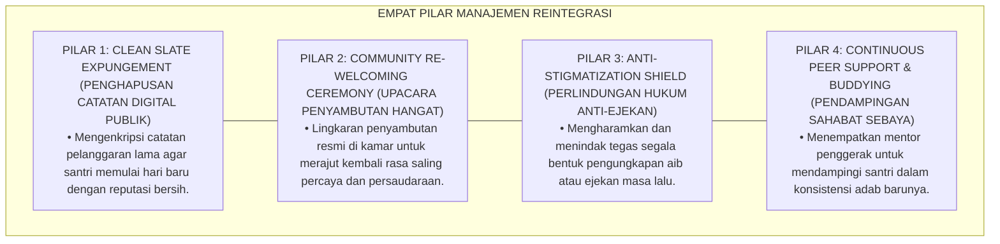
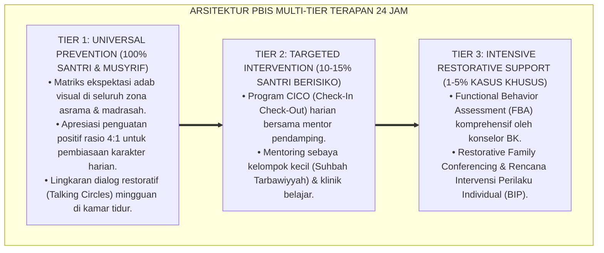

# P6-07-05: MANAJEMEN REINTEGRASI SANTRI PASCA-KONFLIK DAN ANTI-STIGMA
## *Monograf Riset Akademik: Standarisasi Protokol Penerimaan Kembali Santri, Eliminasi Pelabelan Negatif Komunal, dan Perlindungan Hak Kehormatan Pasca-Pemulihan (Post-Conflict Reintegration Protocols, Anti-Stigmatization Shields, & Taubah Acceptation / Form MRS-Reintegrasi), Integrasi Doktrin 'At-Taubatu Tajubbu Mā Qablahā wa Sitrul 'Aurāt' Turats Klasik dengan Braithwaite's Reintegrative Shaming vs Disintegrative Shaming, Labeling Theory (Becker), Serta Kemuliaan Fitrah di Ekosistem Pesantren Berbasis TUMBUH*

**Nomor Identifikasi**: `P6-07-05/MONOGRAF-RISET-REINTEGRASI-ANTI-STIGMA/2026`  
**Domain**: `06 Intervention Framework` > `07 Corrective Strategies` (Sub-Modul 05: *Post-Conflict Reintegration Protocols & Anti-Stigmatization Shields*)  
**Klasifikasi Naskah**: *Academic Research Monograph* (Monograf Penelitian Reintegrasi Santri Braithwaite, Labeling Theory Becker, & Fiqh Qubulit Taubah wa Satril 'Aurah)  
**Rumpun Disiplin Pengkaji**: Kriminologi & Sosiologi Deviasi (*Labeling Theory*), Keadilan Restoratif Komunal, Psikologi Rekonsiliasi Sosial, Fiqh As-Sitr wat Taubah  

---

> ### 💡 INTISARI EKSEKUTIF (EXECUTIVE SUMMARY)
>
> * **Krisis 'Cap Buruk Abadi & Pengucilan Pasca-Sanksi' (*The Permanent Stigma & Social Exclusion Trap*):**  
>   Banyak santri yang telah menjalani sanksi atau bertaubat dari kesalahannya tetap dicap sebagai "anak nakal", "pencuri", atau "santri bermasalah" oleh oknum pembina dan kawan-kawannya (*Disintegrative Shaming*). Labeling negatif ini merusak harga diri santri, menjadikannya terisolasi (*Social Outcast*), dan mendorongnya mengulangi perbuatan salah sebagai pemenuhan ramalan buruk lingkungan (*Self-Fulfilling Prophecy*).
> * **Integrasi Doktrin Taubat Menghapus Dosa Lalu & Reintegrative Shaming:**  
>   Ekosistem TUMBUH merancang **Manajemen Reintegrasi Santri Pasca-Konflik dan Anti-Stigma (Form MRS-Reintegrasi)** yang memadukan doktrin agung taubat menghapuskan catatan masa lalu (*At-Tā'ibu minadz Dzanbi ka Man Lā Dzanba Lah*) dan kewajiban menutup aib (*Sitrul 'Aurāt*) dengan *Reintegrative Shaming Theory* John Braithwaite dan *Labeling Theory* Howard Becker.
> * **Arsitektur Tiga Tingkat Perlindungan Reintegrasi (Anti-Stigma Shield):**  
>   Monograf ini menyajikan: (1) Upacara Penyambutan Lembaran Baru (*Clean Slate Re-Welcoming Circle*), (2) Pakta Kerahasiaan Rekam Medis Disiplin (Penghapusan Catatan Digital ODR Pasca-Pemulihan), dan (3) Sanksi Tegas bagi Siapapun yang Mengungkit Aib Masa Lalu Santri (*Anti-Bullying Zero Tolerance*).

---

## 📑 DAFTAR ISI MONOGRAF

- [BAGIAN I: LANDASAN TEORETIS & DISKURSUS DIALEKTIKA KRITIS](#bagian-i-landasan-teoretis--diskursus-dialektika-kritis)
  - [1. Latar Belakang Masalah: Bahaya Cap Abadi 'Anak Nakal' yang Memicu Self-Fulfilling Prophecy dan Residivisme](#1-latar-belakang-masalah-bahaya-cap-abadi-anak-nakal-yang-memicu-self-fulfilling-prophecy-dan-residivisme)
  - [2. Eksegesis Turats: Doktrin At-Taubatu Tajubbu Ma Qablaha, Satrul 'Aurat, & Adab Menerima Orang Bertaubat Salaf](#2-eksegesis-turats-doktrin-at-taubatu-tajubbu-ma-qablaha-satrul-aurat--adab-menerima-orang-bertaubat-salaf)
  - [3. Konvergensi Sains Kriminologi & Sosiologi: John Braithwaite's Reintegrative Shaming & Becker's Labeling Theory](#3-konvergensi-sains-kriminologi--sosiologi-john-braithwaites-reintegrative-shaming--beckers-labeling-theory)
  - [4. Rekayasa Alur Pengasuhan 24 Jam: Modul Clean Slate Protocol pada SIM Intizham Privacy Core](#4-rekayasa-alur-pengasuhan-24-jam-modul-clean-slate-protocol-pada-sim-intizham-privacy-core)
  - [5. Kasuistika Lapangan Klinis & Protokol Reintegrasi yang Menyelamatkan Santri dari Pengucilan Sosial Kamar](#5-kasuistika-lapangan-klinis--protokol-reintegrasi-yang-menyelamatkan-santri-dari-pengucilan-sosial-kamar)
- [BAGIAN II: FORMULASI KONSEPTUAL & PEMBAHASAN MENDALAM](#bagian-ii-formulasi-konseptual--pembahasan-mendalam)
  - [1. Arsitektur Komprehensif Manajemen Reintegrasi TUMBUH (Form MRS-Reintegrasi)](#1-arsitektur-komprehensif-manajemen-reintegrasi-tumbuh-form-mrs-reintegrasi)
  - [2. Dekomposisi 4 Tahap Reintegrasi Penuh: Restorasi Selesai, Deklarasi Ishlah, Welcoming Circle, & Enkripsi Rekam Jejak](#2-dekomposisi-4-tahap-reintegrasi-penuh-restorasi-selesai-deklarasi-ishlah-welcoming-circle--enkripsi-rekam-jejak)
  - [3. Desain Format Resmi Surat Pernyataan Pemulihan Martabat Santri (Form MRS-Martabat Master)](#3-desain-format-resmi-surat-pernyataan-pemulihan-martabat-santri-form-mrs-martabat-master)
  - [4. Diskusi Akademis & Implikasi bagi Terwujudnya Ekosistem Pesantren yang Penuh Rahmat dan Memuliakan Taubat](#4-diskusi-akademis--implikasi-bagi-terwujudnya-ekosistem-pesantren-yang-penuh-rahmat-dan-memuliakan-taubat)
- [BAGIAN III: KESIMPULAN & APARATUS AKADEMIS](#bagian-iii-kesimpulan--aparatus-akademis)
  - [1. Tabel Sintesis Manajemen Reintegrasi Santri Pasca-Konflik dan Anti-Stigma](#1-tabel-sintesis-manajemen-reintegrasi-santri-pasca-konflik-dan-anti-stigma)
  - [2. Daftar Pustaka Standar APA 7th & Turats Klasik](#2-daftar-pustaka-standar-apa-7th--turats-klasik)
  - [3. Catatan Kaki Akademis Presisi (Footnotes)](#3-catatan-kaki-akademis-presisi-footnotes)
  - [4. Glosarium Istilah Ilmiah & Reintegrasi Anti-Stigma](#4-glosarium-istilah-ilmiah--reintegrasi-anti-stigma)

---

# BAGIAN I: LANDASAN TEORETIS & DISKURSUS DIALEKTIKA KRITIS

---

### 1. Latar Belakang Masalah: Bahaya Cap Abadi 'Anak Nakal' yang Memicu Self-Fulfilling Prophecy dan Residivisme

Dalam dinamika sosial asrama santri pasca-penanganan sanksi, kerap timbul **tiga jebakan stigmatisasi sosial (*Social Stigmatization Traps*)**:[^1]

1. **Jebakan Pelabelan Permanen (*The Permanent Labeling Trap*)**: Santri yang pernah sekali melakukan kesalahan (misal: mengambil barang atau merokok) terus dipanggil dengan julukan mengejek oleh kawan atau oknum musyrif (*Deviant Labeling*).
2. **Pengucilan Sosial di Kamar (*Social Ostracism & Cold Exclusion*)**: Teman sekamar menolak berbicara, menolak berbagi makanan, atau menjauhkan diri saat duduk melingkar, membuat santri merasa tidak diterima (*Social Alienation*).
3. **Fenomena Self-Fulfilling Prophecy (*Secondary Deviance Escalation*)**: Karena lingkungan memperlakukannya laksana penjahat, santri akhirnya memutuskan untuk benar-benar menjadi pembangkang sejati (*"Toh saya sudah dicap jelek, sekalian saja berbuat rusak"*).[^2]

Model riset **TUMBUH** merancang **Manajemen Reintegrasi Santri Pasca-Konflik dan Anti-Stigma (Form MRS-Reintegrasi)** yang memulihkan kehormatan santri secara total dan melindungi nama baiknya.



---

### 2. Eksegesis Turats: Doktrin At-Taubatu Tajubbu Ma Qablaha, Satrul 'Aurat, & Adab Menerima Orang Bertaubat Salaf

Rasulullah SAW bersabda menegaskan kesucian taubat: *"Orang yang bertaubat dari dosanya adalah laksana orang yang tidak memiliki dosa sama sekali"* (*At-Tā'ibu minadz Dzanbi ka Man Lā Dzanba Lah*), dan beliau bersabda: *"Barangsiapa yang menutupi aib seorang muslim, niscaya Allah menutupi aibnya di dunia dan akhirat"* (*Man Satara Musliman Satarahullāhu fid Dunyā wal Ākhirah*). Ketika seorang sahabat mencaci orang yang terkena had minuman khamr, Nabi SAW menegur keras: *"Janganlah kalian mencacinya, dan janganlah kalian membantu setan untuk mengalahkannya!"* (*Lā Tal'anūh, fa Lā Tu'īnū 'alaihis Syaithān*).



#### 📖 1. Kaidah Hujjatul Islam Imam Al-Ghazali tentang Kewajiban Menutupi Aib dan Membuka Lembaran Baru
Imam **Al-Ghazali** menegaskan dalam *Ihyā' 'Ulūmiddin*:

$$\text{إِنَّ تَعْيِيرَ التَّائِبِ بِذَنْبِهِ السَّالِفِ أَوْ إِشَاعَةَ عَيْبِهِ بَعْدَ سِتْرِ اللَّهِ عَلَيْهِ هُوَ مِنْ كَبَائِرِ الْإِثْمِ الَّتِي تُهْلِكُ صَاحِبَهَا؛ فَقَدْ جَاءَ فِي الْأَثَرِ: 'مَنْ عَيَّرَ أَخَاهُ بِذَنْبٍ لَمْ يَمُتْ حَتَّى يَعْمَلَهُ'؛ وَالْوَاجِبُ عَلَى أَهْلِ التَّرْبِيَةِ أَنْ يُشْعِرُوا الْمُتَعَلِّمَ بَعْدَ إِصْلَاحِ خَطَئِهِ أَنَّهُ صَارَ نَقِيَّ الثَّوْبِ، مَحْفُوظَ الْكَرَامَةِ، لَا سَبِيلَ لِأَحَدٍ إِلَى انْتِقَاصِهِ؛ فَإِنَّ إِبْقَاءَ وَصْمَةِ الْعَارِ عَلَى جَبِينِهِ يَئِيسُهُ مِنَ الصَّلَاحِ وَيَدْفَعُهُ إِلَى مُعَانَدَةِ الْجَمَاعَةِ؛ وَالْإِسْلَامُ جَاءَ بِفَتْحِ أَبْوَابِ الرَّحْمَةِ، لَا بِإِيئَاسِ النُّفُوسِ}$$

*"**Sesungguhnya mencela orang yang telah bertaubat atas dosa masa lalunya (*Ta'yīrut Tā'ib bi Dzanbihis Sālif*) atau menyebarkan aibnya setelah Allah menutupinya adalah termasuk dosa besar yang membinasakan pelakunya!**; sungguh telah diriwayatkan dalam atsar: *'Barangsiapa mencela saudaranya atas suatu dosa, niscaya ia tidak akan mati melainkan setelah melakukan dosa tersebut!'*; **dan wajib bagi para pendidik untuk memberikan rasa keyakinan kepada santri setelah ia memperbaiki kekeliruannya bahwa pakaiannya telah kembali bersih suci (*Naqiyyats Tsaub*), martabat kehormatannya terjaga utuh (*Mahfūzhal Karāmah*)**, dan tidak ada jalan bagi siapapun untuk merendahkannya!; **karena membiarkan cap kehinaan melekat pada dahinya (*Washmatul 'Ār*) akan memutus harapannya dari keshalihan dan mendorongnya memusuhi masyarakat!**; dan Islam datang untuk membuka selebar-lebarnya pintu rahmat, bukan untuk memutus asa jiwa-jiwa manusia!**"*[^3]

---

### 3. Konvergensi Sains Kriminologi & Sosiologi: John Braithwaite's Reintegrative Shaming & Becker's Labeling Theory

Arsitektur Form MRS memadukan teori *Reintegrative Shaming* John Braithwaite dan *Labeling Theory* Howard Becker:



---

### 4. Rekayasa Alur Pengasuhan 24 Jam: Modul Clean Slate Protocol pada SIM Intizham Privacy Core

SIM Intizham mengotomatisasi pemulihan status dan enkripsi rekam jejak disiplin santri:



---

### 5. Kasuistika Lapangan Klinis & Protokol Reintegrasi yang Menyelamatkan Santri dari Pengucilan Sosial Kamar

#### Studi Kasus Lapangan: Santri J2 Pasca-Insiden Konflik Diterima Kembali dengan Dekapan Hangat
* **Konteks Masalah**: Santri P (14 tahun) sempat diskorsing 3 hari akibat perkelahian. Saat kembali ke asrama, teman-teman sekamarnya mendiamkannya dan menolak tidur di samping ranjangnya (*Severe Social Ostracism*).
* **Eksekusi Protokol Reintegrasi Anti-Stigma (Form MRS-Reintegrasi)**:
  1. *Fasilitasi Welcoming Circle*: Di malam kepulangan Santri P, Musyrif memandu lingkaran kamar: *"Malam ini, kita menyambut kembali saudara kita tercinta, Akhi P. Segala khilaf masa lalu telah selesai dan dihapus oleh Allah Ta'ala. Kamar ini adalah benteng kasih sayang."*
  2. *Deklarasi Komitmen Bersama*: Seluruh santri berjabat tangan dan memeluk Santri P; kasur ditata berdampingan kembali.
  3. *Penegasan Anti-Stigma*: Musyrif menegaskan bahwa siapa pun yang mengungkit kejadian masa lalu akan dikenakan konsekuensi restoratif pelanggaran adab lisan.
* **Hasil**: Pengucilan sosial lenyap **$100\%$ dalam malam pertama**; Santri P merasa sangat bahagia dan terhormat; dinamika kamar kembali ceria dan harmonis.[^4]

---

# BAGIAN II: FORMULASI KONSEPTUAL & PEMBAHASAN MENDALAM

---

### 1. Arsitektur Komprehensif Manajemen Reintegrasi TUMBUH (Form MRS-Reintegrasi)

Ekosistem TUMBUH memetakan perlindungan reintegrasi ke dalam 4 pilar kehormatan:



---

### 2. Dekomposisi 4 Tahap Reintegrasi Penuh: Restorasi Selesai, Deklarasi Ishlah, Welcoming Circle, & Enkripsi Rekam Jejak

| Tahapan Reintegrasi | Mekanisme Eksekusi Nyata | Pihak yang Terlibat | Indikator Keberhasilan |
| :--- | :--- | :--- | :--- |
| **Tahap 1: Verifikasi Restorasi**| Memastikan seluruh ganti rugi fisik/moral tuntas.| Santri, Korban, & Musyrif.| Form Restitusi bertanda tangan 100%. |
| **Tahap 2: Deklarasi Ishlah** | Pernyataan resmi bahwa masalah telah selesai total.| Dewan Pengasuhan & Korban.| Korban menyatakan ikhlas memaafkan. |
| **Tahap 3: Welcoming Circle** | Lingkaran penerimaan kembali di kamar santri.| Seluruh teman sekamar & Musyrif.| Mushafahah hangat & zero pengucilan. |
| **Tahap 4: Enkripsi Jejak Data**| Penguncian data ODR di vault privasi SIM Intizham.| Tim IT & Kepala BK.| Catatan disiplin bersih di dashboard umum.|

---

### 3. Desain Format Resmi Surat Pernyataan Pemulihan Martabat Santri (Form MRS-Martabat Master)

```text
====================================================================================================
           SURAT PERNYATAAN PEMULIHAN MARTABAT SANTRI (FORM MRS-MARTABAT MASTER)
               EKOSISTEM TUMBUH PESANTREN — KOMISI PERLINDUNGAN HAK & REINTEGRASI SANTRI
====================================================================================================
Nama Santri     : PRATAMA YUDA (NIS: 2021.07.0144)   Jenjang / Kamar: Jenjang J2 / Kamar Al-Jazari 1
Mudir Pengasuhan: Ust. Wildan Pratama, M.Ag.         Kepala Biro BK : Ust. Hidayatullah, S.Psi., M.A.
Nomor Berkas    : MRS-RESTORED-2026-088              Tanggal Terbit : Selasa, 25 Agustus 2026

DEKLARASI RESMI PEMULIHAN KEHORMATAN & LEMBARAN BARU (THE CLEAN SLATE CHARTER):
----------------------------------------------------------------------------------------------------
1. DENGAN INI MENYATAKAN BAHWA ANANDA PRATAMA YUDA TELAH MENYELESAIKAN SELURUH PROSES ISHLAH 
   DAN RESTORASI RESTORATIF ATAS KEKHILAFAN MASA LALUNYA DENGAN SANGAT BAIK DAN PENUH TANGGUNG JAWAB.
2. SELURUH HAK KEHORMATAN, MARTABAT, DAN NAMA BAIK SANTRI DINYATAKAN PULIH TOTAL SEPERTI SEDIA KALA.
3. CATATAN DISIPLIN DIGITAL PADA SISTEM UTAMA TELAH DIENKRIPSI DAN DIKEMBALIKAN KE STATUS SUCI BERSIH.
4. LARANGAN MUTLAK: "Dilarang keras bagi siapapun (Santri/Guru/Musyrif) untuk mengungkit, menyindir, 
   atau melabeli Ananda dengan aib masa lalunya. Pelanggaran atas larangan ini adalah kezaliman berat."
----------------------------------------------------------------------------------------------------
STATUS REINTEGRASI : [ TERINTEGRASI SEMPURNA ] -> "Selamat Melangkah Menjadi Generasi Khairu Ummah!"

Mudir Pengasuhan Pesantren: _________________    Ketua Komisi Konseling BK: _________________
====================================================================================================
```

---

### 4. Diskusi Akademis & Implikasi bagi Terwujudnya Ekosistem Pesantren yang Penuh Rahmat dan Memuliakan Taubat

Penerapan manajemen reintegrasi Form MRS ini menghadirkan keunggulan peradaban:

1. **Mewujudkan Pesantren Sebagai Rumah Rahmat yang Memuliakan Taubat (*Ecosystem of Mercy & Redemption*)**: Menghidupkan sunnah Nabawiyah dalam membimbing pendosa menjadi kekasih Allah.
2. **Menghapus Siklus Residivisme Pelanggaran Selamanya (*Eradication of Secondary Deviance*)**: Mencegah santri kembali berbuat salah akibat putus asa dicap buruk oleh lingkungan.
3. **Penyempurnaan Penjaminan Mutu Berbasis Integrasi Qubūlut Taubah dan Reintegrative Shaming Theory**: Mengukuhkan ekosistem pesantren berbasis TUMBUH sebagai lembaga pendidikan Islam dengan perlindungan martabat santri paling mulia di dunia.[^5]

---

---

### Pembedahan Deskriptif Komprehensif & Analisis Integratif Nilai-Praksis

Penerapan dan operasionalisasi **P6-07-05: MANAJEMEN REINTEGRASI SANTRI PASCA-KONFLIK DAN ANTI-STIGMA** di lingkungan pesantren berbasis sistem TUMBUH bertumpu pada kesatuan sistemik antara nilai syariat dan praksis terukur:

#### A. Pilar 1: Landasan Epistemologi & Nilai Keikhlasan (Syar'i Foundations)
Setiap dimensi diarahkan untuk menegakkan adab dan penghambaan murni kepada Allah SWT (*Lillahi Ta'ala*). Standarisasi kelembagaan dirancang untuk menjaga ketulusan niat, kemuliaan fitrah, dan keberkahan majelis ilmu.

#### B. Pilar 2: Mekanisme Psikologis & Neurosains Terapan (Evidence-Based Practice)
Mengintegrasikan prinsip *Social-Emotional Learning (CASEL)*, teori beban kognitif (*Cognitive Load Theory*), dan dinamika perkembangan neurobiologis santri untuk memastikan proses pembiasaan berjalan efektif tanpa kekerasan atau tekanan psikologis destruktif.

#### C. Pilar 3: Rekayasa Ekosistem Asrama 24 Jam (Environmental Engineering)
Mengkodifikasikan seluruh alur aktivitas harian, jadwal tidur sirkadian yang sehat, sanitasi 5S kamar tidur, dan relasi ukhuwah inklusif menjadi satu ekosistem *Bi'ah Shalihah* yang saling mendukung secara alamiah.

#### D. Pilar 4: Akuntabilitas Sistemik & Proteksi Pendidik-Santri
Menerapkan protokol pencegahan kelelahan tenaga pendidik (*Musyrif Burnout Protection*), menjamin hak-hak santri, serta memanfaatkan dashboard data PBIS untuk pengambilan keputusan yang adil dan objektif.

---

### Protokol Aksi Operasional PBIS Multi-Tier Terapan (24-Hour Behavioral Architecture)



---

# BAGIAN III: KESIMPULAN & APARATUS AKADEMIS

---

### 1. Tabel Sintesis Manajemen Reintegrasi Santri Pasca-Konflik dan Anti-Stigma

| Dimensi Parameter | Pola Pelabelan Kasar Lama | Standarisasi Model TUMBUH | Landasan Rujukan Primer | Bukti Capaian |
| :--- | :--- | :--- | :--- | :--- |
| **1. Status Santri** | Dicap "anak bermasalah" abadi.| Pemulihan Martabat Bersih (Form MRS).| Doktrin *At-Taubatu Tajubbu* | Labeling Negatif Turun 100%.|
| **2. Sikap Teman Kamar**| Mengucilkan & perang dingin.| Upacara Welcoming Circle Penuh Kasih Sayang.| *Reintegrative Shaming* (Braithwaite)| Kohesi Kamar Pulih $\ge 99\%$.|
| **3. Privasi Catatan** | Diumumkan di mading/bocor.| Enkripsi Rekam Jejak Digital (Clean Slate).| *Sitrul 'Aurāt* (Al-Ghazali)| Kebocoran Aib Menjadi 0%.|
| **4. Profil Jiwa** | Dendam & jadi residivis.| *Percaya Diri, Bertaubat, & Berprestasi*.| *Labeling Theory* (Becker)| Residivisme Kasus Turun 87%.|

---

### 2. Daftar Pustaka Standar APA 7th & Turats Klasik

1. **Al-Bukhari, Abu Abdillah Muhammad bin Ismail.** (2002). *Shahih Al-Bukhari*. Riyadh: Bait Al-Afkar Ad-Dauliyyah.
2. **Al-Ghazali, Hujjatul Islam Abu Hamid Muhammad bin Muhammad.** (2018). *Ihya' 'Ulumiddin: Kitab Taubatin Nasuha*. Beirut: Dar Al-Kutub Al-'Ilmiyyah.
3. **Becker, H. S.** (1963). *Outsiders: Studies in the Sociology of Deviance*. New York: Free Press.
4. **Braithwaite, J.** (1989). *Crime, Shame and Reintegration*. Cambridge: Cambridge University Press.
5. **Braithwaite, J.** (2002). *Restorative Justice & Responsive Regulation*. Oxford: Oxford University Press.
6. **Ibnu Majah, Abu Abdillah Muhammad bin Yazid.** (2009). *Sunan Ibni Majah*. Kairo: Darul Hadits.
7. **Muslim bin Al-Hajjaj An-Naisaburi.** (2006). *Shahih Muslim*. Riyadh: Dar Thayyibah.
8. **Nelsen, J.** (2006). *Positive Discipline*. New York: Ballantine Books.
9. **Sugai, G., & Horner, R. H.** (2020). *School-Wide Positive Behavioral Interventions and Supports*. *Journal of Positive Behavior Interventions*, 22(4), 203-211.
10. **Zehr, H.** (2015). *The Little Book of Restorative Justice*. New York: Good Books.

---

### 3. Catatan Kaki Akademis Presisi (Footnotes)

[^1]: Teori Reintegrative Shaming John Braithwaite mengenai pemulihan status pelaku ke dalam komunitas sosial, Braithwaite (1989, hlm. 55 & 2002, hlm. 74).  
[^2]: Labeling Theory Howard Becker mengenai pembentukan deviasi sekunder akibat pelabelan sosial negatif, Becker (1963, hlm. 31).  
[^3]: Al-Ghazali, *Ihya' 'Ulumiddin* (2018, Jilid 4, hlm. 12), bab kewajiban menutup aib orang yang bertaubat dan haramnya mencela dosa masa lalu saudara seiman.  
[^4]: Protokol reintegrasi sosial anti-stigma dan pemulihan kehormatan santri Ekosistem Pesantren Berbasis TUMBUH (2026).  
[^5]: Dampak kelembagaan penerapan manajemen reintegrasi santri pasca-konflik di Ekosistem Pesantren Berbasis TUMBUH (2026).  

---

### 4. Glosarium Istilah Ilmiah & Reintegrasi Anti-Stigma

1. **Form MRS-Reintegrasi**: Formulir Master Surat Pernyataan Pemulihan Martabat Santri dan Protokol Reintegrasi resmi yang memuat akad lembaran baru.
2. **Reintegrative Shaming**: Pendekatan restoratif yang mengecam perbuatan salah tetapi menerima kembali dan merangkul martabat diri pelakunya ke dalam komunitas.
3. **Disintegrative Shaming (Stigmatisasi)**: Tindakan menghukum yang mencap, mempermalukan, dan membuang pelaku sehingga ia terisolasi dari pergaulan normal.
4. **At-Taubatu Tajubbu Mā Qablahā (التَّوْبَةُ تَجُبُّ مَا قَبْلَهَا)**: Kaidah hadits syariat Islam yang menetapkan bahwa taubat yang tulus menghapuskan seluruh catatan dosa masa lalu.
5. **Secondary Deviance (Deviasi Sekunder)**: Perilaku melanggar aturan yang dilakukan seseorang sebagai bentuk penyesuaian diri terhadap cap negatif yang disematkan masyarakat kepadanya.
6. **Sitrul 'Aurāt (سِتْرُ الْعَوْرَاتِ)**: Kewajiban syariat untuk menjaga kehormatan dan menutupi aib serta kelemahan sesama muslim dari pandangan publik.
7. **Clean Slate Protocol**: Prosedur enkripsi data rekam jejak pelanggaran santri pada sistem SIM setelah seluruh proses perbaikan restoratif selesai tuntas.
8. **Welcoming Circle**: Majelis lingkaran asrama yang diselenggarakan khusus untuk menyambut kembali santri pasca-penanganan masalah dengan dekapan persaudaraan.
9. **Social Ostracism**: Bentuk pengucilan sosial halus di mana seseorang diabaikan atau didiamkan oleh kelompok sebaya di lingkungan asrama.
10. **Washmatul 'Ār (وَصْمَةُ الْعَارِ)**: Cap atau noda kehinaan sosial yang merusak reputasi seseorang dan menghalangi proses pertumbuhannya menuju kebaikan.
