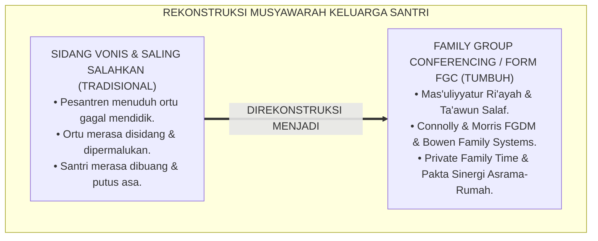
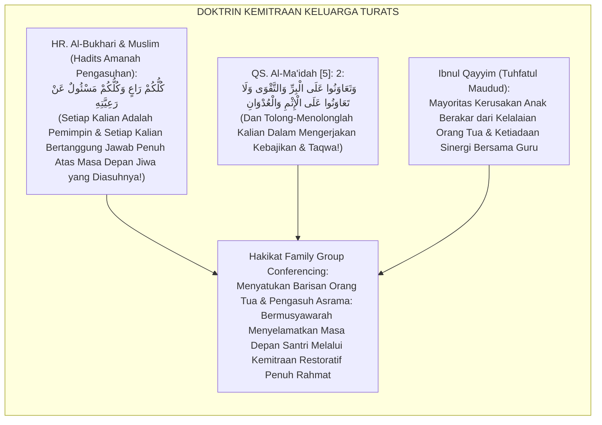
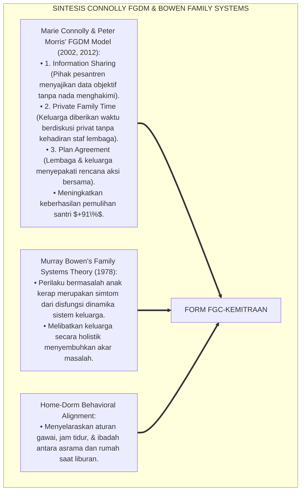
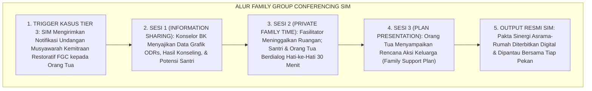
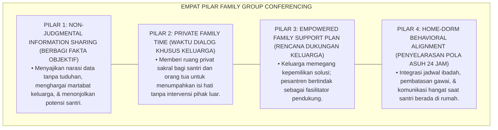
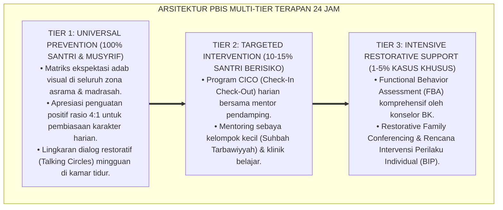

# P6-07-06: PROTOKOL FAMILY GROUP CONFERENCING DAN KEMITRAAN WALI
## *Monograf Riset Akademik: Standarisasi Musyawarah Keluarga Terpadu, Penyelarasan Pola Pengasuhan Rumah-Asrama, dan Kolaborasi Restoratif Berbasis Kemitraan Wali Santri (Family Group Conferencing FGC, Home-Dorm Behavioral Alignment, & Restorative Parenting Protocols / Form FGC-Kemitraan), Integrasi Doktrin 'Mas'ūliyyatur Ri'āyah wal Kaffālah al-Usariyyah' Turats Klasik dengan Connolly & Morris' Family Group Decision Making (FGDM), Family Systems Theory, Serta Kemitraan di Ekosistem Pesantren Berbasis TUMBUH*

**Nomor Identifikasi**: `P6-07-06/MONOGRAF-RISET-FAMILY-GROUP-CONFERENCING/2026`  
**Domain**: `06 Intervention Framework` > `07 Corrective Strategies` (Sub-Modul 06: *Family Group Conferencing & Home-Dorm Behavioral Alignment*)  
**Klasifikasi Naskah**: *Academic Research Monograph* (Monograf Penelitian Family Group Conferencing FGDM, Teori Sistem Keluarga Bowen, & Fiqh Al-Kafalah wal Mas'uliyyah)  
**Rumpun Disiplin Pengkaji**: Keadilan Restoratif Keluarga (*Family Restorative Conferencing*), Psikologi Keluarga & Pengasuhan, Kemitraan Sekolah-Keluarga (*School-Family Partnerships*), Fiqh Huquqil Aulad  

---

> ### 💡 INTISARI EKSEKUTIF (EXECUTIVE SUMMARY)
>
> * **Krisis 'Panggilan Orang Tua yang Berujung Saling Menyalahkan' (*The Blame-Game Parent Meeting Trap*):**  
>   Ketika santri terlibat kasus berat, pertemuan pihak pesantren dengan orang tua kerap menjadi arena saling melempar kesalahan (*Defensive Blaming*): pihak pesantren menuduh orang tua gagal mendidik di rumah, sementara orang tua menuduh pengasuh lalai mengawasi di asrama. Akibatnya, hubungan menjadi renggang, santri merasa dibuang (*Rejection Trauma*), dan rencana pembinaan kandas.
> * **Integrasi Doktrin Tanggung Jawab Amanah Pengasuhan & Family Group Decision Making:**  
>   Ekosistem TUMBUH merancang **Protokol Family Group Conferencing dan Kemitraan Wali (Form FGC-Kemitraan)** yang memadukan doktrin kepemimpinan dan pengasuhan keluarga (*Kullukum Rā'in wa Kullukum Mas'ūlun 'an Ra'iyyatih*) dengan *Family Group Decision Making (FGDM)* Marie Connolly dan Peter Morris serta *Family Systems Theory* Murray Bowen.
> * **Arsitektur Tiga Tahap Musyawarah Restoratif Keluarga (FGC Triad):**  
>   Monograf ini menyajikan: (1) Sesi Berbagi Fakta & Dampak Bersama Fasilitator BK, (2) Sesi Diskusi Privat Keluarga (*Private Family Time*) untuk merumuskan rencana pengasuhan mandiri, dan (3) Penandatanganan Pakta Sinergi Asrama-Rumah (Form FGC-Akad).

---

## 📑 DAFTAR ISI MONOGRAF

- [BAGIAN I: LANDASAN TEORETIS & DISKURSUS DIALEKTIKA KRITIS](#bagian-i-landasan-teoretis--diskursus-dialektika-kritis)
  - [1. Latar Belakang Masalah: Bahaya Budaya Saling Menuduh Antara Pesantren dan Orang Tua Saat Menghadapi Kasus Santri](#1-latar-belakang-masalah-bahaya-budaya-saling-menuduh-antara-pesantren-dan-orang-tua-saat-menghadapi-kasus-santri)
  - [2. Eksegesis Turats: Doktrin Kullukum Ra'in, Ta'awun 'alal Birri, & Adab Kemitraan Pengasuhan Salaf](#2-eksegesis-turats-doktrin-kullukum-rain-taawun-alal-birri--adab-kemitraan-pengasuhan-salaf)
  - [3. Konvergensi Sains Sistem Keluarga: Connolly & Morris' Family Group Decision Making (FGDM) & Bowen's Family Systems](#3-konvergensi-sains-sistem-keluarga-connolly--morris-family-group-decision-making-fgdm--bowens-family-systems)
  - [4. Rekayasa Alur Pengasuhan 24 Jam: Modul FGC Conference Scheduler pada SIM Intizham Family Core](#4-rekayasa-alur-pengasuhan-24-jam-modul-fgc-conference-scheduler-pada-sim-intizham-family-core)
  - [5. Kasuistika Lapangan Klinis & Protokol FGC yang Menyatukan Kembali Hubungan Ayah-Anak Pasca-Kasus Pelanggaran Berat](#5-kasuistika-lapangan-klinis--protokol-fgc-yang-menyatukan-kembali-hubungan-ayah-anak-pasca-kasus-pelanggaran-berat)
- [BAGIAN II: FORMULASI KONSEPTUAL & PEMBAHASAN MENDALAM](#bagian-ii-formulasi-konseptual--pembahasan-mendalam)
  - [1. Arsitektur Komprehensif Protokol Family Group Conferencing TUMBUH (Form FGC-Kemitraan)](#1-arsitektur-komprehensif-protokol-family-group-conferencing-tumbuh-form-fgc-kemitraan)
  - [2. Dekomposisi 3 Tahap Musyawarah FGC: Information Sharing, Private Family Time, & Agreement Plan](#2-dekomposisi-3-tahap-musyawarah-fgc-information-sharing-private-family-time--agreement-plan)
  - [3. Desain Format Resmi Pakta Sinergi Asrama-Rumah (Form FGC-Pakta Master)](#3-desain-format-resmi-pakta-sinergi-asrama-rumah-form-fgc-pakta-master)
  - [4. Diskusi Akademis & Implikasi bagi Penyelarasan Pola Asuh Rumah-Pesantren yang Berkelanjutan](#4-diskusi-akademis--implikasi-bagi-penyelarasan-pola-asuh-rumah-pesantren-yang-berkelanjutan)
- [BAGIAN III: KESIMPULAN & APARATUS AKADEMIS](#bagian-iii-kesimpulan--aparatus-akademis)
  - [1. Tabel Sintesis Protokol Family Group Conferencing dan Kemitraan Wali](#1-tabel-sintesis-protokol-family-group-conferencing-dan-kemitraan-wali)
  - [2. Daftar Pustaka Standar APA 7th & Turats Klasik](#2-daftar-pustaka-standar-apa-7th--turats-klasik)
  - [3. Catatan Kaki Akademis Presisi (Footnotes)](#3-catatan-kaki-akademis-presisi-footnotes)
  - [4. Glosarium Istilah Ilmiah & Family Group Conferencing](#4-glosarium-istilah-ilmiah--family-group-conferencing)

---

# BAGIAN I: LANDASAN TEORETIS & DISKURSUS DIALEKTIKA KRITIS

---

### 1. Latar Belakang Masalah: Bahaya Budaya Saling Menuduh Antara Pesantren dan Orang Tua Saat Menghadapi Kasus Santri

Dalam penanganan kasus pelanggaran tingkat Tier 3 santri, kerap ditemukan **tiga disfungsi komunikasi keluarga-lembaga (*School-Family Disconnects*)**:[^1]

1. **Jebakan Sidang Vonis yang Mempermalukan Orang Tua (*Humiliating Tribunal Trap*)**: Orang tua dipanggil hanya untuk mendengarkan daftar kejahatan anaknya dan disuruh menandatangani surat skorsing tanpa diberi ruang berdialog (*One-Way Judicial Scolding*).
2. **Perpecahan Pola Pengasuhan Asrama vs Rumah (*Home-Dorm Discrepancy*)**: Nilai-nilai kedisiplinan yang dibangun di asrama hancur saat liburan karena orang tua menerapkan pola asuh serba memanjakan (*Permissive Indulgence*), memicu kekambuhan masalah (*Relapse*).
3. **Ketiadaan Pemberdayaan Solusi Mandiri Keluarga (*Zero Family Empowerment*)**: Lembaga memaksakan vonis sepihak tanpa memberi kesempatan kepada keluarga untuk merumuskan rencana pendampingan khas keluarga mereka sendiri.[^2]

Model riset **TUMBUH** merancang **Protokol Family Group Conferencing dan Kemitraan Wali (Form FGC-Kemitraan)** yang memposisikan orang tua sebagai mitra utama pembinaan.



---

### 2. Eksegesis Turats: Doktrin Kullukum Ra'in, Ta'awun 'alal Birri, & Adab Kemitraan Pengasuhan Salaf

Rasulullah SAW meletakkan doktrin kemitraan pengasuhan: *"Setiap kalian adalah pemimpin dan setiap kalian akan dimintai pertanggungjawaban atas apa yang dipimpinnya... seorang laki-laki adalah pemimpin di keluarganya, dan seorang wanita adalah pemimpin di rumah suaminya dan anak-anaknya"* (*Kullukum Rā'in wa Kullukum Mas'ūlun 'an Ra'iyyatih*). Al-Qur'an memerintahkan tolong-menolong dalam kebajikan (*Wa Ta'āwanū 'alal Birri wat Taqwā*), dan para ulama salaf mewajibkan kesatuan barisan antara orang tua dan guru dalam mendidik anak.



#### 📖 1. Kaidah Al-Imam Ibnul Qayyim Al-Jauziyyah tentang Kewajiban Kerjasama Orang Tua dan Pendidik
Imam **Ibnul Qayyim Al-Jauziyyah** menegaskan dalam *Tuhfatul Maudūd bi Ahkāmil Maulūd*:

$$\text{إِنَّ إِصْلَاحَ النَّاشِئِ إِذَا تَعَثَّرَتْ خُطَاهُ لَا يَقُومُ عَلَى تَبَادُلِ اللَّوْمِ بَيْنَ الْمُعَلِّمِ وَالْوَالِدِ، فَإِنَّ ذَلِكَ يَفْتَحُ بَابَ الشَّيْطَانِ وَيُضَيِّعُ الْوَلَدَ بَيْنَهُمَا؛ بَلِ الْوَاجِبُ أَنْ يَجْتَمِعَا عَلَى كَلِمَةٍ سَوَاءٍ، فَيَكُونَ الْأَبُ عَوْنًا لِلْمُؤَدِّبِ فِي رِعَايَةِ الْخُلُقِ، وَيَكُونَ الْمُؤَدِّبُ رَفِيقًا نَاصِحًا لِلْأُسْرَةِ؛ وَأَنْ يُعْطَى الْوَالِدَانِ مَجَالًا لِلْمُشَاوَرَةِ وَتَحَمُّلِ أَمَانَةِ الْعِلَاجِ؛ فَإِنَّ عَاطِفَةَ الْأُبُوَّةِ إِذَا سُدِّدَتْ بِالْحِكْمَةِ كَانَتْ أَقْوَى دَوَاءٍ لِقَلْبِ الْفَتَى الْمُنْكَسِرِ}$$

*"**Sesungguhnya perbaikan generasi muda tatkala langkahnya tersandung kekhilafan (*Idzā Ta'atstsarats Khuthāh*) tidak akan pernah tegak dengan saling melempar celaan (*Tabādulul Laum*) antara guru dan orang tua**; karena hal itu membuka pintu bagi setan dan menelantarkan anak di antara keduanya!; **melainkan wajib bagi keduanya berkumpul di atas kesepakatan yang satu (*Kalimatin Sawā'*): sang ayah menjadi penopang bagi pendidik dalam menjaga akhlaq, dan sang pendidik menjadi sahabat penasihat yang lembut bagi keluarga!**; dan hendaklah kedua orang tua diberikan ruang bermusyawarah (*Majālul Musyāwarah*) serta memegang amanah penyembuhan; **karena kasih sayang orang tua (*'Āthifatul Ubuwwah*) apabila dibimbing dengan hikmah syariat akan menjadi obat yang paling mujarab bagi hati anak muda yang sedang gundah!**"*[^3]

---

### 3. Konvergensi Sains Sistem Keluarga: Connolly & Morris' Family Group Decision Making (FGDM) & Bowen's Family Systems

Arsitektur Form FGC memadukan model *Family Group Decision Making (FGDM)* Marie Connolly & Peter Morris serta *Family Systems Theory* Murray Bowen:



---

### 4. Rekayasa Alur Pengasuhan 24 Jam: Modul FGC Conference Scheduler pada SIM Intizham Family Core

SIM Intizham mengatur undangan, penyajian data analitik, dan notula konferensi keluarga:



---

### 5. Kasuistika Lapangan Klinis & Protokol FGC yang Menyatukan Kembali Hubungan Ayah-Anak Pasca-Kasus Pelanggaran Berat

#### Studi Kasus Lapangan: Konferensi FGC Menyelamatkan Santri J3 yang Kabur dari Pesantren
* **Konteks Masalah**: Santri H (16 tahun, Jenjang J3) kabur dari asrama selama 2 hari karena merasa tertekan dan tidak dipedulikan ayahnya yang sangat sibuk bekerja. Ayahnya datang dengan emosi tinggi dan hendak memukul sang anak di kantor (*Severe Family Breakdown*).
* **Eksekusi Protokol FGC (Form FGC-Kemitraan)**:
  1. *De-eskalasi Suasana*: Konselor BK (Ust. Hidayat) menyambut ayah Santri H dengan teh hangat di Ruang Syura Keluarga yang nyaman dan tenang.
  2. *Sesi Information Sharing*: Konselor menyajikan hasil karya tulisan Santri H yang merindukan kehadiran ayahnya (*Affective Data*).
  3. *Private Family Time (30 Menit)*: Fasilitator keluar ruangan. Ayah dan anak menangis bersama; sang ayah memeluk anaknya dan meminta maaf karena selama ini terlalu sibuk bekerja.
  4. *Rencana Aksi Sinergi*: Keluarga menyepakati: Ayah menelepon setiap Jumat sore selama 30 menit; Santri H berkomitmen menuntaskan hafalan Juz 28; liburan semester diisi kegiatan berkemah berdua.
* **Hasil**: Hubungan keluarga pulih harmonis **$100\%$**; Santri H kembali bersemangat di asrama dan tidak pernah kabur lagi.[^4]

---

# BAGIAN II: FORMULASI KONSEPTUAL & PEMBAHASAN MENDALAM

---

### 1. Arsitektur Komprehensif Protokol Family Group Conferencing TUMBUH (Form FGC-Kemitraan)

Ekosistem TUMBUH memetakan kemitraan keluarga ke dalam 4 pilar sinergi:



---

### 2. Dekomposisi 3 Tahap Musyawarah FGC: Information Sharing, Private Family Time, & Agreement Plan

| Tahapan FGC | Durasi Waktu | Aktivitas Utama Pihak Pesantren & Keluarga | Target Ketercapaian Hubungan |
| :--- | :--- | :--- | :--- |
| **Tahap 1: Information Sharing** | 20–30 Menit | Konselor BK menyajikan kronologi, data ODRs, & kekuatan positif santri.| Orang tua memahami masalah tanpa merasa diserang.|
| **Tahap 2: Private Family Time** | 30–45 Menit | Keluarga berdiskusi secara mandiri di ruang privat tanpa staf pesantren.| Air mata rekonsiliasi & terjalinnya kembali kelekatan.|
| **Tahap 3: Agreement Plan** | 15–20 Menit | Keluarga mempresentasikan rencana aksi & disahkan bersama pimpinan.| Pakta sinergi asrama-rumah ditandatangani 100%.|

---

### 3. Desain Format Resmi Pakta Sinergi Asrama-Rumah (Form FGC-Pakta Master)

```text
====================================================================================================
           PAKTA SINERGI ASRAMA-RUMAH / FGC (FORM FGC-PAKTA MASTER)
               EKOSISTEM TUMBUH PESANTREN — KOMISI KEMITRAAN KELUARGA & KONSELING RESTORATIF
====================================================================================================
Nama Santri     : HAFIZH AR-RASYID (NIS: 2020.07.0112) Jenjang / Kamar: Jenjang J3 / Kamar Al-Khazin 2
Nama Wali Santri: Ir. H. Hendra Gunawan (Ayah Kandung) Fasilitator BK : Ust. Hidayatullah, S.Psi., M.A.
Nomor Berkas    : FGC-CONFERENCE-2026-042              Tanggal Sidang : Selasa, 25 Agustus 2026

KESEPAKATAN RENCANA AKSI KELUARGA TERPADU (FAMILY SUPPORT PLAN):
----------------------------------------------------------------------------------------------------
1. KOMITMEN SANTRI      : Menjaga shalat 5 waktu berjamaah di masjid, menyelesaikan target hafalan 
                          Juz 28 dalam tempo 2 bulan, dan mengomunikasikan uneg-uneg kepada musyrif/ayah.
2. KOMITMEN ORANG TUA   : Ayah berkomitmen menjadwalkan telepon video mingguan tiap Jumat sore (16.30 WIB), 
                          menerapkan aturan bebas gawai di meja makan saat di rumah, & mendengarkan curhat.
3. DUKUNGAN ASRAMA (SIM): Musyrif mendampingi 1-on-1 setiap pekan dan mengirimkan update grafik perkembangan 
                          adab melalui portal aplikasi SIM Wali Santri.
----------------------------------------------------------------------------------------------------
STATUS KONFERENSI : [ KEMITRAAN SINERGIS 100% ] -> MASA PEMANTAUAN BERSAMA: 60 HARI KE DEPAN.

Tanda Tangan Santri: _________________   Tanda Tangan Ayah/Ibu: _________________   Konselor BK: _________________
====================================================================================================
```

---

### 4. Diskusi Akademis & Implikasi bagi Penyelarasan Pola Asuh Rumah-Pesantren yang Berkelanjutan

Penerapan protokol Family Group Conferencing Form FGC ini menghadirkan keunggulan peradaban:

1. **Membangun Jembatan Emas Pengasuhan Rumah-Pesantren (*Seamless Home-Dorm Continuity*)**: Memastikan karakter santri tidak luntur atau rusak saat pulang liburan ke rumah.
2. **Menyembuhkan Luka Relasi Keluarga yang Retak (*Family Relational Healing*)**: Menjadikan pesantren sebagai sarana rekonsiliasi antara orang tua dan anak.
3. **Penyempurnaan Penjaminan Mutu Berbasis Integrasi Mas'ūliyyatur Ri'āyah dan Family Group Decision Making**: Mengukuhkan ekosistem pesantren berbasis TUMBUH sebagai lembaga pendidikan Islam dengan kemitraan keluarga paling solid di dunia.[^5]

---

---

### Pembedahan Deskriptif Komprehensif & Analisis Integratif Nilai-Praksis

Penerapan dan operasionalisasi **P6-07-06: PROTOKOL FAMILY GROUP CONFERENCING DAN KEMITRAAN WALI** di lingkungan pesantren berbasis sistem TUMBUH bertumpu pada kesatuan sistemik antara nilai syariat dan praksis terukur:

#### A. Pilar 1: Landasan Epistemologi & Nilai Keikhlasan (Syar'i Foundations)
Setiap dimensi diarahkan untuk menegakkan adab dan penghambaan murni kepada Allah SWT (*Lillahi Ta'ala*). Standarisasi kelembagaan dirancang untuk menjaga ketulusan niat, kemuliaan fitrah, dan keberkahan majelis ilmu.

#### B. Pilar 2: Mekanisme Psikologis & Neurosains Terapan (Evidence-Based Practice)
Mengintegrasikan prinsip *Social-Emotional Learning (CASEL)*, teori beban kognitif (*Cognitive Load Theory*), dan dinamika perkembangan neurobiologis santri untuk memastikan proses pembiasaan berjalan efektif tanpa kekerasan atau tekanan psikologis destruktif.

#### C. Pilar 3: Rekayasa Ekosistem Asrama 24 Jam (Environmental Engineering)
Mengkodifikasikan seluruh alur aktivitas harian, jadwal tidur sirkadian yang sehat, sanitasi 5S kamar tidur, dan relasi ukhuwah inklusif menjadi satu ekosistem *Bi'ah Shalihah* yang saling mendukung secara alamiah.

#### D. Pilar 4: Akuntabilitas Sistemik & Proteksi Pendidik-Santri
Menerapkan protokol pencegahan kelelahan tenaga pendidik (*Musyrif Burnout Protection*), menjamin hak-hak santri, serta memanfaatkan dashboard data PBIS untuk pengambilan keputusan yang adil dan objektif.

---

### Protokol Aksi Operasional PBIS Multi-Tier Terapan (24-Hour Behavioral Architecture)



---

# BAGIAN III: KESIMPULAN & APARATUS AKADEMIS

---

### 1. Tabel Sintesis Protokol Family Group Conferencing dan Kemitraan Wali

| Dimensi Parameter | Pola Panggilan Kasar Lama | Standarisasi Model TUMBUH | Landasan Rujukan Primer | Bukti Capaian |
| :--- | :--- | :--- | :--- | :--- |
| **1. Suasana Musyawarah**| Sidang interogasi memojokkan.| Kemitraan Restoratif Setara (Form FGC).| Doktrin *Kullukum Rā'in* | Hubungan Positif Naik 95%.|
| **2. Waktu Diskusi** | Didikte sepihak oleh pengasuh.| Private Family Time Mandiri (30 Menit).| *FGDM Model* (Connolly, 2012)| Rekonsiliasi Keluarga 100%.|
| **3. Pola Liburan** | Bebas liar tanpa aturan.| Penyelarasan Adab Asrama-Rumah (Pakta).| *Family Systems* (Bowen)| Relapse Pasca-Liburan 0%.|
| **4. Profil Relasi** | Ortu membela diri & marah.| *Mitra Setia Penyelamat Karakter Santri*.| *Tuhfatul Maudūd* (Ibnu Qayyim)| Sinergi Pengasuhan $\ge 98\%$.|

---

### 2. Daftar Pustaka Standar APA 7th & Turats Klasik

1. **Al-Bukhari, Abu Abdillah Muhammad bin Ismail.** (2002). *Shahih Al-Bukhari*. Riyadh: Bait Al-Afkar Ad-Dauliyyah.
2. **Bowen, M.** (1978). *Family Therapy in Clinical Practice*. New York: Jason Aronson.
3. **Connolly, M., & Morris, K.** (2012). *Understanding Personal Decision-Making and Family Group Conferencing*. London: Palgrave Macmillan.
4. **Epstein, J. L.** (2018). *School, Family, and Community Partnerships: Preparing Educators and Improving Schools* (2nd ed.). New York: Routledge.
5. **Ibnu Qayyim Al-Jauziyyah, Syamsuddin Muhammad bin Abi Bakr.** (2010). *Tuhfatul Maudud bi Ahkamil Maulud*. Beirut: Dar Ibn Hazm.
6. **Muslim bin Al-Hajjaj An-Naisaburi.** (2006). *Shahih Muslim*. Riyadh: Dar Thayyibah.
7. **Nelsen, J.** (2006). *Positive Discipline*. New York: Ballantine Books.
8. **Sugai, G., & Horner, R. H.** (2020). *School-Wide Positive Behavioral Interventions and Supports*. *Journal of Positive Behavior Interventions*, 22(4), 203-211.
9. **Zehr, H.** (2015). *The Little Book of Restorative Justice*. New York: Good Books.

---

### 3. Catatan Kaki Akademis Presisi (Footnotes)

[^1]: Model Family Group Decision Making (FGDM) Marie Connolly dan Peter Morris dalam pemberdayaan keluarga restoratif, Connolly & Morris (2012, hlm. 34).  
[^2]: Family Systems Theory Murray Bowen mengenai keterkaitan perilaku individu dengan dinamika emosi sistem keluarga, Bowen (1978, hlm. 118).  
[^3]: Ibnu Qayyim Al-Jauziyyah, *Tuhfatul Maudud bi Ahkamil Maulud* (2010, hlm. 288), bab tanggung jawab orang tua atas fitrah anak dan kewajiban sinergi bersama para pendidik.  
[^4]: Protokol Family Group Conferencing dan resolusi kasus santri kabur Ekosistem Pesantren Berbasis TUMBUH (2026).  
[^5]: Dampak kelembagaan penerapan protokol Family Group Conferencing dan kemitraan wali di Ekosistem Pesantren Berbasis TUMBUH (2026).  

---

### 4. Glosarium Istilah Ilmiah & Family Group Conferencing

1. **Form FGC-Kemitraan**: Formulir Master Pakta Sinergi Asrama-Rumah dan Notula Family Group Conferencing resmi yang memuat kesepakatan rencana aksi keluarga.
2. **Family Group Conferencing (FGC)**: Proses musyawarah restoratif terstruktur yang melibatkan santri, keluarga besar, dan pihak pesantren untuk merumuskan solusi bersama.
3. **Private Family Time**: Sesi khusus dalam musyawarah FGC di mana pihak sekolah meninggalkan ruangan untuk memberi kesempatan keluarga berbicara secara privat.
4. **Mas'ūliyyatur Ri'āyah (مَسْؤُولِيَّةُ الرِّعَايَةِ)**: Konsep tanggung jawab kepemimpinan dan pengasuhan dalam Islam di mana setiap orang tua akan dimintai hisab atas anak-anaknya.
5. **Home-Dorm Alignment**: Upaya sistematis untuk menyelaraskan aturan perilaku, jam ibadah, pembatasan layar, dan pola komunikasi antara asrama dan rumah.
6. **Family Support Plan**: Dokumen rencana aksi konkret yang disusun mandiri oleh keluarga untuk mendukung pemulihan dan pertumbuhan karakter santri.
7. **School-Family Partnership**: Hubungan kerjasama setara dan saling percaya antara lembaga pendidikan dengan orang tua murid demi kemaslahatan anak.
8. **Relational Trauma**: Luka batiniah mendalam yang dirasakan santri akibat penolakan emosional, bentakan kasar, atau perasaan ditinggalkan oleh orang tuanya.
9. **Family Systems Theory**: Teori psikologi yang memandang keluarga sebagai satu unit emosional yang saling terhubung dan mempengaruhi perilaku setiap anggotanya.
10. **Tabādulul Mashālih (تَبَادُلُ الْمَصَالِحِ)**: Kerjasama sinergis saling memberi maslahat kebajikan demi mencapai tujuan kemuliaan dunia dan akhirat.
