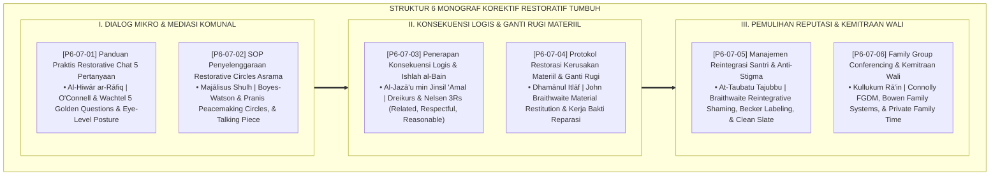

# P6-07: DOKUMEN INDUK STRATEGI KOREKTIF RESTORATIF DAN KONSEKUENSI LOGIS
## *Arsitektur dan Rekayasa Sistem Korektif Restoratif Terpadu, Dialog Mikro 5 Pertanyaan Emas, Penyelenggaraan Lingkaran Restoratif Asrama, Penegakan Konsekuensi Logis 3R, Restitusi Kerusakan Fisik/Finansial, Manajemen Reintegrasi Anti-Stigma, Serta Family Group Conferencing (Restorative Chat Form PRC, Circles SOP Form SRC, Logical Consequences Form PKL, Material Restitution Form PRM, Reintegration Shield Form MRS, Serta FGC Partnership Form FGC) di Ekosistem TUMBUH Pesantren*

**Nomor Identifikasi**: `P6-07/DOKUMEN-INDUK-KOREKTIF-RESTORATIF-KONSEKUENSI/2026`  
**Domain**: `06 Intervention Framework` > `07 Corrective Strategies` (Gugus Sub-Domain 07: *Comprehensive Whole-School Restorative Justice, Logical Consequences, & Family Conferencing*)  
**Klasifikasi Naskah**: *Master Architecture & Navigation Monograph* (Dokumen Induk Peta Jalan Riset & Navigasi 6 Monograf Ilmiah Strategi Korektif Restoratif dan Konsekuensi Logis)  
**Rumpun Disiplin Pengkaji**: Keadilan Restoratif Komunal (*Whole-School Restorative Justice*), Disiplin Positif (*Positive Discipline 3Rs*), Mediasi Perdamaian Asrama, Fiqh As-Sulh wal Ishlah  

---

> ### 💡 INTISARI EKSEKUTIF (EXECUTIVE SUMMARY)
>
> * **Kedudukan Strategis Gugus Strategi Korektif Restoratif dan Konsekuensi Logis:**  
>   Gugus *Corrective Strategies (Strategi Korektif Restoratif dan Konsekuensi Logis)* merupakan inti pemulihan keadilan dan martabat (*The Restorative Justice & Healing Core*) dalam ekosistem TUMBUH. Gugus ini merombak total paradigma hukuman konvensional yang represif, mempermalukan, dan membalas dendam menjadi proses penegakan disiplin yang mendidik, menyembuhkan luka batin, dan memulihkan kerukunan: **Restorative Chat 5 Pertanyaan (Form PRC)**, **SOP Restorative Circles Asrama (Form SRC)**, **Konsekuensi Logis 3R (Form PKL)**, **Restorasi Kerusakan Materiil (Form PRM)**, **Reintegrasi Anti-Stigma (Form MRS)**, dan **Family Group Conferencing (Form FGC)**.
> * **Integrasi Holistik Turats & Konsensus Sains Korektif Restoratif:**  
>   Gugus riset ini memadukan khazanah agung Islam tentang dialog penuh hikmah (*Al-Hiwār ar-Rāfiq*), perdamaian persaudaraan (*Ishlāhu Dzātil Bain*), balasan yang setara dan mendidik (*Al-Jazā'u min Jinsil 'Amal*), kewajiban ganti rugi perusakan (*Dhamānul Itlāf*), taubat suci yang menghapus catatan lalu (*At-Taubatu Tajubbu Mā Qablahā*), dan amanah keluarga (*Kullukum Rā'in*) dengan konsensus sains dunia (*O'Connell & Wachtel 5 Restorative Questions, Boyes-Watson & Pranis Peacemaking Circles, Nelsen 3Rs Logical Consequences, Braithwaite Material Restitution & Reintegrative Shaming, Becker Labeling Theory, dan Connolly & Morris FGDM*).
> * **Struktur Lengkap 6 Berkas Monograf Riset Ilmiah:**  
>   Dokumen induk ini memetakan dan menghubungkan 6 berkas monograf penelitian akademik komprehensif (~175 KB total riset) yang menyajikan protokol dialog mikro 3 menit, ritual tasbih adab lingkaran kamar, matriks kesepadanan sanksi 3R, akad kerja bakti teknisi, deklarasi lembaran baru, dan pakta sinergi asrama-rumah.

---

## 📑 PETA NAVIGASI ENAM MONOGRAF RISET STRATEGI KOREKTIF RESTORATIF

Berikut adalah daftar lengkap 6 monograf riset akademik dalam gugus **`07 Corrective Strategies`**:

---

## 📚 DESKRIPSI RINGKAS 6 BERKAS MONOGRAF

1. **[P6-07-01: Panduan Praktis Restorative Chat 5 Pertanyaan](file:///c:/xampp/htdocs/tumbuh/06%20Intervention%20Framework/07%20Corrective%20Strategies/P6-07-01-Panduan-Praktis-Restorative-Chat-5-Pertanyaan.md)**  
   *Membahas de-eskalasi konflik mikro instan 3-5 menit di lokasi kejadian, doktrin Al-Hiwar ar-Rafiq Nabawi, Terry O'Connell 5 Restorative Questions, eliminasi pertanyaan 'Kenapa', dan form Form PRC-Chat.*
2. **[P6-07-02: SOP Penyelenggaraan Restorative Circles Asrama](file:///c:/xampp/htdocs/tumbuh/06%20Intervention%20Framework/07%20Corrective%20Strategies/P6-07-02-SOP-Penyelenggaraan-Restorative-Circles-Asrama.md)**  
   *Membahas mediasi konflik komunal kamar asrama, doktrin Majalisus Shulh & Ishlah Dzabil Bain, Carolyn Boyes-Watson & Kay Pranis Peacemaking Circles, ritual tasbih adab (Talking Piece), dan form Form SRC-Circles.*
3. **[P6-07-03: Penerapan Konsekuensi Logis dan Ishlah al-Bain](file:///c:/xampp/htdocs/tumbuh/06%20Intervention%20Framework/07%20Corrective%20Strategies/P6-07-03-Penerapan-Konsekuensi-Logis-dan-Ishlah-al-Bain.md)**  
   *Membahas penegakan sanksi edukatif terstandar, doktrin Al-Jaza'u min Jinsil 'Amal, Jane Nelsen 3Rs (Related, Respectful, Reasonable), eliminasi hukuman fisik/mempermalukan, dan form Form PKL-Konsekuensi.*
4. **[P6-07-04: Protokol Restorasi Kerusakan Materiil dan Ganti Rugi](file:///c:/xampp/htdocs/tumbuh/06%20Intervention%20Framework/07%20Corrective%20Strategies/P6-07-04-Protokol-Restorasi-Kerusakan-Materiil-dan-Ganti-Rugi.md)**  
   *Membahas akuntabilitas ganti rugi fasilitas rusak, doktrin Dhamanul Itlaf & Al-Ghurmu bil Ghunmi, John Braithwaite Material Restitution, eliminasi ketergantungan denda ortu, kerja reparasi santri, dan form Form PRM-Restorasi.*
5. **[P6-07-05: Manajemen Reintegrasi Santri Pasca-Konflik dan Anti-Stigma](file:///c:/xampp/htdocs/tumbuh/06%20Intervention%20Framework/07%20Corrective%20Strategies/P6-07-05-Manajemen-Reintegrasi-Santri-Pasca-Konflik-Anti-Stigma.md)**  
   *Membahas protokol penyambutan kembali santri pasca-sanksi, doktrin At-Taubatu Tajubbu Ma Qablaha & Sitrul 'Aurat, John Braithwaite Reintegrative Shaming, Howard Becker Labeling Theory, Clean Slate Protocol, dan form Form MRS-Reintegrasi.*
6. **[P6-07-06: Protokol Family Group Conferencing dan Kemitraan Wali](file:///c:/xampp/htdocs/tumbuh/06%20Intervention%20Framework/07%20Corrective%20Strategies/P6-07-06-Protokol-Family-Group-Conferencing-dan-Kemitraan-Wali.md)**  
   *Membahas musyawarah terpadu keluarga-pesantren untuk kasus berat, doktrin Kullukum Ra'in, Marie Connolly Family Group Decision Making (FGDM), Private Family Time, penyelarasan pola asuh asrama-rumah, dan form Form FGC-Kemitraan.*

---

## 🎯 STANDAR PENJAMINAN MUTU STRATEGI KOREKTIF RESTORATIF

Penerapan gugus **Strategi Korektif Restoratif dan Konsekuensi Logis (Corrective Strategies)** menjamin bahwa:
1. **Disiplin Ditegakkan Tanpa Kekerasan, Dendam, Maupun Trauma Batin (*Firm, Kind, & Trauma-Free Discipline*)**: Menghilangkan sanksi fisik dan bentakan kasar yang merusak psikologis santri.
2. **Setiap Pelanggaran Diselesaikan Melalui Tanggung Jawab Nyata dan Perbaikan Kerusakan (*Authentic Accountability & Restitution*)**: Santri terlatih mengakui kesalahan, memperbaiki kerusakan fasilitas, dan memulihkan luka hati sesama.
3. **Komunitas Asrama Senantiasa Hidup dalam Ukhuwah dan Pintu Taubat yang Terbuka Lebar (*Compassionate Residential Community*)**: Santri yang pernah tersandung kekhilafan disambut kembali dengan mulia, bebas dari stigma abadi, dan didukung penuh oleh keluarga serta pengasuh.
