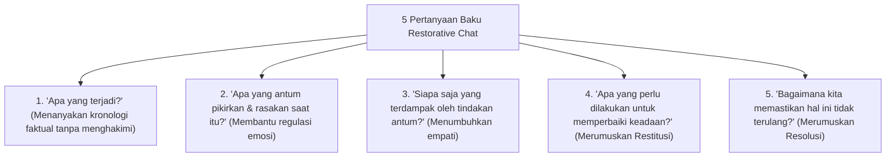

# P6-07: Strategi Korektif Restoratif dan Konsekuensi Logis

## Status Dokumen
* **Status**: 🌟 **A+ (Tervalidasi & Siap Diimplementasikan)**
* **Sub-Domain**: `06 Intervention Framework / 07 Corrective Strategies`
* **Penanggung Jawab Keilmuan**: Dewan Keilmuan TUMBUH (*Pakar Arsitektur PBIS Restoratif & Pakar Bimbingan Konseling*)

---

## 1. Panduan Restorative Chat (Dialog Restoratif 1-on-1)

Restorative Chat adalah percakapan pembinaan singkat 5-10 menit antara Musyrif dan Santri saat terjadi pelanggaran adab ringan/sedang:

---

## 2. Pelaksanaan Restorative Circle (Lingkaran Pemulihan Ukhuwah)

Untuk kasus perselisihan antar santri atau pelanggaran kelompok:
- Musyrif memfasilitasi lingkaran dialog di tempat tertutup.
- Seluruh pihak menyampaikan pandangan secara bergantian dengan *Talking Piece* (benda penanda giliran bicara).
- Menyepakati **Dokumen Pemulihan Ukhuwah (*Ishlah al-Bain Agreement*)** yang ditandatangani bersama.
