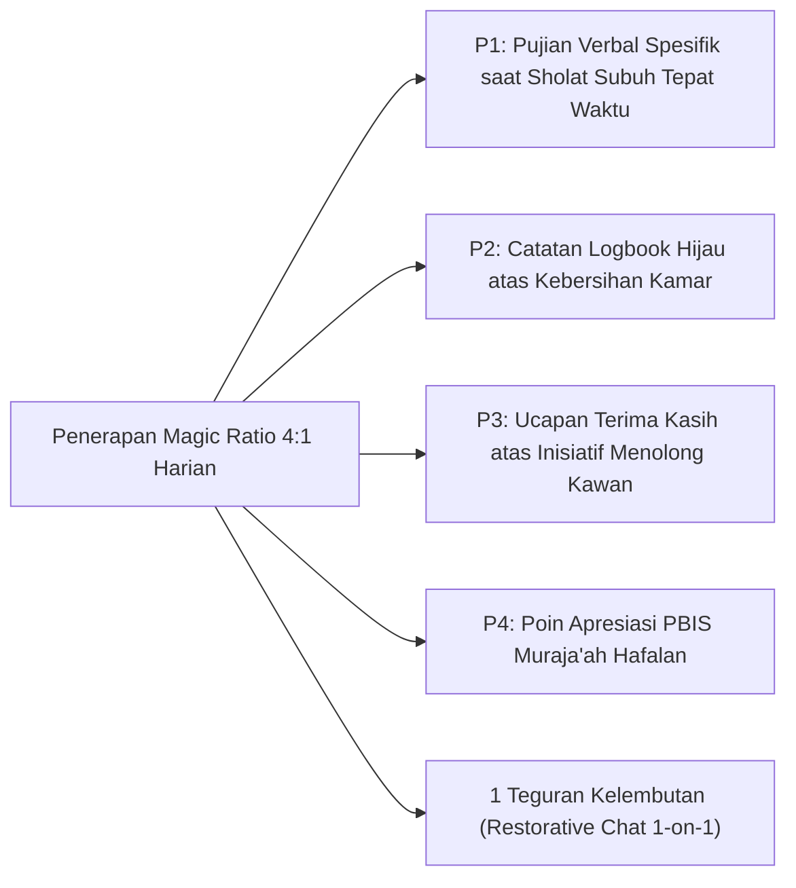

# P6-08-01: Operasionalisasi Magic Ratio 4:1 dalam Pengasuhan

## Status Dokumen
* **Status**: 🌟 **A+ (Tervalidasi & Siap Diimplementasikan)**
* **Sub-Domain**: `06 Intervention Framework / 08 Reinforcement`
* **Penanggung Jawab Keilmuan**: Dewan Keilmuan TUMBUH (*Pakar Arsitektur PBIS Restoratif & Pakar Pengasuhan Asrama*)

---

## 1. Implementasi Magic Ratio 4:1 oleh Musyrif & Guru

Penerapan Magic Ratio 4:1 mewajibkan pengasuh memberikan **minimal 4 bentuk penguatan positif** atas kebaikan/kemajuan santri untuk **setiap 1 bentuk teguran kelembutan**:

---

## 2. Dampak Psikologis pada Iklim Asrama

Penguatan positif berulang meningkatkan *self-efficacy*, menurunkan kecemasan emosional, dan menumbuhkan rasa dicintai oleh pengasuh.
