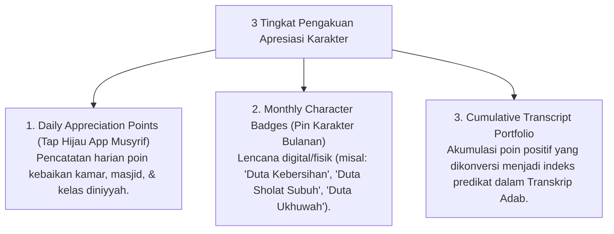

# P6-08-02: Sistem Poin Apresiasi dan Portofolio Karakter PBIS

## Status Dokumen
* **Status**: 🌟 **A+ (Tervalidasi & Siap Diimplementasikan)**
* **Sub-Domain**: `06 Intervention Framework / 08 Reinforcement`
* **Penanggung Jawab Keilmuan**: Dewan Keilmuan TUMBUH (*Pakar Arsitektur Digital Pesantren & Pakar Desain Kurikulum Adab*)

---

## 1. Arsitektur Sistem Poin Apresiasi PBIS Digital

Sistem PBIS mencatat setiap tindakan adab dan inisiatif positif santri ke dalam **Portofolio Karakter Digital**:

---

## 2. Penghapusan Sistem Denda Uang / Sanksi Fisik

Sistem PBIS menggantikan tradisi denda uang atau sanksi fisik dengan **Sistem Penguatan Positif & Konsekuensi Logis Restoratif**.
