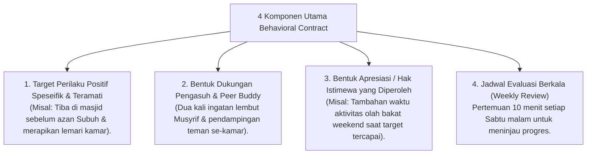

# P6-08-03: Penyusunan dan Monitoring Behavioral Contract

## Status Dokumen
* **Status**: 🌟 **A+ (Tervalidasi & Siap Diimplementasikan)**
* **Sub-Domain**: `06 Intervention Framework / 08 Reinforcement`
* **Penanggung Jawab Keilmuan**: Dewan Keilmuan TUMBUH (*Pakar Bimbingan Konseling & Pakar Arsitektur PBIS Restoratif*)

---

## 1. Operasionalisasi Behavioral Contract (Kontrak Perilaku)

Behavioral Contract adalah kesepakatan tertulis dua arah antara Musyrif/Konselor BK dan Santri peserta Tier 2/3 untuk **memfokuskan perbaikan 2 target adab spesifik**:

---

## 2. Jangka Waktu & Graduasi Kontrak

Behavioral Contract berlaku selama 2 hingga 4 pekan dan dapat diperpanjang atau dinyatakan selesai (*Graduasi*) berdasarkan capaian skor CICO $\ge$ 80%.
