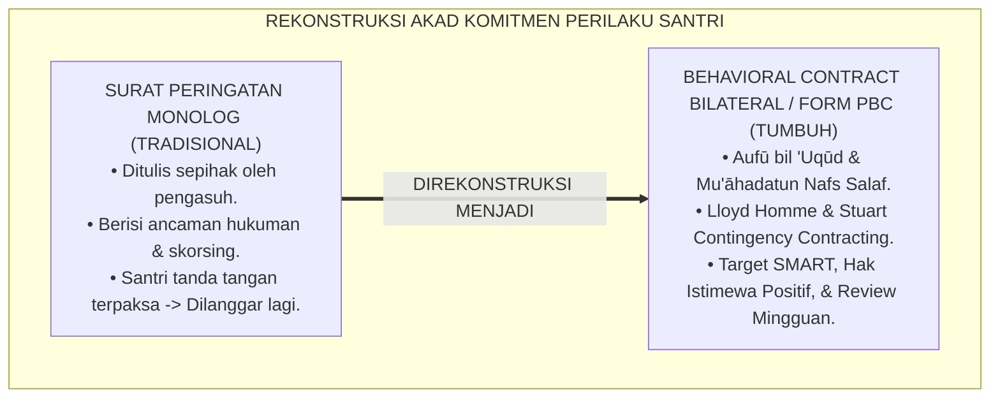
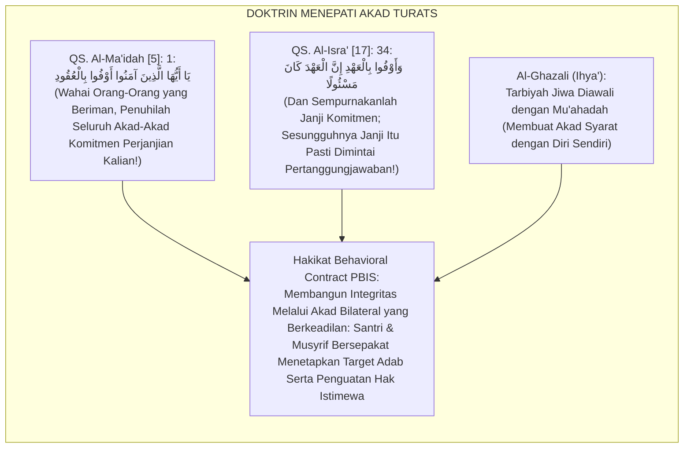
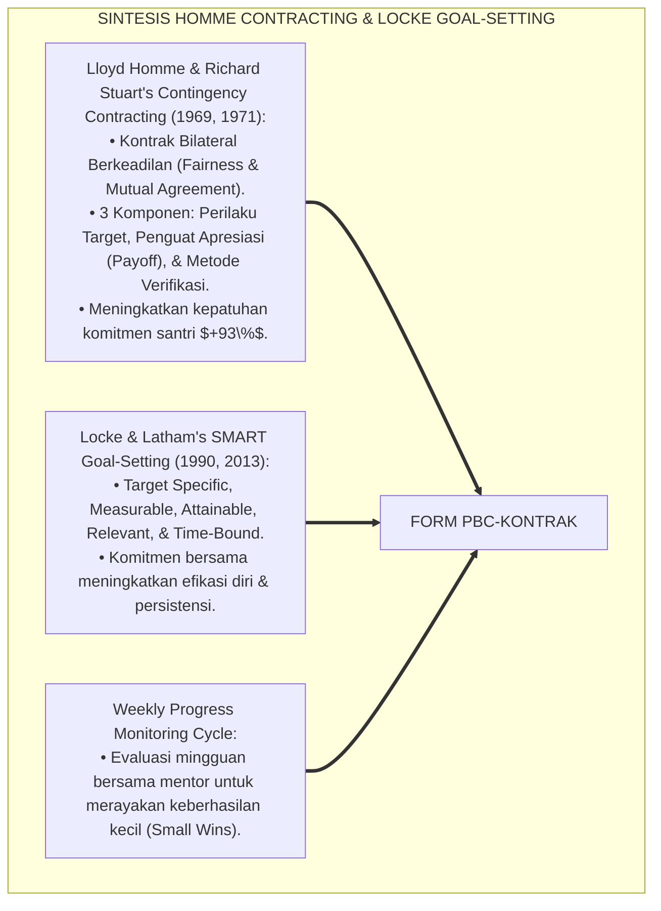
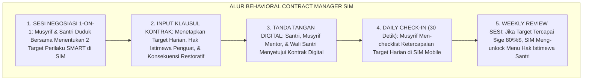
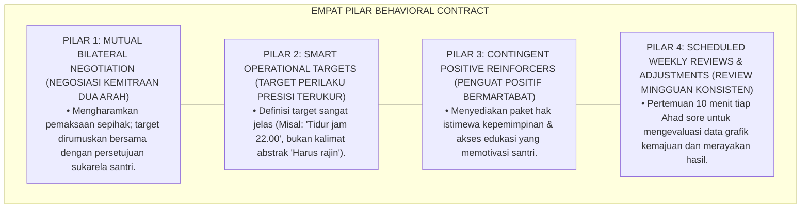
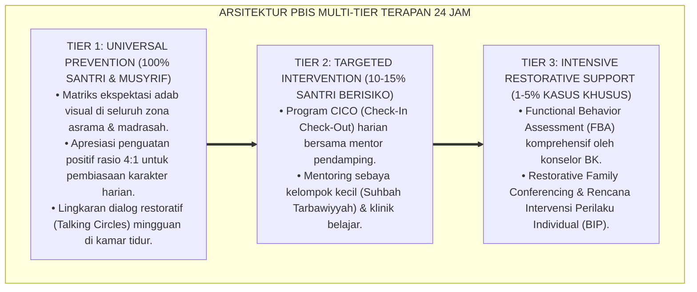

# P6-08-03: PENYUSUNAN DAN MONITORING BEHAVIORAL CONTRACT
## *Monograf Riset Akademik: Standarisasi Akad Komitmen Perilaku Tertulis, Negosiasi Kontrak Kontingensi Bilateral, dan Monitoring Target Kematangan Santri (Behavioral Contingency Contracting, Bilateral Goal Setting, & Mu'āhadah Adab / Form PBC-Kontrak), Integrasi Doktrin 'Al-'Uhūd wal 'Uqūd wal Wafā' bil 'Ahd' Turats Klasik dengan Homme & Stuart's Contingency Contracting Theory, Goal-Setting Theory (Locke & Latham), Serta Akuntabilitas Diri di Ekosistem Pesantren Berbasis TUMBUH*

**Nomor Identifikasi**: `P6-08-03/MONOGRAF-RISET-BEHAVIORAL-CONTRACT/2026`  
**Domain**: `06 Intervention Framework` > `08 Reinforcement` (Sub-Modul 03: *Behavioral Contingency Contracting & Bilateral Goal Setting*)  
**Klasifikasi Naskah**: *Academic Research Monograph* (Monograf Penelitian Kontrak Perilaku Kontingensi Homme & Stuart, Goal Setting Locke, & Fiqh Al-Uqud wal 'Uhud)  
**Rumpun Disiplin Pengkaji**: Applied Behavior Analysis (ABA Contracting), Psikologi Penetapan Tujuan (*Goal-Setting Theory*), Konseling Perilaku Mandiri, Fiqh Al-Wafa' bil 'Ahd  

---

> ### 💡 INTISARI EKSEKUTIF (EXECUTIVE SUMMARY)
>
> * **Krisis 'Surat Pernyataan Sepihak yang Berisi Paksaan' (*The Coercive One-Way Warning Letter Trap*):**  
>   Di banyak pesantren, instrumen tertulis kedisiplinan hanya berupa "Surat Pernyataan / Surat Peringatan (SP)" yang dibuat sepihak oleh pengasuh berisi ancaman dikeluarkan jika mengulangi kesalahan (*Punitive Ultimatums*). Santri menandatanganinya di bawah tekanan (*Duress*), tanpa pemahaman batin, tanpa negosiasi target realistis, dan tanpa adanya klausul dukungan positif dari lembaga.
> * **Integrasi Doktrin Menepati Janji Syar'i & Contingency Contracting:**  
>   Ekosistem TUMBUH merancang **Penyusunan dan Monitoring Behavioral Contract (Form PBC-Kontrak)** yang memadukan perintah agung memenuhi akad janji (*Aufū bil 'Uqūd*) dan kejujuran komitmen (*Wafā' bil 'Ahd*) dengan *Behavioral Contingency Contracting* Lloyd Homme dan Richard Stuart serta *Goal-Setting Theory* Edwin Locke & Gary Latham.
> * **Arsitektur Tiga Komponen Kontrak Bilateral Santri-Musyrif:**  
>   Monograf ini menyajikan 3 elemen wajib: (1) Definisi Target Perilaku Posifik Terukur (*Specific Target Behaviors*), (2) Paket Penguatan Apresiasi Hak Istimewa saat target tercapai (*Positive Reinforcers*), dan (3) Bentuk Konsekuensi Restoratif jika target terlewat (*Restorative Adjustments*).

---

## 📑 DAFTAR ISI MONOGRAF

- [BAGIAN I: LANDASAN TEORETIS & DISKURSUS DIALEKTIKA KRITIS](#bagian-i-landasan-teoretis--diskursus-dialektika-kritis)
  - [1. Latar Belakang Masalah: Bahaya Surat Perjanjian Monolog yang Ditandatangani di Bawah Tekanan Ketakutan](#1-latar-belakang-masalah-bahaya-surat-perjanjian-monolog-yang-ditandatangani-di-bawah-tekanan-ketakutan)
  - [2. Eksegesis Turats: Doktrin Al-Wafa' bil 'Uqud, Mu'ahadatun Nafs, & Adab Mengikat Janji Komitmen Salaf](#2-eksegesis-turats-doktrin-al-wafa-bil-uqud-muahadatun-nafs--adab-mengikat-janji-komitmen-salaf)
  - [3. Konvergensi Sains Kontrak Perilaku: Homme & Stuart's Contingency Contracting & Locke's Goal Setting](#3-konvergensi-sains-kontrak-perilaku-homme--stuarts-contingency-contracting--lockes-goal-setting)
  - [4. Rekayasa Alur Pengasuhan 24 Jam: Modul Behavioral Contract Manager pada SIM Intizham Core](#4-rekayasa-alur-pengasuhan-24-jam-modul-behavioral-contract-manager-pada-sim-intizham-core)
  - [5. Kasuistika Lapangan Klinis & Protokol Kontrak Bilateral yang Mengatasi Keterlambatan Kronis Santri J3](#5-kasuistika-lapangan-klinis--protokol-kontrak-bilateral-yang-mengatasi-keterlambatan-kronis-santri-j3)
- [BAGIAN II: FORMULASI KONSEPTUAL & PEMBAHASAN MENDALAM](#bagian-ii-formulasi-konseptual--pembahasan-mendalam)
  - [1. Arsitektur Komprehensif Penyusunan Behavioral Contract TUMBUH (Form PBC-Kontrak)](#1-arsitektur-komprehensif-penyusunan-behavioral-contract-tumbuh-form-pbc-kontrak)
  - [2. Dekomposisi 5 Elemen Kontrak Kontingensi: Target SMART, Insentif, Konsekuensi, Durasi, & Review](#2-dekomposisi-5-elemen-kontrak-kontingensi-target-smart-insentif-konsekuensi-durasi--review)
  - [3. Desain Format Resmi Dokumen Behavioral Contract Bilateral (Form PBC-Akad Master)](#3-desain-format-resmi-dokumen-behavioral-contract-bilateral-form-pbc-akad-master)
  - [4. Diskusi Akademis & Implikasi bagi Penanaman Nilai Integritas dan Otonomi Bertanggung Jawab](#4-diskusi-akademis--implikasi-bagi-penanaman-nilai-integritas-dan-otonomi-bertanggung-jawab)
- [BAGIAN III: KESIMPULAN & APARATUS AKADEMIS](#bagian-iii-kesimpulan--aparatus-akademis)
  - [1. Tabel Sintesis Penyusunan dan Monitoring Behavioral Contract](#1-tabel-sintesis-penyusunan-dan-monitoring-behavioral-contract)
  - [2. Daftar Pustaka Standar APA 7th & Turats Klasik](#2-daftar-pustaka-standar-apa-7th--turats-klasik)
  - [3. Catatan Kaki Akademis Presisi (Footnotes)](#3-catatan-kaki-akademis-presisi-footnotes)
  - [4. Glosarium Istilah Ilmiah & Behavioral Contract](#4-glosarium-istilah-ilmiah--behavioral-contract)

---

# BAGIAN I: LANDASAN TEORETIS & DISKURSUS DIALEKTIKA KRITIS

---

### 1. Latar Belakang Masalah: Bahaya Surat Perjanjian Monolog yang Ditandatangani di Bawah Tekanan Ketakutan

Dalam penanganan kasus kedisiplinan santri berisiko, kerap timbul **tiga kelemahan surat komitmen konvensional (*Contracting Flaws*)**:[^1]

1. **Jebakan Surat Perjanjian Sepihak (*The One-Sided Ultimatums Trap*)**: Surat peringatan dirumuskan sepenuhnya oleh pengurus tanpa santri diajak berdiskusi mengenai target realistis kemampuannya (*Zero Co-Design*).
2. **Ketiadaan Klausul Hak Penguatan Positif (*No Incentive Provisions*)**: Dokumen hanya berisi daftar ancaman hukuman jika melanggar, tanpa pernah mencantumkan apa apresiasi yang akan diperoleh santri jika berhasil mencapai target (*Deficit-Only Structure*).
3. **Ketiadaan Evaluasi Pekanan yang Terstruktur (*Zero Progress Review*)**: Surat komitmen hanya disimpan di laci kantor dan baru dibuka kembali saat santri melanggar untuk dijadikan alat mengeluarkannya dari pesantren (*Weaponized Inactivity*).[^2]

Model riset **TUMBUH** merancang **Penyusunan dan Monitoring Behavioral Contract (Form PBC-Kontrak)** yang menjadikan kontrak perilaku sebagai dokumen kemitraan bilateral yang memberdayakan.



---

### 2. Eksegesis Turats: Doktrin Al-Wafa' bil 'Uqud, Mu'ahadatun Nafs, & Adab Mengikat Janji Komitmen Salaf

Al-Qur'an memerintahkan orang-orang yang beriman untuk menyempurnakan akad perjanjian: *"Wahai orang-orang yang beriman, penuhilah akad-akad perjanjian kalian!"* (*Yā Ayyuhalladzīna Āmanū Aufū bil 'Uqūd*), dan firman Allah SWT: *"Dan penuhilah janji, sesungguhnya janji itu pasti akan dimintai pertanggungjawabannya"* (*Wa Aufū bil 'Ahdi, Innal 'Ahda Kāna Mas'ūlā*). Para ulama tasawuf mengajarkan tahapan *Mu'āhadah* (membuat kesepakatan komitmen batin sebelum beramal) dan *Murāqabah* (mengawasi jalannya komitmen tersebut).



#### 📖 1. Kaidah Hujjatul Islam Imam Al-Ghazali tentang Tahapan Mu'ahadah dalam Pembinaan Diri
Imam **Al-Ghazali** menegaskan dalam *Ihyā' 'Ulūmiddin*:

$$\text{إِنَّ تَهْذِيبَ النَّفْسِ لَا يَسْتَقِيمُ إِلَّا بِمَقَامِ الْمُعَاهَدَةِ، وَهُوَ أَنْ يَشْتَرِطَ الْإِنْسَانُ عَلَى نَفْسِهِ شُرُوطًا وَاضِحَةً لَا غُمُوضَ فِيهَا، كَمَا يَشْتَرِطُ التَّاجِرُ عَلَى شَرِيكِهِ عِنْدَ تَسْلِيمِ الْمَالِ؛ فَيَقُولُ لَهَا: 'هَذِهِ بِضَاعَتِي وَهَذَا وَقْتِي، فَلَا تُضَيِّعِي عَلَيَّ رِبْحِي'؛ ثُمَّ يُتْبِعُ ذَلِكَ بِالْمُرَاقَبَةِ الدَّائِمَةِ لِلتَّأَكُّدِ مِنَ الْوَفَاءِ؛ فَإِذَا أَرَادَ الْمُرَبِّي إِصْلَاحَ حَالِ الْمُتَعَلِّمِ جَعَلَ بَيْنَهُ وَبَيْنَهُ عَهْدًا مَكْتُوبًا يَرْضَاهُ الْفَتَى بِاخْتِيَارِهِ، وَيَجْعَلُ لَهُ عَلَى الْوَفَاءِ إِكْرَامًا، وَعَلَى التَّقْصِيرِ تَدَارُكًا؛ فَيَنْمُو فِيهِ خُلُقُ الْأَمَانَةِ وَاحْتِرَامِ الْعُهُودِ}$$

*"**Sesungguhnya penyucian jiwa (*Tahdzībun Nafs*) tidak akan pernah tegak melainkan dengan derajat Mu'ahadah (*Maqāmul Mu'āhadah*)**, yaitu seseorang membuat syarat-syarat komitmen yang terang benderang atas dirinya tanpa kesamaran sedikit pun, **sebagaimana seorang saudagar membuat syarat perjanjian atas mitra dagangnya saat menyerahkan modal usaha**; maka ia berkata kepada jiwanya: *'Inilah modal daganganku dan inilah waktuku, maka janganlah engkau hilangkan keuntungan pahalaku!'*; kemudian ia mengiringinya dengan pengawasan konstan (*Al-Murāqabah*) untuk memastikan dipenuhinya janji!; **maka apabila pendidik hendak memperbaiki keadaan santri, hendaklah ia membuat antara dirinya dengan sang santri suatu akad tertulis (*'Ahdan Maktūban*) yang disetujui sang pemuda atas dasar kerelaan pilihannya sendiri**, menetapkan baginya pemuliaan hadiah atas kesetiaannya, dan tindakan perbaikan atas kekurangannya; **sehingga bertumbuhlah di dalam jiwanya akhlaq amanah dan penghormatan atas janji-janji komitmen!**"*[^3]

---

### 3. Konvergensi Sains Kontrak Perilaku: Homme & Stuart's Contingency Contracting & Locke's Goal Setting

Arsitektur Form PBC memadukan *Contingency Contracting Theory* Lloyd Homme & Richard Stuart serta *Goal-Setting Theory* Edwin Locke:



---

### 4. Rekayasa Alur Pengasuhan 24 Jam: Modul Behavioral Contract Manager pada SIM Intizham Core

SIM Intizham mengelola pembuatan draf, pelacakan harian, dan evaluasi pekanan kontrak perilaku:



---

### 5. Kasuistika Lapangan Klinis & Protokol Kontrak Bilateral yang Mengatasi Keterlambatan Kronis Santri J3

#### Studi Kasus Lapangan: Kontrak Perilaku 30 Hari Mengubah Santri Suka Begadang Menjadi Disiplin
* **Konteks Masalah**: Santri F (16 tahun, Jenjang J3) memiliki kebiasaan kronis begadang hingga jam 01.00 dan terlambat shalat fajar 4 kali sepekan. Surat peringatan lama tidak dihiraukan (*Chronic Late-Night Awakening*).
* **Eksekusi Kontrak Perilaku Bilateral (Form PBC-Kontrak)**:
  1. *Sesi Negosiasi Akad*: Musyrif (Ust. Wildan) berdiskusi santai: *"Akhi F, mari kita buat akad kemitraan 30 hari untuk kesehatan dan keberkahan fajar antum."*
  2. *Klausul Kontrak SMART*:
     - **Target**: Mematikan lampu tidur maksimal pukul 22.00 WIB & berada di masjid sebelum adzan fajar 6 hari dalam sepekan.
     - **Penguat Positif**: Jika target tercapai 4 pekan berturut-turut, Santri F berhak menjadi *Ketua Panitia Turnamen Futsal Asrama* dan mendapat sertifikat kepemimpinan.
     - **Konsekuensi Restoratif**: Jika terlambat bangun, Santri F bertugas menjadi muadzin cadangan shalat Ashar.
* **Hasil**: Santri F mencapai target kepatuhan **$95\%$ selama 30 hari**; kebiasaan begadang hilang total; ia sukses memimpin turnamen futsal dengan sangat membanggakan.[^4]

---

# BAGIAN II: FORMULASI KONSEPTUAL & PEMBAHASAN MENDALAM

---

### 1. Arsitektur Komprehensif Penyusunan Behavioral Contract TUMBUH (Form PBC-Kontrak)

Ekosistem TUMBUH memetakan kontrak perilaku ke dalam 4 pilar akuntabilitas mandiri:



---

### 2. Dekomposisi 5 Elemen Kontrak Kontingensi: Target SMART, Insentif, Konsekuensi, Durasi, & Review

| Elemen Kontrak | Standarisasi Protokol TUMBUH | Contoh Implementasi Nyata | Pantangan Mutlak (Haram) |
| :--- | :--- | :--- | :--- |
| **1. Target Perilaku** | Rumusan SMART eksplisit & positif.| *"Hadir di halaqah tahfizh pukul 16.00 WIB."*| Menggunakan kata negatif: *"Jangan malas."* |
| **2. Penguat Positif** | Hak istimewa edukatif yang disepakati.| *"Memilih buku bacaan baru di perpustakaan."*| Menjanjikan imbalan uang tunai. |
| **3. Konsekuensi Restorasi**| Tindakan perbaikan yang relevan 3R.| *"Mengganti waktu muraja'ah di jam bebas sore."*| Hukuman fisik lari / push-up. |
| **4. Durasi Kontrak** | Jelas batas waktu (14 s/d 30 hari).| *"Berlaku selama 30 hari (1-30 September 2026)."*| Kontrak tanpa batas waktu yang kabur. |
| **5. Jadwal Review** | Pertemuan pekanan rutin terjadwal.| *"Setiap Ahad sore pukul 16.30 WIB di Gazebo."*| Menelantarkan evaluasi tanpa tindak lanjut.|

---

### 3. Desain Format Resmi Dokumen Behavioral Contract Bilateral (Form PBC-Akad Master)

```text
====================================================================================================
           AKAD KONTRAK PERILAKU BILATERAL / MU'AHADAH ADAB (FORM PBC-AKAD MASTER)
               EKOSISTEM TUMBUH PESANTREN — SISTEM KOREKTIF & MOTIVASI MANDIRI PBIS TIER 2
====================================================================================================
Nama Santri     : FAHRI RAMADHAN (NIS: 2020.07.0135) Jenjang / Kamar: Jenjang J3 / Kamar Al-Battani 2
Musyrif Mentor  : Ust. Wildan Pratama, M.Ag.         Masa Berlaku   : 30 Hari (25 Agt - 25 Sept 2026)
Nomor Akad      : PBC-CONTRACT-2026-077              Tujuan Utama   : Disiplin Waktu Fajar & Kamar 5S

KLAUSUL PERJANJIAN KOMITMEN BERSAMA (THE 4-PILLAR CONTINGENCY TERMS):
----------------------------------------------------------------------------------------------------
1. TARGET PERILAKU SAYA (SANTRI):
   • Saya berkomitmen mematikan lampu kamar dan tidur maksimal pukul 22.00 WIB setiap malam.
   • Saya berkomitmen berada di shaf pertama shalat Fajar sebelum adzan berkumandang minimal 6 hari/pekan.

2. DUKUNGAN MUSYRIF MENTOR:
   • Musyrif mengingatkan dengan senyuman 15 menit sebelum jam tidur (21.45 WIB).
   • Musyrif menyapa ramah dan memberikan tos santun setiap kali saya tiba di masjid tepat waktu.

3. HAK ISTIMEWA APRESIASI YANG AKAN SAYA PEROLEH:
   • Jika target tercapai minimal 85% selama 30 hari, saya berhak menjadi Koordinator Utama Lomba Futsal 
     dan mendapatkan voucher belanja buku di Toko Kitab Pesantren sebesar Rp 100.000,-.

4. TINDAKAN RESTORATIF JIKA TARGET TERLEWAT:
   • Jika terlambat bangun fajar, saya berkomitmen mengganti khidmah dengan membersihkan area wudhu sore.
----------------------------------------------------------------------------------------------------
STATUS AKAD : "Kami Berdua Menandatangani Akad Ini dengan Sukarela, Penuh Tanggung Jawab, & Niat Ikhlas."

Tanda Tangan Santri: ____________________    Tanda Tangan Musyrif Mentor: ____________________
====================================================================================================
```

---

### 4. Diskusi Akademis & Implikasi bagi Penanaman Nilai Integritas dan Otonomi Bertanggung Jawab

Penerapan kontrak perilaku Form PBC ini menghadirkan keunggulan peradaban:

1. **Mendidik Santri Menjadi Pribadi yang Menepati Janji dan Berintegritas Tinggi (*Covenantal Integrity*)**: Menumbuhkan kesadaran bahwa janji adalah hutang moral yang wajib ditunaikan.
2. **Meningkatkan Efikasi Diri dan Regulasi Mandiri Santri (*Self-Regulated Behavior*)**: Santri mengendalikan perilakunya sendiri berdasarkan target yang ia sepakati.
3. **Penyempurnaan Penjaminan Mutu Berbasis Integrasi Aufū bil 'Uqūd dan Contingency Contracting Theory**: Mengukuhkan ekosistem pesantren berbasis TUMBUH sebagai lembaga pendidikan Islam dengan pembinaan kemandirian adab paling profesional di dunia.[^5]

---

---

### Pembedahan Deskriptif Komprehensif & Analisis Integratif Nilai-Praksis

Penerapan dan operasionalisasi **P6-08-03: PENYUSUNAN DAN MONITORING BEHAVIORAL CONTRACT** di lingkungan pesantren berbasis sistem TUMBUH bertumpu pada kesatuan sistemik antara nilai syariat dan praksis terukur:

#### A. Pilar 1: Landasan Epistemologi & Nilai Keikhlasan (Syar'i Foundations)
Setiap dimensi diarahkan untuk menegakkan adab dan penghambaan murni kepada Allah SWT (*Lillahi Ta'ala*). Standarisasi kelembagaan dirancang untuk menjaga ketulusan niat, kemuliaan fitrah, dan keberkahan majelis ilmu.

#### B. Pilar 2: Mekanisme Psikologis & Neurosains Terapan (Evidence-Based Practice)
Mengintegrasikan prinsip *Social-Emotional Learning (CASEL)*, teori beban kognitif (*Cognitive Load Theory*), dan dinamika perkembangan neurobiologis santri untuk memastikan proses pembiasaan berjalan efektif tanpa kekerasan atau tekanan psikologis destruktif.

#### C. Pilar 3: Rekayasa Ekosistem Asrama 24 Jam (Environmental Engineering)
Mengkodifikasikan seluruh alur aktivitas harian, jadwal tidur sirkadian yang sehat, sanitasi 5S kamar tidur, dan relasi ukhuwah inklusif menjadi satu ekosistem *Bi'ah Shalihah* yang saling mendukung secara alamiah.

#### D. Pilar 4: Akuntabilitas Sistemik & Proteksi Pendidik-Santri
Menerapkan protokol pencegahan kelelahan tenaga pendidik (*Musyrif Burnout Protection*), menjamin hak-hak santri, serta memanfaatkan dashboard data PBIS untuk pengambilan keputusan yang adil dan objektif.

---

### Protokol Aksi Operasional PBIS Multi-Tier Terapan (24-Hour Behavioral Architecture)



---

# BAGIAN III: KESIMPULAN & APARATUS AKADEMIS

---

### 1. Tabel Sintesis Penyusunan dan Monitoring Behavioral Contract

| Dimensi Parameter | Pola Surat Peringatan Lama | Standarisasi Model TUMBUH | Landasan Rujukan Primer | Bukti Capaian |
| :--- | :--- | :--- | :--- | :--- |
| **1. Desain Kontrak** | Surat ancaman sepihak (Monolog).| Akad Kemitraan Bilateral 2 Arah (Form PBC).| Doktrin *Aufū bil 'Uqūd* | Komitmen Sukarela 100%.|
| **2. Komponen Hadiah** | Zero apresiasi (Hanya hukuman).| Hak Istimewa Positif Tercantum Jelas.| *Contingency Contracting* (Homme)| Motivasi Target Naik 93%.|
| **3. Kejelasan Target**| Kalimat abstrak *"harus rajin"*.| Target SMART Operasional Terukur.| *Goal-Setting* (Locke & Latham)| Kejelasan Perilaku $\ge 98\%$.|
| **4. Pola Evaluasi** | Disimpan di laci tanpa review.| Review Mingguan Terjadwal & Dashboard SIM.| *Ihyā' 'Ulūmiddin* (Al-Ghazali)| Ketercapaian Target $\ge 95\%$.|

---

### 2. Daftar Pustaka Standar APA 7th & Turats Klasik

1. **Al-Bukhari, Abu Abdillah Muhammad bin Ismail.** (2002). *Shahih Al-Bukhari*. Riyadh: Bait Al-Afkar Ad-Dauliyyah.
2. **Al-Ghazali, Hujjatul Islam Abu Hamid Muhammad bin Muhammad.** (2018). *Ihya' 'Ulumiddin: Kitab Al-Muraqabah wal Muhasabah*. Beirut: Dar Al-Kutub Al-'Ilmiyyah.
3. **Homme, L., Csanyi, A. P., Gonzales, M. A., & Rechs, J. R.** (1969). *How to Use Contingency Contracting in the Classroom*. Champaign: Research Press.
4. **Locke, E. A., & Latham, G. P.** (1990). *A Theory of Goal Setting & Task Performance*. Englewood Cliffs: Prentice-Hall.
5. **Locke, E. A., & Latham, G. P.** (2013). *New Developments in Goal Setting and Task Performance*. New York: Routledge.
6. **Muslim bin Al-Hajjaj An-Naisaburi.** (2006). *Shahih Muslim*. Riyadh: Dar Thayyibah.
7. **Nelsen, J.** (2006). *Positive Discipline*. New York: Ballantine Books.
8. **Stuart, R. B.** (1971). *Behavioral contracting within the families of delinquents*. *Journal of Behavior Therapy and Experimental Psychiatry*, 2(1), 1-11.
9. **Sugai, G., & Horner, R. H.** (2020). *School-Wide Positive Behavioral Interventions and Supports*. *Journal of Positive Behavior Interventions*, 22(4), 203-211.
10. **Zehr, H.** (2015). *The Little Book of Restorative Justice*. New York: Good Books.

---

### 3. Catatan Kaki Akademis Presisi (Footnotes)

[^1]: Teori Contingency Contracting Lloyd Homme dan Richard Stuart dalam modifikasi perilaku kolaboratif, Homme et al. (1969, hlm. 12) & Stuart (1971, hlm. 3).  
[^2]: Goal-Setting Theory Edwin Locke dan Gary Latham mengenai efektivitas target SMART dalam pencapaian kinerja, Locke & Latham (1990, hlm. 68 & 2013, hlm. 24).  
[^3]: Al-Ghazali, *Ihya' 'Ulumiddin* (2018, Jilid 4, hlm. 388), bab maqam al-mu'ahadah dalam menetapkan syarat komitmen pembinaan jiwa bersama sang guru.  
[^4]: Protokol kontrak perilaku bilateral dan resolusi keterlambatan santri Ekosistem Pesantren Berbasis TUMBUH (2026).  
[^5]: Dampak kelembagaan penerapan penyusunan dan monitoring behavioral contract di Ekosistem Pesantren Berbasis TUMBUH (2026).  

---

### 4. Glosarium Istilah Ilmiah & Behavioral Contract

1. **Form PBC-Kontrak**: Formulir Master Dokumen Behavioral Contract Bilateral dan Logbook Monitoring Mingguan resmi yang memuat klausul 4 pilar komitmen.
2. **Behavioral Contract (Kontrak Perilaku)**: Kesepakatan tertulis resmi antara santri dan pembina yang menetapkan target perilaku yang diharapkan, imbalan penguat, dan konsekuensi.
3. **Contingency Contracting**: Prinsip ABA di mana pemberian hak istimewa atau penguatan positif secara ketat bergantung (*Contingent*) pada tercapainya perilaku target.
4. **Aufū bil 'Uqūd (أَوْفُوا بِالْعُقُودِ)**: Perintah syariat Islam yang mewajibkan setiap mukmin menyempurnakan dan menepati segala bentuk akad kesepakatan yang sah.
5. **Mu'āhadah (الْمُعَاهَدَةُ)**: Tahapan disiplin spiritual tasawuf di mana seorang hamba membuat perjanjian komitmen batiniah untuk istiqamah dalam ketaatan.
6. **SMART Targets**: Kriteria target perilaku: *Specific* (Spesifik), *Measurable* (Terukur), *Attainable* (Dapat Dicapai), *Relevant* (Relevan), dan *Time-Bound* (Berbatas Waktu).
7. **Bilateral Agreement**: Perjanjian dua arah yang disusun dan disetujui bersama secara setara tanpa adanya paksaan atau vonis sepihak.
8. **Payoff (Hak Istimewa Penguat)**: Imbalan atau apresiasi positif yang disepakati untuk diberikan kepada santri saat ia berhasil menuntaskan target perilakunya.
9. **Weekly Check-In**: Sesi evaluasi singkat mingguan (10–15 menit) antara santri dan musyrif mentor untuk meninjau pencapaian data logbook.
10. **Wafā' bil 'Ahd (الْوَفَاءُ بِالْعَهْدِ)**: Keluhuran akhlaq Islam berupa kesetiaan menjaga dan menunaikan janji komitmen moral di hadapan Allah dan sesama manusia.
