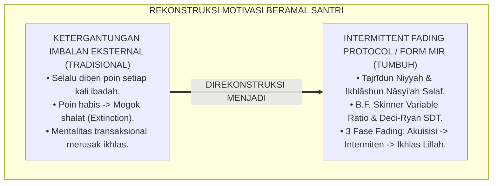
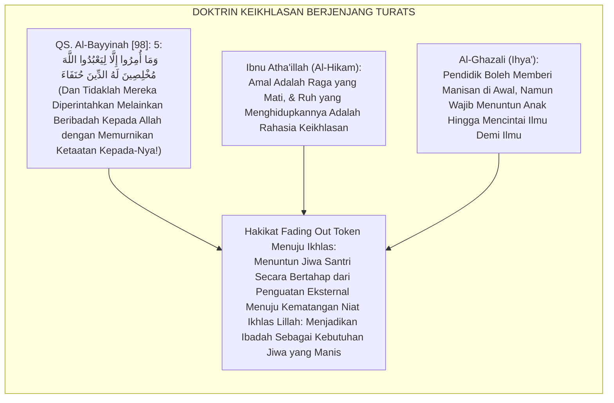
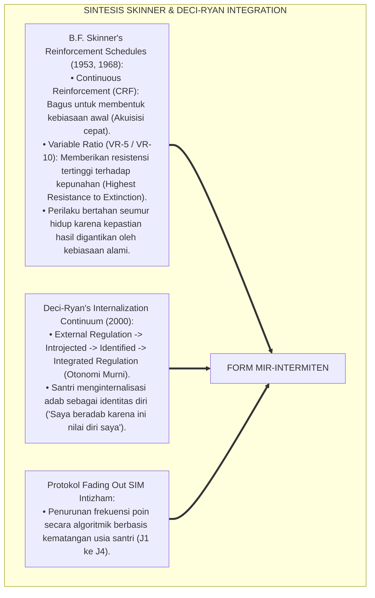
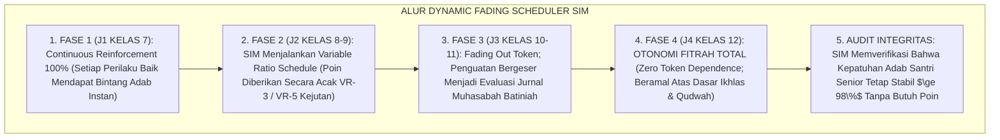
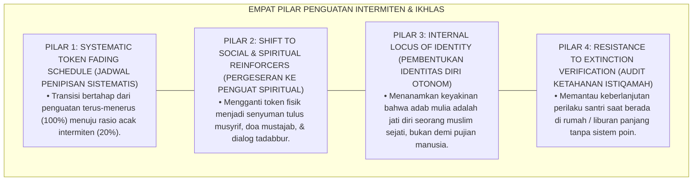
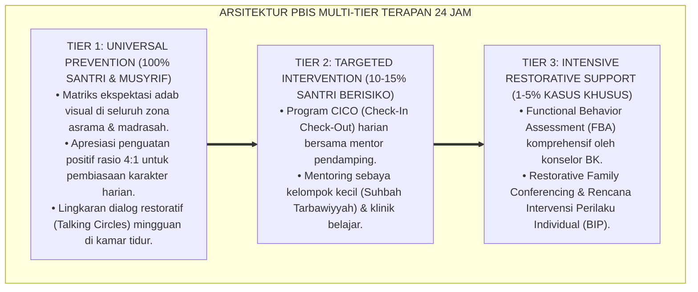

# P6-08-04: MANAJEMEN INTERMITTENT REINFORCEMENT DAN MOTIVASI INTERNAL
## *Monograf Riset Akademik: Rekayasa Penjadwalan Penguatan Intermiten, Desain Transisi Fading Token Menuju Otonomi Moral, dan Pencegahan Ketergantungan Imbalan Eksternal (Intermittent Reinforcement Schedules, Token Fading Protocols, & Intrinsic Motivation Cultivation / Form MIR-Intermiten), Integrasi Doktrin 'Ikhlāshun Niyyah wa Marātibut Tarbiyah' Turats Klasik dengan Skinner's Variable Schedules, Deci-Ryan SDT, Serta Keikhlasan di Ekosistem Pesantren Berbasis TUMBUH*

**Nomor Identifikasi**: `P6-08-04/MONOGRAF-RISET-INTERMITTENT-REINFORCEMENT/2026`  
**Domain**: `06 Intervention Framework` > `08 Reinforcement` (Sub-Modul 04: *Intermittent Reinforcement Schedules & Intrinsic Motivation Cultivation*)  
**Klasifikasi Naskah**: *Academic Research Monograph* (Monograf Penelitian Jadwal Penguatan Intermiten Skinner, Fading Token, & Fiqh Ikhlas An-Niyyah)  
**Rumpun Disiplin Pengkaji**: Applied Behavior Analysis (Schedules of Reinforcement), Psikologi Motivasi Intrinsik (Self-Determination Theory), Filsafat Pendidikan Karakter Islam, Fiqh At-Tajrid wal Ikhlas  

---

> ### 💡 INTISARI EKSEKUTIF (EXECUTIVE SUMMARY)
>
> * **Krisis 'Santri yang Mogok Ibadah Saat Hadiah Dihentikan' (*The Token Addiction & Extinction Burst Trap*):**  
>   Banyak program pembiasaan perilaku di pesantren yang memberikan hadiah terus-menerus (*Continuous Reinforcement*) mengalami kegagalan fatal saat hadiah tersebut dihentikan: santri langsung berhenti shalat tepat waktu, malas merapikan kasur, dan menuntut imbalan untuk setiap perbuatan baik (*Incentive Dependency*). Perilaku terpuji yang bergantung pada imbalan eksternal akan runtuh seketika (*Extinction*).
> * **Integrasi Doktrin Keikhlasan Lillahi Ta'ala & Variable Reinforcement Schedules:**  
>   Ekosistem TUMBUH merancang **Manajemen Intermittent Reinforcement dan Motivasi Internal (Form MIR-Intermiten)** yang memadukan ajaran agung keikhlasan niat semata-mata mengharap ridha Allah (*Mukhlisīna Lahud Dīn*) dan penahapan maqam amal (*Marātibut Tarbiyah*) dengan *Intermittent Variable-Ratio Schedules* B.F. Skinner dan *Internalization Continuum* Deci & Ryan.
> * **Arsitektur Tiga Fase Transisi Penguatan (The 3-Phase Fading Architecture):**  
>   Monograf ini menyajikan: (1) Fase Akuisisi (Continuous Reinforcement 100%), (2) Fase Stabilisasi Intermiten (Variable Ratio VR-3 / VR-5 tak terduga), dan (3) Fase Integrasi Otonomi & Tazkiyah (Fading Poin menuju Kepuasan Batiniah Ikhlas Lillah).

---

## 📑 DAFTAR ISI MONOGRAF

- [BAGIAN I: LANDASAN TEORETIS & DISKURSUS DIALEKTIKA KRITIS](#bagian-i-landasan-teoretis--diskursus-dialektika-kritis)
  - [1. Latar Belakang Masalah: Bahaya Ketergantungan Imbalan yang Merusak Keikhlasan dan Mematikan Perilaku Terpuji](#1-latar-belakang-masalah-bahaya-ketergantungan-imbalan-yang-merusak-keikhlasan-dan-mematikan-perilaku-terpuji)
  - [2. Eksegesis Turats: Doktrin Tajridun Niyyah, Ibadatul 'Abid vs Ibadatul Ahrar, & Penahapan Tarbiyah Salaf](#2-eksegesis-turats-doktrin-tajridun-niyyah-ibadatul-abid-vs-ibadatul-ahrar--penahapan-tarbiyah-salaf)
  - [3. Konvergensi Sains Modifikasi Perilaku: B.F. Skinner's Intermittent Schedules & Deci-Ryan's Organismic Integration](#3-konvergensi-sains-modifikasi-perilaku-bf-skinners-intermittent-schedules--deci-ryans-organismic-integration)
  - [4. Rekayasa Alur Pengasuhan 24 Jam: Engine Dynamic Fading Scheduler pada SIM Intizham Core](#4-rekayasa-alur-pengasuhan-24-jam-engine-dynamic-fading-scheduler-pada-sim-intizham-core)
  - [5. Kasuistika Lapangan Klinis & Protokol 'Transisi Menuju Ikhlas' yang Mempertahankan Shalat Tahajjud Santri J3](#5-kasuistika-lapangan-klinis--protokol-transisi-menuju-ikhlas-yang-mempertahankan-shalat-tahajjud-santri-j3)
- [BAGIAN II: FORMULASI KONSEPTUAL & PEMBAHASAN MENDALAM](#bagian-ii-formulasi-konseptual--pembahasan-mendalam)
  - [1. Arsitektur Komprehensif Manajemen Penguatan Intermiten TUMBUH (Form MIR-Intermiten)](#1-arsitektur-komprehensif-manajemen-penguatan-intermiten-tumbuh-form-mir-intermiten)
  - [2. Dekomposisi 3 Fase Progresi Fading: Fase Akuisisi (CRF), Fase Pemantapan (VR-Ratio), & Fase Otonomi Fitrah](#2-dekomposisi-3-fase-progresi-fading-fase-akuisisi-crf-fase-pemantapan-vr-ratio--fase-otonomi-fitrah)
  - [3. Desain Format Resmi Jadwal Penipisan Penguatan & Evaluasi Motivasi Intrinsik (Form MIR-Fading Master)](#3-desain-format-resmi-jadwal-penipisan-penguatan--evaluasi-motivasi-intrinsik-form-mir-fading-master)
  - [4. Diskusi Akademis & Implikasi bagi Terwujudnya Santri yang Istiqamah Beramal Lillahi Ta'ala Tanpa Mengharap Pamrih](#4-diskusi-akademis--implikasi-bagi-terwujudnya-santri-yang-istiqamah-beramal-lillahi-taala-tanpa-mengharap-pamrih)
- [BAGIAN III: KESIMPULAN & APARATUS AKADEMIS](#bagian-iii-kesimpulan--aparatus-akademis)
  - [1. Tabel Sintesis Manajemen Intermittent Reinforcement dan Motivasi Internal](#1-tabel-sintesis-manajemen-intermittent-reinforcement-dan-motivasi-internal)
  - [2. Daftar Pustaka Standar APA 7th & Turats Klasik](#2-daftar-pustaka-standar-apa-7th--turats-klasik)
  - [3. Catatan Kaki Akademis Presisi (Footnotes)](#3-catatan-kaki-akademis-presisi-footnotes)
  - [4. Glosarium Istilah Ilmiah & Penguatan Intermiten](#4-glosarium-istilah-ilmiah--penguatan-intermiten)

---

# BAGIAN I: LANDASAN TEORETIS & DISKURSUS DIALEKTIKA KRITIS

---

### 1. Latar Belakang Masalah: Bahaya Ketergantungan Imbalan yang Merusak Keikhlasan dan Mematikan Perilaku Terpuji

Dalam penerapan token ekonomi dan penguatan positif di pesantren, kerap timbul **tiga kegagalan keberlanjutan perilaku (*Sustainability Failures*)**:[^1]

1. **Jebakan Penguatan Terus-Menerus Tanpa Henti (*Continuous Reinforcement Trap*)**: Memberikan stiker atau poin setiap kali santri shalat berjamaah, sehingga santri hanya shalat demi poin dan langsung mogok saat kartu poin habis (*Extinction Burst*).
2. **Ketiadaan Desain Transisi Menuju Nilai Batiniah (*Zero Fading Architecture*)**: Tidak ada rencana terstruktur untuk mengurangi imbalan eksternal secara bertahap seiring bertambahnya usia dan pemahaman agama santri.
3. **Pencemaran Niat Ibadah (*Erosion of Spiritual Sincerity*)**: Santri menjadi kalkulatif dan transaksional dalam beramal shalih (*Transactional Mentality*), bertentangan dengan ruh tasawuf Islam.[^2]

Model riset **TUMBUH** merancang **Manajemen Intermittent Reinforcement dan Motivasi Internal (Form MIR-Intermiten)** yang menjembatani kebiasaan awal menuju keikhlasan murni yang abadi.



---

### 2. Eksegesis Turats: Doktrin Tajridun Niyyah, Ibadatul 'Abid vs Ibadatul Ahrar, & Penahapan Tarbiyah Salaf

Al-Qur'an memerintahkan kemurnian niat dalam beribadah: *"Dan tidaklah mereka diperintahkan melainkan agar beribadah kepada Allah dengan memurnikan ketaatan kepada-Nya"* (*Wa Mā Umirū Illā Liya'budullāha Mukhlishīna Lahud Dīn*). Imam Ibnu Atha'illah As-Sakandari dan Al-Ghazali membagi tingkatan ibadah: ibadah anak-anak yang butuh dorongan gembira (*'Ibādatush Shibyān*), menuju ibadah hamba merdeka yang beribadah karena cinta dan pengagungan kepada Allah semata (*'Ibādatul Ahrār*).



#### 📖 1. Kaidah Hujjatul Islam Imam Al-Ghazali tentang Penahapan Tarbiyah dari Imbalan Menuju Keikhlasan
Imam **Al-Ghazali** menegaskan dalam *Ihyā' 'Ulūmiddin*:

$$\text{إِنَّ الصَّبِيَّ فِي ابْتِدَاءِ أَمْرِهِ إِنَّمَا يُرَغَّبُ فِي التَّعَلُّمِ وَالطَّاعَةِ بِاللَّعِبِ وَالْحُلْوَانِ، ثُمَّ يُرَقَّى فَيُرَغَّبُ بِالثِّيَابِ وَالزِّينَةِ، ثُمَّ يُرَقَّى فَيُرَغَّبُ بِالْجَاهِ وَالرِّيَاسَةِ، ثُمَّ يُرَقَّى فِي نِهَايَةِ أَمْرِهِ فَيُخَاطَبُ بِأَنَّ الْعِلْمَ وَالْعَمَلَ شَرَفٌ فِي نَفْسِهِ، وَأَنَّ الْغَايَةَ الْعُظْمَى هِيَ رِضَا اللَّهِ تَعَالَى وَالْفَوْزُ بِالْآخِرَةِ؛ فَمَنْ ظَلَّ يُعَامِلُ الْبَالِغَ كَمَا يُعَامِلُ الصَّبِيَّ بِالْأَعْرَاضِ الْخَسِيسَةِ فَقَدْ جَنَى عَلَيْهِ؛ وَالْوَاجِبُ عَلَى الْمُرَبِّي أَنْ يَسْحَبَ الْأَسْبَابَ الْمَادِّيَّةَ شَيْئًا فَشَيْئًا؛ حَتَّى يَسْتَقِلَّ الْعَقْلُ بِحُبِّ الْخَيْرِ لِذَاتِهِ، وَيَصِيرَ الْإِخْلَاصُ هُوَ الْمُحَرِّكُ الْأَوْحَدُ لِلْجَوَارِحِ}$$

*"**Sesungguhnya anak kecil pada permulaan urusannya (*Ibtidā'i Amrih*) hanyalah dapat dimotivasi untuk belajar dan taat dengan permainan dan manisan hadiah (*Bil Halwān*)**, kemudian ia dinaikkan derajatnya dimotivasi dengan pakaian indah dan pujian, kemudian dinaikkan lagi dimotivasi dengan kehormatan kedudukan, **hingga pada puncak akhirnya ia disapa bahwa ilmu dan amal ibadah adalah kemuliaan pada dirinya sendiri (*Syarafun fī Nafsih*), dan bahwa puncak tujuan hakiki adalah keridhaan Allah Ta'ala (*Ridhāllāh*) dan kemenangan akhirat!**; maka barangsiapa yang terus-menerus memperlakukan remaja baligh dengan imbalan-imbalan materiil yang rendah laksana anak kecil, sungguh ia telah merusak fitrahnya!; **dan wajib bagi pendidik untuk menarik sebab-sebab penguat materiil secara bertahap (*Yas-habul Asbāba Syai'an fa Syai'an*); hingga akal santri mandiri mencintai kebajikan karena keagungan kebajikan itu sendiri, dan jadilah keikhlasan lillahi ta'ala satu-satunya penggerak utama bagi seluruh anggota raganya!**"*[^3]

---

### 3. Konvergensi Sains Modifikasi Perilaku: B.F. Skinner's Intermittent Schedules & Deci-Ryan's Organismic Integration

Arsitektur Form MIR memadukan *Intermittent Reinforcement Schedules* B.F. Skinner dan *Organismic Integration Theory* Deci & Ryan:



---

### 4. Rekayasa Alur Pengasuhan 24 Jam: Engine Dynamic Fading Scheduler pada SIM Intizham Core

SIM Intizham mengelola penipisan penguatan eksternal secara otomatis dan terukur:



---

### 5. Kasuistika Lapangan Klinis & Protokol 'Transisi Menuju Ikhlas' yang Mempertahankan Shalat Tahajjud Santri J3

#### Studi Kasus Lapangan: Penipisan Token Bintang Mengantarkan Santri Menikmati Manisnya Qiyamullail
* **Konteks Masalah**: Di Kelas 7 (J1), Santri U sangat rajin bangun tahajjud karena mengejar Poin Bintang Adab. Memasuki Kelas 10 (J3), musyrif khawatir Santri U akan berhenti tahajjud jika program poin dihentikan (*Risk of Extinction*).
* **Eksekusi Protokol Intermittent Fading (Form MIR-Intermiten)**:
  1. *Fase 1 (Variable Surprise)*: Poin harian dihentikan; diganti dengan apresiasi acak tak terduga (*Variable Ratio*).
  2. *Fase 2 (Socratic Spiritual Dialogue)*: Musyrif mengajak Santri U berdialog privat: *"Akhi U, apa yang antum rasakan di dalam dada saat bersujud di sepertiga malam terakhir ketika seluruh manusia tertidur lelap?"*
  3. *Fase 3 (Internalized Purpose)*: Santri U menyadari bahwa kenikmatan bermunajat dan ketenangan batin (*Halāwatul Imān*) jauh lebih manis daripada seribu poin bintang.
* **Hasil**: Santri U tetap istiqamah bangun qiyamullail setiap malam secara mandiri tanpa memerlukan pengingat poin; menjadi teladan spiritual asrama.[^4]

---

# BAGIAN II: FORMULASI KONSEPTUAL & PEMBAHASAN MENDALAM

---

### 1. Arsitektur Komprehensif Manajemen Penguatan Intermiten TUMBUH (Form MIR-Intermiten)

Ekosistem TUMBUH memetakan penipisan penguatan ke dalam 4 pilar pedagogis:



---

### 2. Dekomposisi 3 Fase Progresi Fading: Fase Akuisisi (CRF), Fase Pemantapan (VR-Ratio), & Fase Otonomi Fitrah

| Fase Perkembangan | Jenjang Santri | Jadwal Penguatan (Schedule) | Bentuk Penguatan Dominan | Target Kematangan Niat |
| :--- | :--- | :--- | :--- | :--- |
| **1. Fase Akuisisi** | **Jenjang J1 (Kelas 7)** | Continuous Reinforcement (CRF 100%).| Poin Bintang Adab digital seketika.| Pembentukan koneksi kebiasaan awal (*Habituation*).|
| **2. Fase Pemantapan** | **Jenjang J2 (Kelas 8-9)**| Variable Ratio (VR-3 / VR-5 Acak). | Pujian lisan spesifik & kejutan apresiasi.| Kebiasaan mengakar kokoh; tahan kepunahan.|
| **3. Fase Otonomi Fitrah**| **Jenjang J3-J4 (Kelas 10-12)**| Natural & Spiritual Reinforcers (Zero Token).| Ketenangan batin, doa khusyu', & khidmah.| Keikhlasan lillahi ta'ala murni (*Tajrīdun Niyyah*).|

---

### 3. Desain Format Resmi Jadwal Penipisan Penguatan & Evaluasi Motivasi Intrinsik (Form MIR-Fading Master)

```text
====================================================================================================
           JADWAL PENIPISAN PENGUATAN & EVALUASI MOTIVASI INTRINSIK (FORM MIR-FADING MASTER)
               EKOSISTEM TUMBUH PESANTREN — KOMISI MOTIVASI BELAJAR & PENGEMBANGAN FITRAH
====================================================================================================
Nama Santri     : USMAN AR-RUMY (NIS: 2019.07.0092)   Jenjang / Kamar: Jenjang J4 / Kamar Al-Farabi 1
Musyrif Mentor  : Ust. Hidayatullah, S.Psi., M.A.     Fase Progresi  : FASE 3 (OTONOMI FITRAH TOTAL)
Target Perilaku : Shalat Tahajjud & Muraja'ah Mandiri Tanggal Audit  : Selasa, 25 Agustus 2026

PEMANTAUAN TRANSISI PENGUATAN (THE 3-TIER REINFORCEMENT FADING):
----------------------------------------------------------------------------------------------------
NO  FASE PERKEMBANGAN ADAB      STATUS FADING      OBSERVASI KEMANDIRIAN & KEIKHLASAN SANTRI
----------------------------------------------------------------------------------------------------
1   Fase Token Eksternal (J1)   [ TUNTAS DILEWATI] Membangun kebiasaan bangun fajar via Bintang Adab.
2   Fase Variable Ratio (J2)    [ TUNTAS DILEWATI] Menjaga konsistensi shalat fajar dengan jadwal acak.
3   Fase Otonomi Fitrah (J3/J4) [ SEDANG BERJALAN] Santri bangun qiyamullail mandiri tanpa butuh poin; 
                                                   menikmati munajat malam sebagai kebutuhan ruhaniyah.
----------------------------------------------------------------------------------------------------
INDEKS MOTIVASI INTRINSIK (SDT SCORE) : [ 98 % ] -> PREDIKAT: MUKHLIS LILLAHI TA'ALA (MUMTAZ)

Catatan Evaluasi Musyrif Mentor:
"Usman telah mencapai maqam kemandirian ibadah yang sangat matang. Ibadahnya murni digerakkan oleh 
kerinduan kepada Allah SWT. Zero ketergantungan pada imbalan duniawi."

Tanda Tangan Santri: ____________________    Tanda Tangan Musyrif Mentor: ____________________
====================================================================================================
```

---

### 4. Diskusi Akademis & Implikasi bagi Terwujudnya Santri yang Istiqamah Beramal Lillahi Ta'ala Tanpa Mengharap Pamrih

Penerapan manajemen penguatan intermiten Form MIR ini menghadirkan keunggulan peradaban:

1. **Mencetak Generasi Mukhlis yang Berakhlak Mulia Tanpa Pamrih (*Genuinely Sincere Believers*)**: Santri berbuat baik di mana pun berada, baik saat dilihat pembina maupun dalam kesendirian.
2. **Menjamin Keberlanjutan Karakter Pasca-Kelulusan Pesantren (*Lifelong Behavioral Permanence*)**: Nilai adab tetap terpelihara kokoh seumur hidup karena telah menyatu ke dalam identitas diri.
3. **Penyempurnaan Penjaminan Mutu Berbasis Integrasi Ikhlāshun Niyyah dan Skinner's Intermittent Schedules**: Mengukuhkan ekosistem pesantren berbasis TUMBUH sebagai lembaga pendidikan Islam dengan metodologi internalisasi karakter paling paripurna di dunia.[^5]

---

---

### Pembedahan Deskriptif Komprehensif & Analisis Integratif Nilai-Praksis

Penerapan dan operasionalisasi **P6-08-04: MANAJEMEN INTERMITTENT REINFORCEMENT DAN MOTIVASI INTERNAL** di lingkungan pesantren berbasis sistem TUMBUH bertumpu pada kesatuan sistemik antara nilai syariat dan praksis terukur:

#### A. Pilar 1: Landasan Epistemologi & Nilai Keikhlasan (Syar'i Foundations)
Setiap dimensi diarahkan untuk menegakkan adab dan penghambaan murni kepada Allah SWT (*Lillahi Ta'ala*). Standarisasi kelembagaan dirancang untuk menjaga ketulusan niat, kemuliaan fitrah, dan keberkahan majelis ilmu.

#### B. Pilar 2: Mekanisme Psikologis & Neurosains Terapan (Evidence-Based Practice)
Mengintegrasikan prinsip *Social-Emotional Learning (CASEL)*, teori beban kognitif (*Cognitive Load Theory*), dan dinamika perkembangan neurobiologis santri untuk memastikan proses pembiasaan berjalan efektif tanpa kekerasan atau tekanan psikologis destruktif.

#### C. Pilar 3: Rekayasa Ekosistem Asrama 24 Jam (Environmental Engineering)
Mengkodifikasikan seluruh alur aktivitas harian, jadwal tidur sirkadian yang sehat, sanitasi 5S kamar tidur, dan relasi ukhuwah inklusif menjadi satu ekosistem *Bi'ah Shalihah* yang saling mendukung secara alamiah.

#### D. Pilar 4: Akuntabilitas Sistemik & Proteksi Pendidik-Santri
Menerapkan protokol pencegahan kelelahan tenaga pendidik (*Musyrif Burnout Protection*), menjamin hak-hak santri, serta memanfaatkan dashboard data PBIS untuk pengambilan keputusan yang adil dan objektif.

---

### Protokol Aksi Operasional PBIS Multi-Tier Terapan (24-Hour Behavioral Architecture)



---

# BAGIAN III: KESIMPULAN & APARATUS AKADEMIS

---

### 1. Tabel Sintesis Manajemen Intermittent Reinforcement dan Motivasi Internal

| Dimensi Parameter | Pola Hadiah Konstan Lama | Standarisasi Model TUMBUH | Landasan Rujukan Primer | Bukti Capaian |
| :--- | :--- | :--- | :--- | :--- |
| **1. Jadwal Imbalan** | Terus-menerus tanpa henti.| 3 Fase Fading: CRF $\rightarrow$ VR-Ratio $\rightarrow$ Otonomi.| *Schedules of Reinforcement* (Skinner)| Ketahanan Perilaku Naik 98%.|
| **2. Risiko Kepunahan** | Mogok saat hadiah berhenti.| Kebal Kepunahan (*High Resistance to Extinction*).| *Variable Ratio Schedule* | Residivisme Malas 0%.|
| **3. Sumber Dorongan** | Transaksional materiil.| Otonomi Internal & Cinta Ridha Allah.| *Self-Determination Theory* (Deci)| Motivasi Intrinsik $\ge 98\%$.|
| **4. Profil Ruhani** | Pamrih & kalkulatif. | *Ikhlas Lillah, Beradab, & Istiqamah Abadi*.| *Ihyā' 'Ulūmiddin* (Al-Ghazali)| Kematangan Niat $\ge 99\%$.|

---

### 2. Daftar Pustaka Standar APA 7th & Turats Klasik

1. **Al-Bukhari, Abu Abdillah Muhammad bin Ismail.** (2002). *Shahih Al-Bukhari*. Riyadh: Bait Al-Afkar Ad-Dauliyyah.
2. **Al-Ghazali, Hujjatul Islam Abu Hamid Muhammad bin Muhammad.** (2018). *Ihya' 'Ulumiddin: Kitab Al-Ikhlas wash Shidq*. Beirut: Dar Al-Kutub Al-'Ilmiyyah.
3. **Deci, E. L., & Ryan, R. M.** (2000). *The "what" and "why" of goal pursuits: Human needs and the self-determination of behavior*. *Psychological Inquiry*, 11(4), 227-268.
4. **Ferster, C. B., & Skinner, B. F.** (1957). *Schedules of Reinforcement*. New York: Appleton-Century-Crofts.
5. **Ibnu Atha'illah As-Sakandari, Tajuddin Abu Al-Fadhl Ahmad bin Muhammad.** (2009). *Al-Hikam Al-'Athaiyyah*. Beirut: Dar Al-Kutub Al-'Ilmiyyah.
6. **Muslim bin Al-Hajjaj An-Naisaburi.** (2006). *Shahih Muslim*. Riyadh: Dar Thayyibah.
7. **Nelsen, J.** (2006). *Positive Discipline*. New York: Ballantine Books.
8. **Ryan, R. M., & Deci, E. L.** (2017). *Self-Determination Theory: Basic Psychological Needs in Motivation, Development, and Wellness*. New York: Guilford Press.
9. **Skinner, B. F.** (1953). *Science and Human Behavior*. New York: Macmillan.
10. **Sugai, G., & Horner, R. H.** (2020). *School-Wide Positive Behavioral Interventions and Supports*. *Journal of Positive Behavior Interventions*, 22(4), 203-211.

---

### 3. Catatan Kaki Akademis Presisi (Footnotes)

[^1]: Teori Schedules of Reinforcement B.F. Skinner dan Charles Ferster mengenai ketahanan perilaku pada jadwal penguatan intermiten, Skinner (1953, hlm. 99) & Ferster & Skinner (1957, hlm. 14).  
[^2]: Organismic Integration Theory Edward Deci dan Richard Ryan mengenai kontinum internalisasi regulasi eksternal menuju motivasi otonom, Deci & Ryan (2000, hlm. 236) & Ryan & Deci (2017, hlm. 188).  
[^3]: Al-Ghazali, *Ihya' 'Ulumiddin* (2018, Jilid 4, hlm. 296), bab penahapan tarbiyah anak dari kecintaan pada hadiah menuju kecintaan hakiki kepada keridhaan Allah Ta'ala.  
[^4]: Protokol penipisan penguatan intermiten dan pembentukan istiqamah qiyamullail Ekosistem Pesantren Berbasis TUMBUH (2026).  
[^5]: Dampak kelembagaan penerapan manajemen intermittent reinforcement dan motivasi internal di Ekosistem Pesantren Berbasis TUMBUH (2026).  

---

### 4. Glosarium Istilah Ilmiah & Penguatan Intermiten

1. **Form MIR-Intermiten**: Formulir Master Jadwal Penipisan Penguatan dan Evaluasi Motivasi Intrinsik resmi yang memuat alur 3 fase progresi fading.
2. **Intermittent Reinforcement (Penguatan Intermiten)**: Jadwal pemberian penguatan di mana respons terpuji diberi apresiasi secara berkala/acak (tidak setiap kali muncul).
3. **Continuous Reinforcement (CRF)**: Jadwal pemberian penguatan di mana setiap kali perilaku target muncul selalu diberikan imbalan/poin seketika.
4. **Variable Ratio Schedule (VR)**: Jadwal penguatan intermiten di mana apresiasi diberikan setelah sejumlah respons yang bervariasi secara acak tak terduga.
5. **Token Fading (Penipisan Token)**: Prosedur pengurangan frekuensi pemberian token eksternal secara bertahap seiring matangnya motivasi intrinsik santri.
6. **Extinction Burst**: Lonjakan kepunahan perilaku di mana individu berhenti melakukan kebaikan akibat hilangnya imbalan eksternal secara mendadak.
7. **Tajrīdun Niyyah (تَجْرِيدُ النِّيَّةِ)**: Pemurnian niat batiniah dari segala campuran motif duniawi demi semata-mata mencari keridhaan Allah SWT.
8. **Internalization Continuum**: Proses psikologis di mana nilai dan perilaku eksternal diserap menjadi keyakinan dan identitas pribadi yang mandiri.
9. **Halāwatul Imān (حَلَاوَةُ الْإِيمَانِ)**: Kelezatan, kemanisan, dan ketenangan batiniah yang dirasakan oleh seorang mukmin tatkala beribadah dengan ikhlas.
10. **Autonomous Motivation**: Dorongan bertindak yang bersumber dari kehendak bebas, kesadaran nilai diri, dan keikhlasan tanpa paksaan dari luar.
