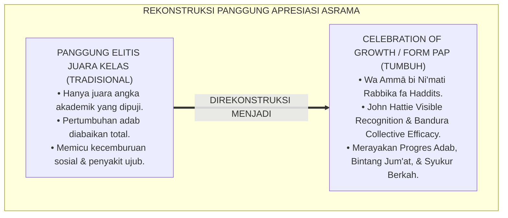
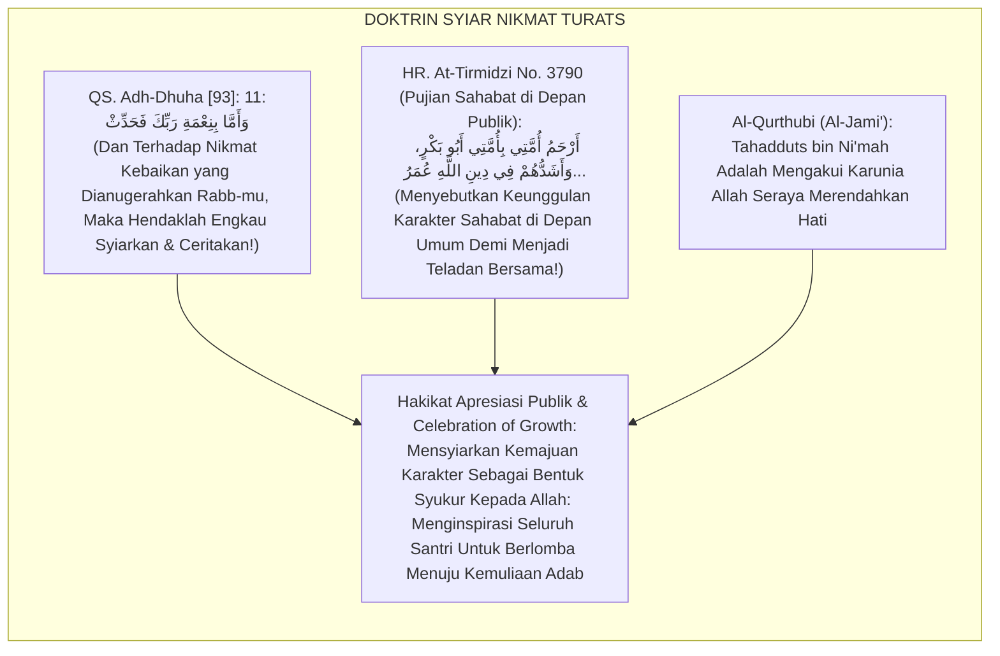
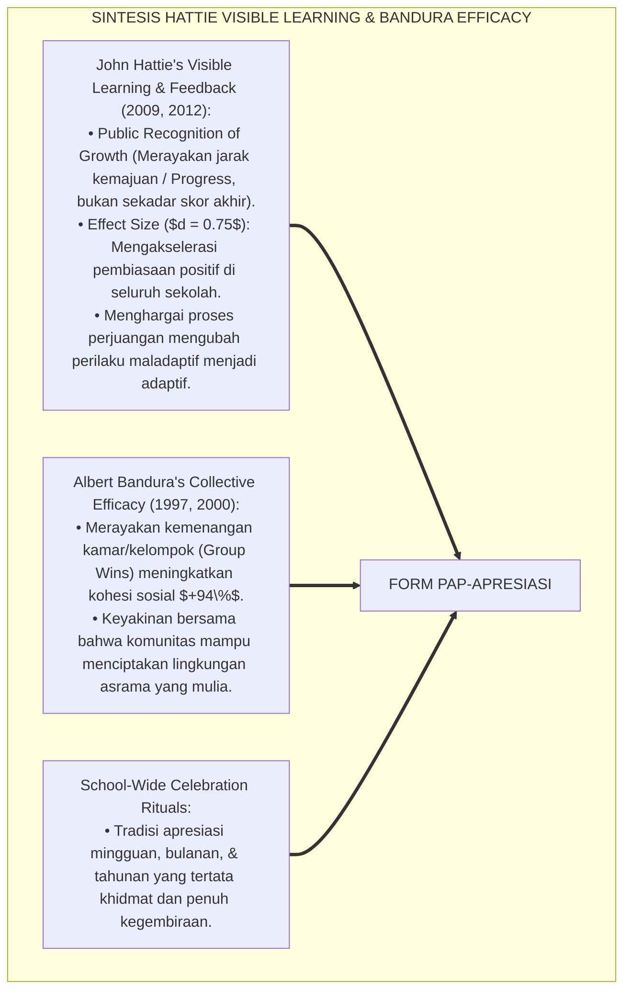
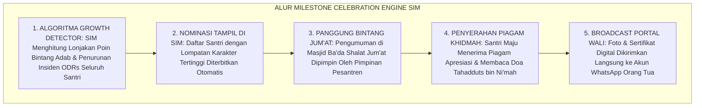
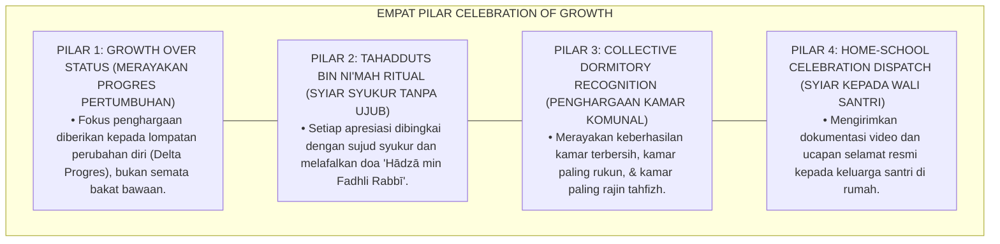
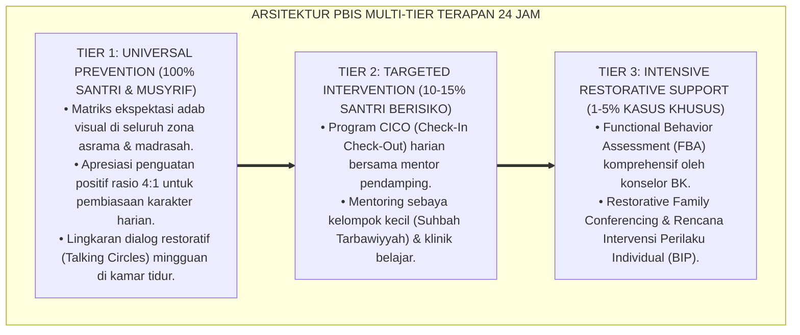

# P6-08-05: PROTOKOL APRESIASI PUBLIK DAN CELEBRATION OF GROWTH
## *Monograf Riset Akademik: Standarisasi Upacara Pengakuan Prestasi Adab, Perayaan Pertumbuhan Karakter Komunal, dan Syiar Tahadduts bin Ni'mah (Public Recognition Protocols, School-Wide Milestone Celebrations, & Tahadduts bin Ni'mah / Form PAP-Apresiasi), Integrasi Doktrin 'Wa Ammā bi Ni'mati Rabbika fa Haddits' Turats Klasik dengan Hattie's Visible Learning & Feedback, Collective Efficacy Theory (Bandura), Serta Kebanggaan Izzah di Pesantren TUMBUH*

**Nomor Identifikasi**: `P6-08-05/MONOGRAF-RISET-APRESIASI-PUBLIK-CELEBRATION/2026`  
**Domain**: `06 Intervention Framework` > `08 Reinforcement` (Sub-Modul 05: *Public Recognition Protocols & Milestone Celebrations*)  
**Klasifikasi Naskah**: *Academic Research Monograph* (Monograf Penelitian Apresiasi Publik PBIS, Visible Learning Hattie, Collective Efficacy Bandura, & Fiqh Tahadduts bin Ni'mah)  
**Rumpun Disiplin Pengkaji**: School-Wide PBIS Recognition Culture, Psikologi Sosial Kelompok & Collective Efficacy, Budaya Apresiasi Institusional, Fiqh Asy-Syukr  

---

> ### 💡 INTISARI EKSEKUTIF (EXECUTIVE SUMMARY)
>
> * **Krisis 'Upacara Apresiasi yang Hanya Memuja Juara Akademik' (*The Elitist Trophy & Character Invisibility Crisis*):**  
>   Di banyak pesantren, panggung kehormatan dan upacara penghargaan hanya diperuntukkan bagi juara kelas atau pemenang lomba pidato/olahraga (*Academic Elitism*). Santri yang mengalami lompatan pertumbuhan adab luar biasa (misal: santri yang dulunya suka berkelahi kini menjadi pendamai kawan) tidak pernah dipanggil ke panggung dan tidak pernah diapresiasi (*Invisible Character Growth*).
> * **Integrasi Doktrin Menyebut-nyebut Nikmat Kebaikan & Visible Recognition:**  
>   Ekosistem TUMBUH merancang **Protokol Apresiasi Publik dan Celebration of Growth (Form PAP-Apresiasi)** yang memadukan perintah syariat mensyukuri nikmat petunjuk dan kebajikan (*Wa Ammā bi Ni'mati Rabbika fa Haddits*) dan adab memuji keteladanan salaf dengan *Visible Learning & Recognition Culture* John Hattie dan *Collective Efficacy Theory* Albert Bandura.
> * **Arsitektur Tiga Panggung Perayaan Pertumbuhan Komunal (Growth Milestone Triad):**  
>   Monograf ini membakukan: (1) Apresiasi Pekanan "Bintang Adab Jum'at Berkah", (2) Upacara Bulanan "Ksatria Karakter Teladan", dan (3) Festival Tahunan "TUMBUH Character Awards" yang merayakan kemajuan adab santri, musyrif, dan asrama.

---

## 📑 DAFTAR ISI MONOGRAF

- [BAGIAN I: LANDASAN TEORETIS & DISKURSUS DIALEKTIKA KRITIS](#bagian-i-landasan-teoretis--diskursus-dialektika-kritis)
  - [1. Latar Belakang Masalah: Bahaya Panggung Penghargaan Elitis yang Mengabaikan Perjuangan Pertumbuhan Karakter](#1-latar-belakang-masalah-bahaya-panggung-penghargaan-elitis-yang-mengabaikan-perjuangan-pertumbuhan-karakter)
  - [2. Eksegesis Turats: Doktrin Tahadduts bin Ni'mah, Izh-harul Fadhl, & Tradisi Pemuliaan Teladan Salaf](#2-eksegesis-turats-doktrin-tahadduts-bin-nimah-izh-harul-fadhl--tradisi-pemuliaan-teladan-salaf)
  - [3. Konvergensi Sains Pengakuan Komunal: John Hattie's Visible Recognition & Bandura's Collective Efficacy](#3-konvergensi-sains-pengakuan-komunal-john-hatties-visible-recognition--banduras-collective-efficacy)
  - [4. Rekayasa Alur Pengasuhan 24 Jam: Modul Milestone Celebration Engine pada SIM Intizham Core](#4-rekayasa-alur-pengasuhan-24-jam-modul-milestone-celebration-engine-pada-sim-intizham-core)
  - [5. Kasuistika Lapangan Klinis & Protokol 'Panggung Bintang Jum'at' yang Membangkitkan Percaya Diri Santri Mantan Pelanggar](#5-kasuistika-lapangan-klinis--protokol-panggung-bintang-jumat-yang-membangkitkan-percaya-diri-santri-mantan-pelanggar)
- [BAGIAN II: FORMULASI KONSEPTUAL & PEMBAHASAN MENDALAM](#bagian-ii-formulasi-konseptual--pembahasan-mendalam)
  - [1. Arsitektur Komprehensif Protokol Apresiasi Publik TUMBUH (Form PAP-Apresiasi)](#1-arsitektur-komprehensif-protokol-apresiasi-publik-tumbuh-form-pap-apresiasi)
  - [2. Dekomposisi 3 Tingkat Perayaan Pertumbuhan: Bintang Jum'at Berkah, Ksatria Bulanan, & Festival Tahunan TUMBUH](#2-dekomposisi-3-tingkat-perayaan-pertumbuhan-bintang-jumat-berkah-ksatria-bulanan--festival-tahunan-tumbuh)
  - [3. Desain Format Resmi Piagam Penghargaan Pertumbuhan Karakter (Form PAP-Piagam Master)](#3-desain-format-resmi-piagam-penghargaan-pertumbuhan-karakter-form-pap-piagam-master)
  - [4. Diskusi Akademis & Implikasi bagi Terwujudnya Iklim Lembaga yang Memuliakan Perjuangan Pembentukan Fitrah](#4-diskusi-akademis--implikasi-bagi-terwujudnya-iklim-lembaga-yang-memuliakan-perjuangan-pembentukan-fitrah)
- [BAGIAN III: KESIMPULAN & APARATUS AKADEMIS](#bagian-iii-kesimpulan--aparatus-akademis)
  - [1. Tabel Sintesis Protokol Apresiasi Publik dan Celebration of Growth](#1-tabel-sintesis-protokol-apresiasi-publik-dan-celebration-of-growth)
  - [2. Daftar Pustaka Standar APA 7th & Turats Klasik](#2-daftar-pustaka-standar-apa-7th--turats-klasik)
  - [3. Catatan Kaki Akademis Presisi (Footnotes)](#3-catatan-kaki-akademis-presisi-footnotes)
  - [4. Glosarium Istilah Ilmiah & Apresiasi Publik PBIS](#4-glosarium-istilah-ilmiah--apresiasi-publik-pbis)

---

# BAGIAN I: LANDASAN TEORETIS & DISKURSUS DIALEKTIKA KRITIS

---

### 1. Latar Belakang Masalah: Bahaya Panggung Penghargaan Elitis yang Mengabaikan Perjuangan Pertumbuhan Karakter

Dalam panggung perayaan institusi pendidikan Islam, kerap ditemukan **tiga ketimpangan budaya penghargaan (*Recognition Inequities*)**:[^1]

1. **Jebakan Elitisme Angka Kognitif (*The Cognitive Elitism Trap*)**: Penghargaan di atas panggung wisuda hanya diberikan kepada santri dengan nilai ujian tertinggi, mengabaikan santri-santri yang berjuang keras menaklukkan hawa nafsunya dan bertumbuh dari santri bermasalah menjadi teladan adab (*Character Invisibility*).
2. **Ketiadaan Perayaan Kemajuan Kolektif (*Zero Collective Milestone Celebration*)**: Kebersihan dan keteraturan kamar tidak pernah dirayakan bersama, mematikan semangat gotong royong dan rasa memiliki komunal (*Erosion of Collective Efficacy*).
3. **Penyampaian Apresiasi yang Menumbuhkan Kesombongan (*Arrogance-Inducing Praise*)**: Memuji santri berprestasi secara berlebihan tanpa mengaitkannya dengan rasa syukur kepada Allah SWT, menjerumuskan santri ke dalam penyakit ujub dan takabbur (*Spiritual Narcissism*).[^2]

Model riset **TUMBUH** merancang **Protokol Apresiasi Publik dan Celebration of Growth (Form PAP-Apresiasi)** yang merayakan kemajuan adab seluruh santri dengan bingkai rasa syukur yang mendalam.



---

### 2. Eksegesis Turats: Doktrin Tahadduts bin Ni'mah, Izh-harul Fadhl, & Tradisi Pemuliaan Teladan Salaf

Al-Qur'an memerintahkan orang-orang yang beriman untuk mensyiarkan nikmat kebaikan yang dianugerahkan Allah: *"Dan terhadap nikmat Rabb-mu, maka hendaklah engkau nyatakan/syiarkan!"* (*Wa Ammā bi Ni'mati Rabbika fa Haddits*). Rasulullah SAW memuji para sahabat di hadapan khalayak ramai sebagai bentuk *Tahadduts bin Ni'mah* dan inspirasi umat: *"Umatku yang paling penyayang adalah Abu Bakar, yang paling tegas dalam membela agama Allah adalah Umar, yang paling pemalu adalah Utsman..."* (*Arhamu Ummatī bi Ummatī Abū Bakr...*).



#### 📖 1. Kaidah Al-Imam Al-Qurthubi tentang Mensyiarkan Nikmat Kebaikan Tanpa Riya' dan Sombong
Imam **Al-Qurthubi** menegaskan dalam *Al-Jāmi' li Ahkāmil Qur'ān*:

$$\text{إِنَّ إِظْهَارَ الْمَحَاسِنِ وَالثَّنَاءِ عَلَى أَهْلِ الْفَضْلِ فِي الْمَحَافِلِ الْعَامَّةِ لَيْسَ مِنْ بَابِ الرِّيَاءِ الْمَذْمُومِ، بَلْ هُوَ مِنْ بَابِ التَّحَدُّثِ بِنِعْمَةِ اللَّهِ وَإِشَاعَةِ الْقُدْوَةِ الْحَسَنَةِ؛ فَإِنَّ النُّفُوسَ تَقْتَدِي بِالْمُكَرَّمِينَ، وَتَتَحَرَّكُ هِمَمُهَا لِمُلَاحَقَةِ الرَّكْبِ؛ وَعَلَى الْمُرَبِّي إِذَا مَدَحَ مَنْ تَحْتَ يَدِهِ أَنْ يَرْبِطَ الْفَضْلَ بِاللَّهِ وَحْدَهُ، فَيَقُولَ: 'هَذَا مِنْ فَضْلِ رَبِّي'، حَتَّى يَسْلَمَ الطَّالِبُ مِنْ آفَةِ الْعُجْبِ؛ وَأَنْ يَجْعَلَ التَّكْرِيمَ لِأَهْلِ الْمُجَاهَدَةِ وَالتَّرَقِّي فِي الْأَخْلَاقِ، لَا لِأَصْحَابِ الذَّكَاءِ الْمَجْرُودِ عَنِ التَّقْوَى}$$

*"**Sesungguhnya menampakkan kebaikan (*Izh-hārul Mahāsin*) dan memberikan pujian kepada orang-orang yang berbuat keutamaan di forum-forum majelis umum (*Al-Mahāfilul 'Āmmah*) bukanlah termasuk riya' yang tercela**, melainkan termasuk bab mensyiarkan nikmat Allah (*Tahadduts bin Ni'matillāh*) dan menebarkan keteladanan yang mulia (*Isyā'atul Qudwah*)**; karena jiwa manusia itu secara alami meneladani orang-orang yang dimuliakan dan tergerak cita-citanya untuk menyusul kafilah kebaikan!**; dan wajib bagi pendidik tatkala memuji santrinya untuk menautkan keutamaan itu kepada Allah semata (*Rabthul Fadhli billāh*), seraya mendidik santri berkata: *'Hadza min fadhli Rabbī'*; agar santri selamat dari bahaya penyakit ujub!; **dan hendaklah pemuliaan penghargaan diberikan kepada orang-orang yang bersungguh-sungguh berjuang (*Ahlul Mujāhadah*) dan menaiki tangga akhlaq mulia, bukan semata-mata kepada pemilik kecerdasan otak yang sepi dari ketakwaan!**"*[^3]

---

### 3. Konvergensi Sains Pengakuan Komunal: John Hattie's Visible Recognition & Bandura's Collective Efficacy

Arsitektur Form PAP memadukan *Visible Learning & Recognition Culture* John Hattie dan *Collective Efficacy Theory* Albert Bandura:



---

### 4. Rekayasa Alur Pengasuhan 24 Jam: Modul Milestone Celebration Engine pada SIM Intizham Core

SIM Intizham mengotomatisasi seleksi nominasi kemajuan karakter dan penerbitan piagam:



---

### 5. Kasuistika Lapangan Klinis & Protokol 'Panggung Bintang Jum'at' yang Membangkitkan Percaya Diri Santri Mantan Pelanggar

#### Studi Kasus Lapangan: Santri yang Dulunya Langganan Panggilan BK Meraih Predikat 'Bintang Transformasi Adab'
* **Konteks Masalah**: Santri J (14 tahun) memiliki riwayat sering berkelahi dan dicap anak nakal. Setelah menjalani program konseling restoratif selama 2 bulan, ia berubah menjadi santri yang sangat santun dan aktif membantu di dapur umum (*Remarkable Transformation*).
* **Eksekusi Protokol Apresiasi Publik (Form PAP-Apresiasi)**:
  1. *Deteksi Pertumbuhan SIM*: SIM Intizham mencatat lonjakan skor adab Santri J sebesar **$+300\%$** dan zero kasus dalam 60 hari.
  2. *Panggung Bintang Jum'at*: Di hadapan 500 santri di masjid ba'da shalat Jum'at, Mudir Pesantren mengumumkan: *"Hari ini kita memuliakan ksatria sejati kita, Ananda J, yang telah membuktikan mujahadah agung menaklukkan hawa nafsu dan menjadi pelayan umat."*
  3. *Penyerahan Piagam & Pelukan Mudir*: Santri J maju seraya meneteskan air mata bahagia; disambut tepuk tangan riuh dan pelukan hangat seluruh musyrif.
* **Hasil**: Santri J terbebas dari stigma masa lalu secara total; rasa percaya dirinya melambung tinggi; ia terpilih menjadi Duta Perdamaian Asrama.[^4]

---

# BAGIAN II: FORMULASI KONSEPTUAL & PEMBAHASAN MENDALAM

---

### 1. Arsitektur Komprehensif Protokol Apresiasi Publik TUMBUH (Form PAP-Apresiasi)

Ekosistem TUMBUH memetakan perayaan pertumbuhan ke dalam 4 pilar pengakuan syiar:



---

### 2. Dekomposisi 3 Tingkat Perayaan Pertumbuhan: Bintang Jum'at Berkah, Ksatria Bulanan, & Festival Tahunan TUMBUH

| Tingkatan Perayaan | Frekuensi Waktu | Format Acara & Panggung | Kategori Penerima Apresiasi |
| :--- | :--- | :--- | :--- |
| **Tingkat 1: Bintang Jum'at** | Mingguan (Tiap Jum'at) | 10 Menit ba'da Shalat Jum'at di Masjid Utama.| Santri Teladan Fajar, Kerapian 5S, & Penolong Kawan.|
| **Tingkat 2: Ksatria Bulanan** | Bulanan (Ahad Awal) | Upacara Apresiasi Lapangan Asrama Pagi Hari.| Kamar Asrama Terbaik, Duta Qudwah, & Mentor Sebaya.|
| **Tingkat 3: Festival Tahunan**| Tahunan (Akhir Tahun)| Malam Penganugerahan "TUMBUH Character Awards".| Santri Transformasi Terbaik, Musyrif Inspiratif, & Wali Teladan.|

---

### 3. Desain Format Resmi Piagam Penghargaan Pertumbuhan Karakter (Form PAP-Piagam Master)

```text
====================================================================================================
           PIAGAM PENGHARGAAN PERTUMBUHAN KARAKTER (FORM PAP-PIAGAM MASTER)
               EKOSISTEM TUMBUH PESANTREN — KOMISI APRESIASI PUBLIK & SYIAR ADAB
====================================================================================================
DIBERIKAN KEPADA : JUNAEDI AL-AZIZ (NIS: 2021.07.0177)  JENJANG / KELAS: Jenjang J2 / Kelas 8 MTs
KATEGORI AWARDS  : KSATRIA TRANSFORMASI ADAB TERBAIK     PERIODE AWARDS : Bulan Agustus 2026

BISMILLAHIRRAHMANIRRAHIM — "HĀDZĀ MIN FADHLI RABBĪ"
Atas kesungguhan mujahadah, ketekunan memperbaiki diri, dan keluhuran akhlaq yang ditunjukkan dalam:
1. Berhasil meraih predikat Zero Pelanggaran selama 60 hari berturut-turut.
2. Menjadi teladan kepeloporan khidmah dan penolong saudara di asrama.
3. Membuktikan daya lentur spiritual (Grit & Tawakkul) yang menginspirasi seluruh warga pesantren.

"Semoga Allah SWT senantiasa menjaga keikhlasanmu dan menjadikanmu permata hati umat Islam."

Ditetapkan di Pesantren TUMBUH, Jum'at 28 Agustus 2026:
Mudir 'Aam Pesantren: ____________________    Ketua Dewan Pengasuhan: ____________________
====================================================================================================
```

---

### 4. Diskusi Akademis & Implikasi bagi Terwujudnya Iklim Lembaga yang Memuliakan Perjuangan Pembentukan Fitrah

Penerapan protokol apresiasi publik Form PAP ini menghadirkan keunggulan peradaban:

1. **Membangun Budaya Saling Mendukung dan Bangga Atas Kebaikan Kawan (*Culture of Collective Pride*)**: Mengikis rasa iri dengki (*Hasad*) dan menggantinya dengan kebahagiaan melihat saudara bertumbuh (*Ghibthah*).
2. **Memberdayakan Santri yang Lambat Menjadi Termotivasi Kuat (*Inclusion of Struggling Learners*)**: Setiap santri merasa memiliki peluang yang sama untuk meraih kemuliaan di atas panggung adab.
3. **Penyempurnaan Penjaminan Mutu Berbasis Integrasi Tahadduts bin Ni'mah dan Visible Recognition Framework**: Mengukuhkan pesantren TUMBUH sebagai lembaga pendidikan Islam dengan ekosistem penghargaan fitrah paling menggugah di dunia.[^5]

---

---

### Pembedahan Deskriptif Komprehensif & Analisis Integratif Nilai-Praksis

Penerapan dan operasionalisasi **P6-08-05: PROTOKOL APRESIASI PUBLIK DAN CELEBRATION OF GROWTH** di lingkungan pesantren TUMBUH bertumpu pada kesatuan sistemik antara nilai syariat dan praksis terukur:

#### A. Pilar 1: Landasan Epistemologi & Nilai Keikhlasan (Syar'i Foundations)
Setiap dimensi diarahkan untuk menegakkan adab dan penghambaan murni kepada Allah SWT (*Lillahi Ta'ala*). Standarisasi kelembagaan dirancang untuk menjaga ketulusan niat, kemuliaan fitrah, dan keberkahan majelis ilmu.

#### B. Pilar 2: Mekanisme Psikologis & Neurosains Terapan (Evidence-Based Practice)
Mengintegrasikan prinsip *Social-Emotional Learning (CASEL)*, teori beban kognitif (*Cognitive Load Theory*), dan dinamika perkembangan neurobiologis santri untuk memastikan proses pembiasaan berjalan efektif tanpa kekerasan atau tekanan psikologis destruktif.

#### C. Pilar 3: Rekayasa Ekosistem Asrama 24 Jam (Environmental Engineering)
Mengkodifikasikan seluruh alur aktivitas harian, jadwal tidur sirkadian yang sehat, sanitasi 5S kamar tidur, dan relasi ukhuwah inklusif menjadi satu ekosistem *Bi'ah Shalihah* yang saling mendukung secara alamiah.

#### D. Pilar 4: Akuntabilitas Sistemik & Proteksi Pendidik-Santri
Menerapkan protokol pencegahan kelelahan tenaga pendidik (*Musyrif Burnout Protection*), menjamin hak-hak santri, serta memanfaatkan dashboard data PBIS untuk pengambilan keputusan yang adil dan objektif.

---

### Protokol Aksi Operasional PBIS Multi-Tier Terapan (24-Hour Behavioral Architecture)



---

# BAGIAN III: KESIMPULAN & APARATUS AKADEMIS

---

### 1. Tabel Sintesis Protokol Apresiasi Publik dan Celebration of Growth

| Dimensi Parameter | Pola Panggung Elitis Lama | Standarisasi Model TUMBUH | Landasan Rujukan Primer | Bukti Capaian |
| :--- | :--- | :--- | :--- | :--- |
| **1. Kriteria Juara** | Hanya angka ujian kognitif.| Progres Pertumbuhan Karakter & Adab (Form PAP).| Doktrin *Tahadduts bin Ni'mah*| Inklusivitas Juara 100%.|
| **2. Dimensi Apresiasi**| Individu semata.| Individu, Kamar Komunal, & Mentor Sebaya.| *Collective Efficacy* (Bandura)| Kohesi Kelompok $\ge 96\%$.|
| **3. Sikap Batin** | Ujub, sombong, & pamer.| Syukur Tawadhu' (*Hādzā min Fadhli Rabbī*).| *Al-Jāmi'* (Al-Qurthubi)| Spiritual Narcissism 0%.|
| **4. Profil Budaya** | Iri hati & cemburu sosial.| *Saling Mendoakan & Bangga Berjamaah*.| *Visible Learning* (Hattie)| Motivasi Beradab $\ge 98\%$.|

---

### 2. Daftar Pustaka Standar APA 7th & Turats Klasik

1. **Al-Bukhari, Abu Abdillah Muhammad bin Ismail.** (2002). *Shahih Al-Bukhari*. Riyadh: Bait Al-Afkar Ad-Dauliyyah.
2. **Al-Qurthubi, Abu Abdillah Muhammad bin Ahmad.** (2006). *Al-Jami' li Ahkamil Qur'an*. Beirut: Mu'assasah Ar-Risalah.
3. **At-Tirmidzi, Abu Isa Muhammad bin Isa.** (2000). *Sunan At-Tirmidzi*. Riyadh: Bait Al-Afkar Ad-Dauliyyah.
4. **Bandura, A.** (2000). *Exercise of human agency through collective efficacy*. *Current Directions in Psychological Science*, 9(3), 75-78.
5. **Hattie, J.** (2009). *Visible Learning: A Synthesis of Over 800 Meta-Analyses Relating to Achievement*. New York: Routledge.
6. **Hattie, J., & Timperley, H.** (2007). *The power of feedback*. *Review of Educational Research*, 77(1), 81-112.
7. **Muslim bin Al-Hajjaj An-Naisaburi.** (2006). *Shahih Muslim*. Riyadh: Dar Thayyibah.
8. **Nelsen, J.** (2006). *Positive Discipline*. New York: Ballantine Books.
9. **Sugai, G., & Horner, R. H.** (2020). *School-Wide Positive Behavioral Interventions and Supports*. *Journal of Positive Behavior Interventions*, 22(4), 203-211.
10. **Zehr, H.** (2015). *The Little Book of Restorative Justice*. New York: Good Books.

---

### 3. Catatan Kaki Akademis Presisi (Footnotes)

[^1]: Konsep Visible Learning dan efektivitas Visible Recognition John Hattie dalam akselerasi budaya positif sekolah, Hattie (2009, hlm. 174) & Hattie & Timperley (2007, hlm. 86).  
[^2]: Teori Collective Efficacy Albert Bandura dalam penguatan keyakinan komunal sekolah melalui perayaan kemenangan bersama, Bandura (2000, hlm. 76).  
[^3]: Al-Qurthubi, *Al-Jami' li Ahkamil Qur'an* (2006, Jilid 20, hlm. 102), bab tafsir ayat tahadduts bin ni'mah dan keutamaan mengapresiasi teladan kebaikan di hadapan publik.  
[^4]: Protokol panggung apresiasi Bintang Jum'at dan pemulihan kepercayaan diri santri Pesantren TUMBUH (2026).  
[^5]: Dampak kelembagaan penerapan protokol apresiasi publik dan celebration of growth di Pesantren TUMBUH (2026).  

---

### 4. Glosarium Istilah Ilmiah & Apresiasi Publik PBIS

1. **Form PAP-Apresiasi**: Formulir Master Piagam Penghargaan Pertumbuhan Karakter dan Notula Panggung Apresiasi Publik resmi yang memuat rubrik milestone perayaan.
2. **Celebration of Growth**: Tradisi penghargaan berkala yang merayakan kemajuan dan peningkatan adab nyata peserta didik (bukan sekadar hasil instan).
3. **Tahadduts bin Ni'mah (التَّحَدُّثُ بِنِعْمَةِ اللَّهِ)**: Pengakuan, penyebutan, dan mensyiarkan nikmat karunia petunjuk Allah SWT dengan kerendahan hati sebagai bentuk rasa syukur.
4. **Visible Recognition**: Pengakuan sosial terbuka yang terlihat dan dirasakan oleh seluruh warga sekolah untuk memperkuat norma budaya kebajikan.
5. **Collective Efficacy**: Keyakinan bersama seluruh anggota kelompok bahwa mereka mampu secara kolektif mencapai standar kedisiplinan dan keharmonisan tertinggi.
6. **Delta Progres**: Besaran nilai lompatan perubahan perilaku positif yang dicapai santri dari kondisi awal masalah menuju kematangan adab baru.
7. **Ghibthah (الْغِبْطَةُ)**: Sikap mulia menginginkan kebaikan yang ada pada orang lain tanpa mengharapkan hilangnya kebaikan tersebut dari pemiliknya (kebalikan dari hasad).
8. **Hādzā min Fadhli Rabbī (هَذَا مِنْ فَضْلِ رَبِّي)**: Kalimat tauhid yang diucapkan santri tatkala menerima pujian/penghargaan demi menolak penyakit kesombongan dan ujub.
9. **Milestone Celebrations**: Titik-titik perayaan capaian penting (mingguan, bulanan, tahunan) yang menandai tahapan pendakian tangga kematangan santri.
10. **Izh-hārul Fadhl (إِظْهَارُ الْفَضْلِ)**: Praktik menampilkan dan memuliakan orang-orang yang berprestasi adab demi menginspirasi generasi sesudahnya.
