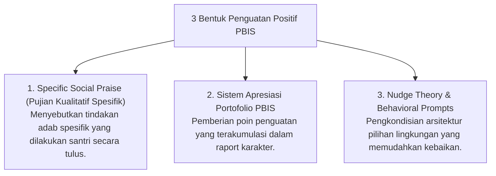

# P6-08: Sistem Penguatan Positif dan Magic Ratio 4:1

## Status Dokumen
* **Status**: 🌟 **A+ (Tervalidasi & Siap Diimplementasikan)**
* **Sub-Domain**: `06 Intervention Framework / 08 Reinforcement`
* **Penanggung Jawab Keilmuan**: Dewan Keilmuan TUMBUH (*Pakar Arsitektur PBIS Restoratif & Pakar Pedagogi Master Guru*)

---

## 1. Operasionalisasi Penguatan Positif PBIS

Sistem Penguatan Positif PBIS bertindak sebagai mesin pendorong utama perubahan adab santri secara sukarela (*Intrinsic Motivation Building*).

---

## 2. Penyusunan Behavioral Contract (Kontrak Perilaku Positif)

Untuk santri yang membutuhkan penguatan ekstra:
- Musyrif dan santri merumuskan **Behavioral Contract (Kontrak Perilaku)** yang memuat target 2 adab spesifik, bentuk penguatan yang diperoleh jika berhasil, dan komitmen bersama selama 2–4 pekan.
