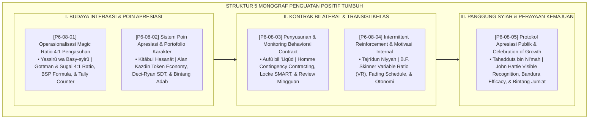

# P6-08: DOKUMEN INDUK SISTEM PENGUATAN POSITIF DAN MAGIC RATIO 4:1
## *Arsitektur dan Rekayasa Sistem Penguatan Positif Terpadu, Operasionalisasi Rasio Interaksi 4:1, Sistem Poin Apresiasi Non-Material, Kontrak Perilaku Bilateral, Manajemen Intermittent Fading Menuju Ikhlas, Serta Perayaan Pertumbuhan Komunal (Magic Ratio Form OMR, Character Portfolio Form PAK, Behavioral Contract Form PBC, Intermittent Fading Form MIR, Serta Public Celebration Form PAP) di Ekosistem TUMBUH Pesantren*

**Nomor Identifikasi**: `P6-08/DOKUMEN-INDUK-PENGUATAN-POSITIF-MAGIC-RATIO/2026`  
**Domain**: `06 Intervention Framework` > `08 Reinforcement` (Gugus Sub-Domain 08: *Comprehensive Positive Reinforcement Systems, 4:1 Magic Ratio, & Milestone Celebrations*)  
**Klasifikasi Naskah**: *Master Architecture & Navigation Monograph* (Dokumen Induk Peta Jalan Riset & Navigasi 5 Monograf Ilmiah Sistem Penguatan Positif dan Apresiasi Karakter)  
**Rumpun Disiplin Pengkaji**: School-Wide PBIS Positive Reinforcement, Psikologi Relasional Afirmatif, Token Economy & Fading, Fiqh At-Tahfiz wal Ikhlas  

---

> ### 💡 INTISARI EKSEKUTIF (EXECUTIVE SUMMARY)
>
> * **Kedudukan Strategis Gugus Sistem Penguatan Positif dan Magic Ratio 4:1:**  
>   Gugus *Reinforcement (Sistem Penguatan Positif dan Magic Ratio 4:1)* merupakan mesin penyubur kebajikan dan iklim kasih sayang (*The Virtue Nurturing & Affirmation Engine*) dalam ekosistem TUMBUH. Gugus ini merombak budaya institusi yang kaku dan sarat celaan menjadi ekosistem yang melimpah dengan apresiasi otentik, kabar gembira, dan motivasi batin: **Operasionalisasi Magic Ratio 4:1 (Form OMR)**, **Sistem Poin Apresiasi Bintang Adab (Form PAK)**, **Behavioral Contract Bilateral (Form PBC)**, **Manajemen Intermittent Fading (Form MIR)**, dan **Apresiasi Publik & Celebration of Growth (Form PAP)**.
> * **Integrasi Holistik Turats & Konsensus Sains Penguatan Positif:**  
>   Gugus riset ini memadukan khazanah agung Islam tentang menyebarkan kabar gembira (*Yassirū wa Basy-syirū*), kata-kata baik (*Al-Kalimatuth Thayyibah*), pencatatan amal kebajikan (*Kitābul Hasanāt*), memenuhi janji akad (*Aufū bil 'Uqūd*), kemurnian niat lillahi ta'ala (*Tajrīdun Niyyah*), dan mensyiarkan nikmat (*Tahadduts bin Ni'mah*) dengan konsensus sains dunia (*Gottman & Sugai 4:1 Ratio, Kazdin Token Economy, Locke & Latham Goal-Setting, Skinner Intermittent Schedules, Deci & Ryan Self-Determination Theory, Bandura Collective Efficacy, dan Hattie Visible Recognition*).
> * **Struktur Lengkap 5 Berkas Monograf Riset Ilmiah:**  
>   Dokumen induk ini memetakan dan menghubungkan 5 berkas monograf penelitian akademik komprehensif (~145 KB total riset) yang menyajikan panduan tally counter ponsel musyrif, transkrip digital portofolio karakter, akad 30 hari SMART, jadwal transisi 3 fase menuju ikhlas, dan format panggung penghargaan Bintang Jum'at Berkah.

---

## 📑 PETA NAVIGASI LIMA MONOGRAF RISET SISTEM PENGUATAN POSITIF

Berikut adalah daftar lengkap 5 monograf riset akademik dalam gugus **`08 Reinforcement`**:

---

## 📚 DESKRIPSI RINGKAS 5 BERKAS MONOGRAF

1. **[P6-08-01: Operasionalisasi Magic Ratio 4:1 dalam Pengasuhan](file:///c:/xampp/htdocs/tumbuh/06%20Intervention%20Framework/08%20Reinforcement/P6-08-01-Operasionalisasi-Magic-Ratio-4-1-dalam-Pengasuhan.md)**  
   *Membahas standarisasi minimal 4 apresiasi positif berbanding 1 koreksi, doktrin Yassiru wa Basy-syiru, John Gottman & George Sugai 4:1 Ratio, Behavior-Specific Praise (BSP), dan form Form OMR-MagicRatio.*
2. **[P6-08-02: Sistem Poin Apresiasi dan Portofolio Karakter PBIS](file:///c:/xampp/htdocs/tumbuh/06%20Intervention%20Framework/08%20Reinforcement/P6-08-02-Sistem-Poin-Apresiasi-dan-Portofolio-Karakter-PBIS.md)**  
   *Membahas perancangan token ekonomi non-material dan portofolio digital adab, doktrin Kitabul Hasanat & Khabī'atut Tha'ah, Alan Kazdin Token Economy, menu hak istimewa edukatif, dan form Form PAK-Apresiasi.*
3. **[P6-08-03: Penyusunan dan Monitoring Behavioral Contract](file:///c:/xampp/htdocs/tumbuh/06%20Intervention%20Framework/08%20Reinforcement/P6-08-03-Penyusunan-dan-Monitoring-Behavioral-Contract.md)**  
   *Membahas akad komitmen perilaku bilateral santri-musyrif, doktrin Aufu bil 'Uqud & Mu'ahadatun Nafs, Lloyd Homme Contingency Contracting, target SMART, evaluasi mingguan, dan form Form PBC-Kontrak.*
4. **[P6-08-04: Manajemen Intermittent Reinforcement dan Motivasi Internal](file:///c:/xampp/htdocs/tumbuh/06%20Intervention%20Framework/08%20Reinforcement/P6-08-04-Manajemen-Intermittent-Reinforcement-dan-Internal-Motivation.md)**  
   *Membahas penipisan penguatan eksternal menuju keikhlasan beramal lillahi ta'ala, doktrin Tajridun Niyyah, B.F. Skinner Variable Ratio Schedules, Deci & Ryan Self-Determination Theory, dan form Form MIR-Intermiten.*
5. **[P6-08-05: Protokol Apresiasi Publik dan Celebration of Growth](file:///c:/xampp/htdocs/tumbuh/06%20Intervention%20Framework/08%20Reinforcement/P6-08-05-Protokol-Apresiasi-Publik-dan-Celebration-of-Growth.md)**  
   *Membahas perayaan kemajuan pertumbuhan karakter seluruh santri, doktrin Tahadduts bin Ni'mah, John Hattie Visible Recognition, Albert Bandura Collective Efficacy, Panggung Bintang Jum'at Berkah, dan form Form PAP-Apresiasi.*

---

## 🎯 STANDAR PENJAMINAN MUTU SISTEM PENGUATAN POSITIF

Penerapan gugus **Sistem Penguatan Positif dan Magic Ratio 4:1 (Reinforcement)** menjamin bahwa:
1. **Ekosistem Pengasuhan Dipenuhi oleh Semangat Saling Menghargai dan Apresiasi Otentik (*Abundant Affirmative Bi'ah*)**: Mengikis budaya mencari kesalahan dan menggantinya dengan rasio interaksi 4:1 yang menyuburkan kasih sayang.
2. **Karakter Santri Mengakar Kuat Menuju Keikhlasan Sejati (*From Token Habit to Pure Sincerity*)**: Santri terlatih menepati akad komitmen mandiri dan bertumbuh dari motivasi eksternal menuju keikhlasan lillahi ta'ala.
3. **Setiap Perjuangan Memperbaiki Diri Dirayakan dengan Rasa Syukur yang Agung (*Collective Growth & Gratitude Culture*)**: Menghilangkan elitisme angka kognitif dan membangun kebanggaan bersama atas keluhuran akhlaq generasi khairu ummah.
