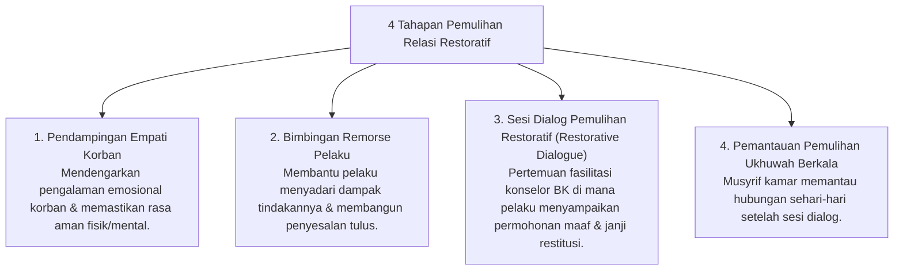

# P6-09-01: Protokol Pemulihan Relasi Korban dan Pelaku

## Status Dokumen
* **Status**: 🌟 **A+ (Tervalidasi & Siap Diimplementasikan)**
* **Sub-Domain**: `06 Intervention Framework / 09 Recovery`
* **Penanggung Jawab Keilmuan**: Dewan Keilmuan TUMBUH (*Pakar Bimbingan Konseling & Pakar Arsitektur PBIS Restoratif*)

---

## 1. Operasionalisasi Pemulihan Relasi (Victim-Offender Reconciliation)

Protokol Pemulihan Relasi bertujuan memulihkan luka sosio-emosional korban dan memfasilitasi rasa penyesalan tulus serta restitusi dari pihak pelaku:

---

## 2. Jaminan Kesukarelaan (Voluntary Participation)

Proses dialog pemulihan dilakukan secara sukarela tanpa paksaan pada pihak korban, dengan tetap menjamin hak restitusi dan rasa aman korban di asrama.
