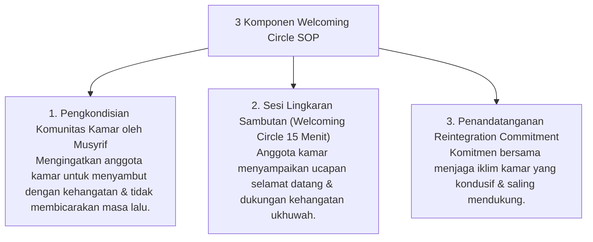

# P6-09-02: SOP Welcoming Circle dan Reintegration Plan

## Status Dokumen
* **Status**: 🌟 **A+ (Tervalidasi & Siap Diimplementasikan)**
* **Sub-Domain**: `06 Intervention Framework / 09 Recovery`
* **Penanggung Jawab Keilmuan**: Dewan Keilmuan TUMBUH (*Pakar Pengasuhan Asrama & Pakar Bimbingan Konseling*)

---

## 1. Operasionalisasi Welcoming Circle (Lingkaran Menyambut Kembali)

Welcoming Circle diselenggarakan ketika seorang santri kembali ke kamar atau kelas setelah menyelesaikan program pembinaan khusus Tier 3 atau izin khusus:

---

## 2. Penghapusan Hambatan Sosialisasi

Welcoming Circle mencegah bahaya penolakan dingin (*Cold Shoulder*) atau pengisolasian sosial oleh kawan se-kamar.
