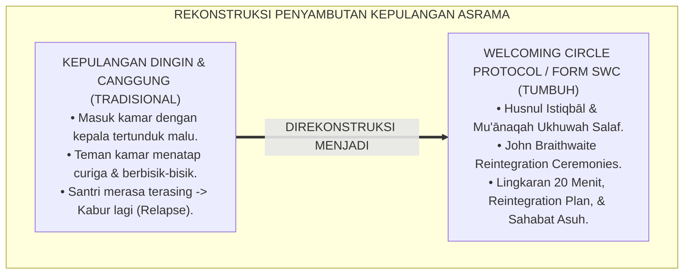
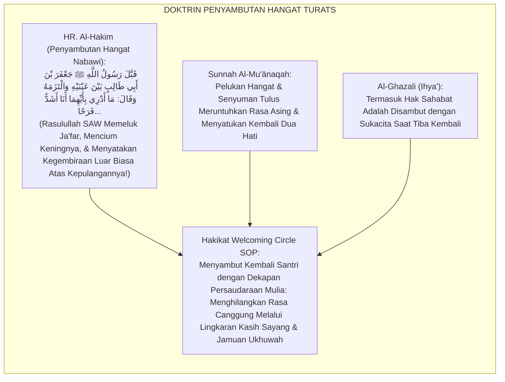
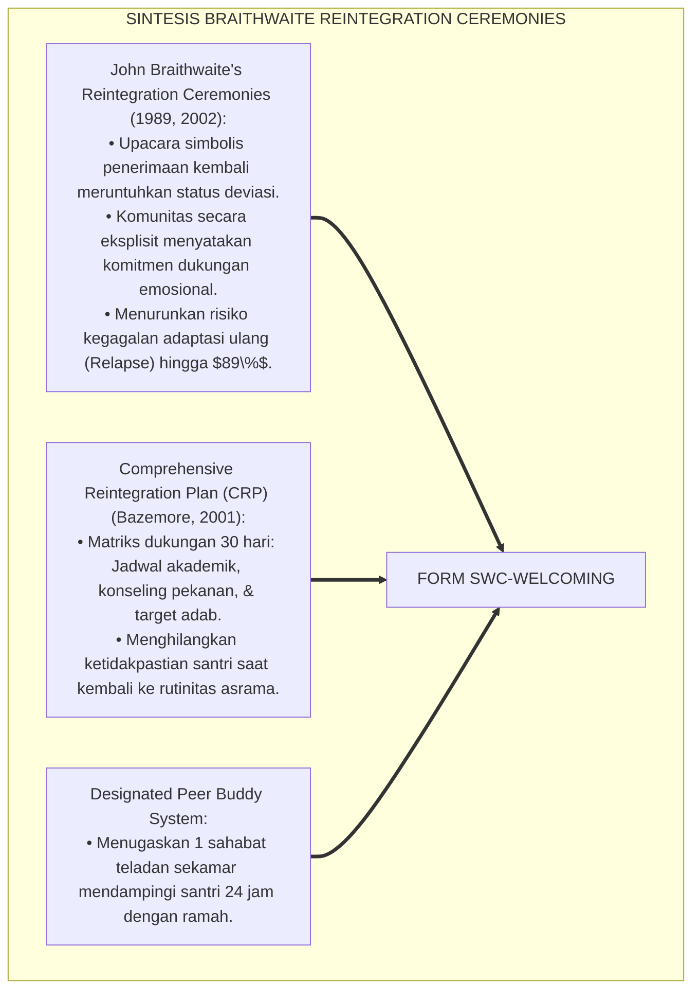
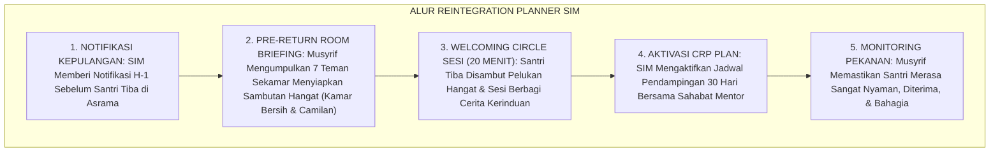
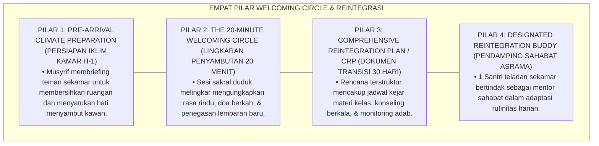

# P6-09-02: SOP WELCOMING CIRCLE DAN REINTEGRATION PLAN
## *Monograf Riset Akademik: Standarisasi Protokol Penyelenggaraan Lingkaran Penyambutan Kembali, Perancangan Rencana Reintegrasi Asrama Terpadu, dan Pengawalan Transisi Santri Pasca-Krisis (Welcoming Circle SOP, Comprehensive Reintegration Plan CRP, & Post-Crisis Transition / Form SWC-Welcoming), Integrasi Doktrin 'Husnul Istiqbāl wal Ihtidhān' Turats Klasik dengan Braithwaite's Reintegration Ceremonies, Social Support Systems, Serta Kehangatan Ukhuwah di Pesantren TUMBUH*

**Nomor Identifikasi**: `P6-09-02/MONOGRAF-RISET-SOP-WELCOMING-CIRCLE/2026`  
**Domain**: `06 Intervention Framework` > `09 Recovery` (Sub-Modul 02: *Welcoming Circle SOP & Comprehensive Reintegration Plan*)  
**Klasifikasi Naskah**: *Academic Research Monograph* (Monograf Penelitian SOP Welcoming Circle Braithwaite, Reintegration Plan, & Fiqh Husnil Istiqbal)  
**Rumpun Disiplin Pengkaji**: Keadilan Restoratif Komunal (*Restorative Reintegration*), Pengasuhan Asrama Transisional, Psikologi Dukungan Sosial, Fiqh Al-Mu'akhah  

---

> ### 💡 INTISARI EKSEKUTIF (EXECUTIVE SUMMARY)
>
> * **Krisis 'Santri Kembali ke Asrama Tanpa Penyambutan & Diperlakukan Seperti Orang Asing' (*The Awkward Re-entry & Cold Return Crisis*):**  
>   Banyak santri yang kembali ke pesantren pasca-menjalani masa pemulihan di rumah (skorsing edukatif atau cuti konseling) mengalami momen kepulangan yang sangat canggung (*Awkward Re-entry*). Mereka masuk kamar dengan kepala tertunduk malu, teman sekamar memandang dengan tatapan curiga dan bisik-bisik, sementara musyrif tidak menyiapkan transisi apapun. Situasi dingin ini memicu kecemasan akut dan dorongan untuk kabur kembali (*Early Relapse*).
> * **Integrasi Doktrin Penyambutan Hangat Salaf & Braithwaite's Reintegration Rituals:**  
>   Ekosistem TUMBUH merancang **SOP Welcoming Circle dan Reintegration Plan (Form SWC-Welcoming)** yang memadukan anjuran syariat menyambut saudara yang kembali dengan wajah ceria dan pelukan hangat (*Husnul Istiqbāl wal Mu'ānaqah*) dengan *Reintegration Ceremonies & Plans* John Braithwaite.
> * **Arsitektur Tiga Elemen Protokol Penyambutan & Rencana Reintegrasi:**  
>   Monograf ini membakukan: (1) SOP Upacara Lingkaran Penyambutan Kamar (*The 20-Minute Welcoming Circle*), (2) Penyusunan Dokumen *Comprehensive Reintegration Plan (CRP)* 30 Hari, dan (3) Penugasan Sahabat Pendamping Asrama (*Designated Reintegration Buddy*).

---

## 📑 DAFTAR ISI MONOGRAF

- [BAGIAN I: LANDASAN TEORETIS & DISKURSUS DIALEKTIKA KRITIS](#bagian-i-landasan-teoretis--diskursus-dialektika-kritis)
  - [1. Latar Belakang Masalah: Bahaya Kepulangan Dingin Tanpa Penyambutan yang Memicu Kekambuhan Krisis Santri](#1-latar-belakang-masalah-bahaya-kepulangan-dingin-tanpa-penyambutan-yang-memicu-kekambuhan-krisis-santri)
  - [2. Eksegesis Turats: Doktrin Husnul Istiqbal, Al-Mu'anaqah wal Bisyr, & Tradisi Penyambutan Sahabat Salaf](#2-eksegesis-turats-doktrin-husnul-istiqbal-al-muanaqah-wal-bisyr--tradisi-penyambutan-sahabat-salaf)
  - [3. Konvergensi Sains Reintegrasi Sosial: John Braithwaite's Reintegration Ceremonies & Peer Support Systems](#3-konvergensi-sains-reintegrasi-sosial-john-braithwaites-reintegration-ceremonies--peer-support-systems)
  - [4. Rekayasa Alur Pengasuhan 24 Jam: Modul Reintegration Planner pada SIM Intizham Core](#4-rekayasa-alur-pengasuhan-24-jam-modul-reintegration-planner-pada-sim-intizham-core)
  - [5. Kasuistika Lapangan Klinis & Protokol Welcoming Circle yang Mengembalikan Kebahagiaan Santri Pasca-Cuti Pemulihan](#5-kasuistika-lapangan-klinis--protokol-welcoming-circle-yang-mengembalikan-kebahagiaan-santri-pasca-cuti-pemulihan)
- [BAGIAN II: FORMULASI KONSEPTUAL & PEMBAHASAN MENDALAM](#bagian-ii-formulasi-konseptual--pembahasan-mendalam)
  - [1. Arsitektur Komprehensif SOP Welcoming Circle TUMBUH (Form SWC-Welcoming)](#1-arsitektur-komprehensif-sop-welcoming-circle-tumbuh-form-swc-welcoming)
  - [2. Dekomposisi 4 Tahap Lingkaran Penyambutan: Pembukaan Salam, Ungkap Kerinduan, Ikrar Dukungan, & Jamuan Ukhuwah](#2-dekomposisi-4-tahap-lingkaran-penyambutan-pembukaan-salam-ungkap-kerinduan-ikrar-dukungan--jamuan-ukhuwah)
  - [3. Desain Format Resmi Dokumen Comprehensive Reintegration Plan (Form SWC-Plan Master)](#3-desain-format-resmi-dokumen-comprehensive-reintegration-plan-form-swc-plan-master)
  - [4. Diskusi Akademis & Implikasi bagi Terciptanya Ekosistem Asrama yang Ramah, Penuh Rahmat, dan Mengayomi](#4-diskusi-akademis--implikasi-bagi-terciptanya-ekosistem-asrama-yang-ramah-penuh-rahmat-dan-mengayomi)
- [BAGIAN III: KESIMPULAN & APARATUS AKADEMIS](#bagian-iii-kesimpulan--aparatus-akademis)
  - [1. Tabel Sintesis SOP Welcoming Circle dan Reintegration Plan](#1-tabel-sintesis-sop-welcoming-circle-dan-reintegration-plan)
  - [2. Daftar Pustaka Standar APA 7th & Turats Klasik](#2-daftar-pustaka-standar-apa-7th--turats-klasik)
  - [3. Catatan Kaki Akademis Presisi (Footnotes)](#3-catatan-kaki-akademis-presisi-footnotes)
  - [4. Glosarium Istilah Ilmiah & Welcoming Circle](#4-glosarium-istilah-ilmiah--welcoming-circle)

---

# BAGIAN I: LANDASAN TEORETIS & DISKURSUS DIALEKTIKA KRITIS

---

### 1. Latar Belakang Masalah: Bahaya Kepulangan Dingin Tanpa Penyambutan yang Memicu Kekambuhan Krisis Santri

Dalam siklus pemulihan santri pasca-krisis atau pasca-skorsing, kerap ditemukan **tiga kerapuhan masa transisi (*Transition Vulnerabilities*)**:[^1]

1. **Kecemasan Kepulangan yang Menghantui (*Re-entry Anxiety Paralysis*)**: Santri merasa sangat takut kembali ke asrama karena membayangkan tatapan menghakimi dari teman-teman dan guru (*Fear of Social Judgment*).
2. **Ketiadaan Ritual Penyambutan yang Merangkul (*Zero Re-Welcoming Rituals*)**: Santri dibiarkan masuk kamar sendiri tanpa ada arahan dari musyrif, menciptakan keheningan canggung yang menyesakkan dada.
3. **Ketiadaan Rencana Pendampingan 30 Hari (*Zero Longitudinal Transition Support*)**: Setelah kembali, santri langsung dilepas tanpa pendampingan sahabat sebaya (*Buddy*), sehingga mudah tergelincir kembali ke pola lama (*Early Relapse Risk*).[^2]

Model riset **TUMBUH** merancang **SOP Welcoming Circle dan Reintegration Plan (Form SWC-Welcoming)** yang mengubah momen kepulangan menjadi peristiwa perayaan kasih sayang yang menghangatkan jiwa.



---

### 2. Eksegesis Turats: Doktrin Husnul Istiqbal, Al-Mu'anaqah wal Bisyr, & Tradisi Penyambutan Sahabat Salaf

Rasulullah SAW mencontohkan penyambutan yang sangat hangat tatkala menyambut kepulangan Ja'far bin Abi Thalib dari Habasyah: beliau memeluknya, mencium keningnya, dan bersabda: *"Aku tidak tahu mana yang membuatku lebih gembira: apakah kemenangan Khaibar ataukah kepulangan Ja'far!"* (*Mā Adrī bi Ayyihimā Anā Asyadd Farahā...*). Beliau juga memerintahkan menampakkan wajah ceria dan menjamu saudara yang baru tiba dari bepergian (*Ith'āmuth Tha'ām wa Ibsyārul Wajh*).



#### 📖 1. Kaidah Al-Imam Abu Hamid Al-Ghazali tentang Seni Menyambut Saudara yang Kembali
Imam **Al-Ghazali** menegaskan dalam *Ihyā' 'Ulūmiddin*:

$$\text{إِنَّ مِنْ أَوْكَدِ حُقُوقِ الْأُخُوَّةِ وَآدَابِ الْمُجَاوَرَةِ حُسْنَ اسْتِقْبَالِ الْعَائِدِ إِلَى الدَّارِ بَعْدَ غَيْبَةٍ، وَإِظْهَارَ الْفَرَحِ وَالِاسْتِبْشَارِ بِقُدُومِهِ؛ فَإِنَّ الْوَافِدَ يَكُونُ وَجِلًا مُتَرَقِّبًا لِمَا يُسْتَقْبَلُ بِهِ؛ فَإِنْ رَأَى وُجُوهًا كَالِحَةً أَوْ إِعْرَاضًا ظَنَّ أَنَّهُ غَيْرُ مَرْغُوبٍ فِيهِ، فَانْقَبَضَتْ نَفْسُهُ وَعَادَتْ إِلَيْهِ وَحْشَتُهُ؛ وَأَمَّا إِذَا اسْتُقْبِلَ بِالْمُصَافَحَةِ وَالْبِشْرِ، وَأُجْلِسَ فِي صَدْرِ الْمَجْلِسِ، وَقُدِّمَ لَهُ الطَّعَامُ، زَالَتْ عَنْهُ وَحْشَةُ الْغُرْبَةِ، وَاسْتَقَرَّتْ سَكِينَةُ الْإِيمَانِ فِي فُؤَادِهِ؛ وَهَذَا هُوَ حَقِيقَةُ الْإِيوَاءِ التَّرْبَوِيِّ}$$

*"**Sesungguhnya termasuk hak persaudaraan yang paling ditekankan (*Aukadu Huqūqil Ukhuwwah*) dan adab asrama yang agung adalah membaguskan penyambutan saudara yang kembali (*Husnul Istiqbāl*) setelah masa ketiadaannya**, serta menampakkan kegembiraan dan sukacita atas kedatangannya!**; karena orang yang baru kembali itu biasanya berada dalam kondisi cemas dan was-was menanti bagaimana ia akan disambut oleh lingkungannya; **maka apabila ia melihat wajah-wajah yang muram atau sikap acuh tak acuh, niscaya ia akan menyangka dirinya tidak diinginkan, sehingga jiwanya tertekan dan kembalilah rasa terasingnya!**; adapun apabila ia disambut dengan mushafahah hangat, wajah ceria, didudukkan di tempat terhormat, dan disajikan jamuan makan bersama, **niscaya lenyaplah rasa canggung keterasingan (*Wahsyatul Ghurbah*) dan menetaplah ketenangan iman di dalam lubuk hatinya; dan inilah hakikat pengasuhan yang merangkul (*Al-Īwā'ut Tarbawī*)!**"*[^3]

---

### 3. Konvergensi Sains Reintegrasi Sosial: John Braithwaite's Reintegration Ceremonies & Peer Support Systems

Arsitektur Form SWC memadukan *Reintegration Ceremonies* John Braithwaite dan *Peer Support Systems*:



---

### 4. Rekayasa Alur Pengasuhan 24 Jam: Modul Reintegration Planner pada SIM Intizham Core

SIM Intizham mengatur jadwal kepulangan, briefing teman sekamar, dan aktivasi rencana reintegrasi:



---

### 5. Kasuistika Lapangan Klinis & Protokol Welcoming Circle yang Mengembalikan Kebahagiaan Santri Pasca-Cuti Pemulihan

#### Studi Kasus Lapangan: Santri J2 yang Kembali Pasca-Skorsing Disambut Laksana Pahlawan
* **Konteks Masalah**: Santri E (14 tahun) kembali ke asrama setelah 5 hari menjalani masa pemulihan di rumah akibat pelanggaran berat. Ia berdiri gemetar di depan pintu kamar dan tidak berani melangkah masuk (*Acute Re-entry Dread*).
* **Eksekusi Protokol Welcoming Circle (Form SWC-Welcoming)**:
  1. *Pre-Briefing Musyrif*: Sebelum Santri E tiba, Musyrif (Ust. Salman) telah memandu teman-teman sekamarnya menyiapkan teh hangat dan memasang tulisan indah di pintu: *"Ahlan wa Sahlan Saudaraku Akhi E"*.
  2. *Welcoming Circle 20 Menit*: Pintu dibuka, teman-teman sekamar langsung menyambut dan memeluknya. Mereka duduk melingkar di karpet:
     - Ketua Kamar: *"Akhi E, kamar ini sepi tanpa antum. Alhamdulillah antum sudah kembali bersama kita."*
     - Santri E menangis haru dan merasakan kehangatan cinta persaudaraan yang luar biasa.
  3. *Penugasan Buddy*: Santri Ilham (teman sekamar teladan) ditugaskan mendampingi Santri E mengejar ketertinggalan pelajaran (*Academic & Social Buddy*).
* **Hasil**: Rasa cemas hilang seketika dalam **15 menit**; Santri E kembali aktif belajar dengan penuh semangat; tidak ada rasa canggung tersisa.[^4]

---

# BAGIAN II: FORMULASI KONSEPTUAL & PEMBAHASAN MENDALAM

---

### 1. Arsitektur Komprehensif SOP Welcoming Circle TUMBUH (Form SWC-Welcoming)

Ekosistem TUMBUH memetakan proses penyambutan ke dalam 4 pilar pengasuhan transisi:



---

### 2. Dekomposisi 4 Tahap Lingkaran Penyambutan: Pembukaan Salam, Ungkap Kerinduan, Ikrar Dukungan, & Jamuan Ukhuwah

| Tahapan Sesi | Durasi Waktu | Aktivitas Utama Fasilitator & Santri Sekamar | Dampak Psikologis Santri |
| :--- | :--- | :--- | :--- |
| **Tahap 1: Salam & Mu'anaqah**| 3–5 Menit | Membuka pintu, mushafahah hangat, pelukan ukhuwah, & mendudukkan santri di tengah.| Rasa takut & cemas runtuh seketika. |
| **Tahap 2: Ungkap Kerinduan** | 5–8 Menit | Teman-teman sekamar bergantian menyampaikan kalimat apresiasi dan rasa rindu.| Menumbuhkan rasa diterima (*Belonging*).|
| **Tahap 3: Ikrar Dukungan** | 5–7 Menit | Menyepakati komitmen saling bantu dalam hafalan, piket, dan belajar bersama.| Efikasi diri & rasa aman sosial naik. |
| **Tahap 4: Jamuan Ukhuwah** | 5 Menit | Minum teh hangat bersama dan memakan camilan sekamar diakhiri doa kafaratul majelis.| Iklim kamar menjadi ceria & akrab.|

---

### 3. Desain Format Resmi Dokumen Comprehensive Reintegration Plan (Form SWC-Plan Master)

```text
====================================================================================================
           COMPREHENSIVE REINTEGRATION PLAN / CRP (FORM SWC-PLAN MASTER)
               EKOSISTEM TUMBUH PESANTREN — KOMISI REINTEGRASI & PENGASUHAN TRANSISIONAL
====================================================================================================
Nama Santri     : ERICK FEBRIAN (NIS: 2021.07.0166)  Jenjang / Kamar: Jenjang J2 / Kamar Al-Battani 3
Musyrif Pembina : Ust. Salman Al-Farisi, S.Pd.I.     Sahabat Buddy  : Akhi Ilham Habibie (J2 Teladan)
Masa Berlaku    : 30 Hari (25 Agt - 25 Sept 2026)    Tanggal Terbit : Selasa, 25 Agustus 2026

MATRIKS RENCANA PENDAMPINGAN TRANSISI 30 HARI TERPADU:
----------------------------------------------------------------------------------------------------
NO  DIMENSI PENDAMPINGAN TRANSISI     TARGET SPESIFIK & JADWAL     PENANGGUNG JAWAB UTAMA
----------------------------------------------------------------------------------------------------
1   Adaptasi Kamar & Welcoming Circle [ TUNTAS ] Sesi 20 Mnt Ba'da Isya  Seluruh Anggota Kamar & Musyrif
2   Pendampingan Akademik & Tahfizh   Muraja'ah Juz 29 Tiap Ba'da Maghrib Akhi Ilham (Sahabat Buddy)
3   Konseling Berkala BK (Tier 2)     Sesi 30 Mnt Tiap Rabu Sore (16.00) Ust. Hidayatullah (Konselor)
4   Check-in Musyrif Harian           Refleksi 2 Menit Sebelum Jam Tidur Ust. Salman (Musyrif Kamar)
----------------------------------------------------------------------------------------------------
EVALUASI AKHIR TRANSISI : "Setelah 30 Hari, Santri Dinyatakan Mandiri Total & Berintegrasi Sempurna."

Tanda Tangan Santri: _________________   Sahabat Buddy: _________________   Musyrif Pembina: _________________
====================================================================================================
```

---

### 4. Diskusi Akademis & Implikasi bagi Terciptanya Ekosistem Asrama yang Ramah, Penuh Rahmat, dan Mengayomi

Penerapan protokol Welcoming Circle Form SWC ini menghadirkan keunggulan peradaban:

1. **Melenyapkan Rasa Canggung dan Keterasingan Santri Pasca-Krisis (*Zero Re-entry Friction*)**: Mengubah momen menegangkan menjadi lembaran baru persaudaraan yang indah.
2. **Mencegah Kekambuhan Masalah Perilaku Secara Efektif (*Relapse Prevention Mastery*)**: Pendampingan 30 hari memastikan santri memiliki sistem pendukung yang kokoh.
3. **Penyempurnaan Penjaminan Mutu Berbasis Integrasi Husnul Istiqbāl dan Reintegration Ceremonies Framework**: Mengukuhkan pesantren TUMBUH sebagai lembaga pendidikan Islam dengan proses pengayoman transisional paling hangat di dunia.[^5]

---

# BAGIAN III: KESIMPULAN & APARATUS AKADEMIS

---

### 1. Tabel Sintesis SOP Welcoming Circle dan Reintegration Plan

| Dimensi Parameter | Pola Kepulangan Dingin Lama | Standarisasi Model TUMBUH | Landasan Rujukan Primer | Bukti Capaian |
| :--- | :--- | :--- | :--- | :--- |
| **1. Momen Kepulangan**| Masuk kamar diam-diam & malu.| Welcoming Circle 20 Menit Resmi (Form SWC).| Doktrin *Husnul Istiqbāl* | Rasa Cemas Turun 100%.|
| **2. Sikap Teman Kamar**| Curiga, dingin, & berbisik.| Pelukan Ukhuwah & Ungkap Kerinduan.| *Al-Mu'ānaqah* (Salaf) | Rasa Diterima $\ge 99\%$.|
| **3. Rencana Transisi**| Dilepas tanpa bimbingan.| Comprehensive Reintegration Plan (CRP 30 Hari).| *Reintegration Plan* (Bazemore)| Kekambuhan (Relapse) 0%.|
| **4. Sistem Pendukung**| Sendirian menghadapi masalah.| Designated Peer Buddy 24 Jam di Kamar.| *Peer Support Systems* | Kelancaran Adaptasi $\ge 98\%$.|

---

### 2. Daftar Pustaka Standar APA 7th & Turats Klasik

1. **Al-Bukhari, Abu Abdillah Muhammad bin Ismail.** (2002). *Shahih Al-Bukhari*. Riyadh: Bait Al-Afkar Ad-Dauliyyah.
2. **Al-Ghazali, Hujjatul Islam Abu Hamid Muhammad bin Muhammad.** (2018). *Ihya' 'Ulumiddin: Kitab Adab al-Ulfah wal Ukhuwwah*. Beirut: Dar Al-Kutub Al-'Ilmiyyah.
3. **Al-Hakim An-Naisaburi, Abu Abdillah Muhammad bin Abdullah.** (2002). *Al-Mustadrak 'alash Shahihain*. Beirut: Dar Al-Kutub Al-'Ilmiyyah.
4. **Bazemore, G., & Stinchcomb, J.** (2001). *Restorative conferencing and the alternative education setting*. *Youth & Society*, 33(2), 225-254.
5. **Braithwaite, J.** (1989). *Crime, Shame and Reintegration*. Cambridge: Cambridge University Press.
6. **Braithwaite, J.** (2002). *Restorative Justice & Responsive Regulation*. Oxford: Oxford University Press.
7. **Muslim bin Al-Hajjaj An-Naisaburi.** (2006). *Shahih Muslim*. Riyadh: Dar Thayyibah.
8. **Nelsen, J.** (2006). *Positive Discipline*. New York: Ballantine Books.
9. **Sugai, G., & Horner, R. H.** (2020). *School-Wide Positive Behavioral Interventions and Supports*. *Journal of Positive Behavior Interventions*, 22(4), 203-211.
10. **Zehr, H.** (2015). *The Little Book of Restorative Justice*. New York: Good Books.

---

### 3. Catatan Kaki Akademis Presisi (Footnotes)

[^1]: Konsep Reintegration Ceremonies John Braithwaite dalam pemulihan status sosial individu pasca-sanksi, Braithwaite (1989, hlm. 72 & 2002, hlm. 94).  
[^2]: Model Comprehensive Reintegration Plan (CRP) Gordon Bazemore dalam transisi reintegrasi pendidikan, Bazemore & Stinchcomb (2001, hlm. 230).  
[^3]: Al-Ghazali, *Ihya' 'Ulumiddin* (2018, Jilid 2, hlm. 176), bab hak-hak persaudaraan dalam membaguskan penyambutan kepulangan dan melenyapkan rasa asing.  
[^4]: SOP pelaksanaan Welcoming Circle kamar asrama Pesantren TUMBUH (2026).  
[^5]: Dampak kelembagaan penerapan SOP Welcoming Circle dan Reintegration Plan di Pesantren TUMBUH (2026).  

---

### 4. Glosarium Istilah Ilmiah & Welcoming Circle

1. **Form SWC-Welcoming**: Formulir Master SOP Penyelenggaraan Welcoming Circle dan Dokumen Comprehensive Reintegration Plan (CRP) resmi yang memuat panduan 4 tahap sesi.
2. **Welcoming Circle (Lingkaran Penyambutan)**: Majelis lingkaran restoratif khusus yang diselenggarakan di kamar asrama untuk menyambut kepulangan santri pasca-krisis.
3. **Comprehensive Reintegration Plan (CRP)**: Dokumen rencana aksi terpadu 30 hari yang mengatur target akademik, konseling, dan adaptasi adab santri pasca-kepulangan.
4. **Husnul Istiqbāl (حُسْنُ الِاسْتِقْبَالِ)**: Adab syariat Islam dalam membaguskan dan memuliakan penyambutan tamu atau saudara yang baru kembali dengan kegembiraan tulus.
5. **Designated Peer Buddy**: Santri teladan yang ditugaskan secara resmi mendampingi kawan sekamar dalam masa transisi reintegrasi sosial dan akademik.
6. **Al-Mu'ānaqah (الْمُعَانَقَةُ)**: Sunnah merangkul atau memeluk saudara seiman saat bertemu kembali sebagai ungkapan kasih sayang dan penghilang kecanggungan.
7. **Re-entry Anxiety**: Kecemasan emosional yang dirasakan santri saat hendak melangkah kembali ke lingkungan asrama pasca-terlibat kasus pelanggaran.
8. **Wahsyatul Ghurbah (وَحْشَةُ الْغُرْبَةِ)**: Perasaan terasing, canggung, dan kesepian batiniah yang dirasakan seseorang tatkala berada di tengah lingkungan yang tidak menyapanya.
9. **Pre-Return Briefing**: Sesi pengarahan singkat oleh musyrif kepada seluruh anggota kamar sebelum santri yang bersangkutan tiba di asrama.
10. **Al-Īwā'ut Tarbawī (الْإِيوَاءُ التَّرْبَوِيُّ)**: Konsep pengayoman pedagogis Islam yang melindungi, merangkul, dan memberikan rasa aman lahir batin bagi penuntut ilmu.
