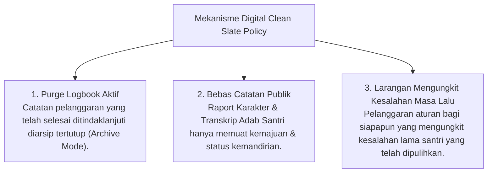

# P6-09-03: Clean Slate Policy dan Eliminasi Stigma Permanen

## Status Dokumen
* **Status**: 🌟 **A+ (Tervalidasi & Siap Diimplementasikan)**
* **Sub-Domain**: `06 Intervention Framework / 09 Recovery`
* **Penanggung Jawab Keilmuan**: Dewan Keilmuan TUMBUH (*Pakar Arsitektur Digital Pesantren & Pakar Filosofi TUMBUH*)

---

## 1. Operasionalisasi Clean Slate Policy Digital

Clean Slate Policy menjamin bahwa rekam jejak kesalahan yang telah diselesaikan secara restoratif **dihapus dari tampilan logbook aktif** Musyrif dan Pengurus Santri:

---

## 2. Landasan Syar'i Pembersihan Stigma

Prinsip ini berlandaskan Sunnah Nabi SAW: *"At-Ta'ibu minadh-dzanbi kamala dzanba lah"* (Orang yang telah bertaubat dan memperbaiki kesalahannya adalah bagaikan orang yang tidak memiliki kesalahan).
