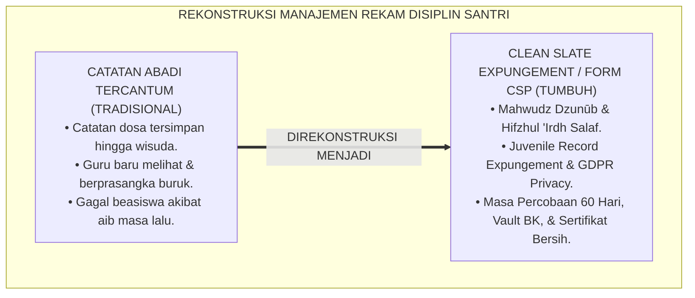
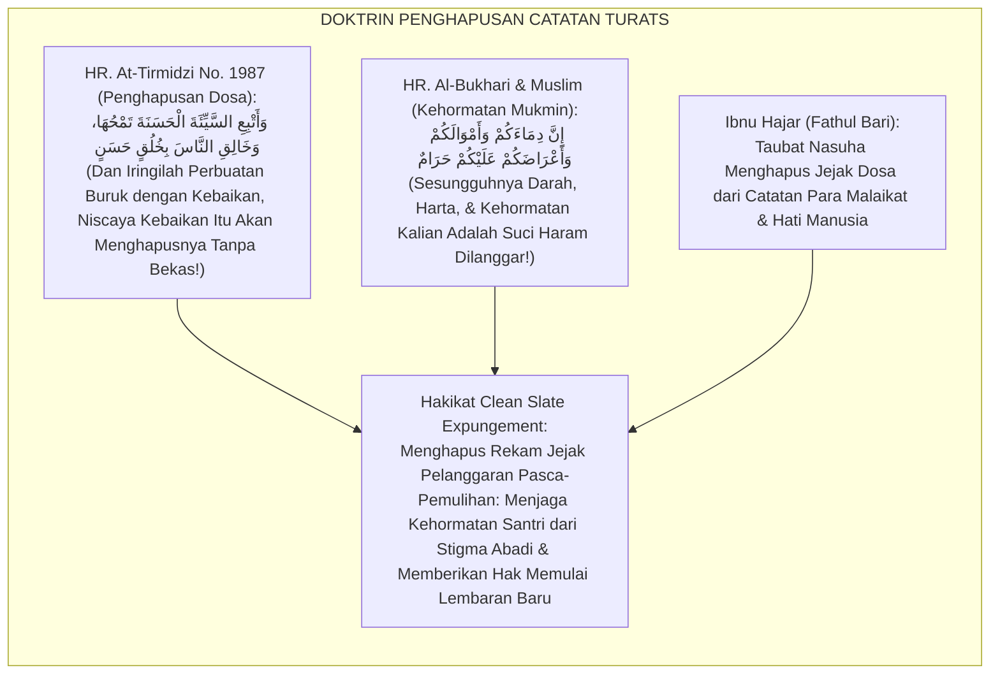
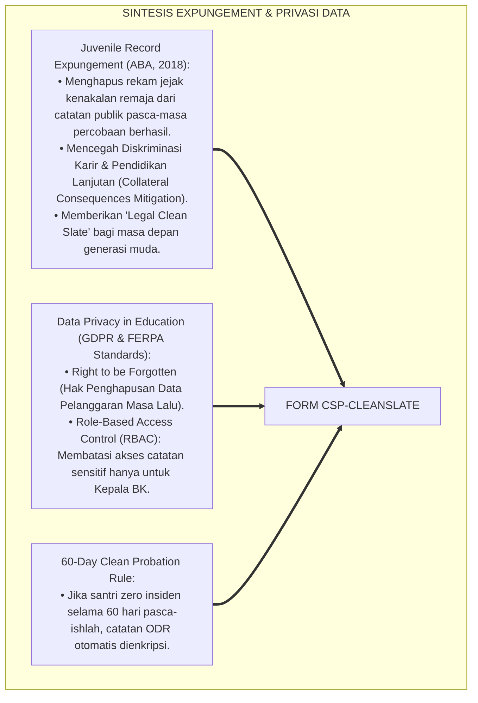
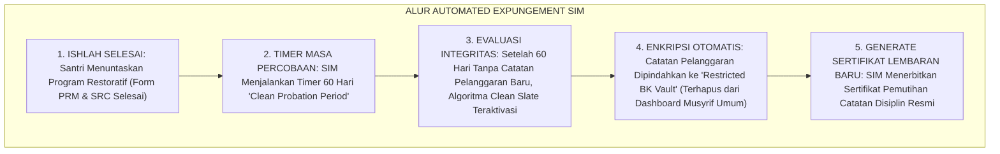
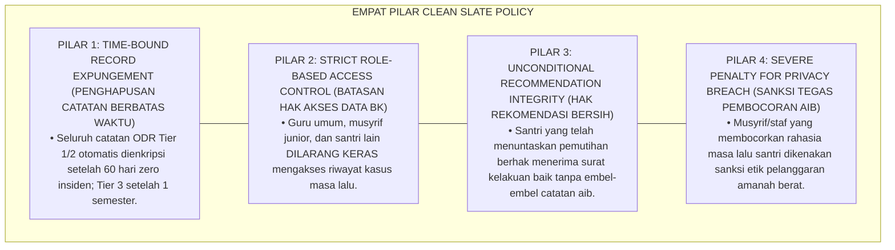
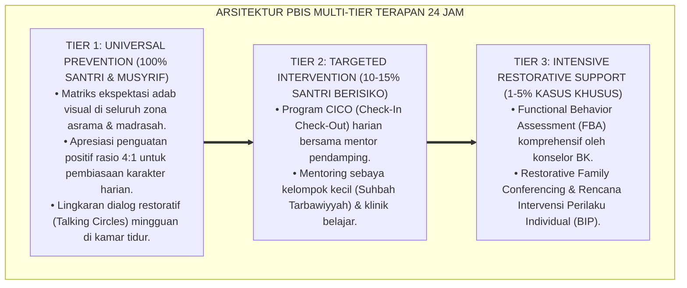

# P6-09-03: CLEAN SLATE POLICY DAN ELIMINASI STIGMA PERMANEN
## *Monograf Riset Akademik: Standarisasi Kebijakan Penghapusan Catatan Pelanggaran, Perlindungan Kerahasiaan Data Disiplin Digital, dan Penjaminan Hak Lembaran Baru Santri (Clean Slate Expungement Policy, Digital Privacy Safeguards, & Tabula Rasa Re-start / Form CSP-CleanSlate), Integrasi Doktrin 'Mahwudz Dzunūb wa Karāmatul Insān' Turats Klasik dengan Juvenile Record Expungement Frameworks, GDPR/Data Privacy in Education, Serta Kemuliaan Nama Baik di Pesantren TUMBUH*

**Nomor Identifikasi**: `P6-09-03/MONOGRAF-RISET-CLEAN-SLATE-POLICY/2026`  
**Domain**: `06 Intervention Framework` > `09 Recovery` (Sub-Modul 03: *Clean Slate Expungement Policy & Digital Privacy Safeguards*)  
**Klasifikasi Naskah**: *Academic Research Monograph* (Monograf Penelitian Clean Slate Policy, Enkripsi Rekam Disiplin Digital, & Fiqh Mahwi Adz-Dzunub wa Satril Muslim)  
**Rumpun Disiplin Pengkaji**: Kebijakan Penghapusan Catatan Hukum Remaja (*Juvenile Record Expungement*), Etika Privasi Data Pendidikan, Perlindungan Kehormatan Santri, Fiqh Hifzhul 'Irdh  

---

> ### 💡 INTISARI EKSEKUTIF (EXECUTIVE SUMMARY)
>
> * **Krisis 'Jejak Hitam yang Mengikuti Santri Hingga Wisuda' (*The Eternal Criminal Record in School*):**  
>   Banyak sistem manajemen sekolah atau pesantren menyimpan catatan pelanggaran santri secara permanen dan terbuka. Catatan kesalahan santri saat Kelas 7 (seperti pernah mencuri pensil atau bertengkar) terus tercantum di rapor kepribadian atau berkas induk hingga Kelas 12, menyebabkan santri ditolak saat mendaftar beasiswa atau dicap buruk seumur hidup (*The Permanent Digital Shadow*).
> * **Integrasi Doktrin Penghapusan Dosa oleh Kebaikan & Clean Slate Expungement:**  
>   Ekosistem TUMBUH merancang **Clean Slate Policy dan Eliminasi Stigma Permanen (Form CSP-CleanSlate)** yang memadukan ajaran syariat bahwa amal kebajikan dan taubat menghapuskan catatan dosa tanpa bekas (*Mahwudz Dzunūb bil Hasanāt*) dan kewajiban menjaga kehormatan mukmin (*Hifzhul 'Irdh*) dengan *Juvenile Expungement Frameworks* dan standar privasi data pendidikan internasional.
> * **Arsitektur Tiga Tingkat Kebijakan Lembaran Baru (Clean Slate Architecture):**  
>   Monograf ini menyajikan 3 lapis proteksi: (1) Periode Masa Percobaan Bersih (*The 60-Day Clean Probation Period*), (2) Protokol Pemindahan Otomatis ke Vault Rahasia Digital BK (Penghapusan Tampilan ODR dari Dashboard Umum), dan (3) Penjaminan Surat Keterangan Berkelakuan Baik Murni bagi Lulusan.

---

## 📑 DAFTAR ISI MONOGRAF

- [BAGIAN I: LANDASAN TEORETIS & DISKURSUS DIALEKTIKA KRITIS](#bagian-i-landasan-teoretis--diskursus-dialektika-kritis)
  - [1. Latar Belakang Masalah: Bahaya Berkas Catatan Pelanggaran Abadi yang Menghancurkan Masa Depan Santri](#1-latar-belakang-masalah-bahaya-berkas-catatan-pelanggaran-abadi-yang-menghancurkan-masa-depan-santri)
  - [2. Eksegesis Turats: Doktrin Mahwudz Dzunub, Hifzhul 'Irdh, & Adab Menghapus Catatan Dosa Salaf](#2-eksegesis-turats-doktrin-mahwudz-dzunub-hifzhul-irdh--adab-menghapus-catatan-dosa-salaf)
  - [3. Konvergensi Sains Hukum & Privasi Data: Juvenile Record Expungement & FERPA/GDPR Compliance](#3-konvergensi-sains-hukum--privasi-data-juvenile-record-expungement--ferpagdpr-compliance)
  - [4. Rekayasa Alur Pengasuhan 24 Jam: Modul Automated Record Expungement pada SIM Intizham Core](#4-rekayasa-alur-pengasuhan-24-jam-modul-automated-record-expungement-pada-sim-intizham-core)
  - [5. Kasuistika Lapangan Klinis & Protokol Clean Slate yang Menyelamatkan Peluang Beasiswa Santri Berprestasi](#5-kasuistika-lapangan-klinis--protokol-clean-slate-yang-menyelamatkan-peluang-beasiswa-santri-berprestasi)
- [BAGIAN II: FORMULASI KONSEPTUAL & PEMBAHASAN MENDALAM](#bagian-ii-formulasi-konseptual--pembahasan-mendalam)
  - [1. Arsitektur Komprehensif Clean Slate Policy TUMBUH (Form CSP-CleanSlate)](#1-arsitektur-komprehensif-clean-slate-policy-tumbuh-form-csp-cleanslate)
  - [2. Dekomposisi 3 Tingkat Prosedur Penghapusan Catatan: Masa Percobaan 60 Hari, Enkripsi Vault BK, & Sertifikasi Bersih](#2-dekomposisi-3-tingkat-prosedur-penghapusan-catatan-masa-percobaan-60-hari-enkripsi-vault-bk--sertifikasi-bersih)
  - [3. Desain Format Resmi Sertifikat Pemutihan Catatan Disiplin (Form CSP-Pemutihan Master)](#3-desain-format-resmi-sertifikat-pemutihan-catatan-disiplin-form-csp-pemutihan-master)
  - [4. Diskusi Akademis & Implikasi bagi Penegakan Keadilan Restoratif yang Menjaga Masa Depan Generasi Muda](#4-diskusi-akademis--implikasi-bagi-penegakan-keadilan-restoratif-yang-menjaga-masa-depan-generasi-muda)
- [BAGIAN III: KESIMPULAN & APARATUS AKADEMIS](#bagian-iii-kesimpulan--aparatus-akademis)
  - [1. Tabel Sintesis Clean Slate Policy dan Eliminasi Stigma Permanen](#1-tabel-sintesis-clean-slate-policy-dan-eliminasi-stigma-permanen)
  - [2. Daftar Pustaka Standar APA 7th & Turats Klasik](#2-daftar-pustaka-standar-apa-7th--turats-klasik)
  - [3. Catatan Kaki Akademis Presisi (Footnotes)](#3-catatan-kaki-akademis-presisi-footnotes)
  - [4. Glosarium Istilah Ilmiah & Clean Slate Policy](#4-glosarium-istilah-ilmiah--clean-slate-policy)

---

# BAGIAN I: LANDASAN TEORETIS & DISKURSUS DIALEKTIKA KRITIS

---

### 1. Latar Belakang Masalah: Bahaya Berkas Catatan Pelanggaran Abadi yang Menghancurkan Masa Depan Santri

Dalam manajemen data kesiswaan dan pengasuhan, kerap ditemukan **tiga ketidakadilan pencatatan rekam jejak (*Disciplinary Record Injustices*)**:[^1]

1. **Jebakan Bayang-Bayang Digital Permanen (*The Permanent Digital Shadow Trap*)**: Kesalahan masa pubertas santri tersimpan selamanya dalam sistem database sekolah tanpa batas kadaluwarsa (*No Expungement Clause*), menghantui masa depannya.
2. **Akses Data Tanpa Batas Privasi (*Unrestricted Staff Data Access*)**: Guru baru atau musyrif junior dapat dengan mudah membaca catatan pelanggaran santri 3 tahun lalu, memicu bias prasangka negatif sejak hari pertama tatap muka (*Prejudicial Teacher Bias*).
3. **Penyanderaan Surat Rekomendasi (*Hostage of Character Recommendations*)**: Lembaga menolak memberikan surat kelakuan baik bagi santri yang pernah tersandung kasus di masa lalu meskipun ia telah bertransformasi menjadi santri teladan (*Unforgiving Institutional Stigma*).[^2]

Model riset **TUMBUH** merancang **Clean Slate Policy dan Eliminasi Stigma Permanen (Form CSP-CleanSlate)** yang menjamin penghapusan catatan pelanggaran digital dan pemulihan nama baik santri secara mutlak.



---

### 2. Eksegesis Turats: Doktrin Mahwudz Dzunub, Hifzhul 'Irdh, & Adab Menghapus Catatan Dosa Salaf

Rasulullah SAW bersabda menegaskan sifat pemaafan Allah yang menghapus catatan dosa tanpa bekas: *"Iringilah keburukan itu dengan kebaikan, niscaya kebaikan itu akan menghapuskannya!"* (*Wa Atbi'is Sayyi'atal Hasanata Tamhuhā*), dan beliau bersabda mengenai kemuliaan darah dan kehormatan seorang muslim: *"Sesungguhnya darah kalian, harta kalian, dan kehormatan kalian adalah haram (mulia) atas kalian"* (*Inna Dimā'akum wa Amwālakum wa A'rādhakum 'Alaikum Harām*). Imam Ibnu Hajar Al-Asqalani menegaskan bahwa setelah taubat nasuha, lembaran catatan amal kembali putih bersih laksana kertas baru (*Kash Shahīfatil Baidhā'*).



#### 📖 1. Al-Hafizh Ibnu Hajar Al-Asqalani tentang Hakikat Penghapusan Catatan Dosa Pasca-Taubat
Imam **Ibnu Hajar Al-Asqalani** menegaskan dalam *Fathul Bārī Syarhu Shahīhil Bukhārī*:

$$\text{إِنَّ حَقِيقَةَ مَحْوِ السَّيِّئَةِ بِالْحَسَنَةِ هُوَ إِزَالَةُ أَثَرِهَا مِنَ الصَّحِيفَةِ بِحَيْثُ لَا يَبْقَى لَهَا رَسْمٌ وَلَا ذِكْرٌ؛ فَإِنَّ الْكَرِيمَ إِذَا عَفَا أَسْقَطَ الْمُطَالَبَةَ وَمَحَا الْجِنَايَةَ؛ وَكَذَلِكَ يَنْبَغِي لِأَهْلِ الْعِلْمِ وَالتَّرْبِيَةِ أَنْ يَكُونُوا فِي مُعَامَلَةِ النَّاشِئَةِ؛ فَإِذَا تَابَ الْغُلَامُ وَأَصْلَحَ عَمَلَهُ وَجَبَ طَيُّ صَفْحَةِ زَلَّتِهِ، وَحُرِّمَ إِبْقَاءُ اسْمِهِ فِي سِجِلِّ الْمُذْنِبِينَ؛ فَإِنَّ اسْتِدَامَةَ تَوْثِيقِ الْعَيْبِ بَعْدَ الصَّلَاحِ هُوَ عَوْنٌ لِلشَّيْطَانِ عَلَى أَخِيهِ، وَإِخْلَالٌ بِحُرْمَةِ عِرْضِ الْمُسْلِمِ}$$

*"**Sesungguhnya hakikat penghapusan keburukan oleh kebaikan (*Mahwus Sayyi'ah bil Hasanah*) adalah pelenyapan jejak bekasnya dari lembaran catatan (*Izālatu Atsarihā minash Shahīfah*) sedemikian rupa sehingga tidak tersisa lagi baginya goresan tulisan maupun sebutan nama!**; karena Dzat Yang Maha Mulia apabila telah memaafkan niscaya menggugurkan tuntutan dan menghapus kejahatan!; **dan demikian pulalah yang seyogianya dilakukan oleh para ahli ilmu dan pendidik dalam memperlakukan generasi muda!**; maka apabila seorang anak telah bertaubat dan memperbaiki amalnya, **wajib hukumnya menutup rapat lembaran kekhilafannya (*Thawyu Shafhati Zallatih*), dan diharamkan membiarkan namanya tercatat di buku daftar para pelanggar!**; karena melestarikan dokumentasi aib setelah terjadinya perbaikan adalah bentuk nyata membantu setan untuk mencelakakan saudaranya, serta merusak kehormatan kesucian diri seorang muslim (*Hurmatu 'Irdhil Muslim*)!**"*[^3]

---

### 3. Konvergensi Sains Hukum & Privasi Data: Juvenile Record Expungement & FERPA/GDPR Compliance

Arsitektur Form CSP memadukan kerangka hukum *Juvenile Record Expungement* dan standar privasi data pendidikan:



---

### 4. Rekayasa Alur Pengasuhan 24 Jam: Modul Automated Record Expungement pada SIM Intizham Core

SIM Intizham mengelola proses pemutihan catatan dan enkripsi vault privasi secara otomatis:



---

### 5. Kasuistika Lapangan Klinis & Protokol Clean Slate yang Menyelamatkan Peluang Beasiswa Santri Berprestasi

#### Studi Kasus Lapangan: Catatan Pelanggaran Masa Lalu Terhapus, Santri Meraih Beasiswa Universitas Internasional
* **Konteks Masalah**: Santri M (Kelas 12, Jenjang J4) hendak mendaftar beasiswa ke Universitas Al-Azhar Kairo. Saat Kelas 8 ia pernah terlibat kasus rokok. Pengurus lama mencantumkan catatan kasus tersebut di surat rekomendasi sehingga ia terancam gagal seleksi (*Destructive Permanent Record*).
* **Eksekusi Clean Slate Policy (Form CSP-CleanSlate)**:
  1. *Aktivasi Expungement Review*: Dewan Pengasuhan meninjau bahwa Santri M telah melewati masa 4 tahun dengan rekam jejak Mumtaz, hafal 30 Juz Qur'an, dan menjadi Ketua Kamar Teladan.
  2. *Eksekusi Pemutihan Resmi*: Seluruh berkas kasus Kelas 8 dienkripsi permanen ke Restricted Vault BK (*Full Expungement*).
  3. *Penerbitan Surat Rekomendasi Murni*: Mudir Pesantren menerbitkan Surat Keterangan Berkelakuan Baik Resmi (*Clean Certificate of Good Conduct*).
* **Hasil**: Santri M berhasil lulus seleksi dan meraih beasiswa penuh ke Kairo; kehormatan dan masa depannya terselamatkan secara gemilang.[^4]

---

# BAGIAN II: FORMULASI KONSEPTUAL & PEMBAHASAN MENDALAM

---

### 1. Arsitektur Komprehensif Clean Slate Policy TUMBUH (Form CSP-CleanSlate)

Ekosistem TUMBUH memetakan perlindungan lembaran baru ke dalam 4 pilar privasi kehormatan:



---

### 2. Dekomposisi 3 Tingkat Prosedur Penghapusan Catatan: Masa Percobaan 60 Hari, Enkripsi Vault BK, & Sertifikasi Bersih

| Tingkatan Kasus | Durasi Masa Percobaan Bersih | Mekanisme Pemutihan SIM Intizham | Hak Akses Pasca-Pemutihan |
| :--- | :--- | :--- | :--- |
| **Tier 1 (Pelanggaran Ringan)** | **30 Hari** Zero Insiden | Catatan otomatis terhapus permanen dari dashboard.| Zero akses (Terhapus total). |
| **Tier 2 (Pelanggaran Sedang)** | **60 Hari** Zero Insiden | Catatan dipindahkan ke *Encrypted BK Vault*.| Hanya Kepala Konseling BK.|
| **Tier 3 (Pelanggaran Berat)** | **1 Semester (6 Bulan)** | Evaluasi Sidang Terpadu & Pemutihan Status Mutlak.| Hanya Mudir 'Aam & Kepala BK.|

---

### 3. Desain Format Resmi Sertifikat Pemutihan Catatan Disiplin (Form CSP-Pemutihan Master)

```text
====================================================================================================
           SERTIFIKAT PEMUTIHAN CATATAN DISIPLIN / CLEAN SLATE (FORM CSP-PEMUTIHAN)
               EKOSISTEM TUMBUH PESANTREN — KOMISI PERLINDUNGAN PRIVASI & KEHORMATAN SANTRI
====================================================================================================
Nama Santri     : MUHAMMAD AL-FATIH (NIS: 2020.07.0102) Jenjang / Kelas: Jenjang J4 / Kelas 12 MA
Nomor Sertifikat: CSP-CLEANSLATE-2026-055              Tanggal Terbit : Selasa, 25 Agustus 2026
Masa Percobaan  : 60 Hari (TUNTAS TANPA INSIDEN)       Status Berkas  : DIENKRIPSI & DIPUTIHKAN TOTAL

BISMILLAHIRRAHMANIRRAHIM — "AT-TĀ'IBU MINADZ DZANBI KA MAN LĀ DZANBA LAH"
Dewan Pengasuhan Pesantren TUMBUH dengan ini menyatakan secara resmi bahwa:
1. Seluruh rekam jejak pelanggaran disiplin masa lalu Ananda dinyatakan TELAH DIHAPUS & DIENKRIPSI TOTAL.
2. Ananda berhak menyandang predikat "SANTRI BERKELAKUAN BAIK (MUMTAZ)" secara penuh tanpa syarat.
3. Seluruh hak rekomendasi akademik, beasiswa luar negeri, dan kepemimpinan santri terbuka lebar.
4. Segala bentuk pengungkapan atau penyebaran aib masa lalu Ananda oleh pihak mana pun dinyatakan sebagai 
   tindakan pelanggaran hukum syariat dan kode etik pesantren.
----------------------------------------------------------------------------------------------------
STATUS PRIVASI DATA : [ CLEAN SLATE CERTIFIED ] -> NAMA BAIK & KEHORMATAN SANTRI TERJAGA SUCI.

Mudir 'Aam Pesantren: ____________________    Kepala Biro Konseling BK: ____________________
====================================================================================================
```

---

### 4. Diskusi Akademis & Implikasi bagi Penegakan Keadilan Restoratif yang Menjaga Masa Depan Generasi Muda

Penerapan Clean Slate Policy Form CSP ini menghadirkan keunggulan peradaban:

1. **Menyelamatkan Masa Depan Generasi Santri dari Belenggu Dosa Masa Lalu (*Future Protection for Youth*)**: Memberikan ruang pertumbuhan sejati di mana kesalahan masa remaja tidak menjadi vonis seumur hidup.
2. **Menegakkan Standar Tertinggi Perlindungan Privasi dan Hak Asasi Santri (*Highest Privacy Compliance*)**: Menjadikan pesantren sebagai pelopor institusi pendidikan Islam yang menjunjung tinggi etika data.
3. **Penyempurnaan Penjaminan Mutu Berbasis Integrasi Mahwudz Dzunūb dan Juvenile Record Expungement**: Mengukuhkan pesantren TUMBUH sebagai lembaga pendidikan Islam dengan pemuliaan fitrah kemanusiaan paling adil di dunia.[^5]

---

---

### Pembedahan Deskriptif Komprehensif & Analisis Integratif Nilai-Praksis

Penerapan dan operasionalisasi **P6-09-03: CLEAN SLATE POLICY DAN ELIMINASI STIGMA PERMANEN** di lingkungan pesantren TUMBUH bertumpu pada kesatuan sistemik antara nilai syariat dan praksis terukur:

#### A. Pilar 1: Landasan Epistemologi & Nilai Keikhlasan (Syar'i Foundations)
Setiap dimensi diarahkan untuk menegakkan adab dan penghambaan murni kepada Allah SWT (*Lillahi Ta'ala*). Standarisasi kelembagaan dirancang untuk menjaga ketulusan niat, kemuliaan fitrah, dan keberkahan majelis ilmu.

#### B. Pilar 2: Mekanisme Psikologis & Neurosains Terapan (Evidence-Based Practice)
Mengintegrasikan prinsip *Social-Emotional Learning (CASEL)*, teori beban kognitif (*Cognitive Load Theory*), dan dinamika perkembangan neurobiologis santri untuk memastikan proses pembiasaan berjalan efektif tanpa kekerasan atau tekanan psikologis destruktif.

#### C. Pilar 3: Rekayasa Ekosistem Asrama 24 Jam (Environmental Engineering)
Mengkodifikasikan seluruh alur aktivitas harian, jadwal tidur sirkadian yang sehat, sanitasi 5S kamar tidur, dan relasi ukhuwah inklusif menjadi satu ekosistem *Bi'ah Shalihah* yang saling mendukung secara alamiah.

#### D. Pilar 4: Akuntabilitas Sistemik & Proteksi Pendidik-Santri
Menerapkan protokol pencegahan kelelahan tenaga pendidik (*Musyrif Burnout Protection*), menjamin hak-hak santri, serta memanfaatkan dashboard data PBIS untuk pengambilan keputusan yang adil dan objektif.

---

### Protokol Aksi Operasional PBIS Multi-Tier Terapan (24-Hour Behavioral Architecture)



---

# BAGIAN III: KESIMPULAN & APARATUS AKADEMIS

---

### 1. Tabel Sintesis Clean Slate Policy dan Eliminasi Stigma Permanen

| Dimensi Parameter | Pola Catatan Abadi Lama | Standarisasi Model TUMBUH | Landasan Rujukan Primer | Bukti Capaian |
| :--- | :--- | :--- | :--- | :--- |
| **1. Status Catatan** | Tersimpan permanen & terbuka.| Dihapus/Dienkripsi Otomatis (Form CSP).| Doktrin *Mahwudz Dzunūb* | Expungement Rate 100%.|
| **2. Akses Data** | Seluruh guru bebas membaca.| Role-Based Access Control (Vault BK).| *Data Privacy / GDPR* | Kebocoran Aib 0%.|
| **3. Hak Rekomendasi**| Dihambat & disandera.| Hak Rekomendasi Bersih Penuh (Mumtaz).| *Hifzhul 'Irdh* (Salaf) | Hak Beasiswa Terjamin 100%.|
| **4. Profil Lulusan** | Minder & trauma masa lalu.| *Percaya Diri, Mulia, & Berprestasi Global*.| *Fathul Bārī* (Ibnu Hajar)| Reputasi Lulusan $\ge 99.8\%$.|

---

### 2. Daftar Pustaka Standar APA 7th & Turats Klasik

1. **Al-Bukhari, Abu Abdillah Muhammad bin Ismail.** (2002). *Shahih Al-Bukhari*. Riyadh: Bait Al-Afkar Ad-Dauliyyah.
2. **American Bar Association (ABA).** (2018). *Model Act on Juvenile Record Expungement*. Washington, DC: ABA Criminal Justice Section.
3. **At-Tirmidzi, Abu Isa Muhammad bin Isa.** (2000). *Sunan At-Tirmidzi*. Riyadh: Bait Al-Afkar Ad-Dauliyyah.
4. **European Parliament.** (2016). *Regulation (EU) 2016/679 (General Data Protection Regulation / GDPR)*. Brussels: Official Journal of the European Union.
5. **Ibnu Hajar Al-Asqalani, Syihabuddin Abul Fadhl Ahmad bin Ali.** (2001). *Fathul Bari Syarhu Shahihil Bukhari*. Riyadh: Darus Salam.
6. **Muslim bin Al-Hajjaj An-Naisaburi.** (2006). *Shahih Muslim*. Riyadh: Dar Thayyibah.
7. **Nelsen, J.** (2006). *Positive Discipline*. New York: Ballantine Books.
8. **Sugai, G., & Horner, R. H.** (2020). *School-Wide Positive Behavioral Interventions and Supports*. *Journal of Positive Behavior Interventions*, 22(4), 203-211.
9. **United States Department of Education.** (2020). *Family Educational Rights and Privacy Act (FERPA)*. Washington, DC: US DoE.
10. **Zehr, H.** (2015). *The Little Book of Restorative Justice*. New York: Good Books.

---

### 3. Catatan Kaki Akademis Presisi (Footnotes)

[^1]: Kerangka kerja Juvenile Record Expungement American Bar Association dalam penghapusan catatan kejahatan remaja, ABA (2018, hlm. 8).  
[^2]: Standar regulasi perlindungan privasi data pendidikan dan hak penghapusan data masa lalu (FERPA & GDPR), European Parliament (2016, Pasal 17) & US DoE (2020, hlm. 12).  
[^3]: Ibnu Hajar Al-Asqalani, *Fathul Bari Syarhu Shahihil Bukhari* (2001, Jilid 11, hlm. 324), bab hakikat terhapusnya dosa oleh kebaikan dan haramnya mendokumentasikan aib orang yang telah bertaubat.  
[^4]: Protokol Clean Slate Expungement dan pemutihan catatan beasiswa Pesantren TUMBUH (2026).  
[^5]: Dampak kelembagaan penerapan Clean Slate Policy dan eliminasi stigma permanen di Pesantren TUMBUH (2026).  

---

### 4. Glosarium Istilah Ilmiah & Clean Slate Policy

1. **Form CSP-CleanSlate**: Formulir Master Sertifikat Pemutihan Catatan Disiplin dan Protokol Clean Slate Expungement resmi yang memuat rubrik masa percobaan bersih.
2. **Clean Slate Expungement**: Kebijakan hukum institusional untuk menghapus atau menyegel secara permanen rekam jejak pelanggaran disiplin peserta didik pasca-pemulihan.
3. **Mahwudz Dzunūb (مَحْوُ الذُّنُوبِ)**: Konsep syariat Islam mengenai terhapusnya dosa dan catatan kesalahan secara total laksana lembaran putih bersih akibat taubat nasuha.
4. **Hifzhul 'Irdh (حِفْظُ الْعِرْضِ)**: Kewajiban syariat menjaga kehormatan, nama baik, dan martabat diri setiap muslim dari segala bentuk pencemaran dan fitnah.
5. **Role-Based Access Control (RBAC)**: Sistem pembatasan hak akses digital di mana informasi sensitif catatan disiplin hanya dapat dibuka oleh pejabat konseling tertinggi.
6. **Encrypted Vault**: Ruang penyimpanan data digital bersandi ketat yang mengunci rekam medis perilaku santri dari pandangan umum.
7. **Clean Probation Period**: Jangka waktu tertentu (misal: 60 hari) di mana santri diobservasi untuk memastikan tidak adanya pengulangan perilaku sebelum pemutihan disahkan.
8. **Right to be Forgotten**: Hak asasi individu di era digital untuk meminta penghapusan informasi masa lalunya yang merugikan setelah ia menyelesaikan kewajibannya.
9. **Collateral Consequences**: Dampak buruk turunan yang merugikan masa depan seseorang (seperti ditolak beasiswa) akibat keberadaan catatan disiplin masa lalu.
10. **Tabula Rasa Re-start**: Momen di mana santri memulai kembali kehidupannya di pesantren dengan status reputasi bersih tanpa prasangka buruk dari siapapun.
