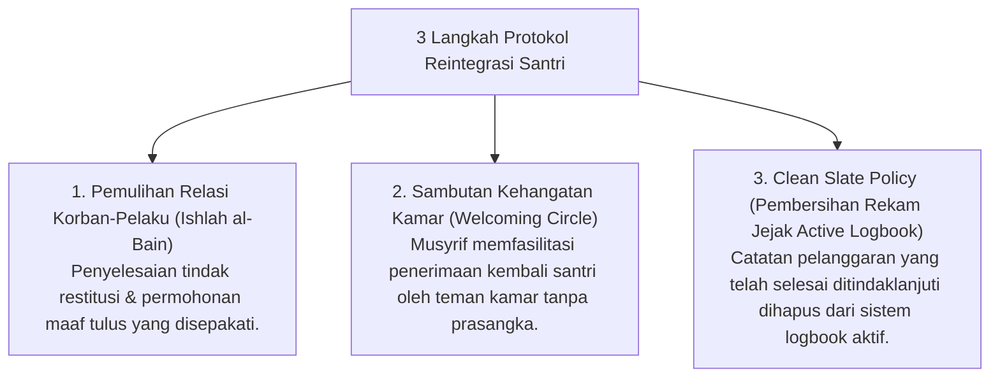

# P6-09: Protokol Pemulihan dan Reintegrasi Santri (Clean Slate Policy)

## Status Dokumen
* **Status**: 🌟 **A+ (Tervalidasi & Siap Diimplementasikan)**
* **Sub-Domain**: `06 Intervention Framework / 09 Recovery`
* **Penanggung Jawab Keilmuan**: Dewan Keilmuan TUMBUH (*Pakar Arsitektur PBIS Restoratif & Pakar Bimbingan Konseling*)

---

## 1. Konseptualisasi Reintegrasi Restoratif

Reintegrasi Restoratif adalah alur pembimbingan yang memastikan bahwa santri yang telah menyelesaikan proses perbaikan perilaku atau intervensi Tier 2/3 **diterima kembali secara utuh ke dalam komunitas kamar dan kelas tanpa diskriminasi atau sinisme**.

---

## 2. Aturan Clean Slate Policy (Bebas Stigma Permanen)

- Catatan insiden pelanggaran yang telah dipulihkan secara restoratif tidak boleh diungkit kembali oleh musyrif, ustadz, maupun santri senior di kemudian hari.
- Santri memiliki kesempatan bersih (*Fresh Start*) untuk membangun portofolio adab positifnya.
