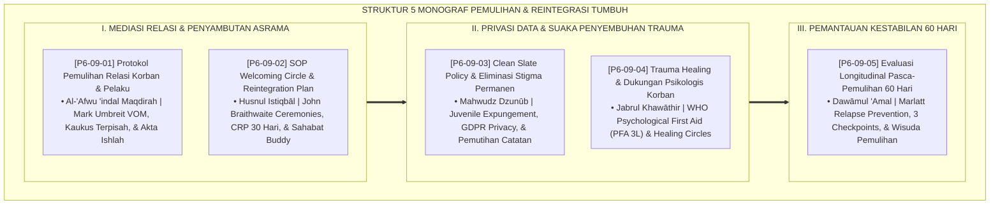

# P6-09: DOKUMEN INDUK PROTOKOL PEMULIHAN DAN REINTEGRASI SANTRI
## *Arsitektur dan Rekayasa Sistem Pemulihan dan Reintegrasi Terpadu, Mediasi Pemulihan Relasi Korban-Pelaku, SOP Welcoming Circle Asrama, Kebijakan Clean Slate Expungement, Pertolongan Pertama Trauma Healing PFA, Serta Evaluasi Longitudinal 60 Hari (Victim Mediation Form PRK, Welcoming Circle Form SWC, Clean Slate Form CSP, Trauma Healing Form MTH, Serta Longitudinal Audit Form PEL) di Ekosistem TUMBUH Pesantren*

**Nomor Identifikasi**: `P6-09/DOKUMEN-INDUK-PEMULIHAN-REINTEGRASI/2026`  
**Domain**: `06 Intervention Framework` > `09 Recovery` (Gugus Sub-Domain 09: *Comprehensive Restorative Recovery, Victim Healing, & Reintegration Framework*)  
**Klasifikasi Naskah**: *Master Architecture & Navigation Monograph* (Dokumen Induk Peta Jalan Riset & Navigasi 5 Monograf Ilmiah Pemulihan dan Reintegrasi Santri)  
**Rumpun Disiplin Pengkaji**: Keadilan Restoratif Komunal (*Restorative Recovery*), Victim-Offender Mediation (VOM), Trauma-Informed Care, Fiqh As-Sulh wal Istiqamah  

---

> ### 💡 INTISARI EKSEKUTIF (EXECUTIVE SUMMARY)
>
> * **Kedudukan Strategis Gugus Protokol Pemulihan dan Reintegrasi Santri:**  
>   Gugus *Recovery (Protokol Pemulihan dan Reintegrasi Santri)* merupakan pilar penutup siklus keadilan dan penyembuhan (*The Healing & Full Restoration Arch*) dalam ekosistem TUMBUH. Gugus ini menjamin bahwa setiap proses penanganan konflik dan pelanggaran tidak menyisakan dendam, trauma batin, atau stigma abadi: **Pemulihan Relasi Korban-Pelaku (Form PRK)**, **SOP Welcoming Circle & CRP (Form SWC)**, **Clean Slate Policy (Form CSP)**, **Trauma Healing & PFA (Form MTH)**, dan **Evaluasi Longitudinal 60 Hari (Form PEL)**.
> * **Integrasi Holistik Turats & Konsensus Sains Pemulihan:**  
>   Gugus riset ini memadukan khazanah agung Islam tentang pemaafan mulia (*Al-'Afwu 'indal Maqdirah*), penyambutan saudara yang kembali (*Husnul Istiqbāl*), terhapusnya dosa oleh taubat (*Mahwudz Dzunūb*), membalut luka hati (*Jabrul Khawāthir*), dan kesinambungan amal istiqamah (*Dawāmul 'Amal*) dengan konsensus sains dunia (*Umbreit VOM, Braithwaite Reintegration Ceremonies, Juvenile Expungement Standards, WHO Psychological First Aid, Herman Trauma Stages, dan Marlatt Relapse Prevention*).
> * **Struktur Lengkap 5 Berkas Monograf Riset Ilmiah:**  
>   Dokumen induk ini memetakan dan menghubungkan 5 berkas monograf penelitian akademik komprehensif (~145 KB total riset) yang menyajikan akta ishlah VOM 3 fase, ritual sambutan kamar 20 menit, sertifikat pemutihan catatan digital, panduan PFA 3L, dan matriks audit 3 checkpoints 60 hari.

---

## 📑 PETA NAVIGASI LIMA MONOGRAF RISET PROTOKOL PEMULIHAN

Berikut adalah daftar lengkap 5 monograf riset akademik dalam gugus **`09 Recovery`**:

---

## 📚 DESKRIPSI RINGKAS 5 BERKAS MONOGRAF

1. **[P6-09-01: Protokol Pemulihan Relasi Korban dan Pelaku](file:///c:/xampp/htdocs/tumbuh/06%20Intervention%20Framework/09%20Recovery/P6-09-01-Protokol-Pemulihan-Relasi-Korban-dan-Pelaku.md)**  
   *Membahas mediasi humanistik korban-pelaku, doktrin Al-'Afwu 'indal Maqdirah & Adabul I'tidzar, Mark Umbreit VOM, kaukus pra-mediasi terpisah, dan form Form PRK-Relasi.*
2. **[P6-09-02: SOP Welcoming Circle dan Reintegration Plan](file:///c:/xampp/htdocs/tumbuh/06%20Intervention%20Framework/09%20Recovery/P6-09-02-SOP-Welcoming-Circle-dan-Reintegration-Plan.md)**  
   *Membahas upacara penyambutan kepulangan santri di kamar asrama, doktrin Husnul Istiqbal & Al-Mu'anaqah, John Braithwaite Reintegration Ceremonies, Comprehensive Reintegration Plan (CRP), dan form Form SWC-Welcoming.*
3. **[P6-09-03: Clean Slate Policy dan Eliminasi Stigma Permanen](file:///c:/xampp/htdocs/tumbuh/06%20Intervention%20Framework/09%20Recovery/P6-09-03-Clean-Slate-Policy-dan-Eliminasi-Stigma-Permanen.md)**  
   *Membahas kebijakan penghapusan catatan pelanggaran digital dan pemulihan reputasi santri, doktrin Mahwudz Dzunub & Hifzhul 'Irdh, Juvenile Record Expungement, dan form Form CSP-CleanSlate.*
4. **[P6-09-04: Manajemen Trauma Healing dan Dukungan Psikologis Korban](file:///c:/xampp/htdocs/tumbuh/06%20Intervention%20Framework/09%20Recovery/P6-09-04-Manajemen-Trauma-Healing-dan-Dukungan-Psikologis-Korban.md)**  
   *Membahas pertolongan pertama psikologis santri korban dan saksi pasca-krisis, doktrin Jabrul Khawathir & Taskinur Ru', WHO Psychological First Aid (PFA 3L: Look, Listen, Link), dan form Form MTH-TraumaHealing.*
5. **[P6-09-05: Protokol Evaluasi Longitudinal Pasca-Pemulihan 60 Hari](file:///c:/xampp/htdocs/tumbuh/06%20Intervention%20Framework/09%20Recovery/P6-09-05-Protokol-Evaluasi-Longitudinal-Pasca-Pemulihan-60-Hari.md)**  
   *Membahas audit kestabilan adab dan pencegahan kekambuhan pasca-ishlah, doktrin Dawamul 'Amal & Fastaqim Kama Umirta, G. Alan Marlatt Relapse Prevention Model, 3 checkpoints audit, dan form Form PEL-Evaluasi.*

---

## 🎯 STANDAR PENJAMINAN MUTU PROTOKOL PEMULIHAN & REINTEGRASI

Penerapan gugus **Protokol Pemulihan dan Reintegrasi Santri (Recovery)** menjamin bahwa:
1. **Luka Batin Korban Dipulihkan dan Rasa Takut Dilenyapkan Secara Profesional (*Trauma-Free & Protected Victims*)**: Korban mendapatkan perlindungan psikologis dan tidak dipaksa melakukan rekonsiliasi semu.
2. **Santri yang Bertaubat Diterima Kembali dengan Mulia dan Bebas dari Catatan Aib Abadi (*Dignified Clean Slate Re-entry*)**: Menghapus stigma masa lalu dan memberikan kepastian masa depan cerah.
3. **Hasil Perbaikan Karakter Mengakar Kokoh dan Tahan Kekambuhan (*Long-Term Moral Permanence*)**: Pengawalan 60 hari menjamin transisi pembiasaan adab berjalan mulus hingga mencapai derajat istiqamah sejati.
