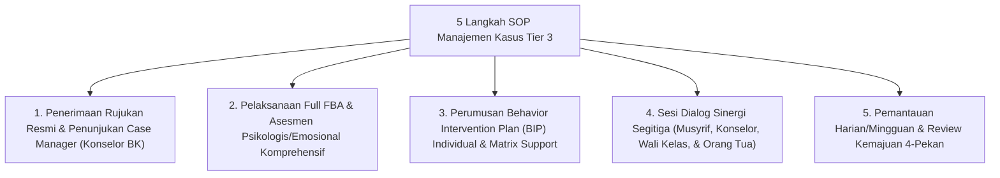

# P6-10-01: SOP Manajemen Kasus Khusus Tier 3

## Status Dokumen
* **Status**: 🌟 **A+ (Tervalidasi & Siap Diimplementasikan)**
* **Sub-Domain**: `06 Intervention Framework / 10 Case Management`
* **Penanggung Jawab Keilmuan**: Dewan Keilmuan TUMBUH (*Pakar Bimbingan Konseling & Pakar Pengasuhan Asrama*)

---

## 1. SOP Penanganan Kasus Khusus Tier 3

Manajemen Kasus Khusus Tier 3 mengkoordinasikan intervensi individual bagi santri yang menghadapi tantangan perilaku/emosional kompleks:

---

## 2. Tanggung Jawab Case Manager (Konselor BK)

Konselor BK bertindak sebagai *Case Manager* utama yang mengoordinasikan seluruh informasi, dokumen pembinaan, dan alur konseling santri secara terpadu.
