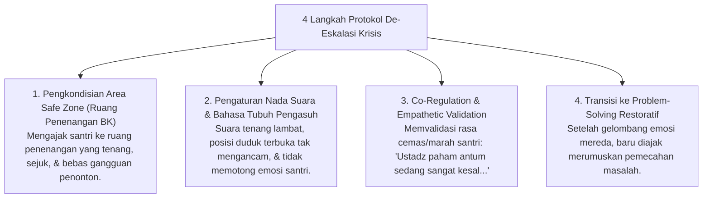

# P6-10-02: Protokol De-Eskalasi Krisis Emosional Santri

## Status Dokumen
* **Status**: 🌟 **A+ (Tervalidasi & Siap Diimplementasikan)**
* **Sub-Domain**: `06 Intervention Framework / 10 Case Management`
* **Penanggung Jawab Keilmuan**: Dewan Keilmuan TUMBUH (*Pakar Bimbingan Konseling & Pakar Neurosains Perkembangan*)

---

## 1. Operasionalisasi De-Eskalasi Krisis Emosional

Protokol ini digunakan saat santri mengalami luapan emosi intens (marah berlebih, panik, atau kecemasan ekstrem):

---

## 2. Larangan Konfrontasi saat Emosi Tinggi

Dilarang keras mendebat, menasihati panjang lebar, atau memberi ancaman saat santri berada dalam kondisi krisis emosional (*Amigdala Hijack*).
