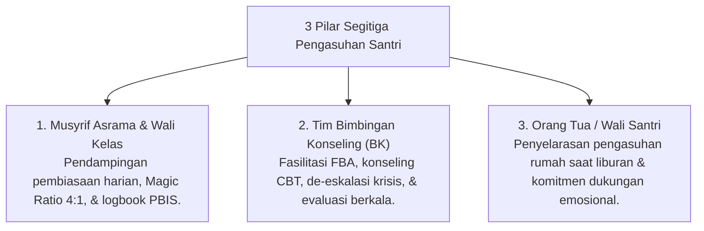

# P6-10-03: Sinergi Segitiga Pengasuhan Musyrif-BK-Orang Tua

## Status Dokumen
* **Status**: 🌟 **A+ (Tervalidasi & Siap Diimplementasikan)**
* **Sub-Domain**: `06 Intervention Framework / 10 Case Management`
* **Penanggung Jawab Keilmuan**: Dewan Keilmuan TUMBUH (*Pakar Bimbingan Konseling & Pakar Pengasuhan Asrama*)

---

## 1. Operasionalisasi Sinergi Segitiga Pengasuhan

Sinergi Segitiga menghubungkan tiga pilar utama pengasuhan santri secara selaras dan saling menguatkan:

---

## 2. SOP Dialog Kemitraan Orang Tua

- Penyampaian laporan dilakukan dengan pendekatan empati dan apresiatif (*Growth-Oriented Partnership*).
- Menghindari menyalahkan orang tua atas perilaku santri, melainkan mengundang kolaborasi nyata untuk mendukung pertumbuhan anak.
