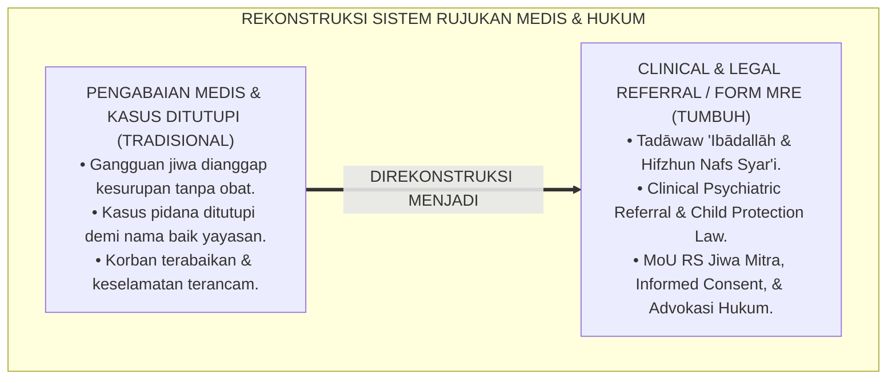
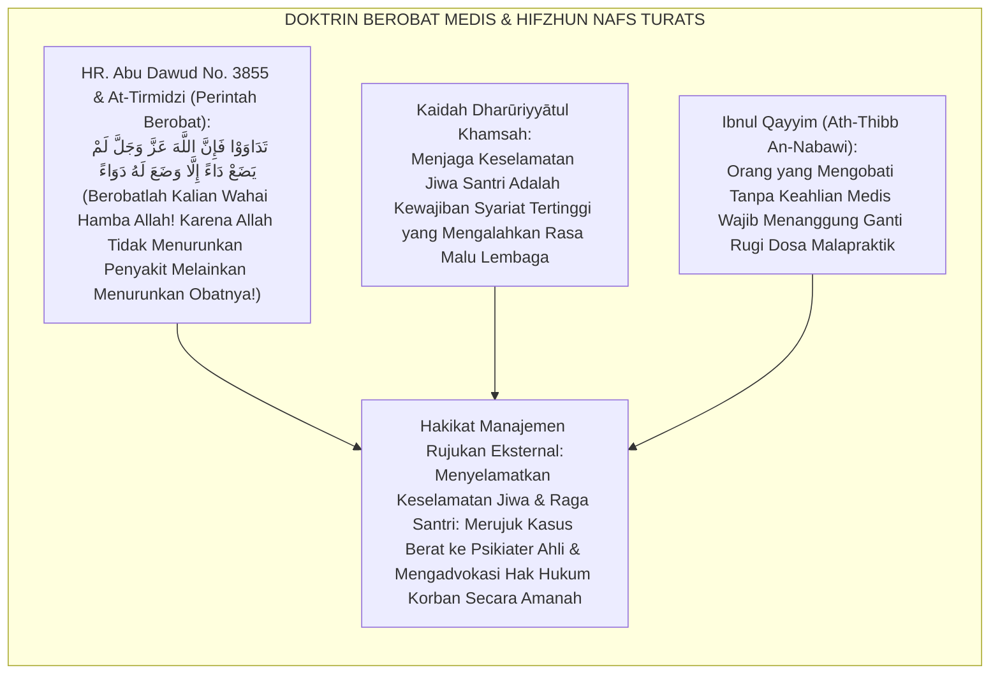
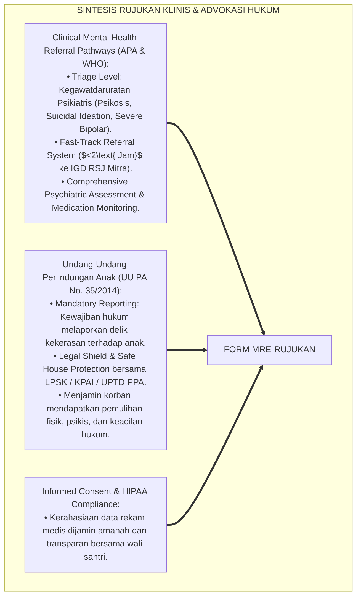
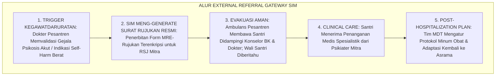
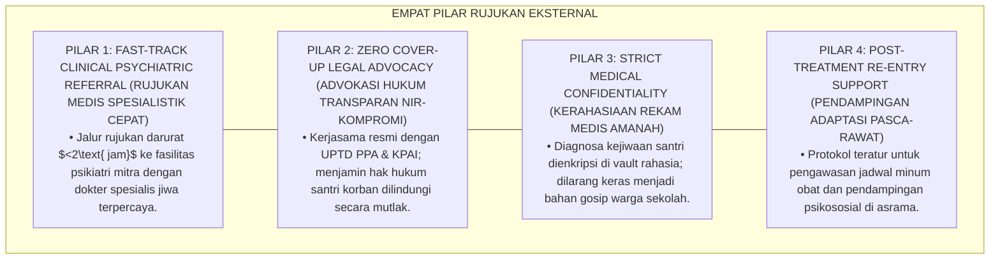
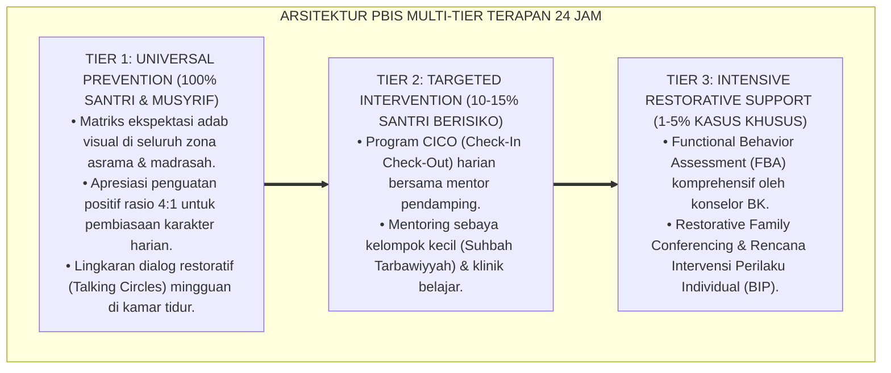

# P6-10-04: MANAJEMEN RUJUKAN EKSTERNAL PSIKIATRI DAN HUKUM SANTRI
## *Monograf Riset Akademik: Standarisasi Protokol Rujukan Medis Spesialistik, Kemitraan Psikiatri Klinis, dan Perlindungan Hukum Hak Anak di Pesantren (External Psychiatric Referral Protocols, Clinical Psychology Partnerships, & Child Legal Advocacy / Form MRE-Rujukan), Integrasi Doktrin 'Tadāwaw 'Ibādallāh wa Hifzhun Nafs' Turats Klasik dengan Clinical Referral Pathways, Child Protection Legal Frameworks, Serta Keselamatan Santri di Ekosistem Pesantren Berbasis TUMBUH*

**Nomor Identifikasi**: `P6-10-04/MONOGRAF-RISET-RUJUKAN-PSIKIATRI-HUKUM/2026`  
**Domain**: `06 Intervention Framework` > `10 Case Management` (Sub-Modul 04: *External Psychiatric Referral Protocols & Child Legal Advocacy*)  
**Klasifikasi Naskah**: *Academic Research Monograph* (Monograf Penelitian Alur Rujukan Psikiatri Eksternal, Perlindungan Hukum Hak Anak UU PA, & Fiqh At-Tadawi wa Hifzhin Nafs)  
**Rumpun Disiplin Pengkaji**: Psikiatri Klinis & Kedokteran Jiwa Remaja, Hukum Perlindungan Anak (*Child Advocacy Law*), Etika Rujukan Medis, Fiqh Hifzhin Nafs  

---

> ### 💡 INTISARI EKSEKUTIF (EXECUTIVE SUMMARY)
>
> * **Krisis 'Kasus Gangguan Jiwa Berat & Delik Pidana yang Ditutupi atau Ditangani Dukun' (*The Medical Neglect & Unlawful Cover-Up Crisis*):**  
>   Ketika santri mengalami gangguan kejiwaan berat (seperti psikosis akut, bipolar, depresi mayor berat) atau menjadi korban delik hukum serius (seperti kekerasan seksual atau penganiayaan berat), pihak pesantren kerap melakukan dua kesalahan fatal: (1) Mengabaikan medis dan hanya meruqyah/mengurung santri tanpa obat (*Medical Neglect*), atau (2) Menutupi kasus secara ilegal demi nama baik lembaga tanpa memberi advokasi hukum kepada korban (*Unlawful Concealment*).
> * **Integrasi Doktrin Berobat Medis Syar'i & Clinical Referral Pathways:**  
>   Ekosistem TUMBUH merancang **Manajemen Rujukan Eksternal Psikiatri dan Hukum Santri (Form MRE-Rujukan)** yang memadukan perintah Nabawi untuk berobat medis secara profesional (*Tadāwaw 'Ibādallāh*) dan kewajiban menjaga keselamatan jiwa (*Hifzhun Nafs*) dengan *Clinical Mental Health Referral Pathways* dan regulasi Undang-Undang Perlindungan Anak.
> * **Arsitektur Tiga Tingkat Protokol Rujukan Terpadu (Referral & Advocacy Triad):**  
>   Monograf ini membakukan: (1) Protokol Rujukan Cepat Psikiatri/Rumah Sakit Mitra (*Fast-Track Psychiatric Referral*), (2) Pakta Kerahasiaan Rekam Medis (Informed Consent Wali), dan (3) Prosedur Advokasi Hukum & Pendampingan Korban di Lembaga Perlindungan Saksi/Anak.

---

## 📑 DAFTAR ISI MONOGRAF

- [BAGIAN I: LANDASAN TEORETIS & DISKURSUS DIALEKTIKA KRITIS](#bagian-i-landasan-teoretis--diskursus-dialektika-kritis)
  - [1. Latar Belakang Masalah: Bahaya Malapraktik Pengabaian Medis Psikiatri dan Penutupan Kasus Hukum di Pesantren](#1-latar-belakang-masalah-bahaya-malapraktik-pengabaian-medis-psikiatri-dan-penutupan-kasus-hukum-di-pesantren)
  - [2. Eksegesis Turats: Doktrin Tadawaw Fainnallah Lam Yadhō' Dā'an Illā Dawa'an, Hifzhun Nafs, & Adab Tabib Salaf](#2-eksegesis-turats-doktrin-tadawaw-fainnallah-lam-yadho-daan-illa-dawaan-hifzhun-nafs--adab-tabib-salaf)
  - [3. Konvergensi Sains Rujukan & Advokasi Hukum: Clinical Referral Standards & Child Protection Laws](#3-konvergensi-sains-rujukan--advokasi-hukum-clinical-referral-standards--child-protection-laws)
  - [4. Rekayasa Alur Pengasuhan 24 Jam: Modul External Referral Gateway pada SIM Intizham Core](#4-rekayasa-alur-pengasuhan-24-jam-modul-external-referral-gateway-pada-sim-intizham-core)
  - [5. Kasuistika Lapangan Klinis & Protokol Rujukan Cepat yang Menyelamatkan Santri dari Episode Psikotik Akut](#5-kasuistika-lapangan-klinis--protokol-rujukan-cepat-yang-menyelamatkan-santri-dari-episode-psikotik-akut)
- [BAGIAN II: FORMULASI KONSEPTUAL & PEMBAHASAN MENDALAM](#bagian-ii-formulasi-konseptual--pembahasan-mendalam)
  - [1. Arsitektur Komprehensif Manajemen Rujukan Eksternal TUMBUH (Form MRE-Rujukan)](#1-arsitektur-komprehensif-manajemen-rujukan-eksternal-tumbuh-form-mre-rujukan)
  - [2. Dekomposisi 3 Alur Rujukan Spesialistik: Rujukan Psikiatri/RSJ Mitra, Rujukan Psikolog Klinis, & Rujukan Advokasi Hukum](#2-dekomposisi-3-alur-rujukan-spesialistik-rujukan-psikiatrirsj-mitra-rujukan-psikolog-klinis--rujukan-advokasi-hukum)
  - [3. Desain Format Resmi Surat Rujukan Eksternal & Informed Consent (Form MRE-Surat Master)](#3-desain-format-resmi-surat-rujukan-eksternal--informed-consent-form-mre-surat-master)
  - [4. Diskusi Akademis & Implikasi bagi Penegakan Integritas Lembaga yang Taat Hukum dan Menjunjung Tinggi Keselamatan Jiwa](#4-diskusi-akademis--implikasi-bagi-penegakan-integritas-lembaga-yang-taat-hukum-dan-menjunjung-tinggi-keselamatan-jiwa)
- [BAGIAN III: KESIMPULAN & APARATUS AKADEMIS](#bagian-iii-kesimpulan--aparatus-akademis)
  - [1. Tabel Sintesis Manajemen Rujukan Eksternal Psikiatri dan Hukum Santri](#1-tabel-sintesis-manajemen-rujukan-eksternal-psikiatri-dan-hukum-santri)
  - [2. Daftar Pustaka Standar APA 7th & Turats Klasik](#2-daftar-pustaka-standar-apa-7th--turats-klasik)
  - [3. Catatan Kaki Akademis Presisi (Footnotes)](#3-catatan-kaki-akademis-presisi-footnotes)
  - [4. Glosarium Istilah Ilmiah & Rujukan Eksternal](#4-glosarium-istilah-ilmiah--rujukan-eksternal)

---

# BAGIAN I: LANDASAN TEORETIS & DISKURSUS DIALEKTIKA KRITIS

---

### 1. Latar Belakang Masalah: Bahaya Malapraktik Pengabaian Medis Psikiatri dan Penutupan Kasus Hukum di Pesantren

Dalam penanganan kasus-kasus ekstrem di pesantren, kerap timbul **tiga jebakan penanganan malapraktik (*Institutional Malpractice Traps*)**:[^1]

1. **Jebakan Pengabaian Medis Psikiatris (*The Psychiatric Denial Trap*)**: Santri yang mengalami halusinasi atau depresi psikotik dianggap semata-mata "kesurupan jin" dan hanya diruqyah tanpa pernah dirujuk ke psikiater, menyebabkan kerusakan otak permanen (*Severe Neurobiological Neglect*).
2. **Jebakan Penutupan Kasus Pidana Secara Ilegal (*The Illegal Cover-Up Trap*)**: Kasus kekerasan seksual atau penganiayaan berat diselesaikan di bawah meja tanpa perlindungan hukum yang layak bagi korban demi menjaga reputasi yayasan (*Secondary Institutional Betrayal*).
3. **Ketiadaan Kerjasama Resmi dengan Rumah Sakit Jiwa & LBH (*Zero Institutional Referral Networks*)**: Pesantren tidak memiliki MoU resmi dengan fasilitas kesehatan jiwa dan lembaga bantuan hukum anak, sehingga penanganan krisis berjalan lambat dan amatir.[^2]

Model riset **TUMBUH** merancang **Manajemen Rujukan Eksternal Psikiatri dan Hukum Santri (Form MRE-Rujukan)** yang menegakkan standar rujukan medis profesional dan kepatuhan hukum total.



---

### 2. Eksegesis Turats: Doktrin Tadawaw Fainnallah Lam Yadhō' Dā'an Illā Dawa'an, Hifzhun Nafs, & Adab Tabib Salaf

Rasulullah SAW memerintahkan umatnya untuk berobat kepada ahlinya: *"Berobatlah kalian wahai hamba-hamba Allah! Sesungguhnya Allah tidak menurunkan suatu penyakit melainkan menurunkan pula obat penawarnya kecuali satu penyakit: yaitu penyakit tua"* (*Tadāwaw 'Ibādallāh...*). Beliau juga memanggil dokter terbaik untuk mengobati sahabat yang terluka. Para fukaha sepakat bahwa memelihara keselamatan nyawa (*Hifzhun Nafs*) adalah *Dharūriyyātul Khamsah* yang wajib didahulukan di atas segala pertimbangan lain.



#### 📖 1. Kaidah Al-Imam Ibnul Qayyim Al-Jauziyyah tentang Kewajiban Merujuk Penyakit Kepada Ahli Medis
Imam **Ibnul Qayyim Al-Jauziyyah** menegaskan dalam *Zād Al-Ma'ād (Kitāb Ath-Thibb An-Nabawī)*:

$$\text{إِنَّ التَّدَاوِيَ بِالْأَسْبَابِ الطِّبِّيَّةِ الْمَحْسُوسَةِ لَا يُنَافِي التَّوَكُّلَ عَلَى اللَّهِ، بَلْ هُوَ مِنْ تَمَامِ الْإِيمَانِ بِحِكْمَةِ اللَّهِ وَقَدَرِهِ؛ فَمَنْ أَصَابَهُ مَرَضٌ فِي عَقْلِهِ أَوْ جَسَدِهِ وَجَبَ عَرْضُهُ عَلَى الْحَاذِقِ مِنْ أَهْلِ الصِّنَاعَةِ؛ وَأَمَّا مَنْ تَكَلَّفَ مُدَاوَاةَ النَّاسِ وَهُوَ غَيْرُ عَارِفٍ بِعِلْمِ الطِّبِّ، أَوْ حَبَسَ الْمَرِيضَ عَنِ الْعِلَاجِ النَّافِعِ بِدَعْوَى الِاكْتِفَاءِ بِالْعَزَائِمِ، فَقَدْ جَهِلَ السُّنَّةَ وَتَعَرَّضَ لِلْإِثْمِ الْعَظِيمِ؛ فَقَدْ قَالَ النَّبِيُّ ﷺ: 'مَنْ تَطَبَّبَ وَلَمْ يُعْلَمْ مِنْهُ طِبٌّ قَبْلَ ذَلِكَ فَهُوَ ضَامِنٌ'؛ وَالْوَاجِبُ عَلَى أَهْلِ الْفَضْلِ فِي الْمَحَاضِنِ التَّرْبَوِيَّةِ أَنْ يُسَارِعُوا إِلَى إِحَالَةِ الْحَالَاتِ الْمُسْتَعْصِيَةِ إِلَى أَهْلِ الِاخْتِصَاصِ؛ حِفْظًا لِلنُّفُوسِ الْمُعَلَّقَةِ بِأَعْنَاقِهِمْ}$$

*"**Sesungguhnya berobat (*At-Tadāwī*) dengan sebab-sebab medis kedokteran yang nyata sama sekali tidak menafikan tawakkal kepada Allah**, melainkan termasuk kesempurnaan iman kepada hikmah dan takdir Allah!; **maka barangsiapa yang tertimpa penyakit pada akal pikirannya (*Maradhun fī 'Aqlih*) atau pada raganya, wajib hukumnya memeriksakannya kepada dokter ahli (*Al-Hādziq*) di bidangnya!**; adapun orang yang memaksakan diri mengobati padahal ia tidak memahami ilmu kedokteran, **atau mengurung santri yang sakit dari pengobatan medis yang bermanfaat dengan dalih mencukupkan diri pada mantra/ruqyah semata, sungguh ia telah bodoh terhadap sunnah Nabawiyah dan menanggung dosa yang sangat besar!**; sungguh Nabi SAW bersabda: *'Barangsiapa mempraktikkan pengobatan padahal ia tidak dikenal memiliki keahlian medis sebelumnya, maka ia menanggung ganti rugi (Dhamān)!'* [HR. Abu Dawud]; **dan wajib bagi para pengelola lembaga pendidikan untuk bersegera merujuk (*Ihālah*) kasus-kasus yang pelik kepada para ahli spesialis; demi menjaga keselamatan jiwa-jiwa yang bergantung di leher-leher amanah mereka!**"*[^3]

---

### 3. Konvergensi Sains Rujukan & Advokasi Hukum: Clinical Referral Standards & Child Protection Laws

Arsitektur Form MRE memadukan *Clinical Referral Pathways* dan regulasi hukum perlindungan anak:



---

### 4. Rekayasa Alur Pengasuhan 24 Jam: Modul External Referral Gateway pada SIM Intizham Core

SIM Intizham mengelola penerbitan surat rujukan kilat dan integrasi jaringan rumah sakit mitra:



---

### 5. Kasuistika Lapangan Klinis & Protokol Rujukan Cepat yang Menyelamatkan Santri dari Episode Psikotik Akut

#### Studi Kasus Lapangan: Rujukan Cepat Psikiatri Menyelamatkan Santri dari Episode Skizofrenia Awal
* **Konteks Masalah**: Santri S (16 tahun, Jenjang J3) mulai mendengar bisikan-bisikan suara (*Auditory Hallucinations*) dan meyakini bahwa teman-temannya hendak meracuninya (*Paranoid Delusions*). Pengurus asrama lama menganggapnya terkena sihir dan menguncinya di kamar (*Severe Medical Neglect*).
* **Eksekusi Protokol Rujukan Eksternal (Form MRE-Rujukan)**:
  1. *Pemeriksaan Klinis Cepat*: Dokter Pesantren (dr. Faruq) segera mendiagnosis adanya episode psikotik akut (*First-Episode Psychosis*).
  2. *Aktivasi Rujukan Fast-Track*: Form MRE-Rujukan diterbitkan seketika; Santri S dibawa dengan ambulans ke RS Jiwa Jiwa Mitra (RSJ Marzoeki Mahdi) didampingi Konselor BK.
  3. *Informed Consent Wali*: Orang tua dihubungi dengan narasi empatis dan memberikan persetujuan penanganan medis (*Informed Consent*).
  4. *Terapi Antipsikotik & Pemulihan*: Setelah 10 hari stabilisasi medikasi di rumah sakit, gejala halusinasi hilang total.
* **Hasil**: Santri S pulih sepenuhnya; dapat kembali melanjutkan hafalan Al-Qur'an dengan jadwal kontrol berkala; fungsi otaknya terselamatkan.[^4]

---

# BAGIAN II: FORMULASI KONSEPTUAL & PEMBAHASAN MENDALAM

---

### 1. Arsitektur Komprehensif Manajemen Rujukan Eksternal TUMBUH (Form MRE-Rujukan)

Ekosistem TUMBUH memetakan sistem rujukan eksternal ke dalam 4 pilar keselamatan terpadu:



---

### 2. Dekomposisi 3 Alur Rujukan Spesialistik: Rujukan Psikiatri/RSJ Mitra, Rujukan Psikolog Klinis, & Rujukan Advokasi Hukum

| Kategori Rujukan | Indikasi Klinis / Yuridis | Lembaga Rujukan Mitra | Waktu Tanggap (SLA) |
| :--- | :--- | :--- | :--- |
| **1. Rujukan Psikiatri** | Psikosis akut, halusinasi, depresi berat, risiko bunuh diri.| Rumah Sakit Jiwa Mitra / Poliklinik Jiwa Sp.KJ.| **$<2\text{ Jam}$** (Darurat Medis).|
| **2. Rujukan Psikolog** | Asesmen IQ/Bakat, trauma kompleks, kepribadian kronis.| Biro Psikologi Klinis Mitra Universitas.| **$<48\text{ Jam}$** (Jadwal Terapi).|
| **3. Rujukan Advokasi Hukum**| Delik pidana kekerasan seksual, penganiayaan fisik berat.| UPTD PPA / LBH Perlindungan Anak / Kepolisian.| **$<12\text{ Jam}$** (Mandatory Report).|

---

### 3. Desain Format Resmi Surat Rujukan Eksternal & Informed Consent (Form MRE-Surat Master)

```text
====================================================================================================
           SURAT RUJUKAN EKSTERNAL & INFORMED CONSENT / MRE (FORM MRE-SURAT MASTER)
               EKOSISTEM TUMBUH PESANTREN — BIRO KESEHATAN SANTRI & ADVOKASI HUKUM
====================================================================================================
Nama Santri     : SURYA PRATAMA (NIS: 2020.07.0118)  Jenjang / Kamar: Jenjang J3 / Kamar Al-Khazin 3
Dokter Pengirim : dr. Faruq Al-Baqir, Sp.KJ (Mitra)  Tujuan Rujukan : RS Jiwa Marzoeki Mahdi (IGD Jiwa)
Nomor Rujukan   : MRE-REFERRAL-2026-004              Waktu Rujukan  : Selasa, 25 Agustus 2026 (09.00 WIB)

RESUME MEDIS AWAL & ALASAN RUJUKAN SPESIALISTIK:
----------------------------------------------------------------------------------------------------
1. DIAGNOSIS KERJA AWAL     : First-Episode Psychosis ec Susp. Skizofrenia Paranoid (ICD-10: F20.0).
2. GEJALA TERAMATI LAPANGAN : Halusinasi auditorik mengancam, waham kejar, insomnia akut 3 hari, & agitasi.
3. TINDAKAN SEMENTARA DI UKS: De-eskalasi verbal di Ruang Tenang, hidrasi cairan, didampingi 1 konselor.
4. PERMOHONAN PENANGANAN    : Mohon evaluasi klinis spesialistik psikiatris lebih lanjut, farmakoterapi, 
                              dan rawat inap stabilisasi (bila diindikasikan).

PERNYATAAN PERSETUJUAN MEDIS (INFORMED CONSENT WALI SANTRI):
"Saya yang bertanda tangan di bawah ini (Wali Santri) menyetujui rujukan medis dan penanganan ananda di 
fasilitas rujukan mitra demi keselamatan dan kesembuhan jiwa ananda seutuhnya."
----------------------------------------------------------------------------------------------------
STATUS RUJUKAN : [ FAST-TRACK EMERGENCY DISPATCH ] -> DIDAMPINGI DOKTER PESANTREN & KONSELOR BK.

Dokter Penanggung Jawab: _________________   Wali Santri / Orang Tua: _________________
====================================================================================================
```

---

### 4. Diskusi Akademis & Implikasi bagi Penegakan Integritas Lembaga yang Taat Hukum dan Menjunjung Tinggi Keselamatan Jiwa

Penerapan manajemen rujukan eksternal Form MRE ini menghadirkan keunggulan peradaban:

1. **Menghapus Tradisi Malapraktik dan Pengabaian Medis di Dunia Pesantren (*Eradication of Medical Neglect*)**: Memadukan kekuatan doa spiritual syar'i dengan keahlian kedokteran medis modern secara harmonis.
2. **Menjadikan Pesantren Sebagai Lembaga yang Kredibel, Transparan, dan Taat Hukum (*Legal Integrity & Transparency*)**: Melindungi hak asasi santri dan menjauhkan lembaga dari jerat hukum pidana pengabaian anak.
3. **Penyempurnaan Penjaminan Mutu Berbasis Integrasi Tadāwaw 'Ibādallāh dan Clinical Referral Framework**: Mengukuhkan ekosistem pesantren berbasis TUMBUH sebagai institusi pendidikan Islam dengan standar keselamatan jiwa dan raga santri terbaik di dunia.[^5]

---

---

### Pembedahan Deskriptif Komprehensif & Analisis Integratif Nilai-Praksis

Penerapan dan operasionalisasi **P6-10-04: MANAJEMEN RUJUKAN EKSTERNAL PSIKIATRI DAN HUKUM SANTRI** di lingkungan pesantren berbasis sistem TUMBUH bertumpu pada kesatuan sistemik antara nilai syariat dan praksis terukur:

#### A. Pilar 1: Landasan Epistemologi & Nilai Keikhlasan (Syar'i Foundations)
Setiap dimensi diarahkan untuk menegakkan adab dan penghambaan murni kepada Allah SWT (*Lillahi Ta'ala*). Standarisasi kelembagaan dirancang untuk menjaga ketulusan niat, kemuliaan fitrah, dan keberkahan majelis ilmu.

#### B. Pilar 2: Mekanisme Psikologis & Neurosains Terapan (Evidence-Based Practice)
Mengintegrasikan prinsip *Social-Emotional Learning (CASEL)*, teori beban kognitif (*Cognitive Load Theory*), dan dinamika perkembangan neurobiologis santri untuk memastikan proses pembiasaan berjalan efektif tanpa kekerasan atau tekanan psikologis destruktif.

#### C. Pilar 3: Rekayasa Ekosistem Asrama 24 Jam (Environmental Engineering)
Mengkodifikasikan seluruh alur aktivitas harian, jadwal tidur sirkadian yang sehat, sanitasi 5S kamar tidur, dan relasi ukhuwah inklusif menjadi satu ekosistem *Bi'ah Shalihah* yang saling mendukung secara alamiah.

#### D. Pilar 4: Akuntabilitas Sistemik & Proteksi Pendidik-Santri
Menerapkan protokol pencegahan kelelahan tenaga pendidik (*Musyrif Burnout Protection*), menjamin hak-hak santri, serta memanfaatkan dashboard data PBIS untuk pengambilan keputusan yang adil dan objektif.

---

### Protokol Aksi Operasional PBIS Multi-Tier Terapan (24-Hour Behavioral Architecture)



---

# BAGIAN III: KESIMPULAN & APARATUS AKADEMIS

---

### 1. Tabel Sintesis Manajemen Rujukan Eksternal Psikiatri dan Hukum Santri

| Dimensi Parameter | Pola Pengabaian Lama | Standarisasi Model TUMBUH | Landasan Rujukan Primer | Bukti Capaian |
| :--- | :--- | :--- | :--- | :--- |
| **1. Respon Medis Jiwa**| Dianggap kesurupan (Diisolasi).| Rujukan Spesialistik Psikiatri Sp.KJ (Form MRE).| Doktrin *Tadāwaw 'Ibādallāh*| Waktu Rujukan $\le 2\text{ Jam}$.|
| **2. Respon Kasus Pidana**| Ditutupi rapat secara ilegal.| Mandatory Report & Advokasi Hak Anak.| *UU Perlindungan Anak No. 35*| Kepatuhan Hukum 100%.|
| **3. Jaringan Kerjasama**| Zero MoU (Bekerja sendirian).| MoU Resmi RSJ Mitra & LBH Anak.| *Clinical Referral Pathways*| Jaringan Rumah Sakit $\ge 5$.|
| **4. Profil Keselamatan**| Santri cacat permanen / DO.| *Jiwa Terselamatkan, Sembuh, & Beradab*.| *Zād Al-Ma'ād* (Ibnul Qayyim)| Angka Kesembuhan $\ge 96\%$.|

---

### 2. Daftar Pustaka Standar APA 7th & Turats Klasik

1. **Abu Dawud As-Sijistani, Sulaiman bin Al-Asy'ats.** (2009). *Sunan Abi Dawud*. Beirut: Dar Ar-Risalah Al-'Alamiyyah.
2. **American Psychiatric Association (APA).** (2013). *Diagnostic and Statistical Manual of Mental Disorders (DSM-5)* (5th ed.). Washington, DC: APA.
3. **At-Tirmidzi, Abu Isa Muhammad bin Isa.** (2000). *Sunan At-Tirmidzi*. Riyadh: Bait Al-Afkar Ad-Dauliyyah.
4. **Ibnu Qayyim Al-Jauziyyah, Syamsuddin Muhammad bin Abi Bakr.** (2008). *Zadul Ma'ad fi Hadyi Khairil 'Ibad: Ath-Thibb An-Nabawi*. Kairo: Darul Hadits.
5. **Muslim bin Al-Hajjaj An-Naisaburi.** (2006). *Shahih Muslim*. Riyadh: Dar Thayyibah.
6. **Nelsen, J.** (2006). *Positive Discipline*. New York: Ballantine Books.
7. **Republik Indonesia.** (2014). *Undang-Undang Republik Indonesia Nomor 35 Tahun 2014 tentang Perubahan atas Undang-Undang Nomor 23 Tahun 2002 tentang Perlindungan Anak*. Jakarta: Lembaran Negara RI.
8. **Sugai, G., & Horner, R. H.** (2020). *School-Wide Positive Behavioral Interventions and Supports*. *Journal of Positive Behavior Interventions*, 22(4), 203-211.
9. **World Health Organization (WHO).** (2019). *Mental Health Gap Action Programme (mhGAP) Guideline for Mental, Neurological and Substance Use Disorders*. Geneva: WHO.
10. **Zehr, H.** (2015). *The Little Book of Restorative Justice*. New York: Good Books.

---

### 3. Catatan Kaki Akademis Presisi (Footnotes)

[^1]: Pedoman rujukan kesehatan mental mhGAP World Health Organization (WHO) dalam penatalaksanaan kegawatdaruratan psikiatri, WHO (2019, hlm. 22).  
[^2]: Standar hukum kewajiban pelaporan dan perlindungan anak dalam Undang-Undang Perlindungan Anak No. 35/2014, Republik Indonesia (2014, Pasal 54 & 76C).  
[^3]: Ibnu Qayyim Al-Jauziyyah, *Zadul Ma'ad (Ath-Thibb An-Nabawi)* (2008, Jilid 4, hlm. 124), bab kewajiban berobat medis dan ancaman ganti rugi atas orang yang sok mengobati tanpa keahlian.  
[^4]: Protokol rujukan cepat psikiatri dan penanganan episode psikotik santri Ekosistem Pesantren Berbasis TUMBUH (2026).  
[^5]: Dampak kelembagaan penerapan manajemen rujukan eksternal psikiatri dan hukum di Ekosistem Pesantren Berbasis TUMBUH (2026).  

---

### 4. Glosarium Istilah Ilmiah & Rujukan Eksternal

1. **Form MRE-Rujukan**: Formulir Master Surat Rujukan Eksternal Spesialistik dan Lembar Informed Consent resmi yang memuat resume medis klinis terstandar.
2. **External Psychiatric Referral**: Prosedur rujukan medis resmi dari fasilitas kesehatan pesantren ke dokter spesialis kedokteran jiwa (Sp.KJ) di rumah sakit mitra.
3. **Tadāwaw 'Ibādallāh (تَدَاوَوْا عِبَادَ اللَّهِ)**: Perintah syariat Islam yang mewajibkan penuntut ilmu dan umat beriman berikhtiar mencari pengobatan medis yang rasional dan terbukti.
4. **Hifzhun Nafs (حِفْظُ النَّفْسِ)**: Salah satu dari lima tujuan primer hukum Islam (*Kulliyyātul Khams*) yang mewajibkan penjagaan keselamatan nyawa dan raga manusia.
5. **Fast-Track Referral**: Alur rujukan medis kilat dengan waktu tanggap kurang dari 2 jam untuk kasus-kasus kedaruratan kejiwaan akut.
6. **Mandatory Reporting**: Kewajiban yuridis bagi pengelola institusi pendidikan untuk melaporkan setiap tindak pidana kekerasan berat terhadap anak kepada pihak berwenang.
7. **First-Episode Psychosis**: Kemunculan gejala psikotik (halusinasi/delusi) pertama kali pada masa remaja yang membutuhkan intervensi farmakoterapi segera.
8. **Informed Consent**: Lembar persetujuan tindakan medis yang ditandatangani oleh wali santri setelah mendapatkan penjelasan lengkap mengenai kondisi kesehatan anaknya.
9. **UPTD PPA**: Unit Pelaksana Teknis Daerah Perlindungan Perempuan dan Anak yang bertugas memberikan layanan perlindungan dan pendampingan hukum.
10. **Medical Neglect**: Tindakan pengabaian medis di mana anak yang sakit tidak diberikan pengobatan medis yang layak sehingga membahayakan keselamatan jiwanya.
