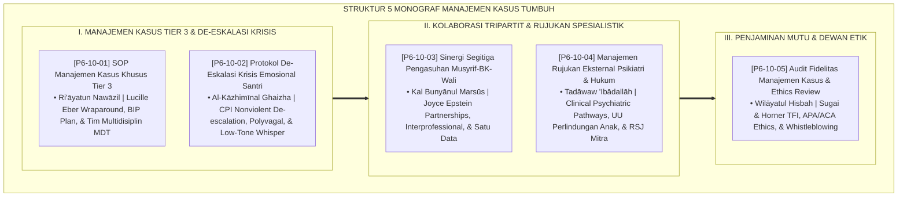

# P6-10: DOKUMEN INDUK MANAJEMEN KASUS KHUSUS DAN SINERGI PENGASUHAN
## *Arsitektur dan Rekayasa Sistem Manajemen Kasus Khusus Terpadu, Tim Multidisiplin Pengasuhan MDT, De-Eskalasi Krisis Emosional Nir-Kekerasan, Sinergi Segitiga Musyrif-BK-Wali, Rujukan Eksternal Spesialistik Psikiatri/Hukum, Serta Audit Fidelitas Mutu dan Dewan Etik (Tier 3 Wraparound Form MKK, Crisis De-escalation Form PDK, Tripartite Synergy Form SSP, External Referral Form MRE, Serta Fidelity Audit Form AFM) di Ekosistem TUMBUH Pesantren*

**Nomor Identifikasi**: `P6-10/DOKUMEN-INDUK-MANAJEMEN-KASUS-SINERGI/2026`  
**Domain**: `06 Intervention Framework` > `10 Case Management` (Gugus Sub-Domain 10: *Comprehensive Tier 3 Case Management, Crisis De-escalation, Tripartite Care, & Ethical Auditing Framework*)  
**Klasifikasi Naskah**: *Master Architecture & Navigation Monograph* (Dokumen Induk Peta Jalan Riset & Navigasi 5 Monograf Ilmiah Manajemen Kasus Khusus dan Sinergi Pengasuhan)  
**Rumpun Disiplin Pengkaji**: PBIS Tier 3 Intensive Supports, Manajemen Krisis & Nonviolent Intervention, Sosiologi Kolaborasi Tripartit, Fiqh An-Nawazil wal Hisbah  

---

> ### 💡 INTISARI EKSEKUTIF (EXECUTIVE SUMMARY)
>
> * **Kedudukan Strategis Gugus Manajemen Kasus Khusus dan Sinergi Pengasuhan:**  
>   Gugus *Case Management (Manajemen Kasus Khusus dan Sinergi Pengasuhan)* merupakan pilar puncak penanganan intensif, perlindungan darurat, dan penjaminan mutu kelembagaan (*The Intensive Protection & Quality Governance Pinnacle*) dalam Domain 06 (`06 Intervention Framework`). Gugus ini mengintegrasikan seluruh elemen penanganan kasus berat, krisis agresif, kolaborasi pengasuh, rujukan medis/hukum, dan audit etika: **SOP Kasus Khusus Tier 3 (Form MKK)**, **De-Eskalasi Krisis Emosional (Form PDK)**, **Sinergi Segitiga Musyrif-BK-Wali (Form SSP)**, **Rujukan Eksternal Psikiatri/Hukum (Form MRE)**, dan **Audit Fidelitas & Ethics Review (Form AFM)**.
> * **Integrasi Holistik Turats & Konsensus Sains Manajemen Kasus:**  
>   Gugus riset ini memadukan khazanah agung Islam tentang penanganan kasus darurat (*Ri'āyatun Nawāzil*), menahan amarah (*Al-Kāzhimīnal Ghaizha*), persatuan bangunan kokoh (*Kal Bunyānul Marsūs*), perintah berobat medis (*Tadāwaw 'Ibādallāh*), dan audit pengawasan amanah (*Wilāyatul Hisbah*) dengan konsensus sains dunia (*Eber Wraparound Model, CPI Nonviolent Crisis Intervention, Porges Polyvagal Theory, Epstein School-Family Partnerships, Clinical Referral Standards, UU Perlindungan Anak, dan Sugai & Horner Tiered Fidelity Inventory TFI*).
> * **Struktur Lengkap 5 Berkas Monograf Riset Ilmiah:**  
>   Dokumen induk ini memetakan dan menghubungkan 5 berkas monograf penelitian akademik komprehensif (~150 KB total riset) yang menyajikan panduan tim MDT 60 hari, safe stance 1.5 meter tanpa kuncian fisik, pakta sinergi tripartit satu data SIM, fast-track rujukan IGD jiwa, dan instrumen audit TFI triwulanan.

---

## 📑 PETA NAVIGASI LIMA MONOGRAF RISET MANAJEMEN KASUS KHUSUS

Berikut adalah daftar lengkap 5 monograf riset akademik dalam gugus **`10 Case Management`**:

---

## 📚 DESKRIPSI RINGKAS 5 BERKAS MONOGRAF

1. **[P6-10-01: SOP Manajemen Kasus Khusus Tier 3](file:///c:/xampp/htdocs/tumbuh/06%20Intervention%20Framework/10%20Case%20Management/P6-10-01-SOP-Manajemen-Kasus-Khusus-Tier-3.md)**  
   *Membahas penanganan intensif individual 1-5% santri krisis berat, doktrin Ri'ayatun Nawazil, Lucille Eber Wraparound Model, Individualized Behavior Intervention Plan (BIP), dan form Form MKK-Tier3.*
2. **[P6-10-02: Protokol De-Eskalasi Krisis Emosional Santri](file:///c:/xampp/htdocs/tumbuh/06%20Intervention%20Framework/10%20Case%20Management/P6-10-02-Protokol-De-Eskalasi-Krisis-Emosional-Santri.md)**  
   *Membahas teknik penjinakan amarah dan histeria tanpa kekerasan fisik, doktrin Al-Kazhiminal Ghaizha & Tuntunan Nabawi Saat Marah, CPI Nonviolent Crisis Intervention, Stephen Porges Polyvagal Theory, dan form Form PDK-DeEskalasi.*
3. **[P6-10-03: Sinergi Segitiga Pengasuhan Musyrif, BK, dan Orang Tua](file:///c:/xampp/htdocs/tumbuh/06%20Intervention%20Framework/10%20Case%20Management/P6-10-03-Sinergi-Segitiga-Pengasuhan-Musyrif-BK-Orang-Tua.md)**  
   *Membahas kolaborasi tripartit 24 jam tanpa celah manipulasi santri, doktrin Kal Bunyanil Marsus & Ta'awun, Joyce Epstein School-Family Partnerships, Interprofessional Collaboration, dan form Form SSP-Segitiga.*
4. **[P6-10-04: Manajemen Rujukan Eksternal Psikiatri dan Hukum Santri](file:///c:/xampp/htdocs/tumbuh/06%20Intervention%20Framework/10%20Case%20Management/P6-10-04-Manajemen-Rujukan-Eksternal-Psikiatri-dan-Hukum-Santri.md)**  
   *Membahas alur rujukan medis spesialis jiwa dan advokasi hukum hak anak, doktrin Tadawaw 'Ibadallah & Hifzhun Nafs, Clinical Referral Pathways, UU Perlindungan Anak No. 35/2014, dan form Form MRE-Rujukan.*
5. **[P6-10-05: Protokol Audit Fidelitas Manajemen Kasus dan Ethics Review](file:///c:/xampp/htdocs/tumbuh/06%20Intervention%20Framework/10%20Case%20Management/P6-10-05-Protokol-Audit-Fidelitas-Manajemen-Kasus-dan-Ethics-Review.md)**  
   *Membahas audit penjaminan mutu implementasi dan sidang etik independen pengasuhan, doktrin Hasibu Anfusakum & Wilayatul Hisbah, George Sugai & Robert Horner Tiered Fidelity Inventory (TFI), APA/ACA Ethics, dan form Form AFM-Audit.*

---

## 🎯 STANDAR PENJAMINAN MUTU MANAJEMEN KASUS KHUSUS

Penerapan gugus **Manajemen Kasus Khusus dan Sinergi Pengasuhan (Case Management)** menjamin bahwa:
1. **Tidak Ada Satupun Santri yang Dikorbankan atau Dikeluarkan Secara Sembrono (*Zero Abandonment Policy*)**: Setiap kasus berat ditangani melalui rencana penyelamatan individual multidisiplin.
2. **Krisis Agresif Diredakan dengan Ketenangan, Keamanan, dan Ketiadaan Kekerasan (*Zero Physical Restraint Injury*)**: Menjaga keselamatan fisik dan kehormatan martabat santri seutuhnya.
3. **Lembaga Beroperasi dengan Standar Akuntabilitas, Sinergi Keluarga, Kepatuhan Hukum, dan Etika Tertinggi (*Exemplary Institutional Governance*)**: Menjadikan pesantren TUMBUH sebagai suaka pendidikan Islam yang paling aman, profesional, dan diridhai Allah SWT.
