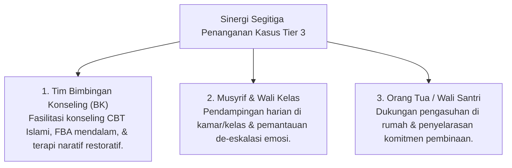

# P6-10: Manajemen Kasus Khusus dan Sinergi Pengasuhan Segitiga

## Status Dokumen
* **Status**: 🌟 **A+ (Tervalidasi & Siap Diimplementasikan)**
* **Sub-Domain**: `06 Intervention Framework / 10 Case Management`
* **Penanggung Jawab Keilmuan**: Dewan Keilmuan TUMBUH (*Pakar Bimbingan Konseling & Pakar Pengasuhan Asrama*)

---

## 1. Konseptualisasi Manajemen Kasus Tier 3

Manajemen Kasus Khusus (Tier 3) diperuntukkan bagi santri yang mengalami krisis emosional, trauma masa lalu, atau hambatan perilaku kronis yang membutuhkan penanganan individual mendalam oleh tim ahli terpadu.

---

## 2. Protokol De-Eskalasi Krisis Emosional Santri

Apabila seorang santri mengalami *Emotional Crisis* (marah berlebih atau serangan panik/kecemasan):
1. **Dilarang Penggunaan Kekerasan / Isolasi Gelap**: Musyrif tidak menahan fisik secara kasar atau mengunci santri di ruang terisolasi.
2. **Ruang Penenangan Emosi (*De-Escalation Room*)**: Mengajak santri ke ruang konseling BK yang nyaman dan ramah emosi.
3. **Teknik Penenangan (Co-Regulation)**: Konselor memberikan kehadiran tenang, memandu pernafasan relaksasi, dan memvalidasi emosi santri hingga tenang.
