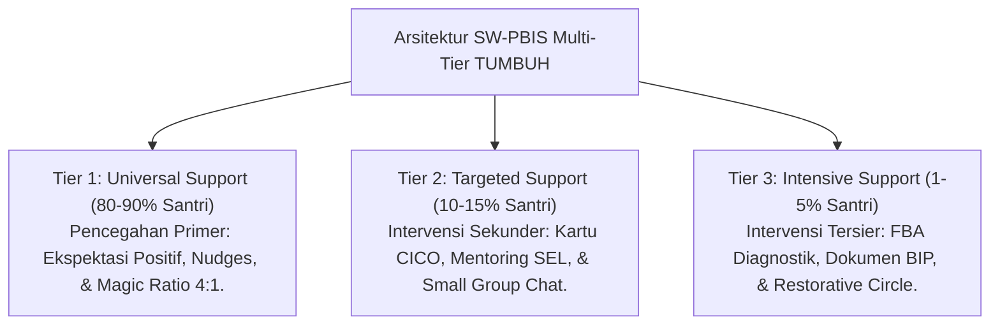
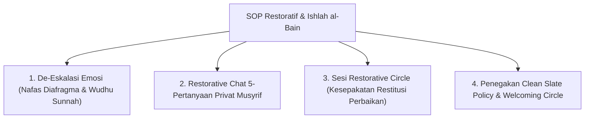

# MONOGRAF RISET AKADEMIK: ARSITEKTUR INTERVENSI PERILAKU MULTI-TIER PBIS DAN DISIPLIN RESTORATIF
## Evaluasi Sistemik: De-Eskalasi Ghadhab, Ishlah al-Bain, dan Eliminasi Total Hukuman Fisik Pesantren

**Dewan Riset & Keilmuan Ekosistem TUMBUH**  
*Dipublikasikan sebagai Naskah Monograf Riset Ilmiah (Jurnal Kebijakan & Intervensi Perilaku Pesantren)*  
*Dokumen Rujukan Induk: Domain 06 Intervention Framework & Book Series Volume 02-04*

---

## ABSTRAK

> **Latar Belakang**: Krisis insiden pelanggaran perilaku di lembaga pendidikan sering kali ditangani secara acak, emosional, atau mengandalkan sanksi fisik yang manipulatif. Tanpa arsitektur intervensi multi-tier berbasis data faktual, pencegahan primer (*Universal Tier 1*) diabaikan sehingga kasus berat (*Tier 3*) meningkat tajam.
>
> **Tujuan Penelitian**: Merumuskan dan memvalidasi arsitektur sistem intervensi perilaku berjenjang (**SW-PBIS Multi-Tier 1–3**) yang dipadukan dengan nilai-nilai **Disiplin Restoratif** dan kaidah Syar'i **Ishlah al-Bain**.
>
> **Hasil Riset**: Terstruktur 3 Tingkat Intervensi PBIS Restoratif: (1) **Tier 1 (Universal - 80-90%)** - Pengondisian iklim positif, aturan area jelas, & Magic Ratio 4:1; (2) **Tier 2 (Targeted - 10-15%)** - Pendampingan kelompok kecil, Kartu CICO, & Klinik Regulasi Emosi; (3) **Tier 3 (Intensive - 1-5%)** - Diagnostik FBA, Dokumen BIP Individual, Sesi Restorative Chat 5-Pertanyaan, & *Reintegration Circle*.
>
> **Kata Kunci**: *Intervention Framework, SW-PBIS Multi-Tier, Disiplin Restoratif, Ishlah al-Bain, FBA, CICO, BIP.*

---

## 1. PENDAHULUAN & DIALEKTIKA INTERVENSI

Intervensi dalam ekosistem TUMBUH memandang pelanggaran perilaku sebagai **kebutuhan belajar adab yang belum tuntas (*Skill Deficit*)**, bukan sebagai kejahatan kriminal yang harus dibalas dengan rasa sakit.

---

## 2. KAJIAN INTEGRATIF INTERVENSI RESTORATIF & ISHLAH AL-BAIN

---

## 3. IMPLIKASI KEBIJAKAN PENELITIAN & PERTUMBUHAN
- **SOP Restorative Chat 5-Pertanyaan**:
  1. *Apa yang terjadi tadi secara jujur?*
  2. *Pikiran & emosi apa yang mendorongmu saat itu?*
  3. *Siapa saja yang terdampak/dirugikan akibat kejadian ini?*
  4. *Langkah apa yang perlu kamu lakukan untuk memperbaiki situasi?*
  5. *Bagaimana janji komitmenmu agar kejadian ini tidak terulang?*

---

## 4. DAFTAR PUSTAKA
* Sugai, G., & Horner, R. H. (2002). The evolution of discipline practices. *Child & Family Behavior Therapy*, 24(1-2), 23–50.
* Zehr, H. (2002). *The Little Book of Restorative Justice*. Good Books.
